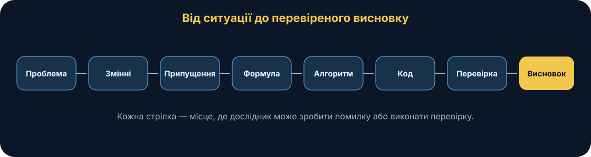
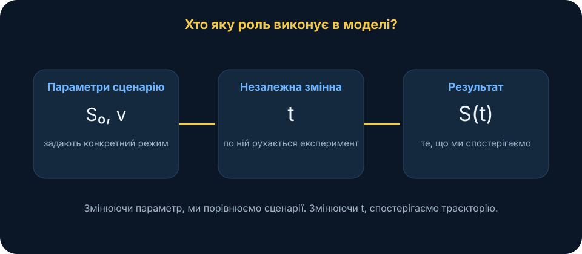
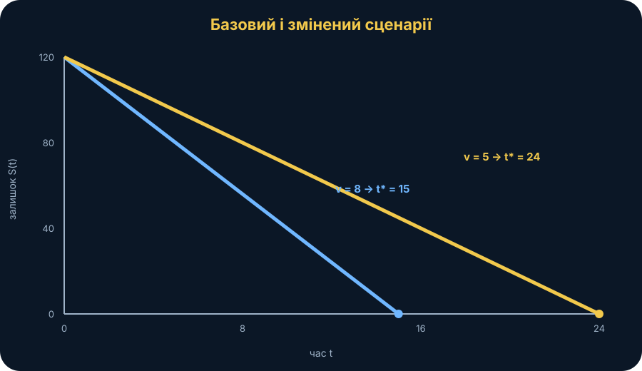
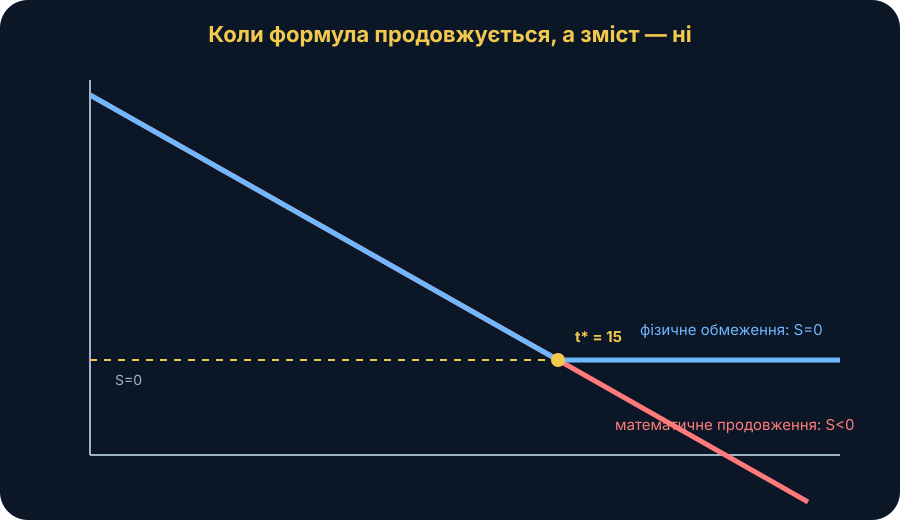
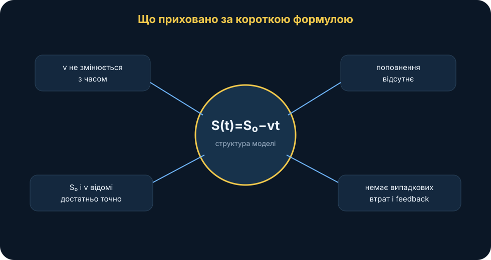
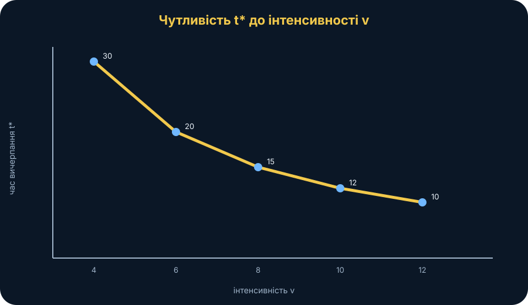
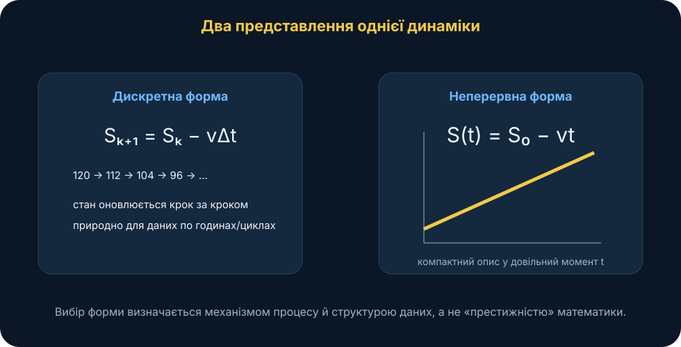
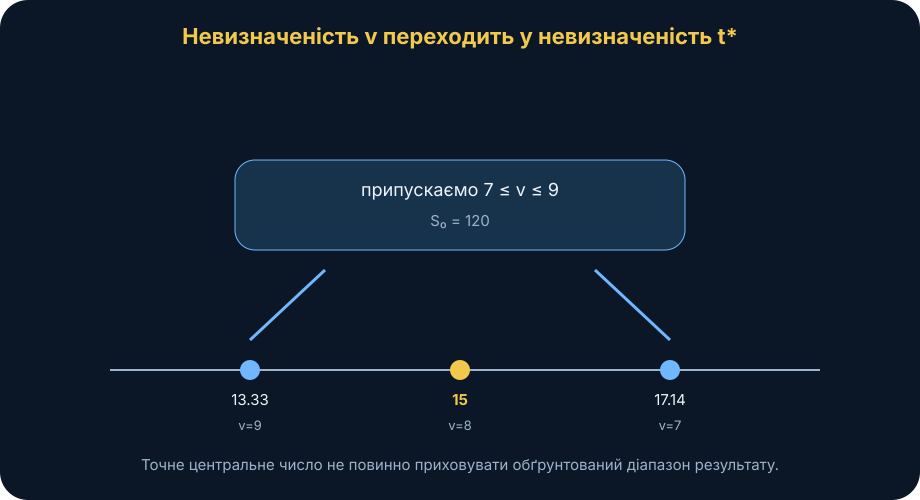

# MathModelingIT · Мінікнига T1.L1

## Форма і принципи представлення математичних моделей

### Від реальної ситуації до моделі, яку можна перевірити

> **Головна ідея книги:** математична модель — це не «математика заради математики» і не спроба описати світ до останньої деталі. Це свідомо спрощене представлення реальної ситуації, яке дозволяє поставити чітке питання, виконати обчислювальний експеримент, перевірити припущення й сформулювати висновок у межах того, що модель справді підтримує.

---

## 0. Паспорт книги

**Код заняття:** T1.L1 
**Тема:** форма і принципи представлення математичних моделей 
**Рівень:** вступний 
**Орієнтовний час читання:** 45–60 хвилин 
**Попередні знання:** базова алгебра, читання простого графіка; програмування не обов’язкове.

Після цієї книги ви повинні вміти:

- побачити в прикладній ситуації об’єкт моделювання;
- відокремити змінні від параметрів;
- сформулювати припущення та обмеження;
- перейти від словесного опису до математичної залежності;
- прочитати графік як аргумент, а не як ілюстрацію;
- пояснити різницю між математично можливим і змістовно допустимим результатом;
- провести простий сценарій та чутливість експеримент;
- зрозуміти, де закінчується область застосовності моделі;
- перенести той самий workflow на власну дисертаційну задачу.

**Після книги:** відкрийте інтерактивну лабораторія T1.L1, а потім Python-пакет заняття.

---

## 1. Сцена: одна цифра, яка ще нічого не пояснює

Уявімо навчальний польовий захід. Група планування має умовний запас ресурсу — назвемо його просто **120 одиниць**. Це може бути заряд акумуляторів навчального обладнання, умовний запас витратного матеріалу або інша навчальна величина. У нашому прикладі конкретний тип ресурсу не має значення: дані синтетичні, а задача потрібна для розуміння самої логіки моделювання.

Офіцер відкриває таблицю й бачить:

- запас на початку — 120;
- типовий темп витрачання — 8 одиниць за годину.

Перша реакція майже автоматична:

> «120 поділити на 8 — маємо 15 годин».

Число правильне. Але чи маємо ми вже **модель**?

Поки що — лише арифметичну операцію. Ми ще не сказали:

- що саме змінюється з часом;
- чи є темп витрачання сталим;
- чи можливе поповнення;
- чи може запас стати від’ємним;
- чи відомі 120 і 8 точно;
- чи однаково система поводиться на першій і п’ятнадцятій годині;
- чи не змінюється режим роботи після досягнення певного порога.

Тому справжнє дослідницьке питання звучить не «скільки буде 120/8», а значно точніше:

> **Як змінюється залишок ресурсу в часі, як параметр інтенсивності витрачання впливає на час функціонування системи і за яких умов така модель перестає бути змістовною?**

Саме це перетворює задачу з рахування на моделювання.

<figure>
 
 <figcaption><strong>Рис. 1.</strong> Модель — це не одна формула, а ланцюжок: проблема → змінні → припущення → формула → алгоритм → код → експеримент → перевірка → висновок.</figcaption>
</figure>

---

## 2. Модель — не копія реальності

Карта місцевості не містить кожного каменя. Схема електромережі не показує колір стін. Організаційна схема не описує кожну розмову між людьми.

І все ж вони корисні.

Причина проста: **модель відкидає деталі, які не потрібні для конкретного питання**.

Це ключова ідея. Хороша модель не обов’язково складна. Вона повинна бути достатньою для відповіді на визначене питання.

Для нашої задачі можна уявити реальну систему з десятками факторів:

- темп витрачання може змінюватися;
- частина ресурсу може поповнюватися;
- дані про запас можуть мати похибку;
- робоче навантаження може змінюватися;
- можливі перерви;
- можливі втрати;
- різні елементи системи можуть споживати ресурс нерівномірно.

Але якщо наше перше питання — **«що відбувається за сталої інтенсивності витрачання?»** — ми свідомо залишаємо всі ці фактори за межами першої моделі.

Це не помилка. Помилкою було б забути, що ми їх виключили.

Тому будь-яка модель має дві сторони:

1. **що вона враховує**;
2. **що вона не враховує**.

На практиці друга частина часто важливіша за першу.

---

## 3. Чотири форми однієї моделі

Одну й ту саму ідею корисно представити щонайменше в чотирьох формах.

### 3.1. Словесна форма

> На початку маємо запас ресурсу. За кожну одиницю часу витрачається однакова кількість. Потрібно визначити залишок ресурсу в будь-який момент часу.

Це зрозуміло людині, але недостатньо точно для обчислення.

### 3.2. Математична форма

Позначимо:

- \(S_0\) — початковий запас;
- \(v\) — інтенсивність витрачання;
- \(t\) — час;
- \(S(t)\) — залишок ресурсу в момент \(t\).

Тоді найпростіша модель:

\[
S(t)=S_0-vt.
\]

Тут уже немає двозначності: для кожного \(t\) формула дає конкретне значення.

### 3.3. Алгоритмічна форма

1. Взяти \(S_0\).
2. Взяти \(v\).
3. Вибрати момент \(t\).
4. Обчислити \(S_0-vt\).
5. Якщо фізично запас не може бути від’ємним — обмежити результат нулем.
6. Повторити для всіх моментів часу.
7. Побудувати графік.
8. Порівняти сценарії.

### 3.4. Програмна форма

~~~python
def resource(t, s0, rate):
    return max(0, s0 - rate * t)
~~~

Код — це не сама модель, а **реалізація моделі**.

Це принципово. Один і той самий математичний вираз можна реалізувати Python, JavaScript, Excel або навіть вручну. Модель від цього не змінюється.

---

## 4. Об’єкт, змінна, параметр: не плутати ролі

На початку курсу ці слова легко змішати. Розділимо їх максимально просто.

### Об’єкт

Це те, поведінку чого ми досліджуємо.

У нашому прикладі — система з обмеженим запасом ресурсу.

### Незалежна змінна

Це величина, відносно якої ми спостерігаємо зміну.

Тут:

\[
t = \text{час}.
\]

### Залежна змінна

Це результат, який змінюється залежно від незалежної змінної.

\[
S(t)=\text{залишок ресурсу}.
\]

### Параметри

Це величини, які визначають конкретний сценарій моделі.

У нашому випадку:

\[
S_0,\quad v.
\]

Якщо \(S_0=120\) і \(v=8\), маємо один сценарій. Якщо \(v=5\), структура моделі та сама, але сценарій інший.

### Чому це важливо

У дисертаційному дослідженні плутанина між змінною та параметром часто призводить до плутанини в самому дизайні експерименту.

Питання «що ми змінюємо?» і «що ми спостерігаємо?» повинні мати різні відповіді.

<figure>
 
 <figcaption><strong>Рис. 2.</strong> Ролі в простій моделі: час є незалежною змінною, залишок — результатом, а початковий запас та інтенсивність — параметрами сценарію.</figcaption>
</figure>

---

## 5. Формула як короткий запис історії

Розглянемо ще раз:

\[
S(t)=S_0-vt.
\]

Не потрібно сприймати цю формулу як абстрактний символічний об’єкт. Її можна буквально прочитати реченням:

> **Залишок у момент часу дорівнює початковому запасу мінус те, що було витрачено за цей час.**

Величина \(vt\) — накопичена витрата.

Якщо:

\[
S_0=120,\qquad v=8,\qquad t=5,
\]

то:

\[
S(5)=120-8\cdot5=80.
\]

Через 5 умовних годин залишиться 80 одиниць.

### Перевірка одиниць

Якщо:

- \(S_0\) вимірюється в одиницях ресурсу;
- \(v\) — одиниць ресурсу за годину;
- \(t\) — у годинах,

то:

\[
v t =
\frac{\text{одиниць}}{\text{годину}}\cdot\text{години}
=
\text{одиниці}.
\]

Тобто від \(S_0\) ми віднімаємо величину тієї самої розмірності.

Це проста, але дуже сильна перевірка здорового глузду. Якщо одиниці не узгоджуються, у постановці майже напевно є проблема.

---

## 6. Що означає нахил прямої

У формулі

\[
S(t)=S_0-vt
\]

коефіцієнт перед \(t\) дорівнює \(-v\).

Це **нахил** графіка.

- велике \(v\) → пряма спадає крутіше;
- мале \(v\) → пряма спадає повільніше;
- \(v=0\) → горизонтальна лінія.

Для baseline:

\[
v_1=8.
\]

Для зміненого сценарію:

\[
v_2=5.
\]

Оскільки \(5<8\), друга лінія спадає повільніше.

Це можна передбачити **ще до побудови графіка**.

Саме так варто працювати з моделями: спочатку прогнозувати напрям зміни, а потім перевіряти обчисленням.

<figure>
 
 <figcaption><strong>Рис. 3.</strong> За однакового \(S_0=120\) менша інтенсивність \(v=5\) дає повільніше зменшення запасу, ніж baseline \(v=8\).</figcaption>
</figure>

---

## 7. Час вичерпання

Ресурс вичерпано, коли:

\[
S(t_*)=0.
\]

Підставимо у вихідну формулу:

\[
0=S_0-vt_*.
\]

Переносимо:

\[
vt_*=S_0.
\]

Отже:

\[
t_*=\frac{S_0}{v}, \qquad v>0.
\]

Для baseline:

\[
t_*=\frac{120}{8}=15.
\]

Для сценарію \(v=5\):

\[
t_*=\frac{120}{5}=24.
\]

Це не просто дві цифри.

Вони показують **структурний зв’язок**:

- збільшення \(S_0\) збільшує час функціонування;
- збільшення \(v\) зменшує час функціонування.

### Граничний випадок \(v=0\)

Якщо ресурс не витрачається:

\[
S(t)=S_0.
\]

Формально \(S_0/0\) не визначено. У моделі ми інтерпретуємо час вичерпання як:

\[
t_*=\infty.
\]

Це корисний приклад того, що формула іноді потребує **окремого правила для граничного випадку**.

---

## 8. Математично можливо — змістовно неможливо

Нехай:

\[
S_0=120,\quad v=8,\quad t=20.
\]

Тоді:

\[
S(20)=120-8\cdot20=-40.
\]

Математика не «зламалася». Обчислення правильне.

Але що означає **мінус 40 одиниць запасу**?

Для фізичного ресурсу це, найімовірніше, беззмістовно.

Тут з’являється важлива різниця:

> **математична формула може бути коректною поза областю, де її інтерпретація має сенс.**

Тому вводимо обмеження:

\[
S(t)\ge 0.
\]

І фізично обмежену модель:

\[
S_{\mathrm{phys}}(t)=\max(0,S_0-vt).
\]

Або у вигляді кусочної функції:

\[
S_{\mathrm{phys}}(t)=
\begin{cases}
S_0-vt, & 0\le t\le t_*,\\
0, & t>t_*.
\end{cases}
\]

<figure>
 
 <figcaption><strong>Рис. 4.</strong> Неперервна математична пряма після \(t_*=15\) переходить у від’ємні значення. Фізична модель повинна зупинити ресурс на нулі або змінити структуру після вичерпання.</figcaption>
</figure>

Це перший приклад **«зламай модель»**: ми навмисно йдемо туди, де формула ще працює, а сенс уже ні.

---

## 9. Припущення — прихована частина формули

У формулі \(S(t)=S_0-vt\) не написано великими літерами:

> «ІНТЕНСИВНІСТЬ СТАЛА».

Але це припущення вбудоване в саму структуру \(vt\).

Так само в ній приховано:

1. \(S_0\) відоме точно;
2. \(v\) не змінюється з часом;
3. поповнення немає;
4. немає випадкових втрат;
5. витрачання починається в момент \(t=0\);
6. сама система не змінює режим поведінки;
7. ресурс достатньо однорідний, щоб описувати його одним числом.

<figure>
 
 <figcaption><strong>Рис. 5.</strong> Формула коротка, але спирається на набір припущень. Якщо хоча б одне з них критично порушується, потрібна інша модель.</figcaption>
</figure>

### Чому це важливо для наукового висновку

Припустимо, ви отримали:

> «За \(v=5\) система працює 24 години».

Неправильне узагальнення:

> «Система гарантовано працює 24 години».

Коректніше:

> «У межах моделі зі сталим темпом витрачання \(v=5\), початковим запасом 120, без поповнення та випадкових втрат теоретичний час до вичерпання становить 24 одиниці часу».

Друге формулювання довше, але науково сильніше, бо чітко показує умови.

---

## 10. Графік — не прикраса

Побудувати графік недостатньо. Його треба **прочитати**.

На графіку \(S(t)\):

- вісь X — час;
- вісь Y — залишок ресурсу;
- перетин із Y при \(t=0\) — \(S_0\);
- нахил — \(-v\);
- перетин із X — \(t_*\).

Тобто геометрія графіка безпосередньо відповідає параметрам моделі.

### Що можна побачити на графіку

Якщо дві прямі мають однаковий старт, але різний нахил, відрізняється темп витрачання.

Якщо однаковий нахил, але різний старт, відрізняється початковий запас.

Якщо лінія вигинається, проста модель зі сталим \(v\) вже не описує таку поведінку.

### Чого графік не доводить

Графік сам по собі не доводить причинність.

Якщо ви намалювали дві криві й одна вища, це ще не означає, що знайдено реальний причинний механізм. Причинність у нашому навчальному прикладі походить із **структури заданої моделі**, а не з візуальної форми картинки.

---

## 11. Наскрізний військовий приклад

Розглянемо синтетичний навчальний сценарій.

Під час багатогодинного навчального заходу група використовує автономні навчальні пристрої з умовним сумарним енергетичним ресурсом:

\[
S_0=120.
\]

За стандартного режиму сумарне споживання:

\[
v=8.
\]

### Baseline

\[
S(t)=120-8t.
\]

Час вичерпання:

\[
t_*=15.
\]

### сценарій: економний режим

Припустимо, організаційне рішення дозволило зменшити середній темп до:

\[
v=5.
\]

Тоді:

\[
S(t)=120-5t,
\]

а:

\[
t_*=24.
\]

Різниця:

\[
\Delta t=24-15=9.
\]

У межах нашої моделі зниження параметра \(v\) на 3 одиниці збільшило теоретичний час функціонування на 9.

Але важливо не зробити надмірний висновок.

Модель **не говорить**, яким саме організаційним рішенням треба досягти \(v=5\). Вона лише показує, що буде **якщо** такий параметр справді реалізований і залишається сталим.

### сценарій B: більший початковий запас

Нехай:

\[
S_0=150,\qquad v=8.
\]

Тоді:

\[
t_*=\frac{150}{8}=18.75.
\]

Тобто і \(S_0\), і \(v\) можуть змінювати результат, але роблять це по-різному.

---

## 12. чутливість: наскільки висновок залежить від параметра

Один сценарій майже ніколи не достатній для дослідження.

Візьмемо:

\[
v\in\{4,6,8,10,12\}.
\]

За \(S_0=120\):

| \(v\) | \(t_*=S_0/v\) |
|---:|---:|
| 4 | 30 |
| 6 | 20 |
| 8 | 15 |
| 10 | 12 |
| 12 | 10 |

Тепер видно не просто два сценарії, а **форму залежності**.

<figure>
 
 <figcaption><strong>Рис. 6.</strong> Час вичерпання зменшується нелінійно як \(t_*=S_0/v\). Однакова абсолютна зміна \(v\) має різний ефект у різних частинах діапазону.</figcaption>
</figure>

### Чому графік чутливості не є прямою

Хоча \(S(t)\) лінійна відносно часу, величина

\[
t_*=\frac{S_0}{v}
\]

не є лінійною відносно \(v\).

Наприклад:

- з 4 до 6: час падає з 30 до 20 — на 10;
- з 10 до 12: час падає з 12 до 10 — лише на 2.

Це хороша демонстрація важливого принципу:

> **лінійність самої моделі за однією змінною не означає лінійності всіх похідних показників за всіма параметрами.**

### Трохи глибше: похідна як міра локальної чутливості

Маємо:

\[
t_*(v)=\frac{S_0}{v}.
\]

Тоді:

\[
\frac{dt_*}{dv}=-\frac{S_0}{v^2}.
\]

Мінус означає: зі збільшенням \(v\) час зменшується.

Модуль похідної:

\[
\left|\frac{dt_*}{dv}\right|=\frac{S_0}{v^2}
\]

показує, що при малих \(v\) результат чутливіший до зміни параметра.

Не обов’язково вміти вручну диференціювати всі моделі, щоб зрозуміти ідею. Важливіше питання:

> **Як сильно зміниться наш висновок, якщо параметр трохи помилковий?**

---

## 13. Обчислювальний експеримент

Обчислювальний експеримент — це не просто «запустити код».

Він має структуру.

### Крок 1. Поставити питання

> Як параметр \(v\) впливає на \(S(t)\) та \(t_*\)?

### Крок 2. Зафіксувати незмінне

\[
S_0=120.
\]

### Крок 3. Змінювати один фактор

\[
v=4,6,8,10,12.
\]

### Крок 4. Визначити результат

- траєкторія \(S(t)\);
- час \(t_*\).

### Крок 5. Передбачити

Ще до запуску очікуємо: більший \(v\) → швидше спадання → менший \(t_*\).

### Крок 6. Запустити

Обчислити серію сценаріїв.

### Крок 7. Перевірити

Наприклад:

\[
S(0)=S_0.
\]

Якщо код повернув інше — реалізація неправильна.

### Крок 8. Інтерпретувати

Не «на графіку синя лінія нижче».

А:

> За незмінного \(S_0\) збільшення інтенсивності витрачання зменшує час до вичерпання; залежність \(t_*(v)=S_0/v\) є обернено пропорційною.

---

## 14. Python без страху

Найкоротша реалізація:

~~~python
def resource(t, s0, rate):
    return max(0, s0 - rate * t)

print(resource(5, 120, 8))
# 80
~~~

Відповідність формулі пряма:

~~~text
S(t) = S0 - v*t
         ↓    ↓
       s0 - rate*t
~~~

### Кілька моментів часу

~~~python
times = [0, 5, 10, 15]

for t in times:
    print(t, resource(t, 120, 8))
~~~

Очікуємо:

~~~text
0   120
5    80
10   40
15    0
~~~

### Перевірка часу вичерпання

~~~python
def depletion_time(s0, rate):
    if rate == 0:
        return float("inf")
    return s0 / rate

assert depletion_time(120, 8) == 15
~~~

Цей assert — маленька, але важлива форма перевірка.

Код не повинен бути «чорною скринькою». Ми знаємо контрольний результат ще до запуску.

---

## 15. перевірка: як довіряти простій моделі

Навіть проста модель повинна пройти перевірки.

### перевірка 1. Початкова умова

\[
S(0)=S_0.
\]

Для baseline:

\[
S(0)=120.
\]

### перевірка 2. Нульова інтенсивність

Якщо:

\[
v=0,
\]

то:

\[
S(t)=S_0.
\]

Запас не змінюється.

### перевірка 3. Відомий контрольний результат

\[
S_0=120,\quad v=8
\]

повинно давати:

\[
t_*=15.
\]

### перевірка 4. Некоректні вхідні значення

Для цієї постановки:

- від’ємний час;
- від’ємний початковий запас;
- від’ємна інтенсивність

не повинні мовчки прийматися програмою.

### перевірка 5. Вихід за фізичну область

Без фізичного обмеження модель повинна показати від’ємне значення, щоб ми побачили саму проблему.

З фізичним обмеженням результат не повинен бути меншим за нуль.

---

## 16. Зламай модель

Тепер навмисно поставимо просту модель у ситуації, де вона слабка.

### Випадок 1. Інтенсивність змінюється з часом

Нехай у перші години:

\[
v=5,
\]

а потім:

\[
v=10.
\]

Одна константа \(v\) вже не описує процес.

Потрібна модель:

\[
v=v(t).
\]

Тоді накопичену витрату не можна завжди записати як \(vt\). У загальному випадку:

\[
S(t)=S_0-\int_0^t v(\tau)\,d\tau.
\]

Це вже наступний рівень моделювання.

### Випадок 2. Є поповнення

Якщо ресурс одночасно надходить зі швидкістю \(r\):

\[
S(t)=S_0+(r-v)t.
\]

Якщо \(r=v\), запас не змінюється.

Якщо \(r>v\), запас зростає.

### Випадок 3. Темп залежить від самого запасу

Можлива ситуація, де система змінює режим при малому запасі.

Тоді:

\[
v=v(S).
\]

Лінійна модель перестає бути достатньою.

### Випадок 4. Параметр невідомий точно

Ми написали:

\[
v=8.
\]

А якщо реально це 8 ± 2?

Тоді один час \(t_*=15\) створює ілюзію точності.

Можливо, коректніше розглядати інтервал або розподіл можливих результатів.

### Випадок 5. Дані спостереження не лягають на пряму

Якщо виміряний \(S(t)\) має систематичну кривизну, це сигнал:

> справа може бути не у «поганому параметрі», а в неправильній структурі моделі.

Це один із найважливіших уроків курсу.

Не кожну розбіжність треба «лікувати» підбором параметра.

---

## 17. Як модернізується модель

Моделювання часто розвивається сходинками.

### Рівень 1. Стала швидкість

\[
S(t)=S_0-vt.
\]

### Рівень 2. Фізичне обмеження

\[
S(t)=\max(0,S_0-vt).
\]

### Рівень 3. Змінна швидкість

\[
S(t)=S_0-\int_0^t v(\tau)\,d\tau.
\]

### Рівень 4. Поповнення

\[
S(t)=S_0+\int_0^t [r(\tau)-v(\tau)]\,d\tau.
\]

### Рівень 5. Невизначені параметри

Замість одного \(v\) — діапазон або розподіл.

Це демонструє здоровий принцип:

> **починати з найпростішої моделі, яка відповідає питанню, а складність додавати тоді, коли є причина.**

---

## Поглиблення: звідки взялася формула \(S(t)=S_0-vt\)

Формулу корисно не лише запам’ятати, а й **побачити її походження**.

Уявімо, що ми спостерігаємо систему не безперервно, а щогодини.

На початку:

\[
S_0=120.
\]

Через одну годину за сталої витрати \(v=8\):

\[
S_1=S_0-8=112.
\]

Ще через годину:

\[
S_2=S_1-8=104.
\]

Через три:

\[
S_3=96.
\]

Можемо записати загальне дискретне правило:

\[
S_{k+1}=S_k-v\Delta t.
\]

Якщо крок часу:

\[
\Delta t=1,
\]

то:

\[
S_{k+1}=S_k-v.
\]

Це **рекурентне представлення**: наступний стан обчислюється з попереднього.

Але якщо \(v\) стало, можна одразу порахувати накопичену витрату за \(k\) кроків:

\[
S_k=S_0-vk\Delta t.
\]

Якщо перейти від номера кроку до часу:

\[
t=k\Delta t,
\]

отримуємо знайому неперервну форму:

\[
S(t)=S_0-vt.
\]

Отже, формула не з’явилася «з повітря». Вона є компактним записом багаторазового повторення одного правила:

> на кожному однаковому часовому кроці відняти однакову кількість ресурсу.

Це важливо, бо тепер видно, **коли саме формула перестає бути природною**.

Якщо на кожному кроці витрата різна:

\[
S_{k+1}=S_k-v_k\Delta t,
\]

то один параметр \(v\) вже не описує процес.

Якщо є поповнення:

\[
S_{k+1}=S_k+r_k\Delta t-v_k\Delta t.
\]

Якщо витрата залежить від залишку:

\[
S_{k+1}=S_k-v(S_k)\Delta t.
\]

Так проста ресурсна модель поступово переходить у загальну ідею **динамічної системи**: маємо стан, правило переходу та наступний стан.

<figure>
 
 <figcaption><strong>Рис. 7.</strong> Та сама ідея може бути представлена покроково як \(S_{k+1}=S_k-v\Delta t\) або компактно як \(S(t)=S_0-vt\). Вибір форми залежить від задачі та даних.</figcaption>
</figure>

### Коли корисна дискретна форма

Дискретна модель природна, якщо:

- дані надходять раз на годину, день або цикл;
- рішення переглядається через фіксовані інтервали;
- зміни відбуваються подіями;
- потрібна покрокова симуляція.

### Коли зручна неперервна форма

Неперервна модель корисна, якщо:

- процес можна вважати плавним;
- нас цікавить значення в довільний момент часу;
- потрібно аналізувати похідні, швидкості зміни або інтеграли;
- неперервне наближення суттєво спрощує аналіз.

Не існує правила «неперервна модель науковіша». Правильне питання інше:

> **Яке представлення краще відповідає механізму процесу та доступним даним?**

---

## Поглиблення: як оцінити параметр \(v\) з даних

До цього ми вважали \(v\) відомим.

У реальному дослідженні параметр часто потрібно **оцінити**.

Нехай ми спостерігали:

\[
S(0)=120,
\]

а через 5 годин:

\[
S(5)=82.
\]

Якщо припускаємо сталу швидкість:

\[
S(5)=S_0-5v.
\]

Підставляємо:

\[
82=120-5v.
\]

Отже:

\[
5v=38,
\]

\[
v=7.6.
\]

Це найпростіший приклад **калібрування параметра**.

Ми не вибрали \(v\) довільно — ми підібрали його так, щоб модель узгоджувалася зі спостереженням.

Але тут одразу виникає нове питання.

Припустимо, маємо кілька точок:

| \(t\) | спостережуваний \(S\) |
|---:|---:|
| 0 | 120 |
| 3 | 98 |
| 6 | 74 |
| 9 | 53 |
| 12 | 27 |

Жодне одне значення \(v\) може не пройти точно через усі точки.

Тоді ми можемо шукати \(v\), який **найкраще в середньому** узгоджується з даними.

Це вже веде до задачі оцінювання параметрів і методу найменших квадратів, який зустрінеться далі в курсі.

Але навіть якщо лінія добре проходить через дані, залишається питання:

> **Чи є стала швидкість реальним механізмом, чи лише зручним наближенням?**

Підгонка параметра і перевірка структури моделі — не одне й те саме.

### Три різні запитання

1. **калібрування:** яке значення параметра найкраще відповідає даним?
2. **перевірка:** чи правильно реалізована математична модель?
3. **валідація / адекватність:** чи достатньо ця математична структура описує реальну систему для нашої мети?

Ці три питання легко змішати.

Саме тому «модель добре підганяється під дані» ще не означає «модель правильна».

---

## Поглиблення: невизначеність параметра — невизначеність результату

Нехай ми не впевнені, що:

\[
v=8.
\]

Припустимо, за даними та умовами навчального сценарію обґрунтований діапазон:

\[
7\le v\le9.
\]

Тоді час вичерпання не один.

Для \(v=7\):

\[
t_*=\frac{120}{7}\approx17.14.
\]

Для \(v=9\):

\[
t_*=\frac{120}{9}\approx13.33.
\]

Отже, при такій невизначеності параметра модель підтримує не лише центральну оцінку 15, а приблизний діапазон:

\[
13.33\le t_*\le17.14.
\]

Це вже значно чесніше представлення знання.

<figure>
 
 <figcaption><strong>Рис. 8.</strong> Якщо \(v\) відоме лише в межах 7–9, то й \(t_*\) слід розглядати як діапазон, а не як гарантоване число 15.</figcaption>
</figure>

### Чому середнього значення може бути недостатньо

Середнє приховує розкид.

Дві системи можуть мати однакове середнє \(v=8\), але:

- у першій \(v\) майже завжди 7.9–8.1;
- у другій \(v\) коливається від 4 до 12.

Однакова середня інтенсивність не означає однаковий ризик раннього вичерпання.

Далі в курсі для подібних задач з’являться:

- Monte Carlo;
- бутстреп;
- розподіли параметрів;
- quantiles;
- ймовірність поріг crossing.

Але методологічна основа вже тут:

> якщо параметр невизначений, не приховуйте це за одним точним числом результату.

### Невизначеність не дорівнює помилці

Невизначеність — нормальна властивість дослідження.

Проблема починається тоді, коли невизначеність існує, але висновок написаний так, ніби її немає.

---

## Поглиблення: коректність, адекватність і корисність — різні речі

У розмові про моделі часто звучить фраза:

> «Модель правильна».

Краще розділяти щонайменше три характеристики.

### 1. Математична коректність

Чи правильно сформульовані рівняння?

Чи немає суперечностей?

Чи допустимі операції?

Для нашого прикладу формула

\[
S(t)=S_0-vt
\]

математично коректна для числових \(S_0,v,t\).

Навіть \(S(20)=-40\) математично коректно.

### 2. Коректність реалізації

Чи правильно код реалізує формулу?

Наприклад, якщо програма для:

\[
S_0=120,\quad v=8,\quad t=5
\]

повертає 90, маємо програмний/модель реалізація defect.

Саме тут потрібні одиниця тести.

### 3. Предметна адекватність

Чи відповідає структура моделі реальній ситуації достатньо добре для нашого питання?

Якщо реальний темп різко змінюється, а модель вважає його сталим, код може бути бездоганний, а модель — непридатна для потрібного висновку.

### 4. Корисність

Навіть дуже спрощена модель може бути корисною.

Наприклад, \(S(t)=S_0-vt\) може бути недостатньою для точного прогнозу, але чудово підходити, щоб:

- показати напрям впливу параметра;
- оцінити порядок величини;
- знайти критичний параметр;
- побудувати baseline;
- сформулювати наступний експеримент.

Отже, модель може бути:

- математично коректною;
- правильно запрограмованою;
- частково адекватною;
- і все одно дуже корисною для конкретної мети.

Це набагато точніше, ніж бінарне «правильна / неправильна».

### Запитання, яке варто ставити

Не:

> «Ця модель правильна?»

А:

> **«Для якого питання, за яких припущень і з якою точністю ця модель є достатньою?»**

Саме таке формулювання стане важливим у складніших моделях курсу.

---

## Поглиблення: стан, вхід, параметр і вихід

У простих задачах усе легко назвати просто «даними». Але для серйознішого моделювання цього мало.

Розглянемо чотири ролі.

### Стан

**Стан** описує, де система перебуває зараз.

У нашій моделі природний стан:

\[
S(t).
\]

Якщо ми знаємо \(S(t)\), ми знаємо поточний залишок ресурсу.

У складніших моделях стан може бути вектором:

\[
\mathbf{x}(t)=
\begin{bmatrix}
x_1(t)\\
x_2(t)\\
x_3(t)
\end{bmatrix}.
\]

Тобто для опису системи може бути потрібно кілька величин одночасно.

### Вхід

Вхід — зовнішній вплив, який діє на систему.

У нашій найпростішій моделі окремого змінного входу немає: ми «зашили» витрачання в сталий параметр \(v\).

Але якщо режим можна перемикати, з’являється керуючий вхід:

\[
u(t).
\]

Наприклад, \(u(t)\) може означати один із синтетичних режимів споживання.

Тоді:

\[
v=v(u(t)).
\]

Це вже крок у бік керованих динамічних систем.

### Параметр

Параметр описує властивість конкретної моделі або сценарію.

Наприклад:

\[
v=8.
\]

У межах одного запуску він може бути сталим, але між сценаріями ми його змінюємо.

### Вихід

Вихід — величина, яку ми реально аналізуємо або передаємо далі для рішення.

Виходом може бути сам \(S(t)\), але може бути й похідний показник:

\[
y=t_*.
\]

Тобто модель має внутрішній стан, але дослідника може цікавити лише час до порогу.

### Навіщо це розділення

У багатьох дисертаційних задачах помилка виникає саме тут:

- величину, яку треба оцінювати з даних, оголошують відомим параметром;
- результат рішення називають вхідною змінною;
- стан системи підміняють агрегованим показником;
- один сценарний параметр трактують як керуючий вплив у реальному часі.

Тому перед формулою корисно створити маленьку таблицю ролей:

| Елемент | У T1.L1 | Питання |
|---|---|---|
| стан | \(S(t)\) | що відбувається із системою зараз? |
| незалежний змінна | \(t\) | відносно чого простежуємо зміну? |
| параметр | \(S_0,v\) | що задає конкретний сценарій? |
| Derived результат | \(t_*\) | який підсумковий показник нас цікавить? |

Це дисциплінує постановку ще до програмування.

---

## Поглиблення: як проектувати сценарний експеримент

У лабораторія дуже легко зробити так:

- змінити \(S_0\);
- змінити \(v\);
- змінити горизонт;
- увімкнути або вимкнути фізичне обмеження;
- подивитися на новий графік.

Але якщо змінити все одразу, виникає проблема:

> **ми бачимо інший результат, але не знаємо, яка саме зміна його спричинила.**

Для першого аналізу корисний принцип **змінювати по одному фактору за раз**.

Наприклад:

### Експеримент 

Залишаємо:

\[
S_0=120.
\]

Змінюємо лише:

\[
v: 8\rightarrow5.
\]

Тоді різницю в \(t_*\) можна прямо пов’язати з параметром \(v\) **у межах структури моделі**.

### Експеримент B

Залишаємо:

\[
v=8.
\]

Змінюємо:

\[
S_0:120\rightarrow150.
\]

Тепер досліджуємо вплив початкового запасу.

### Експеримент C

Залишаємо \(S_0\) і \(v\) однаковими, але порівнюємо:

- необмежену формулу;
- фізично обмежену формулу.

Тут ми досліджуємо вже не параметр, а **структурне припущення моделі**.

### Чому цього недостатньо в складних моделях

У реальних системах фактори можуть взаємодіяти.

Ефект зміни \(A\) може залежати від значення \(B\).

Тоді однофакторний аналіз може пропустити ефекти взаємодії між параметрами.

Далі це веде до:

- factorial дизайн;
- глобальний аналіз чутливості;
- Monte Carlo;
- відгук surfaces.

Але для першої лабораторії важливо виробити базову дисципліну:

> змінювати параметри так, щоб результат експерименту можна було пояснити.

### Таблиця плану експерименту

Перед запуском корисно записати:

| запуск | \(S_0\) | \(v\) | clamp | Очікування |
|---|---:|---:|---|---|
| Базовий сценарій | 120 | 8 | так | \(t_*=15\) |
| сценарій 1 | 120 | 5 | yes | довший час |
| сценарій 2 | 150 | 8 | yes | довший час |
| злам | 120 | 8 | немає | після 15 з’явиться \(S<0\) |

Така таблиця робить експеримент відтворюваним і не дає перетворити слайдери на випадкове «поклацування».

---

## Поглиблення: від числа до допустимого твердження

Модель повернула:

\[
t_*=15.
\]

Які твердження ми можемо зробити?

Розглянемо своєрідну **драбину тверджень**.

### Рівень 1. Обчислювальний факт

> Для \(S_0=120\) і \(v=8\) формула \(t_*=S_0/v\) дає 15.

Це безпечне твердження про обчислення.

### Рівень 2. Твердження про модель

> У моделі зі сталим темпом витрачання ресурс досягає нуля в момент 15.

Тут уже явно вказана структура.

### Рівень 3. Твердження про навчальний сценарій

> Якщо синтетичний сценарій достатньо відповідає припущенням сталої витрати без поповнення, модель оцінює час до вичерпання як 15 одиниць.

З’являється умова відповідності.

### Рівень 4. Надмірне твердження

> Реальна система гарантовано функціонуватиме 15 годин.

Такого висновку модель не підтримує.

Між першим і четвертим твердженням — усього кілька слів, але науковий зміст змінюється радикально.

### Allowed висновок

Тому в паспорті моделі є поле **Допустимий висновок**.

Це не формальність.

Воно змушує дослідника спитати:

> **Яке найсильніше твердження я можу зробити, не виходячи за межі моделі та даних?**

У хорошому дослідженні висновок не повинен бути сильнішим за доказ.

---

## Поглиблення: модель як контракт між припущеннями та висновком

Зручно мислити про модель як про контракт.

Ліва сторона контракту:

- вихідні дані;
- припущення;
- обмеження;
- математична структура;
- параметри.

Права сторона:

- результати;
- графіки;
- оцінки;
- допустимі висновки.

Якщо ми змінили ліву сторону — наприклад, дозволили поповнення — права сторона теж повинна змінитися.

Якщо ми не знаємо \(v\) точно — не можемо чесно залишити справа один «точний» \(t_*\).

Якщо система нелінійна — не можна інтерпретувати нахил так, ніби він всюди сталий.

Це дуже корисна звичка для дисертаційного дослідження:

> перед кожним висновком подумки повернутися до припущень, які зробили цей висновок можливим.

Саме тому в цій книзі так багато уваги приділено простій формулі. Вона дозволяє побачити логіку, яка потім залишиться незмінною і для значно складніших моделей.

---

## 18. Типові помилки мислення

### Помилка 1. «Чим складніша модель, тим вона краща»

Ні.

Складніша модель має більше способів помилитися, більше параметрів і вищі вимоги до даних.

Критерій — не складність, а **відповідність питанню**.

### Помилка 2. «Формула дала число — отже це прогноз»

Число є результатом моделі.

Прогнозом воно стає лише тоді, коли припущення моделі достатньо відповідають реальній ситуації.

### Помилка 3. «Точне число означає точне знання»

\(t_*=15.000\) не означає, що реальна система завершить роботу рівно через 15.000.

Кількість знаків після коми не створює достовірність.

### Помилка 4. «Якщо графік красивий, модель правильна»

Візуалізація може бути технічно бездоганною і концептуально помилковою.

### Помилка 5. «Якщо дані майже збігаються з моделлю, структура правильна»

Можливо, інша модель дасть такий самий або кращий збіг.

Потрібна перевірка і, де доречно, comparison альтернативи.

### Помилка 6. «Причинність видно з графіка»

Причинність не виникає з кольору лінії.

Вона має випливати з дослідницького дизайну, структури моделі або додаткових доказів.

---

## 19. прогнозувати: спочатку думка, потім кнопка

Перед інтерактивною лабораторія дайте собі чотири короткі відповіді.

1. Якщо \(v\) зменшити з 8 до 5 — що станеться з нахилом графіка?
2. Що станеться з \(t_*\)?
3. Чи може модель без обмеження показати \(S<0\)?
4. Що означатиме такий результат?

Правильна звичка дослідника:

> **спочатку сформулювати очікування, потім запускати модель.**

Інакше дуже легко підмінити пояснення після факту описом того, що вже показав комп’ютер.

---

## 20. Від мінікнига до лабораторія

У браузерній лабораторія T1.L1 ви працюватимете з тими самими величинами:

- \(S_0\);
- baseline \(v_1\);
- сценарій \(v_2\);
- горизонт;
- фізичне обмеження нулем.

Ваше завдання не просто посувати слайдер.

Пройдіть цикл:

### прогнозувати

Запишіть очікуваний напрям зміни.

### запуск

Змініть один параметр.

### Explain

Поясніть через формулу й геометрію графіка.

### злам

Знайдіть умову, коли математичний результат втрачає фізичний сенс.

### Transfer

Визначте аналог змінної, параметра, припущення й результату у власній задачі.

[**Відкрити інтерактивну лабораторію T1.L1 →**](../../index.html#resource)

---

## 21. Від лабораторія до Python

Browser лабораторія навмисно обмежена.

Вона потрібна для швидкої інтуїції.

Python пакет потрібен для:

- відтворюваності;
- автоматичних тестів;
- серій експериментів;
- збереження результатів;
- подальшого розширення моделі.

У T1.L1 джерело truth реалізує:

~~~text
resource(...)
depletion_time(...)
simulate(...)
compare_rates(...)
~~~

тести перевіряють, зокрема:

- відомий значення;
- обмеження значення знизу нулем;
- unclamped від’ємний значення;
- \(v=0\Rightarrow t_*=\infty\);
- \(120/8=15\);
- rejection від’ємний вхідні дані.

Це вже початок дисципліни **computational відтворюваність**.

---

## 22. дослідження Transfer

Тепер відкладіть приклад з ресурсом.

Візьміть власне дисертаційне дослідження.

Поставте не питання «де тут застосувати формулу \(S_0-vt\)?», а інше:

> **Яку частину моєї дослідницької проблеми можна перетворити на систему змінних, параметрів, припущень і перевірюваного результату?**

Заповніть:

~~~text
Research question:

Object:

Independent variable:

Dependent variable:

Parameters:

Assumptions:

Constraints:

Data:

Mathematical relation:

Computational experiment:

Verification:

Uncertainty:

Limitations:

Allowed conclusion:
~~~

### Приклад структури без готової відповіді

Припустимо, досліджується тривалість певного інформаційного процесу.

Можна запитати:

- що є входом;
- що є виходом;
- яка змінна відповідає часу;
- які параметри описують пропускну спроможність;
- що вважається сталим;
- що вимірюється;
- який сценарій можна змінити;
- який перевірка здорового глузду очевидний;
- де проста модель перестає працювати.

У цей момент ви вже використовуєте не конкретну ресурсну формулу, а **методологію моделювання**.

Саме це і є головним результатом T1.L1.

---

## Мінісловник першого заняття

Нижче — терміни, які далі зустрічатимуться майже в кожній темі курсу.

### Модель

Спрощене формальне представлення об’єкта, процесу або системи, створене для відповіді на конкретне питання.

Ключове слово — **для**. Модель завжди створюється для певної мети.

### Об’єкт моделювання

Те, що ми досліджуємо.

Це може бути система, процес, мережа, розподіл ресурсів, набір альтернатив або динаміка певного показника.

### Змінна

Величина, яка може змінюватися.

У T1.L1 час \(t\) — незалежна змінна, а \(S(t)\) — залежна.

### Параметр

Величина, яка задає конкретні властивості моделі або сценарію.

Наприклад, \(v=8\) і \(v=5\) — два сценарії однієї структури.

### Стан

Набір величин, достатній для опису поточного положення системи в межах моделі.

У простому прикладі стан можна описати одним числом \(S(t)\).

### Припущення

Твердження, яке ми приймаємо як робочу умову моделі.

Наприклад: «інтенсивність витрачання стала».

Припущення не обов’язково є універсальною істиною. Воно має бути достатньо обґрунтованим для мети дослідження.

### Обмеження

Умова, яка визначає допустиму область.

Наприклад:

\[
S(t)\ge0.
\]

### Baseline

Базовий сценарій, відносно якого порівнюються зміни.

Без baseline важко сказати, що саме означає «краще», «гірше», «швидше» або «стійкіше».

### сценарій

Альтернативний набір параметрів або припущень.

сценарний аналіз відповідає на питання «що буде, якщо...?».

### аналіз чутливості

Дослідження того, наскільки результат залежить від зміни параметрів.

Питання чутливість:

> якщо параметр трохи інший, чи залишається наш висновок тим самим?

### перевірка

Перевірка того, що модель і її програмна реалізація працюють так, як задумано математично.

Наприклад, перевірка:

\[
S(0)=S_0.
\]

### валідація / адекватність

Перевірка того, наскільки модель підходить для опису реальної системи та поставленого питання.

перевірка може пройти успішно, а адекватність — ні.

Код може ідеально реалізувати неправильне припущення.

### калібрування

Оцінювання параметрів моделі за даними.

У нашому прикладі — оцінювання \(v\) за спостереженнями \(S(t)\).

### невизначеність

Неповнота знання про параметри, дані або структуру моделі.

невизначеність не є синонімом помилки. Це характеристика того, наскільки впевнено ми знаємо величину або результат.

### Computational експеримент

Спланований запуск моделі з визначеними входами, параметрами, контрольними умовами та очікуваними показниками результату.

Випадково змінювати слайдери — ще не computational експеримент.

### перевірка здорового глузду

Проста перевірка, результат якої відомий із логіки задачі.

Наприклад, якщо \(v=0\), ресурс не повинен зменшуватися.

### межа / edge приклад

Гранична ситуація, де модель проявляє особливу поведінку.

У T1.L1:

\[
v=0
\]

або момент:

\[
t=t_*.
\]

### відмова умова

Умова, за якої модель втрачає зміст, адекватність або числову стійкість.

### Allowed висновок

Найсильніше твердження, яке можна зробити, не виходячи за межі даних, припущень і структури моделі.

Цей термін особливо важливий для дисертаційної роботи: висновок не повинен бути сильнішим за модель, що його підтримує.

---

## 23. Мініексперимент для самоперевірки

Не запускаючи код, оцініть.

### Сценарій 1

\[
S_0=100,\quad v=5.
\]

Час вичерпання:

\[
t_*=\frac{100}{5}=20.
\]

### Сценарій 2

\[
S_0=100,\quad v=10.
\]

\[
t_*=10.
\]

### Сценарій 3

\[
S_0=200,\quad v=10.
\]

\[
t_*=20.
\]

Що бачимо?

Подвоєння \(S_0\) при незмінному \(v\) подвоює \(t_*\).

Подвоєння \(v\) при незмінному \(S_0\) удвічі зменшує \(t_*\).

Це вже дозволяє сформулювати два загальні правила для цієї моделі.

---

## 24. Одна сторінка підсумку

### П’ять головних ідей

1. Модель — це свідоме спрощення реальності для конкретного питання.
2. Формула без припущень легко створює надмірну впевненість.
3. Змінні, параметри, обмеження та результати мають різні ролі.
4. Графік потрібно інтерпретувати через структуру моделі.
5. Хороша модель повинна мати не лише baseline, а перевірка, сценарій і межі застосовності.

### Три формули

Лінійна модель:

\[
S(t)=S_0-vt.
\]

Фізично обмежена модель:

\[
S_{\mathrm{phys}}(t)=\max(0,S_0-vt).
\]

Час вичерпання:

\[
t_*=\frac{S_0}{v},\qquad v>0.
\]

### Дві типові помилки

- точне число приймати за точне знання реальності;
- математично допустиме значення автоматично вважати змістовно допустимим.

### Одне питання для самоперевірки

> Якщо дані систематично відхиляються від прямої, чи варто лише підбирати інше \(v\), чи потрібно перевірити саму структуру моделі?

### Наступний крок

Відкрийте лабораторія T1.L1, зробіть прогноз, проведіть два сценарії, навмисно отримайте від’ємний ресурс у необмеженій версії й поясніть, **де саме закінчився сенс моделі**.

---

## 25. Фінальна думка

На першому занятті легко вирішити, що ми вивчаємо формулу

\[
S(t)=S_0-vt.
\]

Насправді формула тут другорядна.

Ми вивчаємо значно важливіший інтелектуальний рух:

> побачити проблему → виділити головне → зробити припущення → записати модель → перевірити її → провести експеримент → знайти межу → сформулювати обережний висновок.

Складніші теми курсу — оптимізація, мережі, багатокритеріальний вибір, Monte Carlo, нелінійні моделі — будуть відрізнятися математикою.

Але цей рух залишиться тим самим.
