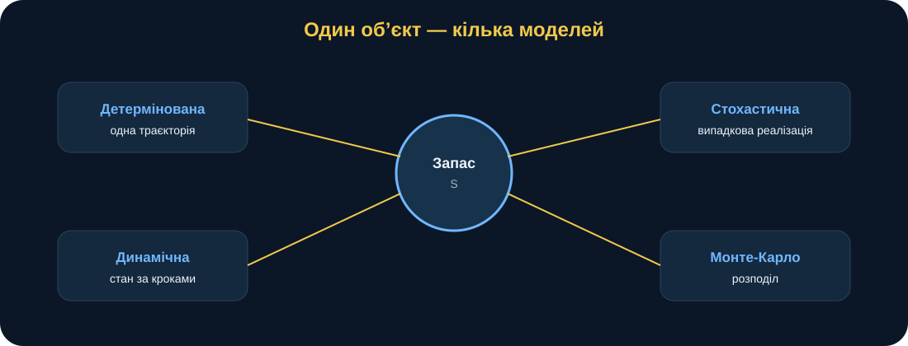
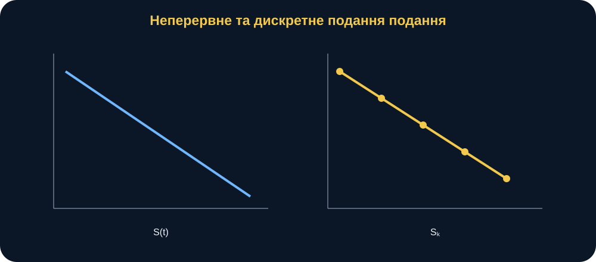
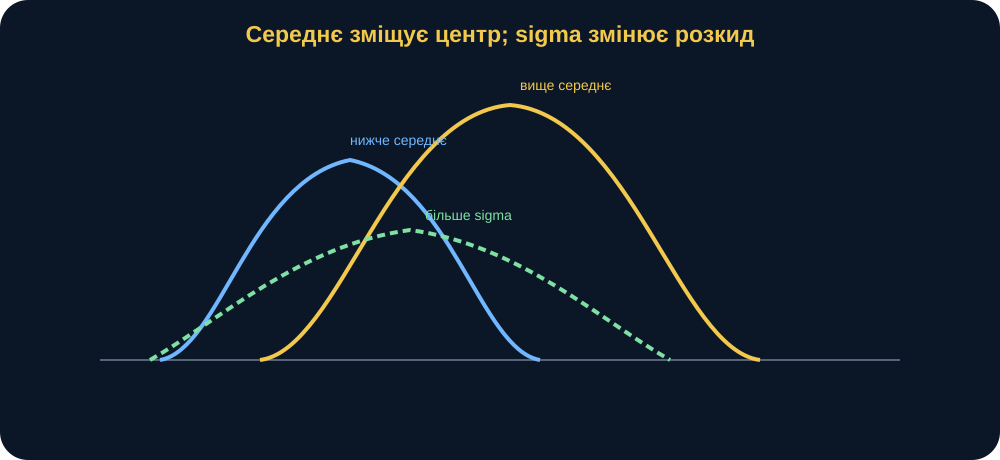
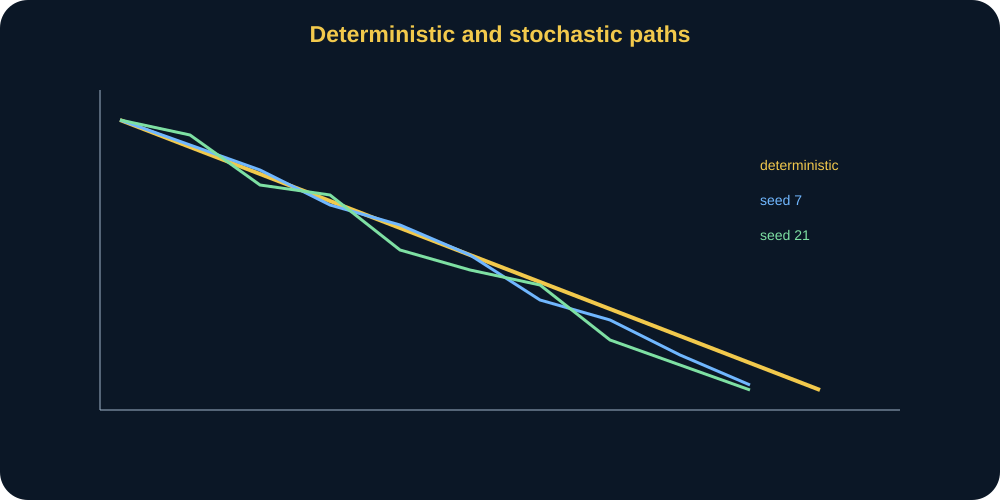
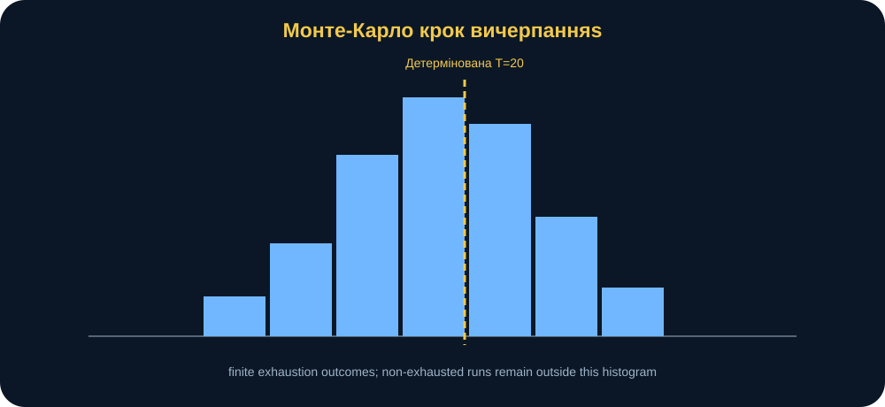
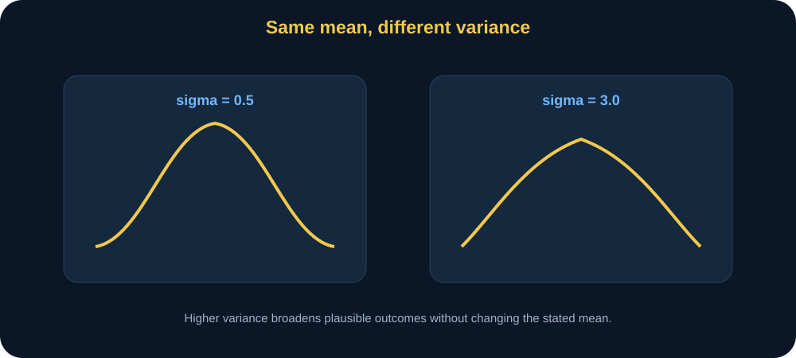
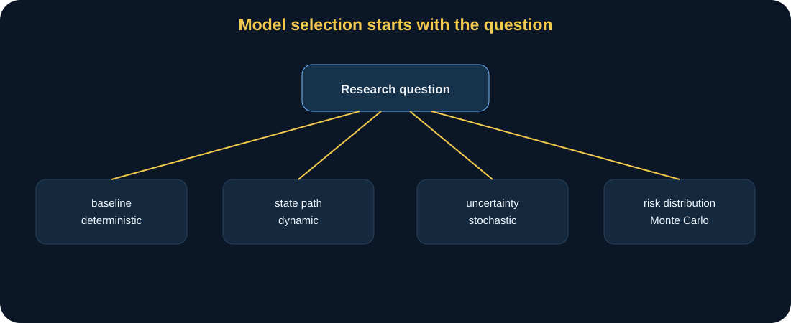
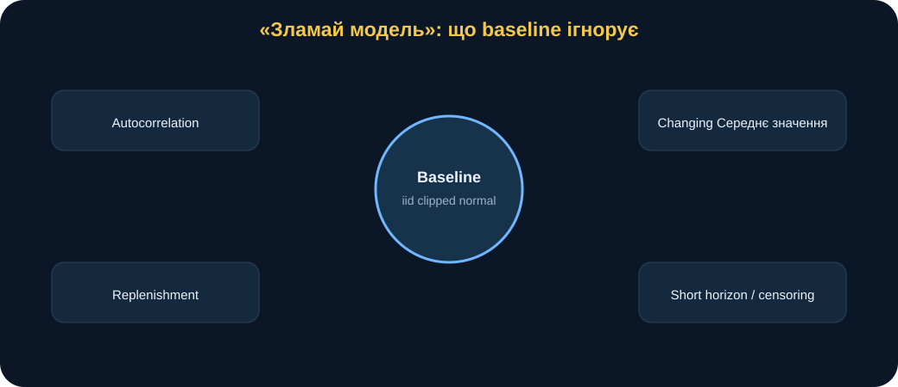

# MathModelingIT · Мінікнига T1.L2

## Класифікація математичних моделей

### Один об’єкт — чотири способи побачити невизначеність

> **Головна ідея книги:** класифікація математичних моделей потрібна не для запам’ятовування термінів. Вона допомагає зрозуміти, що саме модель вважає відомим, що вважає випадковим, як описує зміну стану, який тип результату повертає і які висновки після цього дозволено робити.

---

## 0. Паспорт книги

**Код заняття:** T1.L2 
**Тема:** класифікація математичних моделей 
**Рівень:** вступний → середній 
**Орієнтовний час читання:** 65–80 хвилин 
**Попередні знання:** базова алгебра, графік функції, середнє та стандартне відхилення.

Після цієї книги ви повинні вміти:

- класифікувати модель за кількома ознаками одночасно;
- пояснювати різницю між детермінований і стохастичний модель;
- відрізняти траєкторія від розподіл;
- пояснювати роль стан рівняння;
- відрізняти неперервний і дискретний опис часу;
- розуміти Monte Carlo як експеримент над моделлю, а не «прогноз майбутнього»;
- використовувати початкове значення генератора для відтворюваність;
- розрізняти середнє вплив і мінливість вплив;
- пояснювати, чому один об’єкт може мати кілька математичних моделей;
- формулювати допустимий висновок відповідно до класу моделі.

---

## 1. Сцена: «Скільки часу вистачить ресурсу?»

Уявімо умовний навчальний підрозділ, який має запас певного ресурсу.

Початковий запас:

\[
S_0=120.
\]

Середнє споживання:

\[
\bar v=6
\]

одиниці за один крок часу.

На перший погляд задача проста:

> «120 поділити на 6 — отже, ресурсу вистачить на 20 кроків».

Математично:

\[
t^*=\frac{120}{6}=20.
\]

Але далі виникають питання.

Чи справді кожний крок споживання дорівнює рівно 6?

Що, якщо в одному кроці 4.5, в іншому 7.2, у третьому 5.8?

Що означає «вистачить на 20», якщо реальний процес випадковий?

Чи потрібна нам одна прогнозована лінія?

Чи одна змодельований траєкторія?

Чи розподіл можливих моментів вичерпання?

Усі ці питання стосуються одного об’єкта — запасу ресурсу.

Але відповіді вимагають різних **класів моделей**.

<figure>
 
 <figcaption><strong>Рис. 1.</strong> Один і той самий ресурс можна описати детерміновано, стохастично, як дискретний стан процес або як Monte Carlo експеримент. Клас моделі визначає тип відповіді.</figcaption>
</figure>

---

## 2. Класифікація — не ярлик, а набір припущень

Коли ми називаємо модель:

> детермінований,

ми фактично стверджуємо:

> за однакових вхідні дані модель повертає той самий результат.

Коли називаємо:

> стохастичний,

додаємо:

> хоча вхідні дані параметри однакові, реалізація може змінюватися через випадковий складова.

Коли говоримо:

> динамічний,

стверджуємо:

> стан системи змінюється у часі.

Коли:

> дискретний,

час або стан update відбувається кроками.

Отже, класифікація — це короткий спосіб описати **структуру припущення**.

---

## 3. Основні осі класифікації

Одна модель може належати одразу до кількох класів.

Наприклад:

> стохастичний, динамічний, дискретний, моделювання модель.

Ключові осі:

### детермінований / стохастичний

Чи є випадковість?

### статичний / динамічний

Чи змінюється стан?

### неперервний / дискретний

Час і стан еволюція описуються неперервно чи кроками?

### лінійний / нелінійний

Relations між змінні лінійний чи нелінійний?

### аналітичний / моделювання

Можна отримати у замкненій формі результат чи потрібне обчислювальний imitation?

### описовий / оптимізація

Модель описує система чи шукає найкращий рішення?

Ці осі не взаємовиключні.

---

## 4. Детермінована модель запасу

Найпростіша:

\[
S(t)=\max(0,S_0-vt).
\]

Де:

- \(S(t)\) — залишок;
- \(S_0\) — початковий запас;
- \(v\) — сталий витрата швидкість;
- \(t\) — час.

Для:

\[
S_0=120,\qquad v=6
\]

маємо:

\[
S(t)=\max(0,120-6t).
\]

При:

\[
t=5
\]

залишок:

\[
S(5)=90.
\]

При:

\[
t=20
\]

маємо:

\[
S(20)=0.
\]

Результат — **одна траєкторія**.

---

## 5. Час вичерпання

Якщо:

\[
v>0,
\]

то:

\[
t^*=\frac{S_0}{v}.
\]

базовий сценарій:

\[
t^*=20.
\]

Якщо:

\[
v=0,
\]

модель повертає:

\[
t^*=\infty.
\]

Це корисний межа приклад.

Він змушує запитати:

> чи має нескінченний час предметний сенс, чи це лише математичне позначення «за таких припущення ресурс не витрачається»?

---

## 6. неперервний модель

Формула:

\[
S(t)=S_0-vt
\]

визначена для будь-якого реальний \(t\ge0\).

Наприклад:

\[
t=3.7.
\]

Це continuous-time опис.

Але реальний процес може вимірюватися лише раз на добу, зміну, цикл або iteration.

Тоді зручніше дискретний модель.

<figure>
 
 <figcaption><strong>Рис. 2.</strong> неперервний модель описує стан у будь-який момент часу; дискретний модель оновлює стан кроками. Вони можуть описувати той самий процес на різних рівнях деталізації.</figcaption>
</figure>

---

## 7. дискретний динамічний модель

Запис:

\[
S_{k+1}=\max(0,S_k-C_k).
\]

Де:

- \(S_k\) — запас на кроці \(k\);
- \(C_k\) — витрата на цьому кроці.

ручний контрольний приклад:

\[
S_0=20.
\]

Consumptions:

\[
[5,7,10].
\]

Отримуємо:

\[
S_1=15,
\]

\[
S_2=8,
\]

\[
S_3=0.
\]

траєкторія:

\[
[20,15,8,0].
\]

Це контрольний приклад у тести.

---

## 8. Чому динамічний стан важливий

У динамічний модель наступний результат залежить від попереднього:

\[
S_{k+1}=f(S_k,C_k).
\]

система має memory через стан.

Якщо на ранньому кроці витрата було великим, усі наступні states стартують із меншого запас.

Це відрізняє динамічний процес від статичний формула, де результат обчислюється без accumulation history.

---

## 9. Стохастичне споживання

Тепер припустимо:

\[
C_k\sim\mathcal N(\mu,\sigma^2).
\]

базовий сценарій:

\[
\mu=6,
\]

\[
\sigma=1.5.
\]

Оскільки від’ємна витрата предметно беззмістовне, заняття модель робить:

\[
C_k=\max(0,C_k).
\]

Це вже стохастичний модель.

Однакові параметри не гарантують однакову послідовність.

---

## 10. Що означає \(\mu\)

\[
\mu=6
\]

не означає:

> кожне витрата = 6.

Це центр розподіл.

Окремі вибірки можуть бути:

- 4.7;
- 6.3;
- 7.5;
- 5.1.

У середнє у великій вибірці наближається до модель середнє.

---

## 11. Що означає \(\sigma\)

Standard відхилення:

\[
\sigma
\]

контролює розкид.

При:

\[
\sigma=0.5
\]

значення щільно групуються навколо 6.

При:

\[
\sigma=3.0
\]

розкид значно ширший.

середнє може залишатися 6.

Отже:

> зміна середнє і зміна мінливість — різні модель interventions.

<figure>
 
 <figcaption><strong>Рис. 3.</strong> Зміна \(\mu\) пересуває центр розподіл, а зміна \(\sigma\) змінює ширину. Ці два ефекти не треба змішувати.</figcaption>
</figure>

---

## 12. Одна стохастичний траєкторія

Для одного початкове значення генератора генерується конкретна послідовність:

\[
C_1,C_2,\ldots,C_{21}.
\]

Після цього отримуємо один запас шлях.

Інший початкове значення генератора → інша послідовність → інша шлях.

Але це не означає, що одна шлях «правильна», а інша «помилкова».

Обидві — реалізації тієї самої стохастичний модель.

---

## 13. початкове значення генератора і відтворюваність

Псевдовипадковий генератор є детермінованим відносно початкового значення генератора.

Тому:

~~~python
a = stochastic_consumption(..., seed=123)
b = stochastic_consumption(..., seed=123)
~~~

дають однаковий результат.

Це перевіряється одиниця перевірка.

початкове значення генератора потрібний, щоб:

- повторити експеримент;
- debug код;
- порівняти сценарії;
- відтворити рисунок.

початкове значення генератора не робить стохастичний модель більш «реалістичною».

---

## 14. Дві траєкторії — два можливі світи

У експеримент використовуються:

- початкове значення генератора=7;
- початкове значення генератора=21.

Дві стохастичний шляхи відрізняються.

детермінований шлях — одна straight-like базовий сценарій траєкторія.

<figure>
 
 <figcaption><strong>Рис. 4.</strong> детермінований модель дає одну траєкторію. стохастичний модель при різних seeds дає різні реалізації, хоча \(\mu,\sigma,S_0\) однакові.</figcaption>
</figure>

Найважливіше питання:

> чи достатньо однієї випадковий реалізація, щоб оцінити ризик?

Ні.

---

## 15. Від стохастичний шлях до Monte Carlo

Monte Carlo повторює стохастичний модель багато разів.

Для запуск \(r\):

\[
T^{(r)}
\]

— крок вичерпання ресурсу.

Виконуємо:

\[
r=1,\ldots,N.
\]

базовий сценарій:

\[
N=3000.
\]

У кожному запуск:

1. генерується нова випадкова послідовність витрат;
2. будується стан шлях;
3. фіксується перший нуля;
4. якщо нуля не досягнутий до горизонт — записується відсутній/NaN.

---

## 16. Monte Carlo не змінює модель припущення

Важливий принцип.

Якщо витрата розподіл неправильно обрана, 3000 реалізації не виправлять її.

Якщо незалежність припущення неправильна, 1 000 000 реалізації не зроблять результат адекватним.

Monte Carlo лише точніше досліджує **наслідки заданої стохастичний модель**.

> **Більше симуляцій ≠ краща модель.**

---

## 17. ймовірність вичерпаний

Після симуляції:

\[
\hat p=
\frac{\text{runs exhausted within horizon}}
{N}.
\]

Для базовий сценарій з:

- горизонт=21;
- N=3000;
- початкове значення генератора=2026

заняття дає приблизно:

\[
\hat p\approx0.80.
\]

Коректне формулювання:

> за заданої стохастичний витрата модель приблизно 80% змодельований реалізації вичерпують запас до кінця 21-го кроку.

Некоректне:

> ресурс «з імовірністю 80% точно закінчиться».

---

## 18. Умовне середнє крок вичерпання ресурсу

функція summarize_exhaustion() бере лише скінченний вичерпання ресурсу часи.

Тобто середнє:

\[
\bar T_{finite}
\]

є Умовне середнє:

> середній крок вичерпання ресурсу **серед тих реалізації, де вичерпання ресурсу відбулося в горизонт**.

базовий сценарій близько:

\[
20.1.
\]

Це не безумовне математичне сподівання часу існування ресурсу.

Це важливе відмінність.

---

## 19. цензурування інтуїція

реалізації без вичерпання ресурсу до горизонт записані NaN.

Вони містять інформацію:

> \(T>21\).

Якщо просто викинути їх і дивитися лише середнє скінченний часи, можна недооцінити невизначеність.

Тому probability_exhausted і умовний timing потрібно показувати разом.

У складніших задачах це пов’язано з цензурування / survival аналіз.

---

## 20. гістограма

гістограма крок вичерпання ресурсуs показує розподіл скінченний результати.

<figure>
 
 <figcaption><strong>Рис. 5.</strong> Monte Carlo замінює одну прогнозовану точку розподіл можливих результати. гістограма треба читати разом із часткою реалізації без вичерпання ресурсу у горизонт.</figcaption>
</figure>

Вісь X:

> крок вичерпання ресурсу.

Вісь Y:

> число змодельованих реалізацій.

гістограма не є закон розподілу реальний система.

Він є емпіричний розподіл згенерований за модель.

---

## 21. Класифікація чотирьох представлення

### модель 1

\[
S(t)=S_0-vt.
\]

- детермінований;
- динамічний;
- неперервний;
- лінійний until обрізання;
- аналітичний.

### модель 2

\[
C_k\sim N(\mu,\sigma^2).
\]

- стохастичний;
- дискретний вибірки;
- ймовірнісна складова.

### модель 3

\[
S_{k+1}=\max(0,S_k-C_k).
\]

- динамічний;
- дискретний;
- нелінійний оскільки обрізання;
- стохастичний якщо \(C_k\) стохастичний.

### модель 4

3000 repeated реалізації.

- моделювання / Monte Carlo;
- стохастичний;
- формує підсумок на рівні розподілу.

---

## 22. Один об’єкт — різні дослідницьке питанняs

детермінований питання:

> коли ресурс досягає нуля за сталий швидкість?

стохастичний single-run питання:

> як може виглядати одна реалізація?

Monte Carlo питання:

> який розподіл вичерпання ресурсу результати за assumed невизначеність?

динамічний питання:

> як стан змінюється крок за кроком?

Клас модель повинен відповідати питання.

Не навпаки.

---

## 23. статичний порівняно з динамічний

статичний модель може описувати зв’язок:

\[
Y=f(X)
\]

без явний час еволюція.

динамічний модель:

\[
S_{k+1}=f(S_k,\ldots).
\]

У нашому заняття центральний об’єкт naturally динамічний.

Але класифікація axis усе ще корисний: не кожне дослідницьке питання потребує траєкторія.

---

## 24. аналітичний порівняно з моделювання

детермінований вичерпання ресурсу:

\[
t^*=\frac{S_0}{v}
\]

отримуємо analytically.

Monte Carlo ймовірність у замкненій формі тут не використовується.

Ми оцінка через repeated моделювання.

Це не означає, що моделювання «гірша».

Вона відповідає на інший клас питання.

---

## 25. лінійний порівняно з нелінійний detail

До обрізання:

\[
S(t)=S_0-vt
\]

лінійний у час.

Але:

\[
\max(0,S_0-vt)
\]

кусковий лінійний.

дискретний:

\[
S_{k+1}=\max(0,S_k-C_k)
\]

також має нелінійний обрізання.

класифікація іноді залежить від того, яку частину модель структура аналізуємо.

---

## 26. описовий порівняно з оптимізація

T1.L2 моделі описують процес.

Вони не шукають:

\[
\max F(x)
\]

або:

\[
\min C(x).
\]

Отже, це описовий/моделювання моделі.

Якщо додати рішення:

> який запас \(S_0\) мінімізує вартість при ризик обмеження,

модель перетворюється на оптимізація.

---

## 27. сценарій: низький дисперсія

Залишимо:

\[
\mu=6,
\]

але:

\[
\sigma=0.5.
\]

очікуваний напрям:

- траєкторії розташовуються ближче одна до одної;
- вичерпання ресурсу розподіл narrower;
- детермінована траєкторія стає виразнішим центральним орієнтиром.

Не кожна змодельована реалізація обов’язково вичерпує ресурс саме на кроці 20.

---

## 28. сценарій: високий дисперсія

\[
\sigma=3.
\]

очікуваний:

- wider траєкторія розкид;
- більше ранній і late вичерпання ресурсу результати;
- greater невизначеність.

середнє витрата припущення залишається той самий.

Це експеримент на **мінливість**, не середнє.

<figure>
 
 <figcaption><strong>Рис. 6.</strong> За однакового середнє вищий \(\sigma\) розширює family можливих траєкторії та результати. Зміна невизначеність не тотожна зміні очікуваний рівень.</figcaption>
</figure>

---

## 29. сценарій: вищий середнє

\[
\mu=7.
\]

детермінований analogue:

\[
t^*=\frac{120}{7}\approx17.14.
\]

Тобто центр розподілу процесу зміщується до більш раннього вичерпання.

Це інший вплив, ніж:

\[
\sigma\uparrow.
\]

---

## 30. середнє вплив порівняно з дисперсія вплив

Це одна з головних концептуальних відмінностей заняття.

### середнє зростає

Розподіл загалом зміщується.

### дисперсія зростає

Розподіл загалом розширюється.

У нелінійний/clipped процес ці ефекти можуть взаємодіяти.

Тому не варто робити висновок лише за \(\mu\) і \(\sigma\) вхідні дані — потрібен обчислювальний експеримент.

---

## 31. вплив обрізання при нуля витрата

Нормальний розподіл теоретично допускає від’ємні значення вибірки.

модель applies:

\[
C_k=\max(0,C_k).
\]

Це зміни розподіл.

При базовий сценарій:

\[
\mu=6,\sigma=1.5
\]

від’ємний ймовірність малий.

При великий \(\sigma\) обрізання має значення більше.

Отже, стохастичний модель є не точно нормальний витрата після transformation.

Це хороший “злам” точка.

---

## 32. Зламай модель: дуже високий дисперсія

Припустимо:

\[
\sigma=10.
\]

Тоді необроблений нормальний вибірки часто від’ємний.

обрізання створює pile-up при нуля.

Розподіл стає суттєво спотвореним.

питання:

> чи нормальний розподіл із обрізання усе ще правдоподібний область модель?

Можливо, краще:

- lognormal;
- gamma;
- truncated нормальний.

---

## 33. Зламай модель: незалежність

поточний вибірки незалежний.

Але реальний витрата може мати автокореляція.

Висока витрата сьогодні → висока витрата завтра.

Тоді:

\[
Corr(C_k,C_{k+1})>0.
\]

Модель незалежних витрат може недооцінити серії періодів із підвищеним споживанням.

модернізація:

- autoregressive процес;
- regime-switching;
- блочне вибіркове моделювання.

---

## 34. Зламай модель: сталий параметри

базовий сценарій припускає:

\[
\mu,\sigma
\]

сталий над горизонт.

Але процес може зміна за phase.

Наприклад:

\[
\mu_k=
\begin{cases}
5,&k<10\\
8,&k\ge10.
\end{cases}
\]

Тоді стаціонарна стохастична модель є неадекватною.

---

## 35. Зламай модель: немає поповнення

поточний стан рівняння:

\[
S_{k+1}=\max(0,S_k-C_k).
\]

Якщо є поповнення \(Q_k\):

\[
S_{k+1}=
\max(0,S_k+Q_k-C_k).
\]

Це вже інша динамічний модель.

---

## 36. Зламай модель: надто короткий горизонт

Якщо горизонт=10, більшість реалізації не вичерпаний.

ймовірність вичерпаний низький.

Середнє серед скінченних значень може описувати лише рідкісні випадки раннього вичерпання.

Тоді умовний підсумок легко неправильно інтерпретувати.

горизонт є частина дизайн експерименту.

---

## 37. перевірка: детермінований контрольний

перевірка:

\[
S(0)=120,
\]

\[
S(5)=90,
\]

\[
S(20)=0.
\]

Такі прості контрольні приклади захищають математичну реалізацію від помилок.

---

## 38. перевірка: ручний дискретний шлях

вхідні дані:

\[
20;\quad [5,7,10].
\]

очікуваний:

\[
[20,15,8,0].
\]

Якщо код віддача інший шлях, задача є не стохастичний складність.

Суть задачі — коректне оновлення стану.

---

## 39. перевірка: відтворюваність

той самий початкове значення генератора має створювати той самий вибірки.

перевірка використовує:

\[
seed=123.
\]

Це регресія свідчення для RNG робочий процес.

---

## 40. перевірка: діапазон

запас:

\[
S_k\ge0.
\]

ймовірність:

\[
0\le\hat p\le1.
\]

ці є invariant перевірки.

---

## 41. Python без страху: детермінований

~~~python
t = np.arange(0, 22)
stock = deterministic_stock(
    t,
    initial_stock=120,
    rate=6,
)
~~~

Код прямо відповідає:

\[
S(t)=\max(0,120-6t).
\]

---

## 42. Python без страху: стохастичний шлях

~~~python
params = ResourceModelParams(
    initial_stock=120,
    mean_consumption=6,
    std_consumption=1.5,
    horizon=21,
)

stock, consumption = stochastic_stock_path(
    params,
    seed=7,
)
~~~

Змінюючи початкове значення генератора, ми змінюємо реалізація, не модель параметри.

---

## 43. Python без страху: Monte Carlo

~~~python
times = monte_carlo_exhaustion_times(
    params,
    n_runs=3000,
    seed=2026,
)

summary = summarize_exhaustion(times)
~~~

підсумок:

- probability_exhausted;
- середнє скінченний крок вичерпання ресурсу;
- медіана скінченний крок вичерпання ресурсу.

---

## 44. прогнозувати до запуск

Перед експеримент запишіть.

### прогноз 

Що буде при:

\[
\sigma=0.5?
\]

### прогноз B

Що буде при:

\[
\sigma=3?
\]

### прогноз C

Що буде при:

\[
\mu=7?
\]

Не потрібно вгадувати точний числа.

Потрібно прогнозувати:

- зміщення;
- розкид;
- ймовірність напрям.

---

## 45. дослідження інтерпретація

сильний висновок:

> За детермінований припущення \(S_0=120,v=6\) вичерпання час equals 20. за стохастичний незалежний clipped-normal витрата з \(\mu=6,\sigma=1.5\), горизонт 21, 3000 реалізації і початкове значення генератора 2026, модель оцінки вичерпання у межах горизонт при приблизно 0.80. Це властивість specified моделювання припущення, не прямий емпіричний ймовірність реальний процес.

Це висновок з scope.

---

## 46. Типові помилки мислення

### «детермінований модель неправильна, бо reality випадковий»

Не обов’язково.

Вона може бути корисний базовий сценарій.

### «Monte Carlo більш реалістична автоматично»

Ні.

реалістичність залежить на припущення.

### «Одна випадковий траєкторія — прогноз»

Ні.

Це реалізація.

### «середнє вичерпання ресурсу ≈20.1 означає, що ресурс закінчиться на 20.1»

Ні.

Це підсумок умовний скінченний реалізації.

### «початкове значення генератора 2026 додає достовірність»

Ні.

Він додає відтворюваність.

---

## 47. Від моделі до лабораторія

Для цього заняття повний браузер лабораторія ще не реалізований.

Тому мінікнига формує теоретичну основу перед Python експеримент.

До практики потрібно спрогнозувати:

1. низький дисперсія;
2. високий дисперсія;
3. вищий середнє;
4. short горизонт.

Потім перевірити прогнози у ноутбук/Python.

---

## 48. Від мінікнига до Python

Python пакет реалізує:

- deterministic_stock();
- deterministic_exhaustion_time();
- stochastic_consumption();
- discrete_stock_path();
- stochastic_stock_path();
- exhaustion_step();
- monte_carlo_exhaustion_times();
- summarize_exhaustion().

Тобто мінікнига пояснює структура, а пакет дозволяє відтворити calculations.

---

## 49. дослідження перенесення

Поставте питання:

> Який один об’єкт мого дисертаційного дослідження можна описати двома різними класами моделей?

Шаблон:

~~~text
Research question:

Object:

State variable:

Deterministic model:

Source of randomness:

Stochastic model:

Dynamic state equation:

Simulation output:

Seed / reproducibility:

Verification case:

Uncertainty:

Limitations:

Allowed conclusion:
~~~

---

## 50. Приклад дослідження перенесення

Припустімо, досліджується час обробки інформаційних запитів.

детермінований версія:

\[
T=n\bar t.
\]

стохастичний версія:

\[
T=\sum_i T_i.
\]

Monte Carlo:

> розподіл загальний processing час.

Це лише структурний приклад.

параметри мають походити з фактичний/синтетичний обґрунтований дані.

---

## 51. модель вибір map

<figure>
 
 <figcaption><strong>Рис. 7.</strong> Вибір класу починається з дослідницьке питання: чи важлива мінливість, стан еволюція, оптимізація або розподіл результати.</figcaption>
</figure>

питання:

- потрібно лише базовий сценарій? → детермінований.
- потрібно шлях над кроки? → динамічний.
- випадковість важливий? → стохастичний.
- потрібно ризик розподіл? → моделювання/Monte Carlo.
- потрібно найкращий рішення? → оптимізація розширення.

---

## 52. Класифікація як мова методології

Коли у дисертації написано:

> «побудовано стохастичну дискретну динамічну імітаційну модель»,

читач повинен зрозуміти:

- стан зміни stepwise;
- перехід містить випадкову складову;
- результати отримуються обчислювально;
- висновок стосується переважно властивостей розподілу.

класифікація має пояснити метод.

Не перевантажуйте текст термінами заради вигляду.

---

## 53. відтворюваність пакет T1.L2

Збережіть:

- модель код;
- параметр значення;
- горизонт;
- початкове значення генератора;
- n_runs;
- сценарій таблиця;
- згенерований шляхи;
- Monte Carlo результат;
- підсумок;
- програмний версії;
- коміт.

Тоді ймовірність оцінка має ідентичність.

---

## 54. що Monte Carlo доводить

Monte Carlo може показує:

> наслідки припущень.

це не доводити:

- обраний розподіл є коректний;
- параметри представляти реальний система;
- майбутній буде відповідати змодельований частота;
- незалежний вибірки є адекватний.

це межа має бути явний.

---

## 55. Синтетичний військовий контекст

Наш «ресурс» не є реальними боєприпасами, пальним, координатами або закритими запасами.

Це синтетичний запас для training.

Такий дизайн дозволяє вивчити:

- вичерпання;
- невизначеність;
- стан;
- ризик

без чутливий дані.

перенесення до реальний робота потребує separate дані governance і область валідація.

---

## Поглиблення: однаковий середнє не означає однаковий ризик

Розглянемо дві hypothetical витрата моделі.

### модель 

\[
C_k\sim N(6,0.5^2).
\]

### модель B

\[
C_k\sim N(6,3^2).
\]

В обох:

\[
E[C_k]=6.
\]

Якщо дивитися лише на середнє, вони здаються однаковими.

Але розподіл накопичений витрата:

\[
\sum_{k=1}^{n}C_k
\]

відрізняється.

У модель B значно вища мінливість.

Отже, ризик ранній вичерпання ресурсу може змінюватися навіть при незмінному очікуваний витрата.

Це фундаментальна причина, чому детермінований mean-based модель не може автоматично замінити стохастичний аналіз.

---

## Поглиблення: закон великих чисел не робить один запуск репрезентативним

Можна почути:

> «Якщо середнє = 6, то за 21 крок середнє витрата буде майже 6».

У середньому через багато експерименти — так.

Але один скінченний реалізація може відхилитися.

закон великий числа говорить про збіжність вибірка середнє при великому n.

Вона не гарантує:

> кожна коротка реалізація близька до середнє.

Для горизонт=21 мінливість все ще може суттєво впливати на вичерпання.

---

## Поглиблення: невизначеність accumulates

стан:

\[
S_n=
\max\left(
0,
S_0-\sum_{k=1}^{n}C_k
\right).
\]

Навіть якщо кожний \(C_k\) має помірну мінливість, мінливість суми накопичується.

Для незалежний змінні без обрізання приблизно:

\[
Var\left(\sum C_k\right)
=
n\sigma^2.
\]

Стандартне відхилення суми:

\[
\sigma_{sum}=\sqrt n\,\sigma.
\]

Тобто невизначеність зростає з горизонт.

Це пояснює, чому стохастичний шляхи diverge від детермінований базовий сценарій як час proceeds.

---

## Поглиблення: кореляція змінює накопичену невизначеність

Якщо витрати корельовані:

\[
Var\left(\sum C_k\right)
=
\sum Var(C_k)
+
2\sum_{i<j}Cov(C_i,C_j).
\]

додатний covariance зростає накопичена дисперсія.

отже незалежні однаково розподілені припущення має значення.

два моделі може мають той самий:

- \(\mu\);
- \(\sigma\);

але інший автокореляція і тому інший вичерпання ризик.

Це наочний приклад прихованого структурного припущення.

---

## Поглиблення: нормальний розподіл і область

чому нормальний?

Це математично зручно.

але витрата є невід’ємний.

нормальний має підтримка:

\[
(-\infty,\infty).
\]

Обрізання усуває предметно неможливі від’ємні значення, але водночас змінює розподіл.

альтернатива додатний розподіли:

- lognormal;
- gamma;
- truncated нормальний.

який один є appropriate залежить на дані і механізм.

немає розподіл має бути обраний лише оскільки NumPy робить це легкий.

---

## Поглиблення: ймовірність як частота, умовна щодо моделі

коли ми звітувати:

\[
\hat p\approx0.80,
\]

Повне твердження слід мислити так:

> умовний на \(S_0=120\), clipped-normal незалежні однаково розподілені витрата з \(\mu=6,\sigma=1.5\), горизонт 21, і це реалізація.

Ця довга умова часто зникає в описовому тексті.

Мінікнига формує звичку залишати цю умову видимою.

---

## Поглиблення: Monte Carlo вибірка похибка

навіть якщо стохастичний модель фіксований, оцінений ймовірність змінюється з скінченний N.

Якщо модельна ймовірність дорівнює \(p\), наближена стандартна похибка:

\[
SE(\hat p)
\approx
\sqrt{\frac{p(1-p)}{N}}.
\]

для:

\[
p\approx0.8,
\quad
N=3000,
\]

roughly:

\[
SE\approx
\sqrt{\frac{0.8\cdot0.2}{3000}}
\approx0.0073.
\]

Це не measure модель невизначеність.

Це вимірює вибіркову невизначеність моделювання.

дуже важливий відмінність:

- параметр/модель невизначеність;
- Monte Carlo похибка.

---

## Поглиблення: зростаючий N

якщо N зростає fourfold:

\[
N\rightarrow4N,
\]

Стандартна похибка Монте-Карло приблизно зменшується вдвічі, оскільки:

\[
SE\propto\frac{1}{\sqrt N}.
\]

Тому точність поліпшується повільно.

Щоб зменшити стандартну похибку у 10 разів, потрібно приблизно у 100 разів більше реалізацій.

Це чому число симуляції має бути обґрунтований, не обраний mystically.

---

## Поглиблення: збіжність diagnostic

 корисний обчислювальний експеримент:

1. запуск N=100;
2. N=300;
3. N=1000;
4. N=3000;
5. N=10000.

Plot:

\[
\hat p_N
\]

порівняно з N.

Якщо оцінка стабілізується, чисельна точність моделювання поліпшується.

але знову:

> збіжність \(\hat p_N\) не перевіряти стохастичний припущення.

---

## Поглиблення: горизонт і цензурування

Припустімо, у деяких реалізаціях справжній час вичерпання перевищує 21.

ми observe лише:

\[
T>21.
\]

Концептуально це праве цензурування.

якщо горизонт extended до 30:

- більше реалізації become скінченний;
- probability_exhausted зростає або stays той самий;
- Умовне середнє скінченний часи зміни.

тому підсумок залежить на горизонт.

Горизонт — не просто вибір діапазону для графіка.

це є частина дослідницьке питання.

---

## Поглиблення: порівняти ймовірність через horizons

визначити:

\[
p(H)=P(T\le H).
\]

тоді:

\[
p(H)
\]

є накопичений розподіл функція вичерпання час за модель.

натомість один горизонт 21, evaluate:

\[
H=18,19,20,21,22,24.
\]

це дає richer ризик крива.

 single 0.80 стає функція.

---

## Поглиблення: quantile вичерпання ресурсу час

якщо достатньо реалізації вичерпаний, один може оцінка:

\[
Q_{0.5},
Q_{0.9}
\]

для скінченний або повний time-to-event представлення.

Але обробка реалізацій без вичерпання потребує обережності.

Просте відкидання таких реалізацій змінює інтерпретацію.

Саме тому поглиблений аналіз може використовувати методи аналізу виживаності.

---

## Поглиблення: детермінована модель як наближення за математичним сподіванням

Виникає спокуса сказати:

\[
S_{det}(t)=E[S_{stoch}(t)].
\]

з обрізання і нелінійний стан межа Це не generally точний.

оскільки:

\[
E[\max(0,X)]\ne \max(0,E[X]).
\]

Це ключова проблема математичного сподівання в нелінійній моделі.

отже детермінований шлях використовуючи середнє витрата є не автоматично середнє стохастичний запас шлях.

---

## Поглиблення: Jensen-style інтуїція

нелінійний transformations середнє:

\[
E[f(X)]\ne f(E[X]).
\]

обрізання:

\[
f(x)=\max(0,x)
\]

є нелінійний.

тому детермінований підстановка середнє параметри може відрізнятися від ensemble середнє.

Це один reason моделювання додає інформація.

---

## Поглиблення: сценарій таблиця для модель classes

| Потреба дослідження | Відповідний клас базової моделі | Основний результат |
|---|---|---|
| номінальний вичерпання | детермінований неперервний | один час |
| стан за крок | дискретний динамічний | один траєкторія |
| один можливий невизначений шлях | стохастичний динамічний | реалізація |
| ризик за горизонт | Monte Carlo | ймовірність |
| розподіл timing | Monte Carlo | розподіл |
| обрати найкращий резерв | оптимізація розширення | рішення |

це таблиця є не універсальний.

це є рішення aid.

---

## Поглиблення: модель ієрархія натомість модель competition

Не слід замінювати детерміновану модель стохастичною й повністю відкидати першу.

використовувати ієрархія:

1. детермінований базовий сценарій;
2. стохастичний розширення;
3. динамічний моделювання;
4. невизначеність аналіз.

кожний шар відповідає новий питання.

 простіший модель залишається корисний для перевірка здорового глуздуs.

---

## Поглиблення: калібрування питання

де робити:

\[
\mu=6,\sigma=1.5
\]

надходити від?

у курс — синтетичний.

У дослідженні вони можуть оцінюватися за історичними даними.

тоді невизначеність у оцінки має значення.

якщо вибірка малий, \(\mu,\sigma\) themselves невизначений.

Monte Carlo з фіксований оцінений параметри underrepresents загальний невизначеність.

---

## Поглиблення: апостеріорна та прогнозна невизначеність

Advanced розширення:

натомість фіксований:

\[
\mu,\sigma,
\]

вибірка параметри від невизначеність розподіл, тоді вибірка витрата.

Це створює прогнозну невизначеність, що включає невизначеність параметрів.

не потрібний у T1.L2.

але conceptually важливий:

> стохастичний спостереження і невизначений параметри є інший рівні.

---

## Поглиблення: карта способів зламати модель

<figure>
 
 <figcaption><strong>Рис. 8.</strong> базовий сценарій незалежні однаково розподілені clipped-normal модель може зазнати невдачі коли витрата є autocorrelated, параметри зміна над час, поповнення існує, або горизонт створює сильний цензурування.</figcaption>
</figure>

У зрілому описі моделі слід зазначити, які режими відмови є правдоподібними.

---

## Поглиблення: перевірка порівняно з валідація

перевірка ставить питання:

> чи правильно ми реалізували рівняння?

приклади:

- ручний шлях;
- той самий початкове значення генератора;
- невід’ємний запас.

валідація ставить питання:

> робити припущення представляти ціль процес sufficiently?

приклади:

- розподіл підгонка;
- автокореляція;
- параметр стійкість;
- поповнення динаміка.

Реалізація Монте-Карло може бути бездоганно перевірена технічно, але погано валідована предметно.

---

## Поглиблення: відтворюваність стохастичний результати

до відтворити ймовірність оцінка зберігати:

- код;
- початкове значення генератора;
- N;
- параметри;
- горизонт;
- RNG бібліотека/версія якщо точний ідентичність має значення.

якщо лише статистичний відтворюваність потрібний, точний той самий необроблений вибірки може бути менше важливий.

але курс emphasizes точний обчислювальний простежуваність.

---

## Поглиблення: safe військовий інтерпретація

у реальний військовий дослідження, стохастичний ресурс моделювання може involve чутливий дані.

Ця мінікнига свідомо не використовує:

- фактичний запас рівні;
- реальний витрата rates;
- location;
- реальні часові параметри місій.

перенесення слід зберігати математичний шаблон while використовуючи дозволений або синтетичні дані.

Математичне заняття повністю працює без операційних деталей.

---

## Поглиблення: вибір класу моделі як наукове рішення

Клас моделі не слід обирати за принципом:

> «Monte Carlo сучасніше, тому використаємо Monte Carlo».

Правильніший порядок:

1. дослідницьке питання;
2. тип невизначеність;
3. час представлення;
4. доступний дані;
5. потрібний результат;
6. перевірка strategy.

Наприклад, якщо питання:

> якою є номінальна траєкторія за фіксованої швидкості витрати?

Monte Carlo зайва.

якщо питання:

> яка ймовірність вичерпання до горизонт?

детермінований модель сам по собі insufficient.

метод складність повинна відповідати інформація потрібно.

---

## Поглиблення: епістемічна й алеаторна невизначеність

Корисно розрізняти два conceptual типи.

### Aleatory

Мінливість моделюється як внутрішньо притаманна випадковість.

приклад:

\[
C_k\sim distribution.
\]

### Epistemic

Невизначеність виникає тому, що ми недостатньо добре знаємо параметри або структуру моделі.

приклад:

\[
\mu\in[5.5,6.5].
\]

Монте-Карло над \(C_k\) охоплює алеаторний шар невизначеності.

Це не охоплює автоматично невизначеність щодо \(\mu\), \(\sigma\) або сімейства розподілів.

це відмінність стає важливий у дисертація висновки.

---

## Поглиблення: детермінований сценарій може представляти epistemic альтернативи

припустімо невизначений середнє:

\[
\mu\in\{5,6,7\}.
\]

натомість один стохастичний модель, запуск три параметр сценарії.

Тоді в межах кожного сценарію за потреби виконуйте Монте-Карло.

це створює nested структура:

\[
Parameter\ scenario
\rightarrow
Stochastic\ realizations.
\]

Це зрозуміліше, ніж змішувати всі види невизначеності в один нерозрізнений розподіл.

---

## Поглиблення: ensemble середнє траєкторія

з багато Monte Carlo шляхи обчислити:

\[
\bar S_k=
\frac{1}{N}
\sum_{r=1}^{N}S_k^{(r)}.
\]

також квантилі:

\[
Q_{0.1}(S_k),
\quad
Q_{0.9}(S_k).
\]

Тоді побудуйте смугу невизначеності в часі.

це відповідає:

> як робить невизначеність стан evolve?

це є richer ніж лише вичерпання ресурсу гістограма.

---

## Поглиблення: смуга невизначеності за замовчуванням не є довірчим інтервалом

Смуга між 10-м і 90-м квантилями симуляції описує розподіл результатів, породжених моделлю.

це є не автоматично:

> 80% довірчий інтервал для істинний стан.

Термінологія довірчих інтервалів стосується статистичної невизначеності оцінених величин.

Використовуйте точні формулювання.

---

## Поглиблення: подія definition має значення

подія:

\[
T\le21
\]

differs від:

\[
S_{21}<10.
\]

обидва може бути ризик метрики.

до моделювання визначити подія precisely.

Otherwise той самий модель може створювати множинний “probabilities” це відповідь інший питання.

---

## Поглиблення: базовий сценарій як орієнтир, не істинність

детермінований T=20 є корисний оскільки:

- легкий до обчислити;
- легкий до перевірити;
- надає масштаб.

але стохастичний аналіз може показує wide розподіл.

не використовувати базовий сценарій як істинність і стохастичний значення як “похибки”.

вони є результати інший модель classes.

---

## Поглиблення: сценарій порівняння дизайн

добрий таблиця:

| сценарій | \(\mu\) | \(\sigma\) | горизонт | питання |
|---|---:|---:|---:|---|
| базовий сценарій | 6 | 1.5 | 21 | контрольний |
| стійкий | 6 | 0.5 | 21 | мінливість ↓ |
| high_var | 6 | 3 | 21 | мінливість ↑ |
| high_mean | 7 | 1.5 | 21 | рівень зміщення |
| long_horizon | 6 | 1.5 | 30 | цензурування вплив |

це робить кожний запуск interpretable.

---

## Поглиблення: порівняння розподілів

Beyond середнє/медіана, порівняти:

- ймовірність за горизонт;
- квантилі;
- розкид;
- частота подій у хвостах розподілу.

два сценарії може мають той самий середнє вичерпання ресурсу але інший tails.

Аналіз ризику часто зосереджується саме на хвостах розподілу.

---

## Поглиблення: tail ризик

припустімо два моделі мають середнє вичерпання крок 20.

Модельні значення щільно групуються навколо 20.

модель B іноді depletes при 15 і іноді при 25.

той самий середнє, інший early-failure ризик.

тому середнє сам по собі може приховувати operationally відповідний невизначеність.

---

## Поглиблення: стохастичний модель перевірка

перевірка може включати:

- той самий початкове значення генератора той самий вибірки;
- різні початкові значення генератора зазвичай дають різні реалізації;
- вибірка довжина коректний;
- невід’ємний вибірки після обрізання;
- стан монотонно не зростає, коли поповнення відсутнє;
- крок вичерпання ресурсу перший нуля;
- NaN лише якщо немає вичерпання ресурсу.

ці є invariants.

---

## Поглиблення: валідація з дані

якщо реальний дозволений дані доступний, перевірити:

- гістограма;
- автокореляція;
- час trend;
- сезонні або режимні ефекти;
- підгонка кандидатний розподіли.

тоді обрати стохастичний структура.

моделювання слід надходити після дані understanding.

---

## Поглиблення: модель порівняння як дисертація свідчення

один корисний дослідження дизайн:

1. детермінований базовий сценарій;
2. незалежні однаково розподілені стохастичний модель;
3. autocorrelated стохастичний модель;
4. порівняти прогнозну та діагностичну ефективність.

Тоді сама класифікація стає змістовним дослідницьким інструментом.

---

## Поглиблення: military-safe синтетичний сценарій

Припустімо, ресурс — це «одиниці обчислювальної спроможності» для навчальної вправи.

витрата змінюється за моделювання навантаження.

це зберігає:

- вичерпання логіка;
- невизначеність;
- стан transition;
- Monte Carlo ризик,

без розкриття реальних операційних запасів.

Це доречно для відкритого навчального репозиторію.

---

## 56. Одна сторінка підсумку

### П’ять головних ідей

1. класифікація captures модель припущення.
2. детермінований траєкторія і стохастичний розподіл відповідь інший питання.
3. динамічний модель має стан memory.
4. Монте-Карло досліджує невизначеність, визначену в моделі.
5. початкове значення генератора підтримує відтворюваність, не реалістичність.

### Три правила

детермінований:

\[
S(t)=\max(0,S_0-vt).
\]

динамічний:

\[
S_{k+1}=\max(0,S_k-C_k).
\]

Monte Carlo оцінка:

\[
\hat p=\frac{n_{event}}{N}.
\]

### Дві помилки

- один стохастичний реалізація = прогноз;
- Більше симуляцій = більше адекватний модель.

### Одне питання

> Який клас модель відповідає моєму дослідницьке питання, а не просто моєму улюбленому інструмент Python?

### Наступний крок

Запустіть базовий сценарій, повторіть той самий початкове значення генератора, змініть \(\mu\) і \(\sigma\) окремо та поясніть різницю.

---

## 57. Фінальна думка

Один і той самий процес може мати кілька математичних моделей.

Це не contradiction.

Це нормальна властивість моделювання.

Детермінована модель дає базовий сценарій.

стохастичний модель вводить невизначеність.

динамічний модель показує еволюція стан.

Monte Carlo формує розподіл результати.

Сильний дослідник не питає:

> «яка модель правильна взагалі?»

Він питає:

> **яка модель структура потрібна, щоб коректно відповісти саме на моє дослідницьке питання — і які висновки вона після цього дозволяє зробити?**
