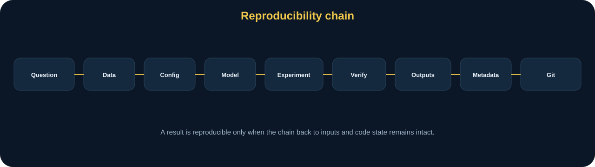
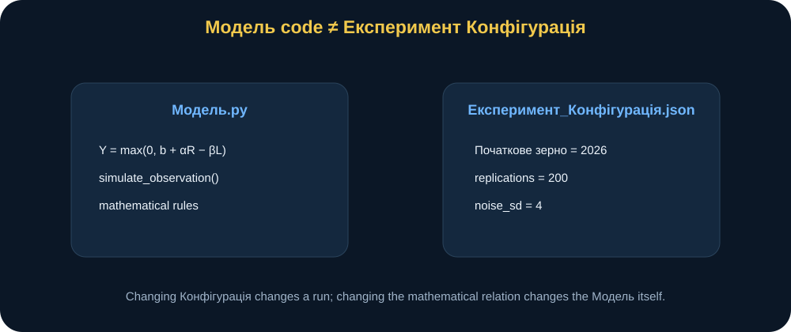
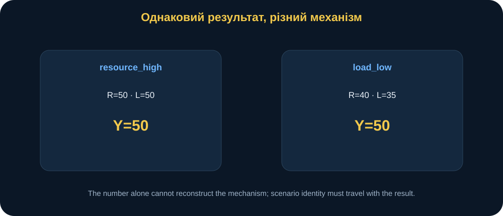
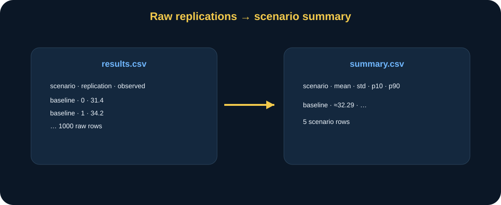
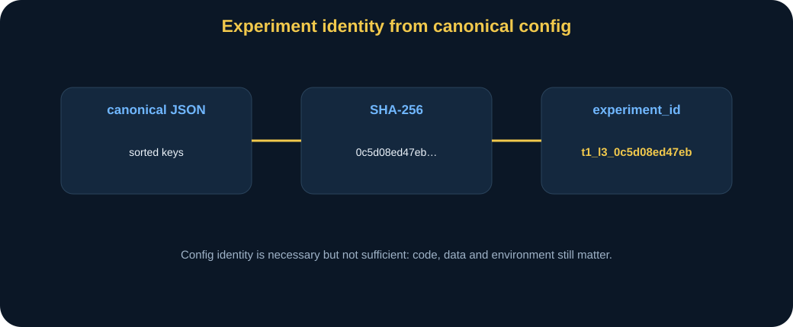
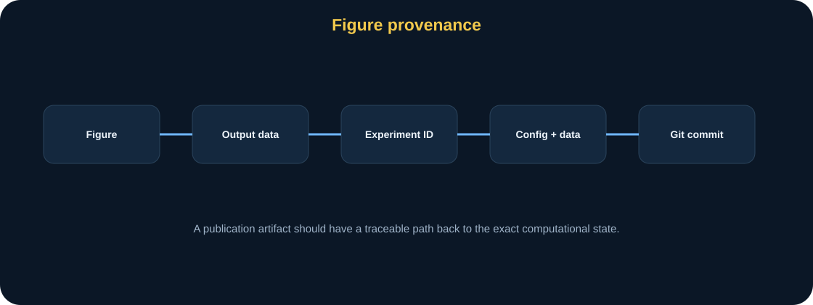
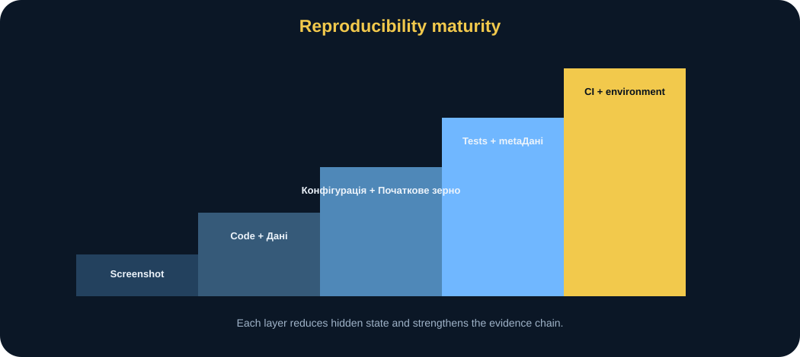
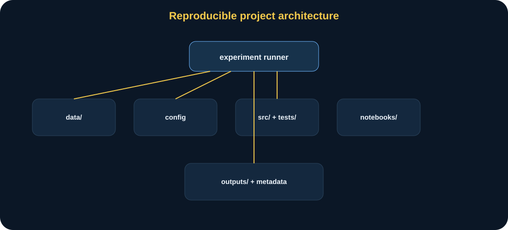

# MathModelingIT · Мінікнига T1.L3

## Організація математичного моделювання

### Як перетворити код на відтворюваний дослідницький процес

> **Головна ідея книги:** математична модель у науковому дослідженні — це не лише формула й не лише ноутбук. Це простежуваний робочий процес, де дослідницьке питання, дані, конфігурація, код, початкове значення генератора, результати, метадані і Git стан дозволяють іншому досліднику відтворити саме той результат, на який ви посилаєтесь у статті чи дисертації.

---

## 0. Паспорт книги

**Код заняття:** T1.L3 
**Тема:** організація математичного моделювання 
**Рівень:** середній 
**Орієнтовний час читання:** 70–85 хвилин 
**Попередні знання:** базова Python-модель, CSV/JSON, поняття випадковий початкове значення генератора, Git на рівні коміт.

Після цієї книги ви повинні вміти:

- розділяти дослідницьке питання, дані, модель, конфігурація, код і результати;
- пояснювати, чому ноутбук не повинен бути єдиним джерелом логіки;
- виносити параметри експеримент у конфігурація;
- використовувати початкове значення генератора як частину експеримент ідентичність;
- формувати необроблений результати і підсумок окремо;
- розуміти роль метадані;
- пояснювати конфігурація хеш;
- відрізняти відтворюваність від адекватність;
- пов’язувати результат → експеримент ID → конфігурація/дані → Git коміт;
- проектувати мінімальний відтворюваний обчислювальний експеримент для власного дослідження.

---

## 1. Сцена: «А який саме запуск дав цей рисунок?»

Уявімо звичайну ситуацію під час підготовки дисертації.

У текст вставлено рисунок.

На ньому п’ять сценарії.

Через пів року керівник запитує:

> «Які параметри використовувалися саме тут?»

Відкривається ноутбук.

У ньому десятки cells.

Деякі виконані в іншому порядку.

Частина параметри змінювалась вручну.

CSV уже оновлений.

початкове значення генератора не зафіксовано.

Файл рисунок називається:

~~~text
plot_final_v2_really_final.png
~~~

І головне питання стає несподівано складним:

> **чи можемо ми точно відтворити той обчислювальний результат, на який посилається дисертація text?**

Саме це питання є центральним у T1.L3.

<figure>
 
 <figcaption><strong>Рис. 1.</strong> Відтворюваність виникає з повного ланцюга: питання → дані → конфігурація → модель/код → експеримент → результати → метадані → Git стан.</figcaption>
</figure>

---

## 2. відтворюваність — властивість робочий процес

Поширена помилка:

> «У мене є ноутбук, отже експеримент відтворюваний».

Не обов’язково.

ноутбук може містити:

- прихований стан;
- комірки виконані не за порядком;
- змінений вручну змінні;
- локальний файли;
- незадокументовані версії пакетів;
- випадкові вибірки без фіксованого початкового значення генератора.

Тому відтворюваність — це не format.

Це властивість whole робочий процес.

---

## 3. Центральна логіка

У заняття зафіксовано:

\[
Research\ question
\rightarrow
Data
\rightarrow
Config
\rightarrow
Model
\rightarrow
Code
\rightarrow
Experiment
\rightarrow
Verification
\rightarrow
Outputs
\rightarrow
Metadata
\rightarrow
Interpretation
\rightarrow
Git.
\]

Кожен елемент має окрему роль.

Якщо все змішано в одному ноутбук, простежуваність слабшає.

---

## 4. дослідницьке питання — початок ідентичність

базовий сценарій питання:

> Як змінюється очікувана результативність системи при зміні ресурсу або навантаження, і як організувати цей експеримент так, щоб його можна було точно повторити?

Це навмисно простий mathematics.

Бо заняття досліджує не складність формула.

Він досліджує **organization свідчення**.

---

## 5. Математична модель

детермінований частина:

\[
Y=
\max(0,\ b+\alpha R-\beta L).
\]

Де:

- \(Y\) — modeled ефективність;
- \(R\) — ресурс;
- \(L\) — навантаження;
- \(b\) — базовий сценарій рівень;
- \(\alpha\) — ресурс gain;
- \(\beta\) — навантаження penalty.

базовий сценарій:

\[
b=20,
\]

\[
\alpha=1.8,
\]

\[
\beta=1.2.
\]

---

## 6. ручний контрольний приклад

При:

\[
R=40,
\]

\[
L=50
\]

отримуємо:

\[
Y=
20+1.8\cdot40-1.2\cdot50.
\]

\[
Y=20+72-60=32.
\]

Отже:

\[
Y=32.
\]

Це базовий перевірка приклад.

Якщо Python не повертає 32, проблема в реалізація.

---

## 7. обрізання при нуля

модель використовує:

\[
Y=\max(0,\cdots).
\]

Тому modeled ефективність не від’ємний.

Наприклад:

\[
R=0,\quad L=100.
\]

необроблений вираз:

\[
20-120=-100.
\]

Після обрізання:

\[
Y=0.
\]

Це моделювання припущення.

Не універсальний математичний law.

---

## 8. стохастичний спостереження

спостережуваний результат:

\[
Y^{obs}=
\max(0,Y+\varepsilon),
\]

де:

\[
\varepsilon\sim N(0,\sigma^2).
\]

базовий сценарій:

\[
\sigma=4.
\]

детермінований модель defines очікуваний структурний відгук.

шум моделі варіацію між окремими запусками.

---

## 9. модель порівняно з експеримент

Це ключове відмінність.

### модель

форма:

\[
Y=\max(0,b+\alpha R-\beta L).
\]

### експеримент

містить:

- який сценарії;
- як багато повтори;
- початкове значення генератора;
- noise_sd;
- результати;
- підсумок.

Змінити повтори:

\[
200\rightarrow1000
\]

— це зміна експеримент.

Змінити:

\[
Y=b+\alpha R-\beta L
\]

на нелінійний формула — зміна модель.

---

## 10. конфігурація як явний contract

базовий сценарій experiment_config.json:

~~~json
{
  "seed": 2026,
  "replications": 200,
  "model": {
    "baseline": 20.0,
    "resource_gain": 1.8,
    "load_penalty": 1.2,
    "noise_sd": 4.0
  }
}
~~~

конфігурація робить параметри видимий.

<figure>
 
 <figcaption><strong>Рис. 2.</strong> модель код визначає математичний relation, а конфігурація — конкретні параметри експеримент. Це дозволяє змінювати сценарій дизайн без редагування core функція.</figcaption>
</figure>

---

## 11. Чому magic числа небезпечні

Погано:

~~~python
for _ in range(200):
    y = 20 + 1.8*r - 1.2*l
    obs = rng.normal(y, 4)
~~~

Числа приховані всередині коду.

Через місяць незрозуміло:

- що 200;
- чому 4;
- чи 1.8 базовий сценарій;
- чи цей файл використаний для підсумковий результат.

Краще:

> параметри live у конфігурація.

---

## 12. сценарії як дані

сценарій таблиця:

| сценарій | ресурс | навантаження |
|---|---:|---:|
| базовий сценарій | 40 | 50 |
| resource_low | 30 | 50 |
| resource_high | 50 | 50 |
| load_low | 40 | 35 |
| load_high | 40 | 65 |

сценарій definitions зберігаються в CSV.

Це дані шар.

---

## 13. Чому сценарії не треба hard-code

Hard-coded:

~~~python
scenarios = [
    ("baseline", 40, 50),
    ...
]
~~~

може працювати.

Але CSV:

- легше аудит;
- легше порівняти;
- легше замінити;
- легше порівняння змін у системі контролю версій;
- separates дизайн експерименту від алгоритм.

---

## 14. базовий сценарій детермінований сценарій значення

### базовий сценарій

\[
R=40,L=50
\]

\[
Y=32.
\]

### resource_low

\[
R=30,L=50
\]

\[
Y=14.
\]

### resource_high

\[
R=50,L=50
\]

\[
Y=50.
\]

### load_low

\[
R=40,L=35
\]

\[
Y=50.
\]

### load_high

\[
R=40,L=65
\]

\[
Y=14.
\]

---

## 15. Однаковий результат — різний механізм

Зверніть увагу:

\[
resource\_high=50,
\]

і:

\[
load\_low=50.
\]

той самий детермінований відгук.

Але перший механізм:

> ресурс increased.

другий:

> навантаження decreased.

<figure>
 
 <figcaption><strong>Рис. 3.</strong> Однакове числове \(Y=50\) не означає однаковий механізм. сценарій ідентичність і вхідні дані значення потрібно зберігати разом із результат.</figcaption>
</figure>

Це важлива причина не зберігати лише підсумкову метрику.

---

## 16. повтори

Для кожного сценарій:

\[
n=200
\]

стохастичний спостереження.

Якщо сценарії=5:

\[
5\cdot200=1000
\]

необроблений rows.

Кількість рядків — простий перевірка здорового глузду.

---

## 17. початкове значення генератора як експеримент параметр

базовий сценарій:

\[
seed=2026.
\]

run_experiment() створює:

~~~python
rng = np.random.default_rng(2026)
~~~

той самий конфігурація + той самий сценарії + той самий код → той самий необроблений результати.

Це перевіряється перевірка.

---

## 18. відтворюваність і випадковість

Це не contradiction.

стохастичний експеримент може бути відтворюваний, якщо pseudo-random послідовність контрольований.

Тоді:

> випадковість існує всередині модель, але обчислювальний реалізація є repeatable.

Це fundamental ідея наукових обчислень.

---

## 19. необроблений результати порівняно з підсумок

необроблений результати містять один рядок на одну реалізацію.

Наприклад:

- scenario_id;
- ресурс;
- навантаження;
- повтор;
- deterministic_response;
- observed_response.

підсумок агрегує.

Це два різні артефакти.

---

## 20. підсумок metrics

summarize_results() computes:

- deterministic_response;
- mean_observed;
- std_observed;
- p10;
- p90.

Це scenario-level підсумок.

<figure>
 
 <figcaption><strong>Рис. 4.</strong> необроблений дані зберігає кожну стохастичний повтор, підсумок стискає її до показників. Для відтворюваності бажано мати обидва рівні.</figcaption>
</figure>

---

## 21. базовий сценарій спостережуваний означає

README дає контрольний значення біля:

| сценарій | детермінований | середнє спостережуваний |
|---|---:|---:|
| базовий сценарій | 32.0 | ≈32.29 |
| resource_low | 14.0 | ≈14.07 |
| resource_high | 50.0 | ≈50.11 |
| load_low | 50.0 | ≈50.16 |
| load_high | 14.0 | ≈13.78 |

спостережуваний означає не точно детермінований значення оскільки скінченний випадковий вибірка.

але close.

---

## 22. чому p10 і p90

середнє сам по собі hides розкид.

p10:

> 10% спостереження нижче приблизно це значення.

p90:

> 90% спостереження нижче це значення.

інтервал:

\[
[p10,p90]
\]

є не формальний довірчий інтервал за default.

це є емпіричний квантильний діапазон.

---

## 23. метадані

metadata.json містить:

- experiment_id;
- config_hash;
- початкове значення генератора;
- повтори;
- scenario_count;
- модель параметри;
- робочий процес note.

метадані відповідає:

> що точно згенерований ці результати?

---

## 24. Canonical JSON

Hashing має бути стійкий.

Якщо ключі JSON переставлено, зміст конфігурації експерименту залишається незмінним.

функція canonical_json:

- sort_keys=істинний;
- стійкий separators.

тоді SHA-256.

це підтримує детермінований ідентичність.

---

## 25. конфігурація хеш

\[
h=
SHA256(canonical\ config).
\]

Коротка форма — перші 12 шістнадцяткових символів.

базовий сценарій:

~~~text
0c5d08ed47eb
~~~

експеримент ID:

~~~text
t1_l3_0c5d08ed47eb
~~~

<figure>
 
 <figcaption><strong>Рис. 5.</strong> конфігурація хеш створює детермінований ідентичність конфігурації. Але повна відтворюваність потребує також код, дані і програмний середовище.</figcaption>
</figure>

---

## 26. Що конфігурація хеш доводить

Він доводить:

> канонічний зміст конфігурації той самий.

Він не доводить:

- код той самий;
- сценарії CSV той самий;
- NumPy той самий;
- `model.py` той самий;
- OS/середовище той самий.

Отже, конфігурація хеш — корисний, але partial ідентичність.

---

## 27. Git коміт

Git коміт визначає код стан.

Рекомендований ланцюг:

\[
Result
\rightarrow
ExperimentID
\rightarrow
Config/Data
\rightarrow
GitCommit.
\]

Якщо рисунок у дисертація має це trace, це може бути rebuilt.

---

## 28. програмний середовище

Навіть той самий код може поводитися інакше через змінені залежності.

Тому відтворюваність пакет має включати:

- Python версія;
- requirements;
- пакет версії.

Поточний репозиторій фіксує версії залежностей.

Це сильний foundation.

---

## 29. перевірка ієрархія

### Ручний розрахунок

\[
Y(40,50)=32.
\]

### Bounds

\[
Y\ge0.
\]

### початкове значення генератора відтворюваність

той самий RNG початкове значення генератора → той самий спостереження послідовність.

### Кількість рядків

\[
n_{rows}=n_{scenarios}\times n_{replications}.
\]

### конфігурація хеш стійкість

ключ order не має значення.

### повний запуск відтворюваність

Ті самі вхідні дані мають створювати однакові результати DataFrame.

---

## 30. тести є частина дослідження infrastructure

одиниця тести не лише програмний engineering.

Вони фіксують інваріантні знання про модель.

для T1.L3 тести document:

- базовий сценарій рівняння;
- обрізання;
- вхідні дані валідність;
- RNG відтворюваність;
- робочий процес size;
- конфігурація ідентичність;
- метадані semantics.

Це робить тести виконуваною документацією.

---

## 31. відтворюваний помилковий модель

важливий sentence:

> **Відтворюваність неправильного припущення не робить модель адекватною.**

Ідеально відтворюваний експеримент може стабільно відтворювати помилкове припущення.

тому два axes:

- відтворюваність;
- валідність/адекватність.

---

## 32. Відтворюваність, повторюваність і реплікованість

Термінологія відрізняється між науковими дисциплінами.

для це курс практичний зміст:

> інший дослідник може recreate той самий обчислювальний результат від preserved артефакти.

Не зациклюйтеся на термінологічних відмінностях.

Focus на простежуваність.

---

## 33. ноутбук role

ноутбук є корисний для:

- exploration;
- narrative;
- visualization;
- interactive аналіз.

Але основна логіка моделі має зберігатися у `src/`.

чому?

- importable;
- testable;
- reusable;
- легше CI;
- менше прихований стан.

---

## 34. прихований стан задача

у ноутбук:

комірка 10 може залежати на змінна змінений у комірка 3 після комірка 7 already ran.

файл appears коректний.

Kernel стан є не.

сильний робочий процес:

> Перезапустити ядро → виконати все → отримати той самий результат.

навіть сильніший:

> main експеримент реалізації від командний рядок незалежний ноутбук.

---

## 35. результати має бути згенерований, не edited

`results.csv` і `summary.csv` є похідними артефактами.

не вручну коректний їх.

якщо результат помилковий:

- fix модель/конфігурація/дані;
- rerun.

Ручне редагування порушує простежуваність походження.

---

## 36. Naming результати

Avoid:

~~~text
final.csv
final2.csv
really_final.csv
~~~

краще:

- фіксований шляхи всередині експеримент каталог;
- експеримент ID каталог;
- метадані alongside результати.

Для великого дослідницького проєкту `experiment_id` може бути назвою каталогу запуску.

---

## 37. сценарій походження

якщо scenarios.csv зміни, конфігурація хеш сам по собі не detect це.

це виявляє поточний limitation.

можливий improvement:

- дані файл хеш;
- combined експеримент хеш;
- Git коміт captures файл стан.

Це excellent “злам модель/робочий процес” приклад.

---

## 38. Зламай робочий процес: той самий конфігурація, змінений CSV

Keep:

~~~text
experiment_config.json
~~~

незмінний.

зміна resource_high від 50 до 55.

конфігурація хеш незмінний.

але експеримент змінений.

тому:

> config_hash ≠ complete експеримент хеш.

Modernization:

- хеш конфігурація + вхідні дані файли;
- або спиратися на стан Git і явні хеші файлів.

---

## 39. Зламай робочий процес: та сама конфігурація, змінений `model.py`

зміна:

\[
\alpha=1.8
\]

Зміна значення за замовчуванням у коді не має впливу, якщо конфігурація все одно явно передає 1.8.

але зміна формула itself:

\[
Y=b+\alpha\log(1+R)-\beta L.
\]

конфігурація хеш незмінний.

експеримент ідентичність string незмінний.

результат інший.

Тому версію коду потрібно фіксувати.

---

## 40. Зламай робочий процес: unpinned залежності

припустімо майбутній NumPy поведінка зміни.

той самий код/конфігурація може створювати інший результат або warning.

тому залежність snapshot має значення.

---

## 41. Зламай робочий процес: початкове значення генератора removed

без фіксований початкове значення генератора:

- необроблений результати зміна;
- налагодження стає складнішим;
- рисунок не точно відтворюваний.

статистичний підсумок може бути similar, але точний артефакт ідентичність lost.

---

## 42. Зламай робочий процес: ручний рисунок edits

якщо рисунок exported, тоді скоригований вручну дані точки у image editor, код може немає довше відтворити рисунок.

допустимий ручний зміни:

- layout;
- labels;
- typography.

не допустимий:

- зміна значення без джерело update.

---

## 43. конфігурація зміна порівняно з модель зміна

зміна:

\[
noise\_sd=4\rightarrow6.
\]

експеримент конфігурація зміна.

зміна:

\[
Y=\max(0,b+\alpha R-\beta L)
\]

до нелінійний relation.

модель зміна.

Ці артефакти потрібно перевіряти по-різному.

---

## 44. чутливість via сценарії

сценарії alter вхідні дані:

- ресурс;
- навантаження.

конфігурація alters глобальний модель/експеримент параметри:

- повтори;
- початкове значення генератора;
- noise_sd.

Таке розділення створює структурований дизайн.

---

## 45. Noise_sd експеримент

якщо:

\[
\sigma=4\rightarrow8,
\]

детермінований відгук незмінний.

Середнє спостережуване значення, ймовірно, залишатиметься поблизу детермінованого значення у симетричних областях без обрізання.

розкид зростає.

при низький детермінований значення обрізання може affect середнє.

Це пов’язує T1.L3 з поняттями невизначеності з T1.L2.

---

## 46. повтори експеримент

Increase:

\[
n=200\rightarrow2000.
\]

необроблений підсумок означає часто stabilize.

але більше реалізації не fix помилковий модель.

той самий заняття як Monte Carlo.

---

## 47. Git простежуваність

 сильний звітувати block:

~~~text
experiment_id: t1_l3_0c5d08ed47eb
config_hash: 0c5d08ed47eb
seed: 2026
Git commit: <sha>
input data: data/scenarios.csv
output files:
  - results.csv
  - summary.csv
  - metadata.json
~~~

Це малий але powerful.

---

## 48. рисунок походження

<figure>
 
 <figcaption><strong>Рис. 6.</strong> рисунок у публікація повинна мати шлях назад до результат дані, експеримент ID, конфігурація/дані та код версія.</figcaption>
</figure>

ідеальний ланцюг:

\[
Figure
\rightarrow
Summary/RawData
\rightarrow
ExperimentID
\rightarrow
Config
\rightarrow
InputData
\rightarrow
Commit.
\]

---

## 49. метадані як науковий свідчення

метадані є не decoration.

це allows питання:

- що початкове значення генератора?
- що конфігурація?
- як багато сценарії?
- який параметри?
- що експеримент ідентичність?

без метадані результат файл є orphaned.

---

## 50. відтворюваність checklist

до citing результат:

### дослідницьке питання

відомий?

### дані

Чи збережено й задокументовано?

### модель

формула і припущення записані явно?

### конфігурація

параметри externalized?

### Execution

один команда?

### перевірка

контрольний приклад?

### метадані

експеримент ID/хеш?

### Git

код версія відомий?

### інтерпретація

немає overclaim?

---

## 51. прогнозувати до запуск

Перед зміною конфігурації запишіть:

### якщо повтори ↑

що зміни?

### якщо noise_sd ↑

що зміни?

### якщо початкове значення генератора зміни лише

що зміни?

очікуваний:

- необроблений спостереження зміна;
- детермінований відгук незмінний;
- форма розподілу в цілому подібна.

---

## 52. Python без страху: детермінований відгук

~~~python
y = deterministic_response(
    resource=40,
    load=50,
)
assert y == 32
~~~

Це прямий перевірка.

---

## 53. Python без страху: запуск експеримент

~~~python
results = run_experiment(
    config,
    scenarios,
)
~~~

очікуваний Кількість рядків:

\[
5\times200=1000.
\]

---

## 54. Python без страху: підсумок

~~~python
summary = summarize_results(results)
~~~

результат містить:

- детермінований;
- середнє;
- std;
- p10;
- p90.

---

## 55. Python без страху: конфігурація хеш

~~~python
experiment_id = (
    "t1_l3_" + config_hash(config)
)
~~~

базовий сценарій:

~~~text
t1_l3_0c5d08ed47eb
~~~

---

## 56. чому хеш ключ order стійкий

конфігурація:

~~~json
{"seed":2026,"replications":200}
~~~

і:

~~~json
{"replications":200,"seed":2026}
~~~

Те саме семантичне відображення.

`canonical_json` сортує ключі.

отже той самий хеш.

Це unit-tested.

---

## 57. синтетичний військовий context

Припустімо, \(Y\) — синтетичний показник ефективності процесу навчальної підтримки.

\(R\) — умовний ресурс.

\(L\) — умовний workload.

немає реальний одиниця, немає фактичний операційний ефективність.

Приклад демонструє робочий процес, а не рекомендацію щодо реального рішення.

---

## 58. дослідження перенесення

питання:

> Як організувати обчислювальний експеримент для одного fragment власної дисертація?

Template:

~~~text
Research question:

Input data:

Data provenance:

Mathematical model:

Config parameters:

Scenario file:

Random seed:

Replications:

Verification case:

Raw outputs:

Summary outputs:

Metadata:

Experiment ID:

Git commit:

Software environment:

Limitations:

Allowed conclusion:
~~~

---

## 59. приклад перенесення: модель калібрування робочий процес

Imagine дисертація модель оцінки параметр від синтетичні дані.

відтворюваний робочий процес:

1. необроблений дані файл;
2. попередня обробка скрипт;
3. калібрування конфігурація;
4. початкове значення генератора;
5. підігнаний параметри;
6. діагностичні графіки;
7. метадані;
8. коміт;
9. результат таблиця.

T1.L3 структура transfers безпосередньо.

---

## 60. Versioning дані

Git добре працює з невеликими текстовими CSV-файлами.

великий або чутливий дані може потрібно:

- дані registry;
- об’єкт storage;
- checksum;
- access-controlled репозиторій.

важливий принцип залишається:

> результат має reference точний дані версія.

---

## 61. чутливий/замкнений дані

у військовий дослідження, дані може не бути publishable.

відтворюваність усе ще можливий всередині контрольований середовище.

зберігати:

- дані версія ID;
- хеш;
- схема;
- умови доступу;
- код/конфігурація.

Публічний артефакт може використовувати синтетичний аналог із задокументованою відмінністю від реальних даних.

---

## 62. середовище snapshot

Requirements файл дає залежність версії.

для сильніший відтворюваність також запис:

- Python версія;
- операційна система або образ контейнера;
- hardware якщо відповідний;
- CUDA/GPU для стохастичних або чисельних обчислень, де результати можуть залежати від обчислювального середовища.

Не кожний експеримент потребує однакового рівня технічної деталізації.

запис що може materially зміна результати.

---

## 63. детермінований результати є не автоматично відтворюваний

навіть детермінований формула може зазнати невдачі відтворюваність якщо:

- дані змінений;
- код змінений;
- конфігурація unknown;
- попередня обробка hidden.

випадковість є не лише threat.

---

## 64. відтворюваність рівні

### рівень 0

Screenshot лише.

### рівень 1

ноутбук + дані.

### рівень 2

src + конфігурація + дані + початкове значення генератора.

### рівень 3

тести + метадані + Git коміт.

### рівень 4

середовище + automated ланцюжок/CI.

курс aims до рівень 3–4.

<figure>
 
 <figcaption><strong>Рис. 7.</strong> відтворюваність посилюється шарами: артефакт → код/дані → конфігурація/початкове значення генератора → тести/метадані/Git → automated середовище.</figcaption>
</figure>

---

## 65. CI як відтворюваність assistant

CI курсу виконує тести та ноутбуки.

це не може доводити дослідження валідність.

але це може detect:

- зламані імпорти;
- змінений контрольний значення;
- missing файли;
- non-executable ноутбук.

Автоматизація зменшує випадкове розходження між кодом і результатами.

---

## 66. Зламай систему: результат без ідентичність

припустімо summary.csv означає:

~~~text
baseline mean_observed=32.29
~~~

але немає конфігурація/хеш/коміт.

може ми використовувати число?

ми може read це.

Чи можемо ми обґрунтувати походження цього результату?

Weakly.

Отже, результат без зафіксованої ідентичності є науково вразливим.

---

## 67. Typical мислення похибки

### «Якщо код є, результат відтворюваний»

не достатньо.

### «той самий конфігурація хеш = той самий експеримент»

не якщо дані/код відрізнятися.

### «Git replaces метадані»

немає.

Git визначає репозиторій стан, метадані визначає запуск.

### «початкове значення генератора робить стохастичний висновок істинний»

немає.

початкове значення генератора робить запуск repeatable.

### «відтворюваний = коректний»

немає.

помилковий модель може відтворити perfectly.

---

## 68. модель аудит порівняно з робочий процес аудит

### модель аудит

- формула;
- припущення;
- параметри;
- адекватність.

### робочий процес аудит

- файли;
- конфігурація;
- execution;
- метадані;
- versioning.

сильний дисертація обчислювальний робота потребує обидва.

---

## 69. One-command принцип

 добрий експеримент слід мають clear команда:

~~~bash
python -m lessons.t1_l3.src.experiment
~~~

це зменшує hidden ручний кроки.

Якщо повне відтворення потребує 17 незадокументованих кліків, відтворюваність страждає.

---

## 70. Immutable необроблений вхідні дані

В ідеалі необроблені вхідні дані не перезаписуються під час експерименту.

Похідні дані зберігаються серед результатів.

це preserves джерело.

Для перетворень зберігайте скрипт і проміжні дані, якщо вони мають наукове значення.

---

## 71. Проблема перезаписування результатів

поточний заняття writes фіксований результати каталог.

для навчальний Це простий.

У дослідницькому масштабі перезапис старого експерименту може бути небажаним.

Modernization:

~~~text
outputs/<experiment_id>/
~~~

або timestamp + хеш.

тоді реалізації coexist.

---

## 72. експеримент registry

 малий CSV/JSON index може містити:

- experiment_id;
- date;
- коміт;
- конфігурація;
- note;
- статус.

це допомагає великий дисертація проєкти.

не потрібний базовий сценарій, але природний розширення.

---

## 73. допустимий висновок

сильний:

> для конфігурація хеш 0c5d08ed47eb, початкове значення генератора 2026 і five сценарії з 200 повтори кожний, базовий сценарій детермінований відгук є 32 і середнє спостережуваний є приблизно 32.29. результат є відтворюваний для той самий код, конфігурація, сценарій дані і програмний середовище.

також стан:

> Це не перевіряти лінійний ресурс/навантаження припущення.

---

## 74. Від мінікнига до practice

до практичний:

1. запуск базовий сценарій;
2. запис experiment_id;
3. перевірити Y=32;
4. rerun і порівняти результати;
5. зміна лише початкове значення генератора;
6. зміна конфігурація;
7. add сценарії;
8. запис Git коміт.

---

## 75. дослідження артефакт passport

створити для кожний важливий результат:

~~~text
Result:
Research question:
Experiment ID:
Config hash:
Input data:
Model version:
Seed:
Replications:
Git commit:
Environment:
Verification:
Limitations:
Publication use:
~~~

Це практичний дисертація discipline.

---

## 76. робочий процес architecture

<figure>
 
 <figcaption><strong>Рис. 8.</strong> Хороша структура розділяє джерело код, вхідні дані, конфігурація, notebooks і згенерований результати. Кожен шар має власну responsibility.</figcaption>
</figure>

Recommended:

~~~text
data/
config
src/
tests/
notebooks/
outputs/
metadata
README
Git
~~~

---

## Поглиблення: відтворюваність має кілька рівнів ідентичність

у базовому сценарії experiment_id залежить від конфігурація.

Але повний обчислювальний результат залежить на broader стан.

Корисно мислити шарами.

### конфігурація ідентичність

\[
ID_{config}=Hash(config).
\]

### дані ідентичність

\[
ID_{data}=Hash(input\ files).
\]

### код ідентичність

Git коміт:

\[
ID_{code}=commit\ SHA.
\]

### середовище ідентичність

фіксація залежностей або контрольна сума контейнера.

### запуск ідентичність

Може комбінувати:

\[
ID_{run}
=
f(
ID_{config},
ID_{data},
ID_{code},
ID_{env}
).
\]

Реалізація курсу навмисно простіша.

Але ця ієрархія показує шлях розвитку дисертація infrastructure.

---

## Поглиблення: чому Git коміт сам по собі є не достатньо

Git коміт tells точний репозиторій стан лише якщо:

- усі відповідний файли tracked;
- немає uncommitted зміни;
- external дані версія відомий;
- середовище відомий.

якщо локальний скрипт modified але не committed, коміт SHA точки до інший стан.

Тому публікаційний запуск в ідеалі слід починати з чистого робочого дерева Git.

якщо не, Це відтворюваність limitation.

---

## Поглиблення: незбережені зміни у робочому дереві Git

Imagine:

- коміт = abc123;
- `model.py` локально змінено;
- експеримент запуск;
- зміна не committed.

метадані records abc123.

Пізніше перехід до коміту `abc123` дає стару модель.

результат не може бути reproduced точно.

можливий improvement:

- відмовлятися від публікаційного запуску, коли репозиторій має незбережені зміни;
- запис diff;
- автоматично зберігати патч змін.

для курс, awareness є достатньо.

---

## Поглиблення: вхідні дані дані hashing

конфігурація хеш protects конфігурація.

Add:

\[
h_{data}=SHA256(file\ bytes).
\]

Тоді метадані можуть включати контрольну суму сценарних даних.

Тепер зміну сценарію можна виявити, навіть якщо назва файлу не змінилася.

Це безпосередньо усуває один із прикладів порушення робочого процесу.

---

## Поглиблення: код версія у метадані

поточний метадані note означає відтворюваний для той самий код/конфігурація/дані/середовище.

Надійніша реалізація може автоматично визначати Git-коміт і зберігати його.

якщо Git недоступний, метадані слід стан:

~~~text
git_commit: unavailable
~~~

замість того, щоб створювати хибну впевненість.

---

## Поглиблення: залежність snapshot

Зафіксовані версії залежностей у репозиторії допомагають.

Але встановлене середовище все одно може відрізнятися, якщо користувач ігнорує ці вимоги.

 запуск може запис:

~~~text
python --version
pip freeze
~~~

або selected критичний версії.

для науковий робота корисний fields включати:

- Python;
- NumPy;
- pandas;
- SciPy;
- SymPy;
- Matplotlib.

Для GPU-обчислень також важливі версії обчислювальних компонентів.

---

## Поглиблення: середовище відтворюваність порівняно з portability

точний середовище повтор є сильний але може бутинадходити brittle над years.

альтернатива goal:

> portable відтворюваність.

Це означає, що код працює в задокументованому діапазоні версій, а тести перевіряють результати й допуски.

Тут існує компроміс між точним заморожуванням усього середовища та підтримкою переносимого протестованого пакета.

Курс використовує зафіксований стек заради навчальної стабільності.

---

## Поглиблення: необроблений дані має бути immutable

 сильний rule:

> необроблені вхідні дані ніколи не перезаписуються під час експерименту.

чому?

Якщо той самий файл змінюється на місці, історичний результат втрачає своє джерело.

Prefer:

~~~text
data/raw/
data/processed/
outputs/
~~~

Скрипт перетворення створює оброблені дані з необроблених.

тоді походження є явний.

---

## Поглиблення: попередня обробка є частина модель ланцюжок

Дослідники іноді думають:

> попередня обробка — це лише підготовка.

Але фільтрація, імпутація, нормалізація та агрегування можуть змінити результати.

тому попередня обробка код belongs у відтворюваність ланцюг.

Якщо CSV вручну очищено в електронній таблиці й перезаписано, простежуваність походження слабшає.

---

## Поглиблення: експеримент конфігурація схема

JSON конфігурація є корисний, але може містити invalid типи.

для більший проєкт визначити схема:

- потрібний keys;
- type обмеження;
- допустимий ranges;
- defaults.

поточний validate_config перевірки:

- початкове значення генератора;
- повтори;
- модель;
- додатний повтори;
- nonnegative noise_sd.

Це перший крок до схема валідація.

---

## Поглиблення: чому явний валідація має значення

без валідація від’ємний повтор count або від’ємний шум значення може зазнати невдачі strangely пізніше.

валідація створює ранній, meaningful похибка.

Це частина науковий якість.

Некоректні вхідні дані потрібно відхиляти до дорогих обчислень.

---

## Поглиблення: результат determinism

для той самий конфігурація/дані/код/початкове значення генератора базовий сценарій необроблений DataFrame має бути identical.

перевірка:

~~~python
pd.testing.assert_frame_equal(a, b)
~~~

Це сильніше, ніж просто сказати, що значення близькі.

це перевірки точний обчислювальний repeatability.

Для деяких паралельних або GPU-обчислень побітова ідентичність може бути нереалістичною.

тоді відтворюваність критерій має використовувати допуски.

---

## Поглиблення: точний порівняно з статистичний відтворюваність

### точний

той самий необроблений числа.

Це доречно для такого псевдовипадкового процесу на CPU.

### чисельний

Differences у межах допуск.

Це типовий рівень для чисельних розв’язувачів із рухомою комою.

### статистичний

інший вибірки але той самий distribution-level висновки.

Common для стохастичний HPC.

Перед твердженням про відтворюваність визначте, який саме її рівень мається на увазі.

---

## Поглиблення: експеримент registry дизайн

коли дисертація має багато реалізації, один метадані файл per результат каталог є не достатньо для overview.

створити registry:

| experiment_id | коміт | конфігурація | дані | призначення | статус |
|---|---|---|---|---|---|
| exp001 | abc | cfg1 | d1 | базовий сценарій | прийнятий |
| exp002 | def | cfg2 | d1 | чутливість | пошуковий |

Це запобігає плутанині щодо того, який запуск був підсумковим.

---

## Поглиблення: пошукові та підтверджувальні реалізації

Під час пошукового етапу дослідник випробовує багато конфігурацій.

пізніше select аналіз план.

це є корисний до mark:

- exploratory;
- валідація;
- підсумковий/публікація.

Інакше вибір підсумкового результату може бути непрозорим.

метадані може включати призначення tag.

---

## Поглиблення: публікація артефакт mapping

припустімо дисертація contains:

- таблиця 3.2;
- рисунок 3.4;
- метрика у paragraph.

створити mapping:

~~~text
Figure 3.4 -> experiment_id X -> script Y -> output Z
Table 3.2  -> experiment_id Q -> summary.csv
~~~

Тоді перегляд і відтворення стають керованими.

---

## Поглиблення: один джерело істинність для figures

Не копіюйте значення вручну з термінала в Excel, а потім у графік.

краще:

\[
data
\rightarrow
script
\rightarrow
figure.
\]

Якщо потрібне коригування стилю, ним має керувати скрипт.

Це зберігає зв’язок чисел з обчисленнями.

---

## Поглиблення: checksums для публікація артефакти

для підсумковий рисунок або таблиця, optional checksum може доводити файл ідентичність.

для приклад:

\[
SHA256(figure.png).
\]

Для звичайного навчального використання це може бути надмірним.

Але це корисно в робочих процесах, які підлягають аудиту.

---

## Поглиблення: відтворюваність за closed-data обмеження

військовий і defence дослідження може мають дані це не може leave безпечний середовище.

відтворюваність може усе ще бути designed.

всередині безпечний мережа зберігати:

- точний необроблений дані;
- версія/хеш;
- scripts;
- конфігурація;
- середовище;
- результати;
- правила доступу.

Поза захищеною мережею публікуйте:

- синтетичні данінабір;
- схема;
- метод;
- limitations.

Не плутайте публічну відтворюваність із внутрішньою.

---

## Поглиблення: синтетичний двійник набору даних

 корисний pattern:

1. confidential реальних данихнабір використаний у безпечний аналіз;
2. синтетичні данінабір preserves структура, не чутливий значення;
3. публічний репозиторій демонструє робочий процес;
4. безпечні метадані пов’язують внутрішній результат із версією реальних даних.

Це забезпечує прозорість навчання та методу без розкриття чутливого змісту.

---

## Поглиблення: походження граф

Концептуально походження формує граф:

\[
Data
\rightarrow
Experiment
\rightarrow
Output
\rightarrow
Publication.
\]

і:

\[
Code+Config
\rightarrow
Experiment.
\]

Метадані зберігають ребра цього графа.

це граф є корисний mental модель для дисертація обчислювальний робота.

---

## Поглиблення: чому результатам ноутбука не слід довіряти без перевірки

Комірка ноутбука може показувати результат зі старого стану ядра, навіть якщо її код пізніше було змінено.

тому підсумковий ноутбук має бути:

1. перезапустити ядро;
2. запуск усі;
3. перевірити немає похибка;
4. порівняти ключ результати;
5. зберегти виконану версію.

Контрольний запуск курсу підтримує цю дисципліну.

---

## Поглиблення: CI є не substitute для локальний походження

CI означає репозиторій версія passes перевірки.

Але якщо публікаційний результат отримано локально з незафіксованими змінами, CI не може про це знати.

отже CI і метадані complement кожний інший.

---

## Поглиблення: відмова recovery

відтворюваний робочий процес також допомагає коли експеримент fails.

Якщо запуск дає неочікуваний результат, порівняйте:

- конфігурація diff;
- дані diff;
- коміт diff;
- залежність diff.

Без простежуваності походження пошук причини перетворюється на вгадування.

---

## Поглиблення: експеримент порівняння

Два експерименти потрібно порівнювати за явно зафіксованими відмінностями.

приклад:

~~~text
A: seed=2026, noise_sd=4, reps=200
B: seed=2026, noise_sd=8, reps=200
~~~

Тоді причинна інтерпретація зрозуміліша, оскільки змінено лише один фактор.

Якщо багато параметрів змінюються одночасно, причинна атрибуція слабшає.

Це обчислювальний експериментal дизайн.

---

## Поглиблення: контрольований зміна принцип

Однофакторна зміна не завжди науково достатня, але педагогічно корисна.

це allows:

\[
\Delta output
\]

до бути associated з один параметр зміна.

Для складних взаємодій використовуйте факторні або сценарні плани експерименту.

 ключ є явний дизайн.

---

## Поглиблення: метадані слід describe призначення, не лише mechanics

Technical метадані:

- початкове значення генератора;
- хеш;
- версії.

науковий метадані:

- дослідницьке питання;
- сценарій зміст;
- очікуваний вплив;
- acceptance критерій.

обидва має значення.

 perfectly identified запуск з unknown призначення є усе ще важким для інтерпретації.

---

## Поглиблення: відтворюваність debt

Just як програмний має technical debt, дослідження може accumulate відтворюваність debt.

приклади:

- unnamed файли;
- ручний зміни;
- missing seeds;
- undocumented configs;
- screenshots без джерело;
- notebooks з прихований стан.

Debt зростає з час.

T1.L3 aims до prevent це ранній у PhD робочий процес.

---

## Поглиблення: minimum viable відтворюваність пакет

якщо час limited, зберігати при least:

1. README команда;
2. код;
3. вхідні дані дані;
4. конфігурація;
5. початкове значення генератора;
6. тести;
7. метадані;
8. коміт SHA;
9. залежність файл.

це малий пакет дає великий виграш.

---

## Поглиблення: publication-grade експеримент

 classroom експеримент є відтворюваний коли файли rerun.

 publication-grade експеримент слід additionally відповідь:

- який результат entered який таблиця/рисунок?
- who/що згенерований це?
- за який код стан?
- було репозиторій clean?
- були залежності recorded?
- були джерело дані immutable?
- може артефакт бути regenerated автоматично?

це додає простежуваність від обчислення до публікація.

---

## Поглиблення: артефакт manifest

створити manifest:

~~~text
artifact_id:
experiment_id:
source_output:
generation_script:
git_commit:
created_at:
checksum:
publication_target:
~~~

тоді рисунок/таблиця стає first-class дослідження артефакт.

---

## Поглиблення: ланцюжок idempotence

запуск ланцюжок twice з той самий вхідні дані.

очікуваний:

- той самий необроблений результати;
- той самий підсумок;
- той самий метадані;
- той самий figures, modulo non-semantic метадані.

це властивість є called idempotent/repeatable поведінка у практичний terms.

якщо rerun accumulates duplicate rows або зміни результат, робочий процес потребує correction.

---

## Поглиблення: side ефекти

Dangerous експеримент скрипт може:

- overwrite необроблений дані;
- modify конфігурація;
- залежати на поточний working каталог;
- append до old результат.

добрий runner слід minimize side ефекти.

результати слід go до designated location лише.

---

## Поглиблення: relative шляхи

використовуючи шляхи relative до скрипт/проєкт improves portability.

Hard-coded:

~~~text
C:\Users\Name\Desktop\data.csv
~~~

breaks на інший machine.

Project-relative шлях підтримує cloning.

---

## Поглиблення: timestamp є не ідентичність

Timestamp tells коли запуск happened.

це не tell що параметри були використаний.

тому:

~~~text
run_2026_09_27
~~~

є weaker ніж конфігурація/дані/код хеш ідентичність.

Timestamp може supplement, не замінити походження.

---

## Поглиблення: human-readable label + хеш

найкращий обидва:

~~~text
baseline_noise4_0c5d08ed47eb
~~~

Human understands призначення.

хеш ensures точний конфігурація ідентичність.

---

## Поглиблення: automated звітувати generation

майбутній improvement:

експеримент runner створює:

- результати;
- підсумок;
- метадані;
- figures;
- short Markdown звітувати.

тоді публікація draft references згенерований артефакти.

це зменшує ручний transcription похибки.

---

## Поглиблення: походження як граф database ідея

для великий дослідження program походження може бути represented як граф:

- дані вузол;
- модель вузол;
- експеримент вузол;
- артефакт вузол;
- публікація вузол.

Edges:

- використовує;
- згенерований;
- derived_from;
- cited_in.

You не потрібно Neo4j для T1.L3.

але мислення у граф terms clarifies простежуваність.

---

## Поглиблення: відтворюваність review до submission

до submitting article/дисертація chapter:

1. clone репозиторій fresh;
2. створити середовище від requirements;
3. запуск тести;
4. запуск експеримент;
5. regenerate результати;
6. порівняти ключ metrics/артефакти;
7. перевірити citations точка до коректний запуск.

Це практичний pre-publication QA.

---

## Поглиблення: archival longevity

GitHub репозиторій може зміна.

для підсумковий дослідження archive consider:

- tagged release;
- DOI archive;
- institutional репозиторій;
- checksum bundle.

курс репозиторій teaches робочий процес; дисертація preservation може потребувати longer-term archive.

---

## Поглиблення: відтворюваність і human-readable documentation

Machine метадані сам по собі insufficient.

README слід explain:

- призначення;
- команда;
- вхідні дані;
- результати;
- limitations.

майбутній дослідник може understand JSON хеш але не чому експеримент існує.

науковий відтворюваність потребує technical і conceptual documentation.

---

## 77. Одна сторінка підсумку

### П’ять головних ідей

1. відтворюваність є робочий процес властивість.
2. модель і експеримент конфігурація є інший.
3. початкове значення генератора, дані, конфігурація і код версія усі має значення.
4. метадані дає запуск ідентичність.
5. відтворюваність не доводити адекватність.

### Три правила

ручний базовий сценарій:

\[
Y=20+1.8R-1.2L.
\]

спостережуваний:

\[
Y^{obs}=\max(0,Y+\varepsilon).
\]

експеримент ідентичність:

\[
ID=f(Hash(config)).
\]

### Дві помилки

- конфігурація хеш сам по собі = повний експеримент ідентичність;
- ноутбук існує = відтворюваний.

### Одне питання

> Чи можу я через шість місяців перебудувати конкретний рисунок із дисертація без ручного guessing?

### Наступний крок

запуск базовий сценарій twice, зміна лише початкове значення генератора, тоді document експеримент ID і коміт.

---

## 78. Фінальна думка

Складна математика не рятує слабко організований експеримент.

І навпаки — навіть проста модель може стати сильним дослідження артефакт, якщо:

- вхідні дані явний;
- конфігурація external;
- випадковість контрольований;
- перевірка present;
- результати згенерований;
- метадані saved;
- код версія відомий.

Тому T1.L3 навчає не «як написати ще один Python скрипт».

Він навчає:

> **як зробити так, щоб обчислювальний результат мав історію походження, яку можна перевірити, повторити й захистити.**
