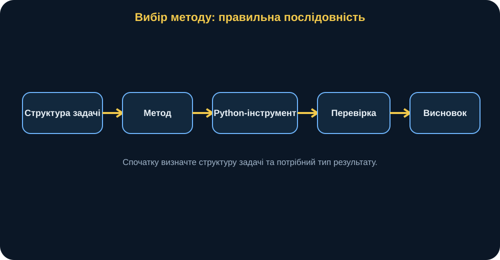
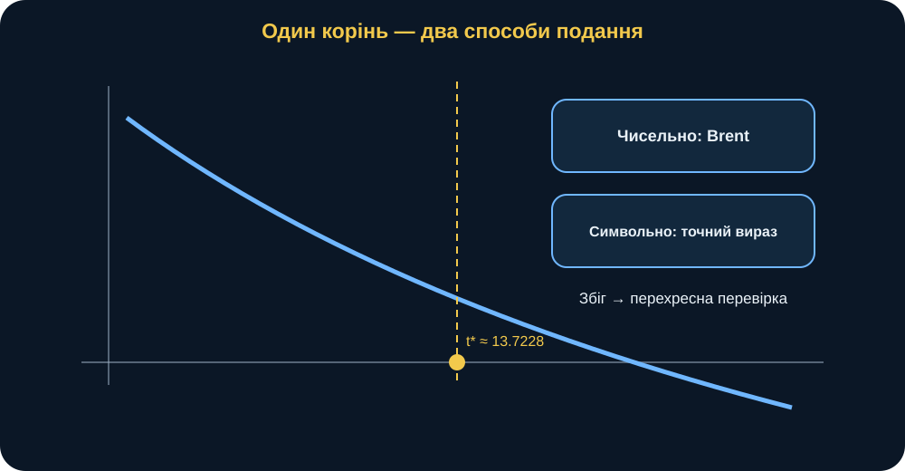
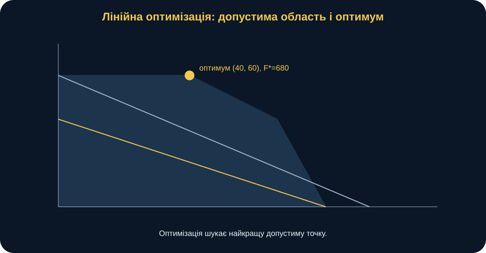
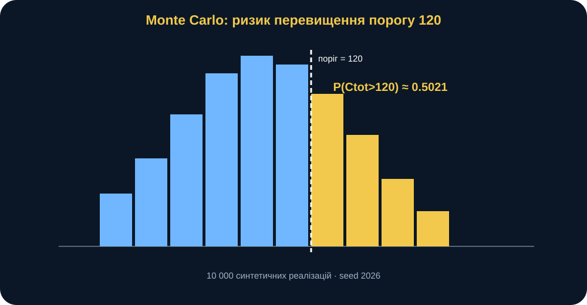
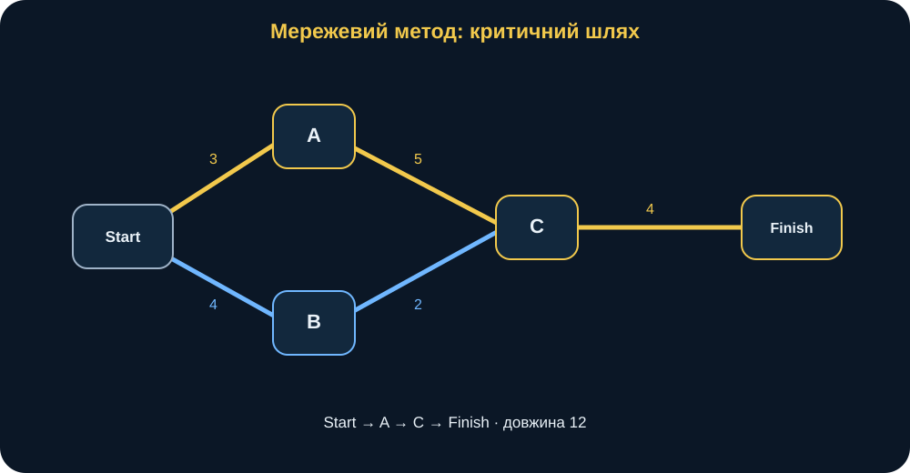
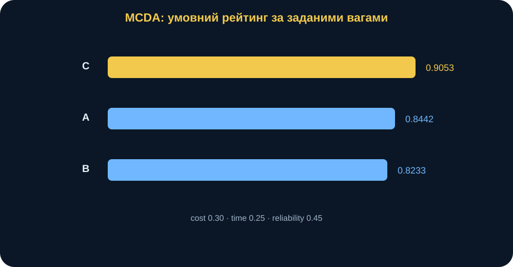
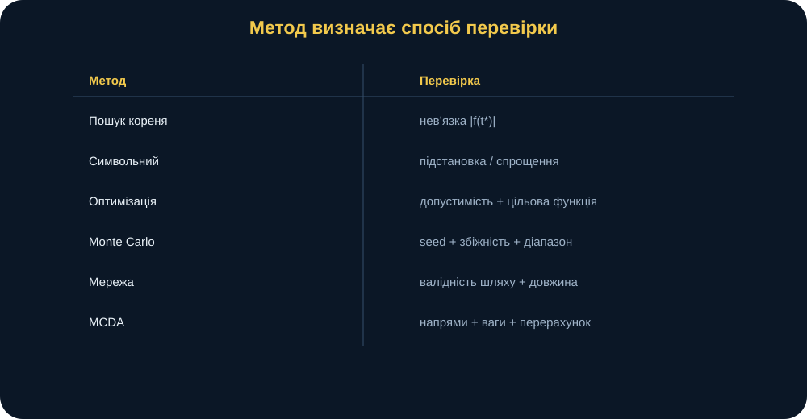
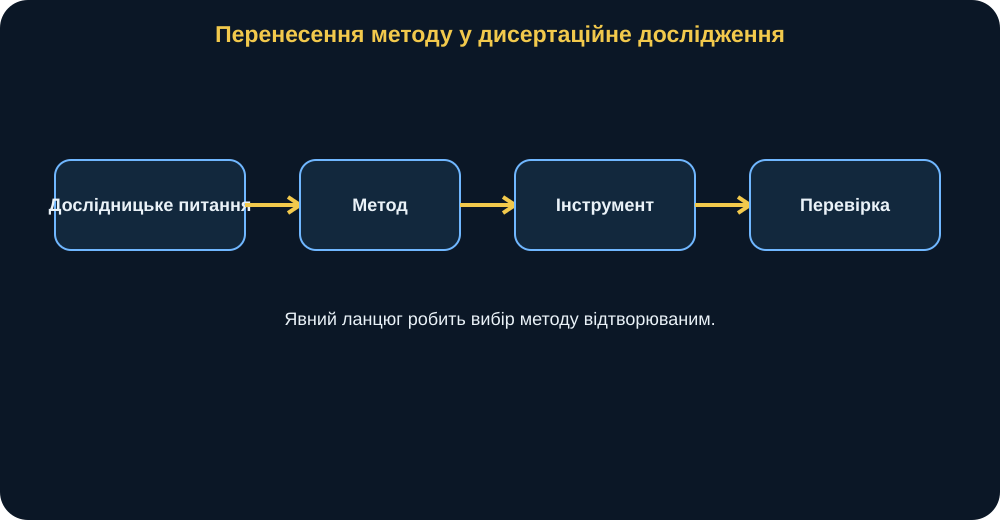

# MathModelingIT MiniBook T1.L4

## Класифікація методів математичного моделювання

### Метод обирає задача, а не бібліотека

> **Головна ідея книги:** сильний дослідник починає не з питання «яку бібліотеку Python використати?», а з питання «яку структуру має моя задача і який тип результату мені потрібен?». Метод — це відповідь на структуру проблеми. Бібліотека — лише інструмент реалізації.

---

## 0. Паспорт книги

**Код заняття:** T1.L4  
**Тема:** класифікація методів математичного моделювання  
**Рівень:** середній  
**Орієнтовний час читання:** 75–90 хвилин.

Після книги ви повинні вміти:

- визначати тип output: число, formula, optimum, probability, path, ranking;
- відрізняти numerical і symbolic methods;
- пояснювати, коли потрібна optimization;
- розуміти Monte Carlo як method uncertainty propagation;
- розпізнавати network structure;
- розуміти MCDA як formalized multi-criteria comparison;
- вибирати Python tool після method selection;
- формулювати verification для кожного класу методу;
- проектувати method-selection chain для dissertation fragment.

---

## 1. Сцена: «Я знаю SciPy — отже, розв’яжу все SciPy»

Дослідник добре знає одну library і починає будь-яку задачу з думки:

> «Як це зробити через SciPy?»

Але problem може вимагати exact symbolic expression, graph structure, ranking alternatives, uncertainty distribution або constrained optimum.

Тому ключова дисципліна:

> **Problem structure → method → Python tool → verification → interpretation.**

<figure>
  
  <figcaption><strong>Рис. 1.</strong> Python tool є четвертим кроком, а не першим. Спочатку потрібно зрозуміти problem structure та expected output.</figcaption>
</figure>

---

## 2. Шість questions перед вибором методу

Перед coding запитайте:

1. Який result потрібен?
2. Чи є uncertainty?
3. Чи є objective та constraints?
4. Чи важлива network structure?
5. Чи є multiple criteria?
6. Чи існує analytical/symbolic benchmark?

### Method selection matrix

| Problem structure | Method | Python tool | Result |
|---|---|---|---|
| root of equation | numerical root finding | SciPy | number |
| exact expression | symbolic algebra | SymPy | formula |
| best feasible allocation | linear optimization | SciPy linprog | optimum |
| risk under randomness | Monte Carlo | NumPy RNG | probability/distribution |
| dependency bottleneck | graph/network | NetworkX | path/structure |
| multi-criteria choice | MCDA | pandas/NumPy | score/ranking |

---

# CASE A — NUMERICAL ROOT FINDING

## 3. Problem

Find positive time \(t\) when:

\[
f(t)=120-6t-0.2t^2
\]

reaches zero:

\[
f(t)=0.
\]

Expected output: one numerical value. This suggests numerical root finding.

Bracket:

\[
t\in[0,30].
\]

Because:

\[
f(0)=120>0,
\]

\[
f(30)=-240<0,
\]

a continuous function has a root inside.

---

## 4. Numerical result

SciPy root_scalar with Brent method gives:

\[
t^*\approx13.7228132327.
\]

Verification:

\[
|f(t^*)|<10^{-8}.
\]

Solver status alone is weaker than residual check.

<figure>
  
  <figcaption><strong>Рис. 2.</strong> Numerical root gives a floating-point value; symbolic method gives an exact expression. Agreement provides cross-method verification.</figcaption>
</figure>

---

# CASE B — SYMBOLIC ANALYSIS

## 5. Same equation, different question

Now ask:

> what is the exact analytical expression for the roots?

SymPy returns:

\[
t=-15\pm5\sqrt{33}.
\]

Positive root:

\[
-15+5\sqrt{33}
\approx13.7228132327.
\]

Same object, different desired output, therefore different method.

---

## 6. Numerical vs symbolic

### Numerical

Useful when:

- function is complicated;
- exact form unavailable;
- only numeric root is needed.

### Symbolic

Useful when:

- exact dependence matters;
- formula supports further analysis;
- derivatives or limits are needed.

Neither is universally superior.

Cross-method agreement is strong verification.

---

## 7. Why exact does not always mean useful

An exact expression may be huge, hard to interpret or numerically inconvenient.

If only one scalar result is required, a robust numerical method may be better.

Method quality is judged against research need.

---

# CASE C — LINEAR OPTIMIZATION

## 8. Problem

Maximize:

\[
F=8x_1+6x_2
\]

subject to:

\[
x_1+x_2\le100,
\]

\[
3x_1+2x_2\le240,
\]

\[
x_1,x_2\ge0.
\]

We seek a best feasible decision, not a root or formula.

---

## 9. Baseline optimum

SciPy linprog returns:

\[
x_1=40,\qquad x_2=60.
\]

Objective:

\[
F^*=8\cdot40+6\cdot60=680.
\]

Both global constraints are active:

\[
40+60=100,
\]

\[
3\cdot40+2\cdot60=240.
\]

<figure>
  
  <figcaption><strong>Рис. 3.</strong> Root finding шукає zero, optimization шукає best point feasible region. У baseline optimum лежить на intersection двох active constraints.</figcaption>
</figure>

---

## 10. Why root finding cannot replace optimization

There is no single equation \(f(t)=0\). Instead we have:

- objective;
- feasible region;
- inequalities.

The method class must preserve these semantics.

Verification checks:

- non-negativity;
- resource;
- budget;
- independent recomputation of objective.

---

## 11. Brute force versus optimization

A grid could enumerate many candidate points.

But grid resolution introduces approximation and scales poorly.

Linear programming exploits mathematical structure directly.

The fact that brute force can solve a tiny teaching case does not make it the preferred method class.

---

# CASE D — MONTE CARLO RISK

## 12. Problem

Single-step consumption:

\[
C_k\sim N(6,1.5^2)
\]

with negative values clipped to zero.

For 20 steps:

\[
C_{tot}=\sum_{k=1}^{20}C_k.
\]

Question:

> what is the probability that total consumption exceeds 120?

This is a probability/distribution question.

---

## 13. Baseline simulation

For:

\[
N=10000,
\]

\[
seed=2026,
\]

the course implementation estimates:

\[
\hat p\approx0.5021.
\]

Nominal mean total is:

\[
20\cdot6=120,
\]

so a result near one-half is plausible.

<figure>
  
  <figcaption><strong>Рис. 4.</strong> Monte Carlo answers a distribution-level question. Capacity threshold splits simulated totals into event and non-event outcomes.</figcaption>
</figure>

---

## 14. Interpretation

Correct:

> under the specified iid clipped-normal model, about 50.21% of simulated totals exceed 120.

Incorrect:

> the real process has exactly 50.21% risk.

Simulation estimates consequences of assumptions.

---

## 15. Why optimization is wrong here

The current question has no decision variable and no objective to maximize.

Adding optimization would answer another question.

For example:

> what capacity minimizes cost subject to risk below 5%?

That would legitimately combine simulation and optimization.

---

# CASE E — NETWORK METHOD

## 16. Work graph

Edges:

- Start→A, weight 3;
- Start→B, 4;
- A→C, 5;
- B→C, 2;
- C→Finish, 4.

Question:

> which dependency path determines total duration?

This is a graph-structure question.

---

## 17. Critical path

Via A:

\[
3+5+4=12.
\]

Via B:

\[
4+2+4=10.
\]

Therefore:

\[
Start\rightarrow A\rightarrow C\rightarrow Finish
\]

has length:

\[
12.
\]

<figure>
  
  <figcaption><strong>Рис. 5.</strong> Network method uses dependency structure directly. Longest weighted DAG path is Start→A→C→Finish, length 12.</figcaption>
</figure>

---

## 18. Why graph representation matters

A duration table alone can hide topology.

Network representation preserves:

- node identity;
- edge direction;
- dependency;
- path.

When topology is the question, graph method is natural.

---

# CASE F — MULTI-CRITERIA DECISION ANALYSIS

## 19. Alternatives

| Alt | Cost | Time | Reliability |
|---|---:|---:|---:|
| A | 80 | 7 | .90 |
| B | 65 | 9 | .82 |
| C | 95 | 5 | .96 |

Weights:

\[
w_{cost}=0.30,\quad
w_{time}=0.25,\quad
w_{rel}=0.45.
\]

Cost/time are cost criteria, reliability is benefit.

---

## 20. Ratio normalization

For cost:

\[
r_{cost,i}=
\frac{\min(cost)}{cost_i}.
\]

For time:

\[
r_{time,i}=
\frac{\min(time)}{time_i}.
\]

For reliability:

\[
r_{rel,i}=
\frac{rel_i}{\max(rel)}.
\]

Score:

\[
S_i=
0.30r_{cost,i}
+0.25r_{time,i}
+0.45r_{rel,i}.
\]

---

## 21. Baseline ranking

Approximate scores:

\[
S_C\approx0.9053,
\]

\[
S_A\approx0.8442,
\]

\[
S_B\approx0.8233.
\]

Ranking:

\[
C>A>B.
\]

<figure>
  
  <figcaption><strong>Рис. 6.</strong> MCDA produces a conditional ranking under explicit weights and criterion directions. Ranking is not an objective property independent of method.</figcaption>
</figure>

---

## 22. MCDA versus optimization

LP chooses continuous decision variables under hard constraints.

MCDA compares discrete alternatives under multiple criteria.

They can coexist in a larger decision workflow, but they are not synonymous.

---

# METHOD SELECTION AS RESEARCH REASONING

## 23. Output type is the first classifier

### Number

Root, integral, parameter estimate.

### Formula

Symbolic expression.

### Optimum

Optimization.

### Distribution/probability

Monte Carlo or statistical method.

### Path/structure

Graph/network method.

### Ranking

MCDA.

The requested answer shape often narrows method choice immediately.

---

## 24. Uncertainty is the second classifier

Ask:

> are inputs or observations random or uncertain?

If yes, a probabilistic layer may be required.

But Monte Carlo should not be added only because uncertainty “sounds scientific”.

Define random variables, distributions and assumptions explicitly.

---

## 25. Constraints are the third classifier

If problem has objective:

\[
F(x)\rightarrow\max
\]

subject to:

\[
g_i(x)\le0,
\]

optimization is a natural class.

Without a decision objective, optimization may be a category error.

---

## 26. Network structure is the fourth classifier

If relationships between entities determine output, preserve them as graph structure.

Examples:

- project dependencies;
- communication topology;
- flow network;
- dependency graph.

---

## 27. Multiple criteria are the fifth classifier

When alternatives are judged by several non-equivalent criteria, one scalar metric may require explicit preference assumptions.

MCDA makes them visible through:

- criterion directions;
- normalization;
- weights;
- aggregation.

---

## 28. Analytical benchmark is a verification opportunity

Even when final method numerical, ask:

> is there a simpler exact case?

Examples:

- numerical root checked by symbolic root;
- numerical ODE checked by closed form;
- Monte Carlo checked against rough expectation;
- optimization checked by manual corner points.

This is reusable research discipline.

---

## 29. Method, algorithm, implementation

Distinguish three levels.

### Method class

Numerical root finding.

### Algorithm

Brent method.

### Implementation

SciPy root_scalar.

Or:

### Method class

Linear programming.

### Algorithm/backend

HiGHS.

### Implementation

SciPy linprog.

This distinction improves dissertation methodology language.

---

## 30. Verification must match method

| Method | Verification |
|---|---|
| root | residual |
| symbolic | substitution/simplification |
| optimization | feasibility + objective |
| Monte Carlo | seed + convergence/range |
| network | manual path validity/length |
| MCDA | directions + weights + score recomputation |

<figure>
  
  <figcaption><strong>Рис. 7.</strong> Method selection includes verification selection. A result without a method-specific check is incomplete.</figcaption>
</figure>

---

## 31. Зламай method selection: the hammer problem

If researcher knows one tool well, every problem can look like that tool.

A probability question forced into optimization is no longer the same research question.

A graph problem flattened into a table may lose topology.

A ranking question reduced to one arbitrary score may hide preferences.

The failure is conceptual, not syntactic.

---

## 32. Зламай method selection: unnecessary complexity

A simple exact formula exists.

Researcher launches 100,000 Monte Carlo runs to estimate the same scalar.

The result may be close, but adds:

- sampling noise;
- computational cost;
- more parameters.

Complexity should earn its place.

---

## 33. Зламай method selection: exactness fetish

A symbolic expression can be exact but uselessly large.

If decision requires only a robust scalar with tolerance, numerical method may communicate better.

Scientific rigor is not measured by expression length.

---

## 34. Hybrid methods

Real research often combines:

\[
Data
\rightarrow
Calibration
\rightarrow
Simulation
\rightarrow
Optimization
\rightarrow
Sensitivity.
\]

Each stage answers a different question.

Method classification is not about choosing one method forever.

It is about choosing each method deliberately.

---

## 35. Sequential method escalation

A sensible strategy:

1. simplest baseline;
2. verify;
3. identify missing structure;
4. add method layer;
5. verify again.

For uncertainty:

\[
Deterministic
\rightarrow
Stochastic
\rightarrow
Monte\ Carlo.
\]

For decisions:

\[
Descriptive
\rightarrow
Optimization
\rightarrow
Robustness.
\]

---

## 36. Computational cost

Method choice also depends on scale.

Symbolic solving may explode in complexity.

Grid search may become impossible in high dimension.

Monte Carlo may require many runs.

Graph algorithms may scale well on sparse structures.

Computational feasibility belongs to method justification.

---

## 37. Interpretability

Different methods expose different evidence.

Symbolic formula reveals dependence.

Monte Carlo reveals distribution.

Optimization reveals active constraints.

Network method reveals topology.

MCDA reveals trade-offs.

Choose method according to what needs to be explained, not only computed.

---

## 38. Predict before tool

Before running each case, record expectation.

- Root between 0 and 30.
- LP likely uses all resource and budget.
- Monte Carlo risk near 0.5 because mean total≈capacity.
- A branch appears longer than B.
- C may lead MCDA due to time/reliability.

Prediction turns method use into experiment.

---

## 39. Python without fear: root

~~~python
root = numerical_root()
value = 120 - 6*root - 0.2*root**2
assert abs(value) < 1e-8
~~~

---

## 40. Python without fear: LP

~~~python
result = linear_optimization()
assert result["resource_used"] <= 100
assert result["budget_used"] <= 240
~~~

Control:

\[
F^*=680.
\]

---

## 41. Python without fear: Monte Carlo

~~~python
risk = monte_carlo_risk(
    n_runs=10000,
    seed=2026,
)
~~~

Control:

\[
risk\approx0.5021.
\]

---

## 42. Python without fear: network

~~~python
path, length = critical_path()
~~~

Control:

\[
Start\rightarrow A\rightarrow C\rightarrow Finish,
\]

\[
length=12.
\]

---

## 43. Python without fear: MCDA

~~~python
ranking = weighted_sum_decision()
~~~

Control:

\[
C>A>B.
\]

---

## 44. Reproducibility across method classes

Each case should record:

- inputs;
- method;
- parameters;
- Python implementation;
- seed where relevant;
- verification;
- output.

The exact metadata differs, but provenance principle remains.

---

## 45. Method selection table for a dissertation

For each research task fill:

| Question | Structure | Output | Method | Alternative | Verification |
|---|---|---|---|---|---|

This prevents the methodology chapter from becoming a list of libraries.

---

## 46. Alternative method analysis

Good research explains not only what was selected, but plausible alternatives.

Example root:

- Brent: robust bracketed scalar root;
- Newton: faster near solution but requires start/derivative behavior;
- SymPy: exact when tractable.

Selection is an argument.

---

## 47. When methods disagree

Suppose symbolic and numerical root differ significantly.

Do not average them.

Investigate:

- wrong equation;
- wrong branch;
- tolerance;
- domain;
- coding error.

Disagreement is diagnostic evidence.

---

## 48. When methods agree

Agreement strengthens confidence in implementation.

But if both encode same wrong assumptions, domain model can still be wrong.

This distinction repeats throughout the course.

---

## 49. Synthetic military context

The six cases may represent abstract tasks such as threshold timing, training resource allocation, uncertain synthetic consumption, project dependencies and alternative selection.

No real operational data are needed.

The transferable object is mathematical structure.

---

## 50. Research Transfer

For one dissertation fragment fill:

~~~text
Research question:

Expected output type:

Deterministic / uncertain:

Decision variables:

Constraints:

Network structure:

Multiple criteria:

Candidate method:

Alternative method:

Why chosen method fits:

Python tool:

Verification:

Sensitivity / uncertainty:

Limitations:

Allowed conclusion:
~~~

---

## 51. Example transfer

Question:

> estimate parameters from noisy observations.

Output:

> parameter estimates plus uncertainty.

Candidate method:

> nonlinear least squares plus bootstrap.

NetworkX would be inappropriate unless graph structure actually exists.

Method justification must reference the problem.

---

## 52. Evidence hierarchy

A strong result includes:

1. valid inputs;
2. justified method;
3. verified computation;
4. sensitivity/uncertainty when needed;
5. bounded interpretation.

Method choice is only one link in evidence chain.

---

## 53. “Best method” is contextual

There is no universal winner.

A method is suitable relative to:

- question;
- assumptions;
- data;
- output;
- computational constraints;
- verification opportunities.

This is why classification is practical methodology, not taxonomy trivia.

---

## 54. One-page summary

### Five ideas

1. Problem structure selects method.
2. Output type is the first classifier.
3. Python library is implementation, not methodology.
4. Verification must match method class.
5. Hybrid workflows are normal when questions change.

### Three rules

Root:

\[
f(t^*)=0.
\]

Optimization:

\[
F(x)\rightarrow\max
\quad\text{subject to constraints}.
\]

Monte Carlo:

\[
\hat p=\frac{events}{runs}.
\]

### Two errors

- familiar tool → forced method;
- successful code → justified methodology.

### One question

> What property of my research problem forces me to choose this method?

### Next step

Build:

\[
Question\rightarrow Method\rightarrow Tool\rightarrow Verification.
\]

<figure>
  
  <figcaption><strong>Рис. 8.</strong> Method selection becomes dissertation-ready when the chain from question to verification is explicit and reproducible.</figcaption>
</figure>

---

## 55. Фінальна думка

Methods are not a menu from which we pick the most sophisticated name.

They are mathematical answers to structural questions.

A root method finds a zero.

Optimization finds a best feasible decision.

Monte Carlo propagates uncertainty.

Network method exposes dependency structure.

MCDA formalizes multi-criteria preference.

Symbolic algebra reveals exact structure.

The core competence is being able to say:

> **“My problem has this structure, therefore this method is appropriate, this is how I will verify it, and these are the limits of the conclusion.”**
