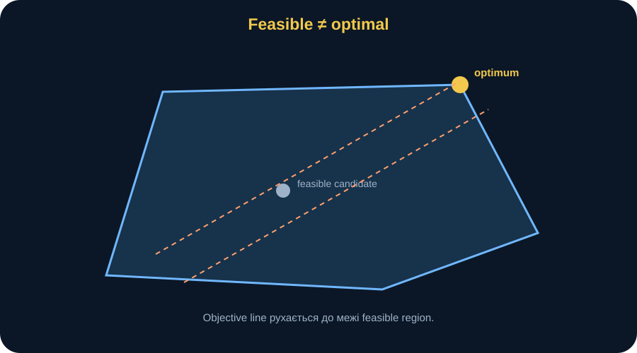
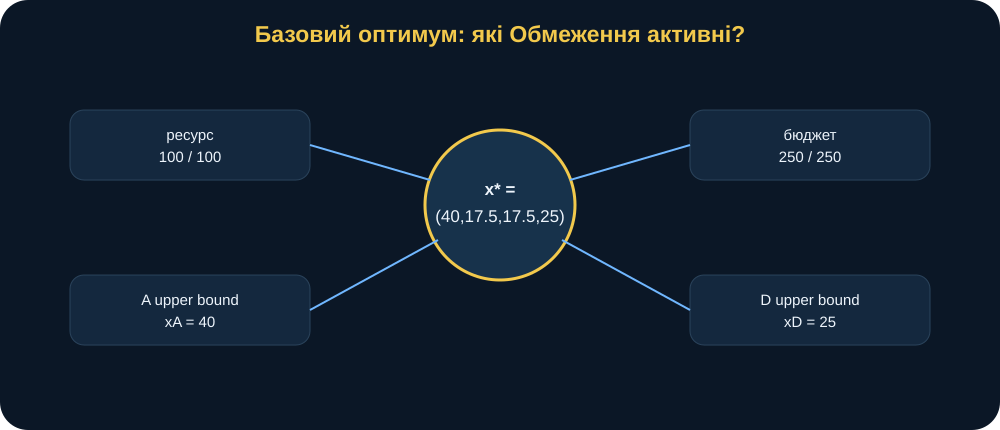
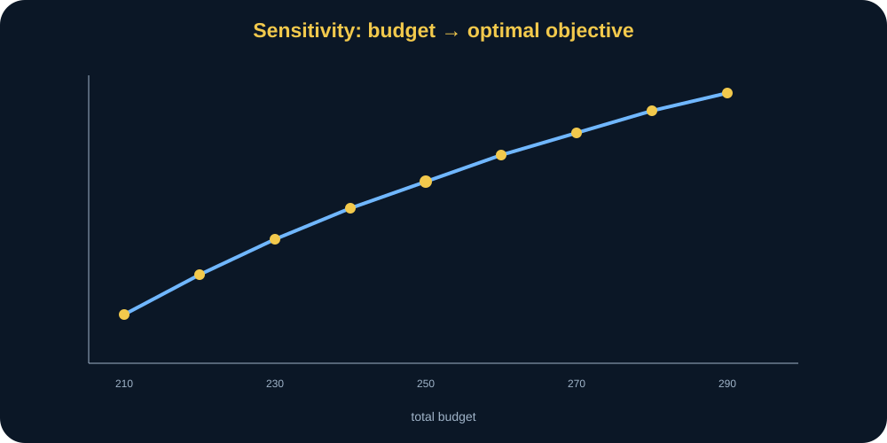
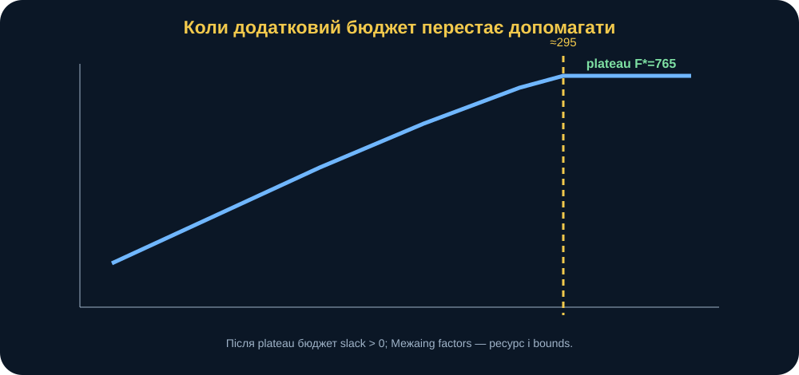
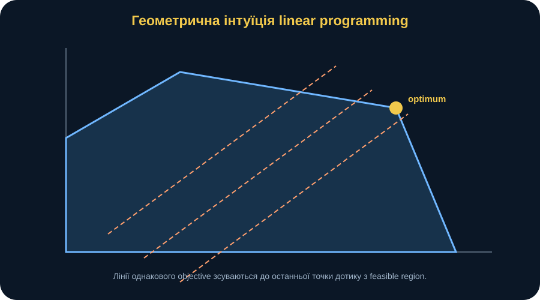
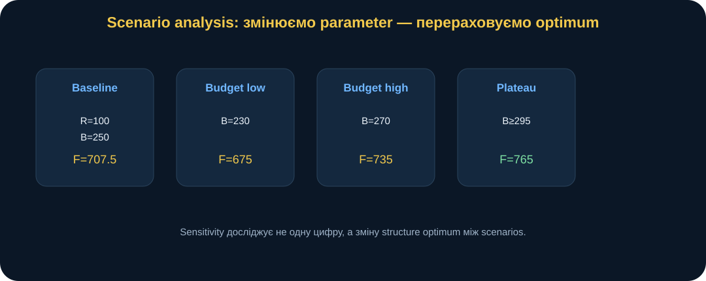
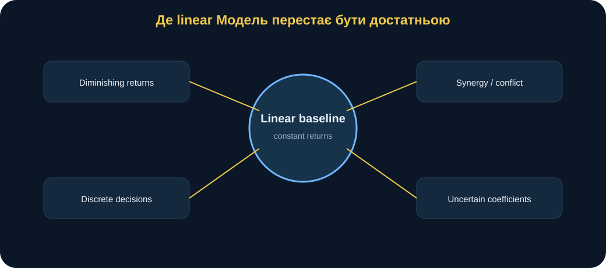

# MathModelingIT MiniBook T2.L1

## Задачі оптимізації в середовищі VS Code

### Як перетворити обмежений ресурс на перевірювану оптимізаційну модель

> **Головна ідея книги:** оптимізація — це не «попросити solver знайти максимум». Це спосіб формально описати, що саме ми вирішуємо, чого прагнемо, які обмеження не можна порушувати, які припущення роблять модель лінійною і як перевірити, що знайдений optimum є допустимим та змістовно інтерпретованим.

---

## 0. Паспорт книги

**Код заняття:** T2.L1  
**Тема:** задачі оптимізації в середовищі VS Code  
**Рівень:** середній  
**Орієнтовний час читання:** 65–80 хвилин  
**Попередні знання:** базова алгебра, поняття функції та нерівності; програмування не є обов’язковим на початку читання.

Після цієї книги ви повинні вміти:

- бачити у прикладній задачі змінні рішення;
- відрізняти змінні рішення від параметрів;
- формулювати objective;
- записувати resource, budget і bound constraints;
- пояснювати feasible region;
- розрізняти feasible і optimal solution;
- розуміти, чому SciPy linprog мінімізує навіть коли наша задача сформульована як maximization;
- перевіряти optimum незалежно від status solver;
- проводити scenario і sensitivity analysis;
- пояснювати active constraints;
- розуміти, коли додатковий ресурс або бюджет перестає покращувати objective;
- переносити optimization logic на власне research question.

---

## 1. Сцена: «Розподіліть усе туди, де коефіцієнт найбільший»

Уявімо навчальну ситуацію.

Є чотири умовні напрями:

- A;
- B;
- C;
- D.

Маємо 100 одиниць обмеженого ресурсу і budget 250 умовних одиниць.

Для кожного напряму відомі:

- effectiveness per unit;
- unit cost;
- minimum allocation;
- maximum allocation.

Таблиця:

| Direction | Effectiveness | Unit cost | Minimum | Maximum |
|---|---:|---:|---:|---:|
| A | 8 | 3 | 10 | 40 |
| B | 6 | 2 | 15 | 35 |
| C | 9 | 4 | 10 | 30 |
| D | 5 | 1 | 5 | 25 |

Хтось одразу каже:

> «C має effectiveness 9 — найбільшу. Давайте весь ресурс віддамо C».

Але C має maximum 30.

Крім того, його unit cost = 4.

Існують minimum requirements інших напрямів.

Budget обмежений.

Отже, «найвищий коефіцієнт» ще не означає «все туди».

Правильне питання:

> **Який розподіл ресурсу максимізує сумарну effectiveness, не порушуючи resource, budget і bounds constraints?**

Це вже оптимізаційна модель.

<figure>
  
  <figcaption><strong>Рис. 1.</strong> Оптимізація поєднує decision variables, objective та constraints. Якщо хоча б один із цих елементів не визначений, «пошук найкращого рішення» математично неповний.</figcaption>
</figure>

---

## 2. Змінна рішення — це те, що ми обираємо

Позначимо:

\[
x_A,x_B,x_C,x_D.
\]

Це кількість ресурсу, яку model allocates кожному напряму.

Вектор:

\[
x=
(x_A,x_B,x_C,x_D).
\]

Це **decision variables**.

Важлива відмінність:

- effectiveness coefficient 8 для A — parameter;
- \(x_A\) — decision variable.

Ми не «обираємо» effectiveness coefficient у baseline.

Ми обираємо allocation.

---

## 3. Parameters: умови задачі

Параметри baseline:

\[
e=(8,6,9,5),
\]

\[
c=(3,2,4,1),
\]

\[
R=100,
\]

\[
B=250.
\]

Також:

\[
l=(10,15,10,5)
\]

— lower bounds,

і:

\[
u=(40,35,30,25)
\]

— upper bounds.

У scenario analysis parameters змінюються.

Decision variables solver визначає заново.

Це ще одна фундаментальна відмінність:

> **parameter задає сценарій; decision variable є відповіддю model у цьому сценарії.**

---

## 4. Objective: що означає «краще»

Сумарна effectiveness:

\[
F(x)=
8x_A+
6x_B+
9x_C+
5x_D.
\]

Потрібно:

\[
F(x)\rightarrow\max.
\]

Це statement of preference.

Воно каже:

> серед допустимих allocations кращий той, де більша weighted sum effectiveness.

Математика не визначає сама, що саме повинно бути objective.

Це визначає research/decision question.

Можна було б мінімізувати cost.

Можна було б мінімізувати risk.

Можна було б мати multi-objective problem.

Baseline обирає одну objective:

> maximize total effectiveness.

---

## 5. Resource constraint

Усього є 100 units:

\[
x_A+x_B+x_C+x_D\le100.
\]

Це глобальне обмеження.

Чому знак:

\[
\le
\]

а не equality?

Тому що mathematically model дозволяє не використовати весь ресурс, якщо це оптимально або якщо інші constraints не дозволяють використати його.

У baseline optimum resource використовується повністю.

Але це **результат**, а не заздалегідь нав’язана equality.

---

## 6. Budget constraint

Вартість allocation:

\[
3x_A+2x_B+4x_C+x_D.
\]

Budget:

\[
3x_A+2x_B+4x_C+x_D\le250.
\]

Тепер видно trade-off.

C має effectiveness 9, але cost 4.

D має effectiveness лише 5, але cost 1.

Тому budget constraint змушує solver балансувати:

- effectiveness;
- cost;
- bounds.

---

## 7. Bounds як частина предметної постановки

Для A:

\[
10\le x_A\le40.
\]

Для B:

\[
15\le x_B\le35.
\]

Для C:

\[
10\le x_C\le30.
\]

Для D:

\[
5\le x_D\le25.
\]

Lower bound може означати:

> мінімально необхідний рівень забезпечення.

Upper bound:

> фізичну, організаційну або технологічну межу використання ресурсу.

Bounds не повинні з’являтися «щоб solver дав красиве рішення».

Вони повинні мати предметний зміст.

---

## 8. Повна математична модель

Отже:

\[
\max_x
\quad
8x_A+6x_B+9x_C+5x_D
\]

за умов:

\[
x_A+x_B+x_C+x_D\le100,
\]

\[
3x_A+2x_B+4x_C+x_D\le250,
\]

\[
10\le x_A\le40,
\]

\[
15\le x_B\le35,
\]

\[
10\le x_C\le30,
\]

\[
5\le x_D\le25.
\]

Це linear programming problem.

Чому linear?

Бо:

- objective linear;
- constraints linear;
- coefficients constant.

---

## 9. Feasible region

Feasible solution — будь-який \(x\), який виконує всі constraints.

Optimal solution — feasible solution із найкращим objective.

Це різні поняття.

Наприклад:

\[
x=(25,25,25,25)
\]

feasible.

Resource:

\[
25+25+25+25=100.
\]

Budget:

\[
3\cdot25+
2\cdot25+
4\cdot25+
1\cdot25
=250.
\]

Objective:

\[
F=8\cdot25+
6\cdot25+
9\cdot25+
5\cdot25
=700.
\]

Отже, 700 — хороший feasible candidate.

Але не optimum.

<figure>
  
  <figcaption><strong>Рис. 2.</strong> Feasible region містить багато допустимих рішень. Optimizer шукає серед них те, яке найкраще відповідає objective.</figcaption>
</figure>

---

## 10. Baseline optimum

Source-of-truth tests фіксують:

\[
x^*=
(40,\ 17.5,\ 17.5,\ 25).
\]

Objective:

\[
F(x^*)=707.5.
\]

Resource used:

\[
100.
\]

Budget used:

\[
250.
\]

Отже, обидва global constraints активні:

\[
resource\ slack=0,
\]

\[
budget\ slack=0.
\]

Це важлива структурна інформація.

Не лише «707.5».

---

## 11. Чому A = 40

A має:

- effectiveness 8;
- cost 3;
- max 40.

У optimum:

\[
x_A=40.
\]

Тобто upper bound активний.

Це означає:

> за baseline objective і constraints model хотіла б принаймні не зменшувати allocation A; її зупиняє upper bound.

Але це не треба інтерпретувати як:

> «A завжди треба забезпечувати максимально».

Лише:

> у цьому model scenario optimum лежить на upper bound A.

---

## 12. Чому D = 25

D має найменшу effectiveness:

\[
5.
\]

Але також найменшу unit cost:

\[
1.
\]

У optimum:

\[
x_D=25,
\]

тобто max.

Це хороший урок.

Найнижчий effectiveness coefficient не означає, що direction не вигідний.

При tight budget дешевший ресурс може звільняти можливість для інших allocations.

Optimization аналізує систему constraints одночасно.

---

## 13. Чому C не отримує maximum 30

C має highest effectiveness:

\[
9.
\]

Але unit cost:

\[
4.
\]

У baseline:

\[
x_C=17.5<30.
\]

Причина — не в тому, що C «погана».

Причина — budget trade-off.

Щоб додати C, потрібно витрачати більше budget per unit.

Зміна allocation повинна компенсуватися зменшенням інших directions.

---

## 14. Active constraints

Constraint active, якщо в optimum виконується як equality.

Baseline:

\[
x_A+x_B+x_C+x_D=100.
\]

Budget:

\[
3x_A+2x_B+4x_C+x_D=250.
\]

Також active bounds:

\[
x_A=40,
\]

\[
x_D=25.
\]

Ці active constraints визначають geometry optimum.

<figure>
  
  <figcaption><strong>Рис. 3.</strong> Baseline optimum лежить на одночасно активних resource і budget constraints, а також на верхніх bounds A і D.</figcaption>
</figure>

---

## 15. Чому optimum часто лежить на межі

У linear programming objective:

\[
c^Tx
\]

змінюється лінійно.

Feasible region — convex polytope.

Для LP optimum, якщо він існує, можна знайти на extreme point feasible region.

Інтуїтивно:

> linear objective «штовхає» solution до межі допустимої області.

Тому active constraints — не випадковість.

Вони часто є ключем до інтерпретації.

---

## 16. Maximization через minimization у SciPy

SciPy linprog формулює:

\[
\min c^Tx.
\]

Наша задача:

\[
\max e^Tx.
\]

Тому передаємо:

\[
c=-e.
\]

Тоді:

\[
\min(-e^Tx)
\]

еквівалентно:

\[
\max(e^Tx).
\]

У коді:

~~~python
result = linprog(
    c=-effectiveness,
    ...
)
~~~

Це не технічна хитрість.

Це математична трансформація.

---

## 17. Solver success — ще не кінець

Припустимо solver повернув:

~~~text
success = True
~~~

Що це означає?

Приблизно:

> numerical optimizer завершив algorithm і вважає, що знайшов solution відповідно до model.

Це не означає автоматично:

- inputs correct;
- constraints reflect reality;
- units correct;
- model adequate;
- interpretation valid.

Тому потрібна independent feasibility check.

---

## 18. Verification constraints

Для candidate \(x\) перевіряємо:

### Bounds

\[
l_i\le x_i\le u_i.
\]

### Resource

\[
\sum_i x_i\le100.
\]

### Budget

\[
\sum_i c_ix_i\le250.
\]

### Finite numbers

Values не повинні бути NaN/∞.

Verification — окремий крок від optimization.

---

## 19. Manual candidate як sanity check

Manual candidate:

\[
(25,25,25,25).
\]

Feasible.

Objective:

\[
700.
\]

Optimizer:

\[
707.5.
\]

Отже:

\[
707.5>700.
\]

Це не математичний доказ global optimality.

Але це корисна перевірка:

> solver принаймні не повернув очевидно гірший result за простий feasible baseline.

---

## 20. Чому рівномірно не означає оптимально

Allocation 25/25/25/25 виглядає «справедливо».

Але objective не містить fairness.

Він містить effectiveness.

Optimization не знає слова «рівномірно», якщо ми не закодували його математично.

Це ключовий principle:

> **model optimizes what you wrote, not what you intended.**

Якщо fairness важлива, потрібно:

- додати constraint;
- або іншу objective;
- або multi-objective formulation.

---

## 21. Scenario analysis

Optimization result має сенс лише разом із питанням:

> що буде, якщо inputs зміняться?

У lesson experiment є scenarios:

1. baseline;
2. resource = 90;
3. resource = 110;
4. budget = 230;
5. budget = 270;
6. effectiveness C: 9 → 11.

Для кожного solver потрібно запускати заново.

Бо optimum — function of parameters:

\[
x^*=x^*(R,B,e,c,l,u).
\]

---

## 22. Scenario: budget 230

При:

\[
B=230
\]

optimal allocation для baseline coefficients:

\[
x^*\approx(35,30,10,25).
\]

Objective:

\[
F^*=675.
\]

Resource:

\[
100.
\]

Budget:

\[
230.
\]

Budget tight.

Resource також fully used.

Структура allocation змінилася помітно.

C опускається до lower bound 10.

Це показує, як expensive direction втрачає priority при tighter budget.

---

## 23. Scenario: budget 270

При:

\[
B=270
\]

один optimum:

\[
x^*=(40,15,25,20).
\]

Objective:

\[
735.
\]

Resource:

\[
100.
\]

Budget:

\[
270.
\]

З більшим budget можна shift allocation toward high-effectiveness C.

Але це не триває нескінченно.

---

## 24. Sensitivity curve: budget 210–290

Розглянемо:

\[
B\in[210,290].
\]

Контрольні points:

| Budget | Objective |
|---:|---:|
| 210 | 625.0 |
| 220 | 651.67 |
| 230 | 675.0 |
| 240 | 692.5 |
| 250 | 707.5 |
| 260 | 721.67 |
| 270 | 735.0 |
| 280 | 748.33 |
| 290 | 760.0 |

Objective grows.

Але marginal gain не однаковий.

<figure>
  
  <figcaption><strong>Рис. 4.</strong> Зі збільшенням budget objective зростає, але структура optimum змінюється кусочно-лінійно, бо активними стають різні constraints і bounds.</figcaption>
</figure>

---

## 25. Коли додатковий budget перестає допомагати

Продовжимо sensitivity.

При budget приблизно:

\[
295
\]

model уже може досягти allocation:

\[
(40,25,30,5).
\]

Objective:

\[
765.
\]

Budget used:

\[
295.
\]

Resource used:

\[
100.
\]

Якщо дати:

\[
B=310
\]

або:

\[
B=350,
\]

objective залишається:

\[
765.
\]

Чому?

Budget більше не limiting.

Тепер обмежують:

- total resource;
- upper bounds A і C;
- lower bound D;
- structure objective.

<figure>
  
  <figcaption><strong>Рис. 5.</strong> Після приблизно 295 додатковий budget не покращує objective. Це приклад зміни active constraint: budget перестає бути bottleneck.</figcaption>
</figure>

---

## 26. Marginal value інтуїтивно

Поки budget active, додаткова одиниця budget має positive marginal value.

Коли budget slack:

\[
B-B_{used}>0,
\]

додатковий budget не змінює optimum.

Можна сказати:

> marginal value budget стає нульовим у поточному regime.

У linear programming це пов’язано з dual values / shadow prices.

У першій MiniBook достатньо інтуїції:

> **цінність додаткового ресурсу залежить від того, чи він реально є limiting constraint.**

---

## 27. «Більше ресурсу» не завжди означає «кращий результат»

Припустимо збільшили total resource:

\[
100\rightarrow110.
\]

Якщо budget залишився 250, додатковий physical resource може не бути повністю використаний.

Чому?

Budget не дозволяє профінансувати всі додаткові units.

Отже:

> resource availability і budget capacity — різні constraints.

Збільшення одного не гарантує покращення, якщо інший уже bottleneck.

---

## 28. Constraint interaction

Optimization model — система.

Не можна інтерпретувати constraint окремо.

Наприклад:

- budget increase змінює optimum;
- потім upper bound C стає active;
- далі benefit budget зменшується;
- зрештою resource constraint dominates.

Це **regime change**.

Sensitivity analysis потрібен саме для виявлення таких переходів.

---

## 29. Геометрична інтуїція на двох variables

У 4D feasible region важко намалювати.

Але у 2D:

\[
x,y.
\]

Constraints утворюють polygon.

Objective:

\[
F=ax+by.
\]

Лінії однакового objective:

\[
ax+by=k.
\]

Ми «зсуваємо» таку лінію в напрямі зростання \(k\), доки вона ще торкається feasible region.

Точка останнього дотику — optimum.

<figure>
  
  <figcaption><strong>Рис. 6.</strong> У двовимірній LP objective line рухається до межі feasible region. Optimum виникає в точці, де подальший рух уже порушив би constraints.</figcaption>
</figure>

---

## 30. Diminishing returns — межа linear model

Baseline припускає:

\[
F=
8x_A+6x_B+9x_C+5x_D.
\]

Тобто кожна додаткова unit C завжди дає +9.

Чи завжди це реалістично?

Можливо, перші 10 units дуже ефективні.

Наступні — менше.

Тоді потрібна nonlinear function:

\[
F_C(x_C)
\]

із diminishing returns.

Це міст до T2.L3.

---

## 31. Synergy і conflict — ще одна межа

Linear objective additive:

\[
F=
F_A+F_B+F_C+F_D.
\]

Вона не містить interaction term.

А якщо A і C разом дають synergy?

Тоді може з’явитися:

\[
\gamma x_Ax_C.
\]

Або conflict:

\[
-\delta x_Bx_D.
\]

Це вже nonlinear model.

---

## 32. Discrete decisions

Baseline variables continuous.

Можливо:

\[
x_A=17.5.
\]

Але якщо resource — неподільні units?

Тоді:

\[
x_i\in\mathbb Z.
\]

Якщо рішення:

> відкрити / не відкрити напрям,

може бути:

\[
y_i\in\{0,1\}.
\]

Тоді це integer або mixed-integer programming.

LP baseline тут недостатній.

---

## 33. Невизначені coefficients

Effectiveness:

\[
e_C=9.
\]

Але якщо це estimate:

\[
e_C\in[7,11]?
\]

Тоді one deterministic coefficient може створювати false certainty.

Можливі extensions:

- scenario analysis;
- robust optimization;
- stochastic programming;
- Monte Carlo around parameters.

Перший крок — не складний algorithm.

Перший крок:

> визнати uncertainty.

---

## 34. Python без страху: problem object

У code parameters зібрані в AllocationProblem.

Концептуально:

~~~python
problem = AllocationProblem(
    names=("A","B","C","D"),
    effectiveness=...,
    unit_cost=...,
    minimum=...,
    maximum=...,
    total_resource=100,
    total_budget=250,
)
~~~

Це корисно, бо model input стає явним object.

Не розкиданим набором magic numbers.

---

## 35. Python без страху: solve

~~~python
result = solve_allocation(problem)
~~~

Результат містить:

- allocation;
- objective;
- resource_used;
- budget_used;
- success;
- message.

Не використовуйте тільки:

~~~python
print(result.objective)
~~~

Потрібно аналізувати структуру solution.

---

## 36. Python без страху: feasibility

~~~python
checks = check_feasibility(
    problem,
    result.allocation,
)

assert checks["all"]
~~~

Це хороший pattern:

> solver → independent check.

У складніших models це стає ще важливішим.

---

## 37. Validation inputs

Модель відхиляє:

- empty direction set;
- parameter vectors wrong length;
- negative minimum;
- maximum < minimum;
- negative resource;
- negative budget.

Ці checks не «заважають користувачу».

Вони захищають semantic contract model.

---

## 38. Infeasible problem

Що буде, якщо budget = 60?

Мінімальні allocations:

\[
(10,15,10,5)
\]

вже коштують:

\[
3\cdot10+
2\cdot15+
4\cdot10+
1\cdot5
=105.
\]

Отже:

\[
60<105.
\]

Feasible solution не існує.

Solver може повідомити failure.

Це не «помилка optimizer».

Це характеристика постановки:

> constraints mutually incompatible.

---

## 39. Feasibility before optimization

Корисний принцип:

> спочатку переконайтеся, що хоча б одне допустиме рішення може існувати.

Наприклад, lower-bound resource:

\[
10+15+10+5=40\le100.
\]

Lower-bound budget:

\[
105\le250.
\]

Це simple necessary check.

Для складніших задач solver сам перевіряє feasibility, але domain sanity checks дуже корисні.

---

## 40. Зламай модель: wrong objective

Припустимо ми хотіли мінімізувати cost, але написали maximize effectiveness.

Solver чесно оптимізує effectiveness.

Потім хтось каже:

> рішення занадто дороге.

Проблема не в solver.

Проблема в objective.

Optimization algorithm не знає незаписані preferences.

---

## 41. Зламай модель: missing constraint

Припустимо напрям C фізично не може отримати більше 20.

А model має:

\[
x_C\le30.
\]

Тоді optimum може бути mathematically feasible, але real-world infeasible.

Це classic example:

> model feasibility ≠ real-world feasibility.

---

## 42. Зламай модель: arbitrary coefficient

Якщо effectiveness 9 для C взято без data або обґрунтування, optimum може бути дуже точним numeric answer на слабке input assumption.

Sensitivity:

\[
9\rightarrow11
\]

показує:

> coefficient matters.

Отже, research transfer повинен включати питання:

> звідки беруться coefficients?

---

## 43. Зламай модель: unit inconsistency

Effectiveness coefficients можуть мати різні meanings.

Якщо A effectiveness виміряна одним методом, C — іншим, linear combination може бути беззмістовною.

Перед optimization:

- definitions;
- units;
- scales;
- data provenance

повинні бути узгоджені.

---

## 44. Verification, validation, calibration

### Verification

Чи правильно solver problem coded?

- signs;
- coefficients;
- constraints;
- bounds.

### Calibration

Чи правильно оцінені coefficients?

Наприклад:

\[
e_C=9.
\]

### Validation / adequacy

Чи linear model достатня для real system?

Це різні рівні.

Успішний solver підтверджує лише дуже малу частину evidence chain.

---

## Поглиблення: optimization як карта компромісів, а не «машина рішень»

У прикладній роботі дуже легко звести оптимізацію до одного рядка:

> solver повернув \(x^*\).

Але науково сильніша інтерпретація починається з іншого питання:

> **які саме компроміси змусили optimum опинитися в цій точці?**

Baseline allocation:

\[
x^*=(40,\ 17.5,\ 17.5,\ 25)
\]

не виникає з одного coefficient.

Вона є результатом одночасної взаємодії:

- effectiveness;
- unit cost;
- total resource;
- total budget;
- lower bounds;
- upper bounds.

Тому optimum корисно читати не як «рекомендацію числа», а як **структурний fingerprint** поточного scenario.

У baseline:

- A впирається у maximum;
- D впирається у maximum;
- resource повністю використаний;
- budget повністю використаний;
- B і C ділять залишок так, щоб одночасно зберегти balances constraints та maximize objective.

Змінимо scenario — fingerprint зміниться.

---

## Поглиблення: повна таблиця сценаріїв

Порівняємо кілька model states.

| Scenario | R | B | Approx allocation | Objective | Main interpretation |
|---|---:|---:|---|---:|---|
| Baseline | 100 | 250 | (40,17.5,17.5,25) | 707.5 | resource і budget active |
| Budget low | 100 | 230 | (35,30,10,25) | 675.0 | C pushed to lower bound |
| Budget high | 100 | 270 | (40,15,25,20) | 735.0 | more allocation to C |
| Near plateau | 100 | 295 | (40,25,30,5) | 765.0 | budget just sufficient |
| Above plateau | 100 | 320 | same optimum | 765.0 | budget no longer limiting |

<figure>
  
  <figcaption><strong>Рис. 7.</strong> Optimization result потрібно читати як family of scenario-dependent solutions. Зміна parameter змінює не лише objective, а й structure allocation та набір active constraints.</figcaption>
</figure>

Така таблиця дає значно сильніший research output, ніж один baseline row.

Вона дозволяє побачити:

- де solution stable;
- де allocation rapidly changes;
- де constraint перестає бути bottleneck;
- де система входить у plateau.

---

## Поглиблення: чому sensitivity curve кусочно-лінійна

У linear programming objective і constraints linear.

Але function:

\[
V(B)=\max_x F(x;B)
\]

не обов’язково одна straight line на всьому діапазоні budget.

Причина — зміна **active set**.

У певному interval optimum може визначатися набором:

- resource active;
- budget active;
- A upper active;
- D upper active.

Після зміни B одна змінна може відійти від bound, інша — дійти до bound.

Тоді slope:

\[
\frac{\Delta V}{\Delta B}
\]

змінюється.

Отже, breakpoints на sensitivity graph мають математичний зміст.

Вони показують:

> **де система переходить у новий optimization regime.**

У research analysis саме ці breakpoints часто цікавіші за baseline optimum.

---

## Поглиблення: локальна marginal value і shadow price

Якщо budget constraint active, невелике збільшення budget може збільшувати objective.

У вузькому interval можна оцінити:

\[
\lambda_B\approx\frac{\Delta F^*}{\Delta B}.
\]

Наприклад, між 240 і 250:

\[
F^*(240)=692.5,
\]

\[
F^*(250)=707.5.
\]

Тому:

\[
\lambda_B\approx
\frac{707.5-692.5}{250-240}
=
1.5.
\]

Інтуїтивно:

> у цьому локальному regime одна додаткова unit budget дає приблизно 1.5 objective units.

Але не можна автоматично переносити це число на:

\[
B=320.
\]

Після plateau:

\[
\lambda_B\approx0.
\]

Shadow price — **локальна**, а не універсальна характеристика.

---

## Поглиблення: sensitivity до effectiveness coefficient

Тепер змінюємо не resource, а model coefficient.

Baseline:

\[
e_C=9.
\]

Scenario:

\[
e_C=11.
\]

Це інше питання.

Budget sensitivity відповідає:

> що буде, якщо зміниться доступне обмеження?

Coefficient sensitivity:

> що буде, якщо ми інакше оцінюємо віддачу direction C?

Це особливо важливо, якщо effectiveness coefficients оцінені експертно або за data.

Якщо невелика зміна:

\[
9\rightarrow9.5
\]

різко перебудовує optimum, conclusion fragile.

Якщо allocation майже не змінюється, model більш stable до цього assumption.

Тому sensitivity analysis потрібно будувати не лише навколо constraints, а й навколо **найменш надійних parameters**.

---

## Поглиблення: що робити, якщо coefficient невідомий точно

Припустимо:

\[
e_C\in[8,11].
\]

Є кілька підходів.

### Scenario analysis

Запустити:

\[
e_C=8,\ 9,\ 10,\ 11.
\]

Порівняти optimum.

### Monte Carlo around coefficients

Якщо є distribution, sample coefficients і solve repeatedly.

### Robust optimization

Шукати decision, який працює прийнятно для worst/plausible parameter combinations.

Ці підходи відповідають на різні questions.

Не потрібно одразу переходити до найскладнішого.

Початкова дисципліна:

> **позначити uncertainty там, де вона реально є.**

---

## Поглиблення: nominal optimum і robust decision — не одне й те саме

Nominal optimization питає:

> яке decision найкраще для одного заданого набору parameters?

Robust perspective:

> яке decision залишається прийнятним, якщо parameters трохи помилкові?

Можливо, nominal optimum:

\[
x^*=(40,17.5,17.5,25)
\]

дуже чутливий.

Інший allocation має трохи нижчий baseline objective, але краще поводиться у wider scenario range.

Тоді decision-maker може свідомо обрати не nominal maximum.

Це не «відмова від математики».

Це зміна decision criterion.

---

## Поглиблення: multiple optima і чому один vector може бути не єдиним

У LP інколи objective line паралельна face feasible region.

Тоді існує багато solutions із тим самим objective.

Solver повертає одну.

Це не означає:

> тільки вона optimal.

Якщо multiple optima існують, можна застосувати secondary criterion.

Наприклад:

1. maximize primary effectiveness;
2. серед усіх primary-optimal solutions minimize imbalance;
3. або maximize reserve;
4. або minimize switching cost.

Це називають lexicographic / hierarchical optimization.

Навіть якщо baseline T2.L1 має контрольний optimum, загальна методологія повинна пам’ятати про non-uniqueness.

---

## Поглиблення: constraints як наукові гіпотези

Constraint часто сприймається як «відомий факт»:

\[
x_C\le30.
\]

Але іноді upper bound — це теж assumption.

Наприклад:

- estimate capacity;
- normative threshold;
- expert restriction;
- historical maximum.

Тоді constraint має provenance.

Корисно мати таблицю:

| Constraint | Meaning | Source | Confidence |
|---|---|---|---|
| \(\sum x_i\le100\) | total resource | measured | high |
| budget≤250 | financial limit | policy | high |
| \(x_C\le30\) | capacity | expert estimate | medium |

Це перетворює model із набору inequalities на **audit-ready research artifact**.

---

## Поглиблення: infeasibility як змістовний результат

Припустимо lower bounds вимагають:

\[
\sum l_i > R.
\]

Тоді жоден allocation не може satisfy constraints.

Або minimum budget requirement перевищує B.

Solver повідомить infeasible.

Не потрібно трактувати це як:

> «програма не спрацювала».

Іноді найцінніший model result:

> **задані вимоги взаємно несумісні.**

Тоді research question змінюється:

- яке requirement послабити;
- наскільки;
- якою ціною;
- який constraint створює conflict.

---

## Поглиблення: optimization model audit

Перед фінальним висновком корисно пройти чотири рівні.

### Semantic audit

- кожна decision variable має реальний зміст?
- objective відповідає research goal?
- кожен constraint має пояснення?

### Numerical audit

- units узгоджені?
- inputs finite?
- bounds valid?
- solver status success?

### Solution audit

- feasibility independently checked?
- objective independently recomputed?
- active constraints identified?

### Stability audit

- sensitivity performed?
- uncertain parameters varied?
- plateau / breakpoints identified?

Якщо хоча б один рівень пропущено, statement «optimal» може бути technically correct, але scientifically weak.

---

## Поглиблення: reproducibility package T2.L1

Для відтворюваного optimization experiment збережіть:

- input table;
- coefficient definitions;
- units;
- bounds;
- total resource;
- budget;
- solver method;
- software versions;
- baseline result;
- feasibility checks;
- scenario table;
- sensitivity graph;
- commit hash;
- interpretation;
- limitations.

Screenshot із objective value не є reproducibility package.

---

## Поглиблення: межі linear baseline

<figure>
  
  <figcaption><strong>Рис. 8.</strong> Linear baseline потрібно розширювати лише тоді, коли предметна логіка вимагає diminishing returns, interactions, discrete decisions або uncertainty. Складність не є самоціллю.</figcaption>
</figure>

Linear model сильна саме своєю прозорістю.

Але вона має assumptions:

- constant marginal effectiveness;
- additive contributions;
- continuous decision variables;
- fixed coefficients;
- fixed bounds;
- one-stage decision.

Якщо хоча б одна з цих assumptions критично порушується, потрібно змінювати model class.

Важливо не казати:

> linear programming «погана».

Правильніше:

> вона відповідає одній структурі assumptions.

Наступне питання завжди:

> чи відповідають ці assumptions нашому research object?

---

## Поглиблення: напівхудожнє повернення до сцени

Після першого solve керівник бачить:

\[
707.5
\]

і питає:

> «То це максимум?»

Аналітик відповідає:

> «Для baseline linear model — так. Але budget і resource повністю active. Якщо budget збільшити, objective росте до приблизно 765. Після близько 295 budget перестає бути bottleneck. Далі потрібен не додатковий budget, а зміна resource/bounds або самої structure model».

Тепер optimization result став управлінсько зрозумілим.

Не просто:

> «solver сказав 707.5».

А:

> **«ось чому 707.5, ось що обмежує систему, ось де додатковий budget має цінність, а ось де перестає».**

Це і є повноцінна інтерпретація.

---

## 45. Scenario design

Сильний experiment:

| Run | Parameter | Expected question |
|---|---|---|
| Baseline | R=100, B=250 | control |
| Resource low | R=90 | effect of resource limit |
| Resource high | R=110 | is resource still bottleneck? |
| Budget low | B=230 | expensive directions constrained |
| Budget high | B=270 | shift toward high effectiveness |
| Coefficient C | 9→11 | sensitivity to effectiveness |

Перед запуском записуйте prediction.

---

## 46. Budget sensitivity як кусочно-лінійна картина

LP sensitivity curve часто складається з segments.

Чому?

У певному interval однакова set of active constraints визначає optimum.

Коли constraint або bound змінює status:

- segment slope змінюється;
- allocation regime змінюється.

Тому «злам» лінії на graph — не numerical noise.

Це може бути зміна structure optimum.

---

## 47. Shadow price інтуїтивно

Якщо budget active, shadow price відповідає на локальне питання:

> наскільки зміниться optimal objective при невеликому збільшенні budget?

У різних ranges slope sensitivity curve різний.

Наприклад, між B=240 і 250:

\[
\Delta F=15.
\]

При:

\[
\Delta B=10,
\]

average gain:

\[
1.5
\]

objective units per budget unit.

А після plateau:

\[
\Delta F=0.
\]

Shadow price conceptually zero.

Для точного dual interpretation потрібна solver dual information, але intuition уже видно.

---

## 48. Чому 707.5 — не «ефективність системи в реальності»

Objective value:

\[
707.5
\]

має meaning лише через coefficients.

Якщо effectiveness units synthetic, 707.5 — synthetic aggregate score.

Не треба писати:

> реальна ефективність системи становить 707.5.

Краще:

> у baseline optimization model optimal weighted objective equals 707.5.

Words matter.

---

## 49. Allowed conclusion

Слабкий:

> оптимальний розподіл A=40, B=17.5, C=17.5, D=25.

Кращий:

> За baseline coefficients, bounds, resource 100 і budget 250 linear model має optimum \(x^*=(40,17.5,17.5,25)\) із objective 707.5; resource і budget constraints активні.

Ще сильніший:

> Budget sensitivity показує, що додатковий budget підвищує objective лише до переходу в інший limiting regime; приблизно після budget 295 baseline model досягає plateau 765, де budget уже не є active constraint.

Це вже structural interpretation.

---

## 50. Research Transfer

Спробуйте описати власну research problem.

Шаблон:

~~~text
Decision question:

Decision variables:

Objective:

Resource constraints:

Budget / capacity constraints:

Lower bounds:

Upper bounds:

Parameters and data sources:

Linearity assumptions:

Baseline scenario:

Verification:

Sensitivity parameter:

Potential nonlinearity:

Uncertainty:

Allowed conclusion:
~~~

### Приклад перенесення

У дисертації decision variables можуть бути:

- allocation of processing capacity;
- time distribution;
- experimental resources;
- model configuration budget.

Головне — не копіювати numbers A–D.

Головне — перенести structure.

---

## 51. Мінісловник T2.L1

### Decision variable

Величина, яку обирає optimization model.

### Parameter

Вхідна характеристика scenario.

### Objective

Функція, яку мінімізують або максимізують.

### Constraint

Умова допустимості.

### Bound

Lower/upper limit decision variable.

### Feasible solution

Рішення, що виконує constraints.

### Optimal solution

Feasible solution з найкращим objective.

### Active constraint

Constraint, виконаний як equality в optimum.

### Slack

Запас до constraint boundary.

### Sensitivity

Зміна optimum при зміні parameter.

### Shadow price

Локальна marginal value relaxation constraint.

### Infeasible problem

Problem без жодного feasible solution.

---

## 52. Мініексперимент

### Question 1

Чому C з effectiveness 9 не отримує 30 baseline?

Через budget trade-off.

### Question 2

Чому D з effectiveness 5 отримує max 25?

Через low cost і system-wide constraint interaction.

### Question 3

Чому budget >295 не дає benefit?

Budget перестає бути bottleneck.

### Question 4

Чи означає solver success, що модель адекватна?

Ні.

---

## 53. Одна сторінка підсумку

### П’ять ідей

1. Optimization починається з decision variables, objective і constraints.
2. Feasible не означає optimal.
3. Active constraints пояснюють structure optimum.
4. Sensitivity показує, коли limiting factor змінюється.
5. Solver success не замінює verification і model adequacy.

### Три формули

Objective:

\[
F(x)=8x_A+6x_B+9x_C+5x_D.
\]

Resource:

\[
\sum_i x_i\le100.
\]

Budget:

\[
3x_A+2x_B+4x_C+x_D\le250.
\]

### Дві помилки

- «найвищий coefficient → весь resource туди»;
- «solver success → правильна real-world decision».

### Одне питання

> Яке constraint є bottleneck у моїй власній optimization problem і як я це перевірю sensitivity analysis?

### Наступний крок

Побудуйте власні scenarios, знайдіть active constraints і поясніть plateau, якщо він з’явиться.

---

## 54. Фінальна думка

Optimization не прибирає складність рішення.

Вона робить її явною.

Вона змушує сказати:

- що ми можемо змінити;
- що ми хочемо покращити;
- що не можна порушувати;
- які numbers вважаємо відомими;
- які assumptions роблять model linear.

Саме тому найцінніший output optimization — не одне число 707.5.

Найцінніше — **структура аргументу**, яка пояснює, чому саме цей solution є optimum у межах саме цієї model.
