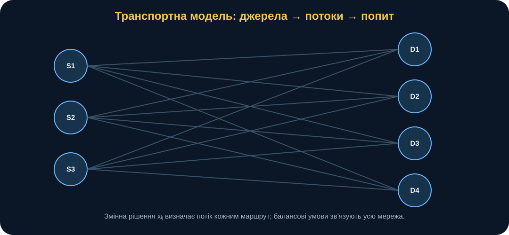
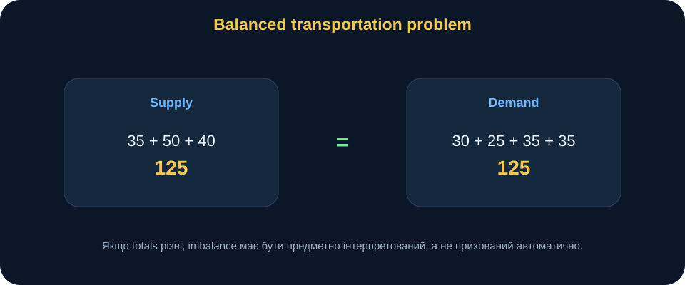
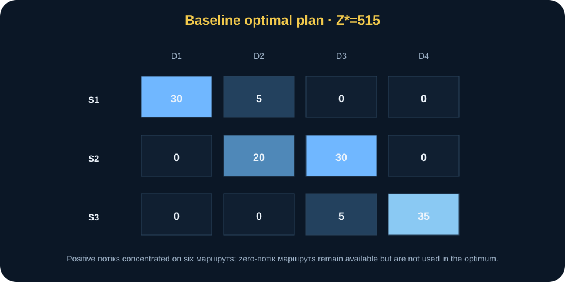
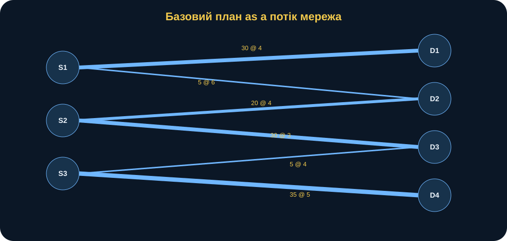
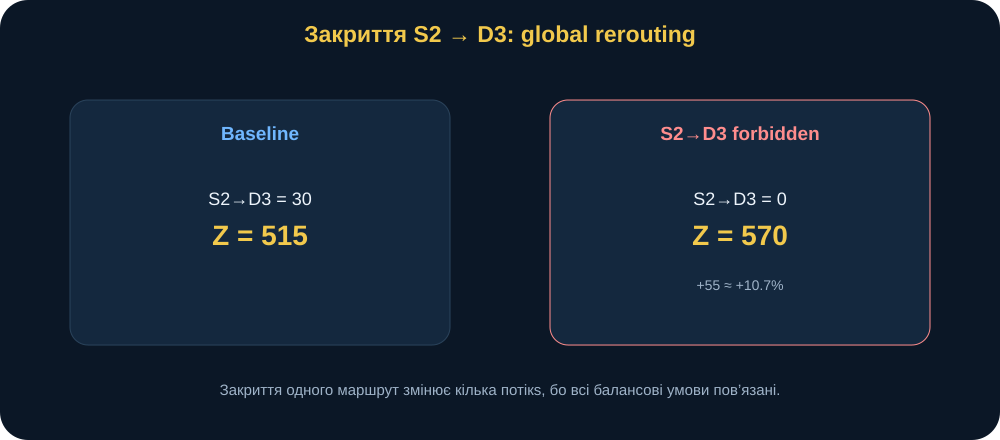
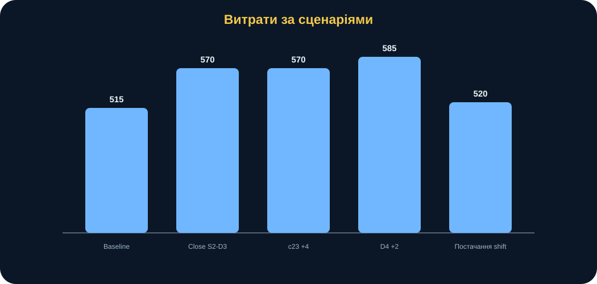
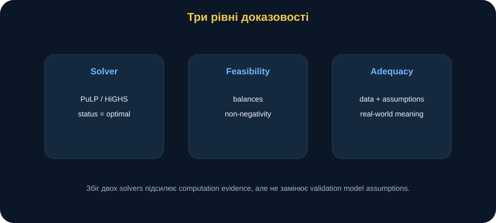
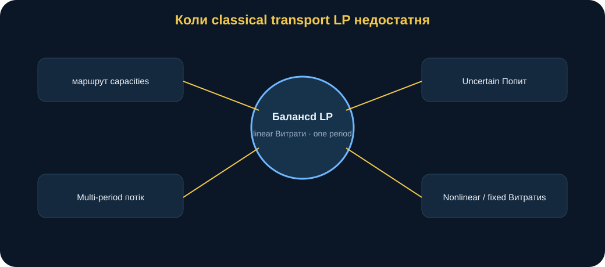

# MathModelingIT MiniBook T2.L2

## Математична модель транспортної задачі

### Як перетворити мережу джерел і потреб на оптимальний потік

> **Головна ідея книги:** транспортна задача — це не просто таблиця тарифів. Це модель потоку, де кожне джерело має запас, кожен пункт має потребу, кожен маршрут має ціну, а всі баланси повинні виконуватися одночасно. Сильний результат — не лише мінімальна вартість, а перевірений план, сценарний аналіз і пояснення того, які маршрути справді критичні для системи.

---

## 0. Паспорт книги

**Код заняття:** T2.L2  
**Тема:** математична модель транспортної задачі  
**Рівень:** середній  
**Орієнтовний час читання:** 65–80 хвилин  
**Попередні знання:** базова алгебра, таблиці, лінійна оптимізація на рівні T2.L1.

Після цієї книги ви повинні вміти:

- бачити структуру «sources → flows → demands»;
- формалізувати \(x_{ij}\);
- записувати objective total transportation cost;
- записувати supply і demand balance equations;
- розрізняти balanced та unbalanced problems;
- пояснювати, чому feasibility важлива не менше за optimality;
- читати optimal plan як network flow;
- перевіряти solution balances незалежно від solver;
- порівнювати PuLP і SciPy як independent computational backends;
- моделювати forbidden routes;
- інтерпретувати route criticality через scenario cost;
- розуміти межі linear transportation model;
- переносити структуру на власну research problem.

---

## 1. Сцена: найдешевший маршрут не вирішує всю задачу

Уявімо синтетичну логістичну навчальну задачу.

Є три умовні джерела:

- S1;
- S2;
- S3.

І чотири пункти потреби:

- D1;
- D2;
- D3;
- D4.

Запаси:

\[
a=(35,50,40).
\]

Потреби:

\[
b=(30,25,35,35).
\]

Матриця unit costs:

|  | D1 | D2 | D3 | D4 |
|---|---:|---:|---:|---:|
| S1 | 4 | 6 | 8 | 7 |
| S2 | 5 | 4 | 3 | 6 |
| S3 | 9 | 7 | 4 | 5 |

Хтось дивиться на таблицю і каже:

> «S2→D3 має cost 3 — найнижчий. Давайте використовувати його максимально».

Це частково правильно.

Але D3 потребує лише 35.

S2 має supply 50.

S2 також може вигідно обслуговувати D2.

D4 має потребу 35.

S3 має власні supply constraints.

Тому local cheapest route не визначає global optimum.

Правильне питання:

> **Як розподілити всі потоки між джерелами й пунктами потреби так, щоб повністю виконати всі supply/demand balances і мінімізувати total cost?**

<figure>
  
  <figcaption><strong>Рис. 1.</strong> Транспортна модель пов’язує джерела, пункти потреби та маршрути. Локально дешевий маршрут корисний лише в межах глобальних balance constraints.</figcaption>
</figure>

---

## 2. Джерела, потреби й потоки

Нехай:

- \(i\) — index source;
- \(j\) — index destination;
- \(a_i\) — supply source \(i\);
- \(b_j\) — demand destination \(j\);
- \(c_{ij}\) — unit cost route \(i\rightarrow j\);
- \(x_{ij}\) — quantity sent on route \(i\rightarrow j\).

Decision variables:

\[
x_{ij}.
\]

Для 3×4 matrix маємо 12 variables.

Кожна відповідає окремому route.

---

## 3. Objective function

Total cost:

\[
Z=
\sum_i\sum_j c_{ij}x_{ij}.
\]

Потрібно:

\[
Z\rightarrow\min.
\]

Для конкретної 3×4 matrix це:

\[
\begin{aligned}
Z={}&
4x_{11}+6x_{12}+8x_{13}+7x_{14}\\
&+5x_{21}+4x_{22}+3x_{23}+6x_{24}\\
&+9x_{31}+7x_{32}+4x_{33}+5x_{34}.
\end{aligned}
\]

Це linear objective.

Кожна додаткова unit на route додає constant unit cost.

---

## 4. Supply constraints

Source S1 має 35:

\[
x_{11}+x_{12}+x_{13}+x_{14}=35.
\]

S2:

\[
x_{21}+x_{22}+x_{23}+x_{24}=50.
\]

S3:

\[
x_{31}+x_{32}+x_{33}+x_{34}=40.
\]

У balanced baseline використовується equality.

Увесь supply повинен бути розподілений.

---

## 5. Demand constraints

D1 потребує 30:

\[
x_{11}+x_{21}+x_{31}=30.
\]

D2:

\[
x_{12}+x_{22}+x_{32}=25.
\]

D3:

\[
x_{13}+x_{23}+x_{33}=35.
\]

D4:

\[
x_{14}+x_{24}+x_{34}=35.
\]

Кожна demand повинна бути задоволена точно.

---

## 6. Non-negativity

Потоки:

\[
x_{ij}\ge0.
\]

У baseline немає сенсу «відправити мінус 5 units».

Це simple constraint, але воно є частиною mathematical meaning.

---

## 7. Balanced problem

Total supply:

\[
35+50+40=125.
\]

Total demand:

\[
30+25+35+35=125.
\]

Отже:

\[
\sum_i a_i=\sum_j b_j.
\]

Problem balanced.

<figure>
  
  <figcaption><strong>Рис. 2.</strong> У baseline total supply = total demand = 125. Саме це дозволяє використовувати equality constraints для всіх sources і destinations без dummy nodes.</figcaption>
</figure>

---

## 8. Чому unbalanced problem не приховують автоматично

У багатьох textbooks unbalanced transportation problem доповнюють dummy source або dummy destination.

Це математично зручно.

Але в нашому course baseline validate_problem() спочатку відхиляє imbalance.

Чому?

Бо різниця:

\[
\sum a_i-\sum b_j
\]

має предметний зміст.

### Якщо supply > demand

Що означає надлишок?

- storage?
- unused resource?
- reserve?
- disposal?

### Якщо demand > supply

Що означає deficit?

- unmet demand?
- priority?
- penalty?
- emergency source?

Dummy node не повинен приховувати це decision question.

---

## 9. Baseline optimal plan

Source-of-truth tests фіксують:

|  | D1 | D2 | D3 | D4 |
|---|---:|---:|---:|---:|
| S1 | 30 | 5 | 0 | 0 |
| S2 | 0 | 20 | 30 | 0 |
| S3 | 0 | 0 | 5 | 35 |

Total cost:

\[
Z^*=515.
\]

<figure>
  
  <figcaption><strong>Рис. 3.</strong> Baseline optimum використовує шість routes із дванадцяти. Нульовий flow не означає «маршрут поганий»; він означає, що в global optimum інші маршрути задовольняють balances дешевше.</figcaption>
</figure>

---

## 10. Manual cost verification

Перевіримо:

\[
30\cdot4=120,
\]

\[
5\cdot6=30,
\]

\[
20\cdot4=80,
\]

\[
30\cdot3=90,
\]

\[
5\cdot4=20,
\]

\[
35\cdot5=175.
\]

Сума:

\[
120+30+80+90+20+175=515.
\]

Це manual sanity check.

Solver value не повинен бути black box.

---

## 11. Supply balance verification

### S1

\[
30+5=35.
\]

### S2

\[
20+30=50.
\]

### S3

\[
5+35=40.
\]

Усі supply balances виконані.

---

## 12. Demand balance verification

### D1

\[
30=30.
\]

### D2

\[
5+20=25.
\]

### D3

\[
30+5=35.
\]

### D4

\[
35=35.
\]

Усі demand balances виконані.

Це просте, але дуже важливе розділення:

- objective correct;
- feasibility correct.

---

## 13. Чому cheapest route S2→D3 не отримує 35

S2→D3 cost:

\[
3.
\]

D3 demand:

\[
35.
\]

Baseline sends:

\[
30.
\]

Чому не 35?

Бо S2 також sends:

\[
20
\]

to D2.

Total supply S2:

\[
50.
\]

Якщо віддати D3 усі 35 із S2, залишиться 15 для D2.

Тоді ще 10 D2 треба покрити іншим source.

Global cost може зрости.

Отже:

> optimization оцінює opportunity cost allocation supply між destinations.

---

## 14. Transportation plan як network flow

Matrix можна читати як graph.

Sources ліворуч.

Destinations праворуч.

Positive flow — active edge.

<figure>
  
  <figcaption><strong>Рис. 4.</strong> Matrix plan і network flow — два представлення тієї самої solution. Товщина route може кодувати quantity, а підпис — unit cost.</figcaption>
</figure>

Visualization корисна, коли допомагає побачити structure.

Не просто «красива схема».

---

## 15. Matrix vs tidy format

Matrix:

|  | D1 | D2 | D3 | D4 |
|---|---:|---:|---:|---:|
| S1 | 30 | 5 | 0 | 0 |
| S2 | 0 | 20 | 30 | 0 |
| S3 | 0 | 0 | 5 | 35 |

Tidy routes:

| supplier | consumer | quantity |
|---|---|---:|
| S1 | D1 | 30 |
| S1 | D2 | 5 |
| S2 | D2 | 20 |
| S2 | D3 | 30 |
| S3 | D3 | 5 |
| S3 | D4 | 35 |

Matrix краще для balances.

Tidy table — для plotting, filtering, route-level analysis.

---

## 16. PuLP і SciPy: навіщо два solvers

Course використовує:

1. PuLP/CBC;
2. SciPy linprog / HiGHS.

Навіщо?

Не тому, що один «правильний», а інший «неправильний».

Independent implementation дозволяє перевірити:

> чи два різні computational pathways дають однаковий optimum.

Baseline:

\[
Z^*_{PuLP}=515.
\]

\[
Z^*_{SciPy}=515.
\]

Це підсилює довіру до computation.

Але не доводить model adequacy.

---

## 17. Три різні твердження

### Solver success

Algorithm завершився.

### Mathematical feasibility

Flows виконують:

- non-negativity;
- supply balances;
- demand balances;
- forbidden route constraints.

### Real-world adequacy

Model assumptions sufficient for actual system.

Це різні рівні.

Можна мати два solvers із perfect agreement і все одно inadequate model.

---

## 18. Forbidden route

Припустимо route:

\[
S2\rightarrow D3
\]

недоступний.

Тоді:

\[
x_{23}=0.
\]

Це новий constraint.

Baseline route був дуже корисний:

- unit cost = 3;
- flow = 30.

Очікуємо, що closure збільшить total cost.

---

## 19. Scenario: S2→D3 closed

Новий optimum:

|  | D1 | D2 | D3 | D4 |
|---|---:|---:|---:|---:|
| S1 | 30 | 0 | 0 | 5 |
| S2 | 0 | 25 | 0 | 25 |
| S3 | 0 | 0 | 35 | 5 |

Total cost:

\[
Z=570.
\]

Increase:

\[
570-515=55.
\]

Relative increase:

\[
\frac{55}{515}\approx10.7\%.
\]

<figure>
  
  <figcaption><strong>Рис. 5.</strong> Закриття дешевого й активно використаного S2→D3 змушує model перебудувати кілька flows, а не просто замінити один route.</figcaption>
</figure>

---

## 20. Чому closure змінює багато routes

Було:

\[
S2\rightarrow D3=30.
\]

Після closure ці 30 units D3 треба отримати інакше.

S3 може більше віддати D3.

Але тоді S3 менше віддає D4.

D4 потребує compensation від S2 або S1.

У результаті запускається chain of reallocation.

Це системний ефект.

> **Route importance визначається не лише cost route, а його місцем у глобальній balance structure.**

---

## 21. Route criticality через cost impact

Можна визначити простий scenario indicator:

\[
Impact_{ij}=
Z^*_{closed(i,j)}-Z^*_{baseline}.
\]

Для S2→D3:

\[
Impact=55.
\]

Це не універсальна «критичність маршруту».

Але в конкретній model:

> closure цього route має cost penalty 55.

Таке scenario-based definition значно чіткіше за слово «важливий».

---

## 22. Scenario: increase cost S2→D3 by 4

Baseline:

\[
c_{23}=3.
\]

Scenario:

\[
c_{23}=7.
\]

Model знаходить rerouting із total cost:

\[
570.
\]

У цьому dataset підвищення cost на 4 робить route настільки невигідним, що optimum фактично переходить до того ж structure, що й closure.

Це цікавий threshold effect у linear optimization.

Route формально доступний.

Але economic optimum перестає його використовувати.

---

## 23. Forbidden ≠ expensive

Forbidden route:

\[
x_{ij}=0.
\]

Expensive route:

\[
c_{ij}\uparrow.
\]

Це різні model mechanisms.

Forbidden — hard constraint.

Expensive — soft economic disincentive через objective.

У певному scenario result може бути однаковим.

Але interpretation різна.

---

## 24. Scenario: all D4 costs +2

Якщо:

\[
c_{i4}\rightarrow c_{i4}+2
\]

для всіх sources, baseline plan може залишитися тим самим.

Чому?

Relative ranking routes to D4 не змінилася.

Кожна unit demand D4 у будь-якому разі стала на 2 дорожча.

D4 demand:

\[
35.
\]

Total cost increase:

\[
2\cdot35=70.
\]

Тому:

\[
515+70=585.
\]

Plan той самий.

Objective змінився.

Це важлива distinction:

> parameter change може змінити objective value, але не decision variables.

---

## 25. Scenario: shift 10 supply S1→S3

Новий supply:

\[
(25,50,50).
\]

Total still:

\[
125.
\]

New optimum cost:

\[
520.
\]

Plan:

|  | D1 | D2 | D3 | D4 |
|---|---:|---:|---:|---:|
| S1 | 25 | 0 | 0 | 0 |
| S2 | 5 | 25 | 20 | 0 |
| S3 | 0 | 0 | 15 | 35 |

Це показує:

> навіть при тому самому total supply distribution across sources matters.

Location/source structure впливає на optimum.

---

## 26. Scenario analysis як лабораторія структури

Корисний набір:

| Scenario | Change | Cost |
|---|---|---:|
| Baseline | none | 515 |
| Close S2→D3 | hard closure | 570 |
| Cost S2→D3 +4 | price shock | 570 |
| D4 all +2 | destination-wide cost | 585 |
| Supply shift | S1−10, S3+10 | 520 |

<figure>
  
  <figcaption><strong>Рис. 6.</strong> Scenario comparison допомагає відокремити зміни plan structure від змін objective value.</figcaption>
</figure>

---

## 27. Heatmap: що вона повинна показувати

Heatmap flows корисна, якщо читається як:

- де concentrated flow;
- які routes zero;
- як plan reroutes after scenario.

Погана інтерпретація:

> сині клітинки більші.

Краща:

> baseline концентрує D3 на S2→D3 через low unit cost; після closure D3 переходить до S3, що каскадно змінює D4 flows.

---

## 28. Assumption: linear route cost

Baseline:

\[
Cost_{ij}=c_{ij}x_{ij}.
\]

Тобто unit cost constant.

Але real system може мати:

- volume discounts;
- congestion;
- fixed activation cost;
- threshold;
- capacity-dependent cost.

Тоді:

\[
Cost_{ij}=f_{ij}(x_{ij})
\]

може бути nonlinear.

Класична transportation LP стає недостатньою.

---

## 29. Assumption: unlimited route capacity

Baseline route не має upper capacity.

Формально:

\[
x_{ij}\ge0
\]

і тільки supply/demand обмежують flow.

Але route може мати maximum:

\[
x_{ij}\le u_{ij}.
\]

Це легко додати в LP.

Але якщо capacity змінюється в часі, model structure ускладнюється.

---

## 30. Assumption: one planning period

Baseline не має time dimension.

Усі supply і demand належать одному period.

Якщо потрібно:

- day 1;
- day 2;
- day 3;

потрібні variables:

\[
x_{ijt}.
\]

З’являються:

- inventory;
- carry-over;
- time-dependent costs;
- dynamic demand.

Це multi-period transport model.

---

## 31. Assumption: known supply and demand

Supply:

\[
35,50,40.
\]

Demand:

\[
30,25,35,35.
\]

Baseline вважає їх exact.

Якщо demand uncertain:

\[
b_j\sim distribution
\]

або:

\[
b_j\in interval,
\]

можна перейти до:

- scenario optimization;
- stochastic programming;
- robust optimization.

---

## 32. Assumption: continuous flow

Model дозволяє:

\[
x_{ij}=5.5.
\]

Якщо flow — неподільні units, потрібно:

\[
x_{ij}\in\mathbb Z.
\]

Це integer transport problem.

Важливо:

> mathematical convenience continuous variable повинна відповідати nature resource.

---

## 33. Зламай модель: imbalance

Змінимо D4:

\[
35\rightarrow36.
\]

Total demand:

\[
126.
\]

Supply:

\[
125.
\]

Current validate_problem() відхиляє problem.

Це навмисно.

Потрібно спочатку пояснити:

> що означає 1 unit deficit?

Можливі extensions:

- unmet demand variable;
- penalty;
- priority;
- emergency source.

---

## 34. Зламай модель: unknown forbidden route

Якщо input:

~~~text
("S2","D99")
~~~

а D99 не існує, current model відхиляє scenario.

Це важлива defensive behavior.

Інакше один backend міг би silently ignore typo, а інший — поводитися інакше.

Model contract має бути consistent.

---

## 35. Зламай модель: negative cost

Baseline requires:

\[
c_{ij}\ge0.
\]

Negative cost міг би означати subsidy або reward, але в цій навчальній постановці такого semantics немає.

Тому negative values rejected.

Якщо предметна область реально допускає negative effective cost, model assumptions потрібно змінити явно.

---

## 36. Зламай модель: route dependency

Baseline routes незалежні, крім supply/demand.

А якщо використання S1→D1 впливає на capacity S1→D2?

Тоді потрібне shared capacity constraint:

\[
x_{11}+x_{12}\le U.
\]

Або складніша network flow model.

---

## 37. Зламай модель: risk instead of monetary cost

Objective можна змінити.

Наприклад:

\[
c_{ij}=risk_{ij}.
\]

Тоді model мінімізує aggregate risk proxy.

Але дуже важливо:

> число risk має бути meaningfully additive.

Не кожен qualitative risk можна коректно просто підсумувати.

---

## 38. Multi-objective extension

Можливо хочемо мінімізувати:

- cost;
- time;
- risk.

Одночасно.

Тоді один scalar objective може бути:

\[
Z=
w_cCost+
w_tTime+
w_rRisk.
\]

Але це вже повертає нас до проблеми weights.

Інший шлях — Pareto analysis.

Transportation problem стає multi-objective.

---

## 39. Python без страху: validation

~~~python
validate_problem(
    costs,
    supply,
    demand,
)
~~~

Перевіряється:

- non-empty matrix;
- row labels match supply;
- columns match demand;
- non-negative costs;
- non-negative supply/demand;
- total balance.

Це input contract.

---

## 40. Python без страху: PuLP

Концептуально:

~~~python
result = solve_transport_pulp(
    costs,
    supply,
    demand,
)
~~~

Output:

- status;
- total_cost;
- plan matrix.

Не зупиняйтеся на total_cost.

Потрібно читати plan.

---

## 41. Python без страху: SciPy verification

~~~python
check = solve_transport_scipy(
    costs,
    supply,
    demand,
)

assert abs(check.total_cost - result.total_cost) < tolerance
~~~

Independent backend зменшує ризик implementation-specific error.

Але обидва використовують ту саму mathematical model.

---

## 42. Python без страху: check_solution

~~~python
checks = check_solution(
    result.plan,
    supply,
    demand,
)

assert checks["feasible"]
~~~

Додатково можна inspect:

- max_supply_residual;
- max_demand_residual.

Numerical solvers працюють із tolerances.

Тому residual — корисний diagnostic.

---

## 43. Total cost як independent recomputation

Не потрібно довіряти лише:

~~~python
result.fun
~~~

Можна обчислити:

\[
\sum_{ij}x_{ij}c_{ij}
\]

окремо.

Current total_cost() робить саме це.

Це pattern:

> recompute important outputs independently when inexpensive.

---

## 44. Verification ≠ proof of real adequacy

Якщо:

- PuLP = 515;
- SciPy = 515;
- balances exact;

ми можемо сказати:

> computation is internally consistent.

Не можемо автоматично сказати:

> real logistics system cost is minimized by this plan.

Для цього потрібно validate assumptions and data.

---

## Поглиблення: transport problem як special case network flow

Класична transportation problem має дуже впізнавану structure:

- left-side nodes — sources;
- right-side nodes — destinations;
- arcs — allowed routes;
- flow conservation — supply/demand balance;
- arc cost — unit transportation cost.

Тому її можна розглядати як special case min-cost flow.

Це важливо методологічно.

Якщо у вашому research object з’являються:

- intermediate nodes;
- transshipment;
- route capacities;
- multi-stage movement;

то таблиця «source × destination» може стати замалою.

Тоді природний extension:

> general network flow model.

Тобто T2.L2 — не ізольована формула, а gateway до ширшого класу flow models.

---

## Поглиблення: чому базисний план зазвичай sparse

У baseline 3×4 маємо:

\[
m=3,\quad n=4.
\]

Для non-degenerate basic feasible transportation solution кількість positive basic variables часто не перевищує:

\[
m+n-1=6.
\]

У baseline positive flows саме шість.

Це допомагає зрозуміти, чому optimal plan часто sparse:

> не всі routes використовуються одночасно.

Zero flow не означає route invalid.

Він означає:

> у поточному optimum route не входить у chosen basic structure.

Це важлива різниця для interpretation.

---

## Поглиблення: route cost і opportunity cost

Raw unit cost route:

\[
c_{ij}
\]

не показує повної системної цінності route.

Наприклад, S2→D3 має cost 3.

Але його closure підвищує total optimum на 55.

Це **global opportunity impact**.

Тому є два різні levels:

### Local cost

\[
c_{23}=3.
\]

### System impact

\[
Z^*_{closed}-Z^*_{base}=55.
\]

У network planning саме другий indicator часто краще відповідає на question:

> наскільки цей route важливий для current optimal structure?

---

## Поглиблення: reduced-cost intuition

У linear programming unused route може мати zero flow тому, що введення невеликого flow через нього не покращує objective після необхідного rebalance.

У simplex terminology це пов’язано з **reduced cost**.

На introductory рівні достатньо intuition:

> «дорогий» або «невикористаний» route оцінюється не ізольовано; важливо, що доведеться змінити в інших flows, щоб зберегти balances.

Наприклад, якщо додати flow на S1→D3, потрібно одночасно:

- зменшити інший flow до D3;
- звільнити supply S1 або змінити інший route;
- зберегти всі row/column totals.

Тому marginal impact route — network-wide.

---

## Поглиблення: dual potentials як прихована структура

Transportation problem має natural dual interpretation.

Можна уявити potentials:

\[
u_i
\]

для sources і:

\[
v_j
\]

для destinations.

Для active routes в optimum часто виконується relationship:

\[
u_i+v_j=c_{ij}
\]

у відповідній dual formulation.

Для inactive route inequality показує, чи route може покращити solution.

На цьому занятті не потрібно вручну будувати MODI method.

Але важливо побачити idea:

> **optimality можна пояснювати не лише primal flows, а й системою marginal values вузлів.**

Це робить міст до duality T2.L1 і broader optimization theory.

---

## Поглиблення: чому однакове підвищення всіх D4 costs не змінює plan

Scenario:

\[
c_{i4}'=c_{i4}+2
\]

для всіх sources.

Будь-який feasible plan повинен доставити:

\[
35
\]

units у D4.

Тому до total cost будь-якого feasible plan додається одна й та сама константа:

\[
2\cdot35=70.
\]

Отже, relative comparison feasible plans не змінюється.

Саме тому optimum plan може залишитися тим самим.

Це дуже сильний analytical result.

Ми можемо передбачити його **до solver**.

Такі algebraic observations потрібно використовувати.

Optimization experiment не повинен складатися лише з black-box runs.

---

## Поглиблення: closure versus capacity reduction

Forbidden route:

\[
x_{23}=0.
\]

Але real degradation може бути partial:

\[
x_{23}\le U.
\]

Наприклад:

\[
U=10.
\]

Тоді route не закритий, але capacity reduced.

Це дає більш плавний sensitivity experiment:

\[
U\in\{30,20,10,0\}.
\]

Можна побудувати:

\[
Z^*(U)
\]

і побачити, коли route capacity стає limiting.

Це сильніший research design, ніж лише binary open/closed scenario.

---

## Поглиблення: capacity sensitivity

Якщо route capacity \(U\) велика і baseline flow:

\[
x_{23}=30,
\]

то:

\[
U\ge30
\]

не впливає на baseline optimum.

Коли:

\[
U<30,
\]

constraint becomes active.

Тоді model починає reroute.

Це точний analogue plateau/breakpoint logic із T2.L1:

> parameter впливає лише після того, як стає active restriction.

Такі structural parallels між lessons важливі.

---

## Поглиблення: imbalance як model design choice

Якщо:

\[
\sum a_i\ne\sum b_j,
\]

можна додати dummy node.

Але dummy node повинен мати semantics.

### Dummy destination

Якщо supply > demand, dummy destination може означати:

- unused stock;
- storage;
- reserve.

Потрібно визначити cost.

### Dummy source

Якщо demand > supply, dummy source може означати:

- unmet demand;
- emergency acquisition;
- shortage penalty.

Знову потрібен cost/penalty.

Якщо поставити dummy cost = 0 без explanation, model може трактувати shortage як безкоштовне.

Отже:

> balancing technique є modeling decision, а не лише textbook trick.

---

## Поглиблення: penalty for unmet demand

Замість strict equality можна ввести shortage variable:

\[
s_j\ge0.
\]

Demand equation:

\[
\sum_i x_{ij}+s_j=b_j.
\]

Objective:

\[
Z=
\sum_{ij}c_{ij}x_{ij}
+
\sum_j p_js_j.
\]

Де:

\[
p_j
\]

— penalty unmet demand.

Тоді model вирішує:

- коли краще expensive transport;
- коли допустимий shortage.

Але penalty має мати предметне обґрунтування.

---

## Поглиблення: fixed route activation cost

Classical model:

\[
Cost_{ij}=c_{ij}x_{ij}.
\]

А якщо запуск route потребує fixed cost:

\[
f_{ij}
\]

незалежно від quantity?

Тоді потрібна binary variable:

\[
y_{ij}\in\{0,1\},
\]

і constraint:

\[
x_{ij}\le U_{ij}y_{ij}.
\]

Objective:

\[
Z=
\sum c_{ij}x_{ij}
+
\sum f_{ij}y_{ij}.
\]

Це вже mixed-integer programming.

Тут добре видно межу classical LP.

---

## Поглиблення: multi-period extension

Для кількох періодів:

\[
x_{ijt}
\]

— flow route \(i\rightarrow j\) у time \(t\).

Можна додати inventory:

\[
I_{it}.
\]

Balance:

\[
I_{i,t-1}+Supply_{it}
=
\sum_j x_{ijt}
+
I_{it}.
\]

Тоді рішення вже враховує:

- коли переміщувати;
- скільки зберігати;
- чи переносити stock у наступний period.

Це значно ближче до dynamic planning.

---

## Поглиблення: uncertainty supply і demand

Baseline:

\[
a_i,\ b_j
\]

fixed.

Але в research problem вони можуть бути forecasts.

Тоді можна:

### Scenario set

- low demand;
- nominal;
- high demand.

### Monte Carlo

Sample demand values.

### Robust optimization

Require feasibility across interval.

### Chance constraints

Allow small probability shortage.

Вибір extension залежить від research question.

Не потрібно автоматично робити stochastic model.

---

## Поглиблення: independent verification as model culture

<figure>
  
  <figcaption><strong>Рис. 7.</strong> PuLP/HiGHS agreement підтверджує computation, balance checks підтверджують feasibility, але лише domain validation може підтвердити, що модель відповідає реальному процесу.</figcaption>
</figure>

Корисна послідовність:

1. **Solver status** — algorithm completed.
2. **Balance verification** — plan mathematically feasible.
3. **Independent recomputation** — objective correct.
4. **Second backend** — implementation consistency.
5. **Scenario analysis** — structural response plausible.
6. **Domain review** — assumptions meaningful.

Кожен layer відповідає на інше question.

---

## Поглиблення: model audit T2.L2

### Structure audit

- sources complete?
- destinations complete?
- routes correctly represented?
- forbidden routes valid?

### Data audit

- unit costs comparable?
- same period/currency/unit?
- supply/demand provenance known?

### Numerical audit

- finite inputs?
- balance correct?
- solver optimal?
- residuals small?

### Scenario audit

- closure scenarios meaningful?
- cost shocks plausible?
- supply shifts justified?

### Interpretation audit

- local route cost not confused with system importance?
- solver agreement not called validation?
- limitations stated?

---

## Поглиблення: reproducibility package

Збережіть:

- costs.csv;
- supply.csv;
- demand.csv;
- forbidden routes;
- solver versions;
- baseline plan;
- objective;
- residuals;
- alternative backend result;
- scenario definitions;
- scenario results;
- figures;
- commit hash;
- interpretation.

Тоді інший researcher може відтворити не лише number 515, а весь experiment.

---

## Поглиблення: де classical transportation model закінчується

<figure>
  
  <figcaption><strong>Рис. 8.</strong> Якщо routes мають capacities, demand uncertain, рішення multi-period або costs nonlinear/fixed, classical balanced transportation LP стає лише baseline, а не фінальною моделлю.</figcaption>
</figure>

Головний principle:

> **розширюйте model лише тоді, коли конкретне припущення baseline суперечить research object.**

Складність має бути мотивована.

---

## Поглиблення: напівхудожнє повернення до сцени

Після baseline керівник бачить:

\[
Z=515
\]

і питає:

> «Чому не просто використовувати найдешевші routes?»

Аналітик показує plan і каже:

> «Бо кожен cheap route конкурує за limited supply і destination demand. Якщо закрити S2→D3, total cost піднімається до 570, і network перебудовує одразу кілька flows. Якщо ж однаково збільшити всі D4 costs на 2, plan не зміниться, а objective зросте рівно на 70».

Тепер table перетворилася на explanation.

Не:

> «solver намалював matrix».

А:

> **«ось які balances формують network, ось який route є системно важливим, ось яка зміна впливає на plan, а яка — лише на total cost».**

Саме це робить transportation model дослідницьким інструментом.

---

## 45. Data provenance

Для costs потрібно знати:

- unit;
- period;
- source;
- date;
- whether constant;
- whether estimated;
- uncertainty.

Для supply/demand:

- measurement;
- forecast;
- normative target;
- synthetic assumption.

Без provenance numbers легко сприймаються як абсолютні.

---

## 46. Scenario design

Сильний experiment:

| Run | Change | Question |
|---|---|---|
| Baseline | none | control |
| Closure | S2→D3 forbidden | structural dependence |
| Price shock | c23 +4 | economic rerouting |
| Destination shock | all D4 +2 | plan vs objective stability |
| Supply redistribution | S1−10, S3+10 | source-location sensitivity |

Перед solve запишіть prediction.

---

## 47. Route sensitivity vs network sensitivity

Route sensitivity:

> як зміна одного route впливає на result?

Network sensitivity:

> як зміна supply/demand distribution перебудовує plan загалом?

Це різні analysis levels.

У дисертації варто чітко вказувати, який рівень досліджується.

---

## 48. Opportunity cost інтуїтивно

Чому closure S2→D3 коштує +55?

Не тому, що:

\[
30\cdot(4-3)=30
\]

і все.

Rerouting changes multiple flows.

Втрата одного route створює opportunity cost у всій network.

Це сильний приклад:

> local change → global reoptimization.

---

## 49. Alternative optimum

У деяких LP може існувати кілька optimal plans із однаковим cost.

Тоді solver повертає один.

Це не означає, що він є єдиним.

У research question може бути важливо дослідити:

- uniqueness;
- alternative optima;
- secondary criteria.

Baseline tests фіксують expected plan, але загальна методологія повинна пам’ятати про possibility multiple optima.

---

## 50. Allowed conclusion

Слабкий:

> мінімальна вартість 515.

Кращий:

> За baseline supply, demand і unit-cost matrix balanced transportation model має optimum cost 515 із планом, що повністю виконує всі balances.

Ще сильніший:

> Заборона route S2→D3 збільшує optimal cost до 570, тобто +55 або приблизно +10.7%; це свідчить про високу економічну значущість цього route в межах baseline model.

І обов’язково:

> model не враховує route capacities, stochastic demand, delays та multi-period effects.

---

## 51. Research Transfer

Поставте питання:

> де у моєму research object є структура «sources → flows → demands»?

Можливі абстрактні аналоги:

- information sources → processing nodes;
- computing resources → tasks;
- training resources → groups;
- data streams → analytic consumers.

Шаблон:

~~~text
Research question:

Sources:

Destinations / demand nodes:

Flow variable:

Supply:

Demand:

Unit cost / risk / time:

Forbidden routes:

Capacity constraints:

Balance assumptions:

Data source:

Solver:

Independent verification:

Scenarios:

Limitations:

Allowed conclusion:
~~~

---

## 52. Не копіюйте military logistics буквально

Research transfer не означає:

> взяти S1, S2, D1 і перейменувати.

Потрібна structural analogy.

Наприклад, у information system:

- source = data source;
- destination = processing service;
- flow = requests;
- cost = latency or resource cost.

Але тільки якщо balance equations мають реальний зміст.

---

## Поглиблення: що саме означає «стійкий транспортний план»

Baseline optimal plan має cost:

\[
515.
\]

Але стійкість може означати різні речі.

### Cost stability

Невеликі зміни inputs мало змінюють total cost.

### Structural stability

Positive routes залишаються приблизно тими самими.

### Feasibility stability

Plan або його близька модифікація залишається feasible при змінах supply/demand.

### Decision stability

Основний practical conclusion не змінюється.

Ці meanings не слід змішувати.

Наприклад, scenario all D4 costs +2:

- plan structure stable;
- objective value changes by 70.

Отже:

> structure stable, cost not identical.

Closure S2→D3:

- structure changes;
- cost changes by 55.

Це інший type sensitivity.

---

## Поглиблення: fixed plan versus reoptimization

Scenario analysis у course переважно робить:

> change inputs → solve again.

Це **reoptimization**.

Але decision support часто потребує іншого experiment.

Припустимо baseline plan уже прийнятий.

Тоді scenario:

> route cost змінився після того, як plan зафіксовано.

Можна оцінити:

\[
Cost(x^{base};scenario)
\]

без reoptimization.

Потім порівняти з:

\[
Z^*_{scenario}.
\]

Різниця:

\[
Regret=
Cost(x^{base};scenario)-Z^*_{scenario}
\]

показує price of sticking to baseline plan.

Це інше question, ніж:

> який новий optimum?

---

## Поглиблення: синтетичний військовий приклад без чутливих даних

Sources можна трактувати як три умовні пункти забезпечення навчального полігону.

Destinations — чотири умовні навчальні зони.

Costs — synthetic generalized transportation scores.

Тоді model показує:

- як balance rules формують flows;
- як closure route змінює global plan;
- як supply redistribution змінює optimum.

Вона **не** описує реальні маршрути, запаси, дислокацію чи operational logistics.

Навчальний value полягає у transferable pattern:

\[
sources
\rightarrow
flows
\rightarrow
demands
\rightarrow
constraints
\rightarrow
reoptimization.
\]

---

## Поглиблення: checklist перед висновком про маршрут

Перед statement:

> «route X критичний»

запитайте:

1. Критичний у якому sense?
2. За яким baseline?
3. Що саме змінюємо — availability, cost чи capacity?
4. Який metric impact?
5. Чи reoptimization allowed?
6. Чи є alternative routes?
7. Чи conclusion stable до supply/demand changes?

Тоді замість fuzzy label отримаємо measurable statement:

> за baseline closure S2→D3 збільшує optimal cost з 515 до 570.

Це значно сильніше і перевірюваніше.

---

## 53. Мінісловник T2.L2

### Supply

Доступний обсяг source.

### Demand

Потрібний обсяг destination.

### Flow

Decision variable \(x_{ij}\).

### Unit cost

Cost per one flow unit.

### Balanced problem

Total supply = total demand.

### Feasible plan

Plan, що виконує balances і non-negativity.

### Forbidden route

Hard constraint \(x_{ij}=0\).

### Optimal plan

Feasible plan із minimum total cost.

### Residual

Numerical deviation from exact balance.

### Independent verification

Перевірка іншою implementation/backend.

### Scenario analysis

Reoptimization після зміни input conditions.

---

## 54. Мініексперимент

### Question 1

Baseline total supply?

\[
125.
\]

Demand?

\[
125.
\]

Balanced.

### Question 2

Closure S2→D3?

\[
515\rightarrow570.
\]

### Question 3

Якщо всі D4 costs +2, чому plan може не змінитися?

Бо relative costs routes to D4 не змінилися, а D4 demand fixed.

### Question 4

Чи доводить PuLP=HiGHS model adequacy?

Ні.

---

## 55. Одна сторінка підсумку

### П’ять ідей

1. Transportation model — система global balances, а не набір незалежних cheapest routes.
2. Feasibility потрібно перевіряти незалежно від solver.
3. Forbidden route і expensive route — різні model mechanisms.
4. Local route change може викликати global rerouting.
5. Independent solver agreement підтверджує computation, але не real-world adequacy.

### Три формули

Objective:

\[
Z=\sum_i\sum_jc_{ij}x_{ij}\rightarrow\min.
\]

Supply balance:

\[
\sum_jx_{ij}=a_i.
\]

Demand balance:

\[
\sum_ix_{ij}=b_j.
\]

### Дві помилки

- «весь flow по cheapest routes»;
- «optimal plan = реальний план без перевірки assumptions».

### Одне питання

> Який route або balance constraint у моїй model найбільше впливає на optimum і як я це покажу scenario analysis?

### Наступний крок

Відтворіть baseline 515, закрийте S2→D3 і поясніть не лише +55, а всю зміну flow structure.

---

## 56. Фінальна думка

Транспортна задача добре показує, чому optimization — системна дисципліна.

Окремий route може бути дешевим.

Окремий source — великим.

Окремий destination — важливим.

Але optimum виникає лише тоді, коли **всі balances виконуються одночасно**.

Тому головний результат T2.L2 — не matrix із числами.

Це навичка бачити:

> source, demand, flow, constraint, global trade-off, scenario і limitation

як єдину математичну систему.
