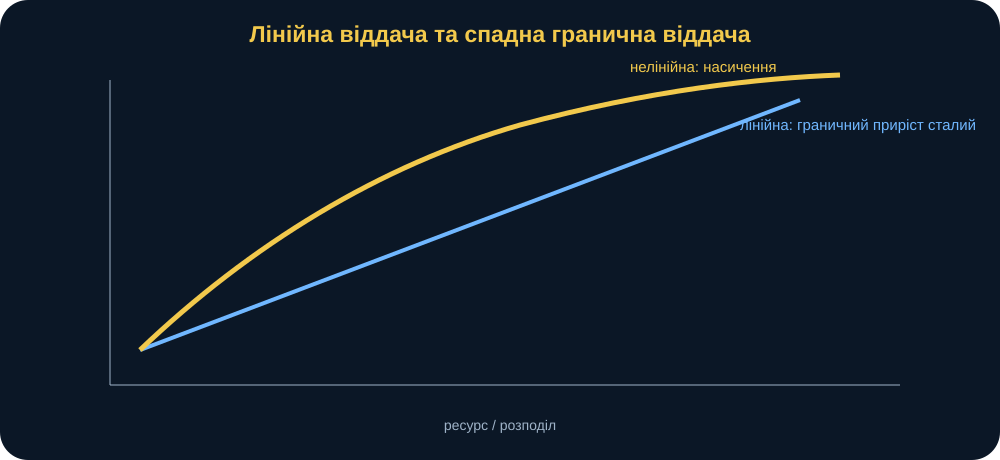
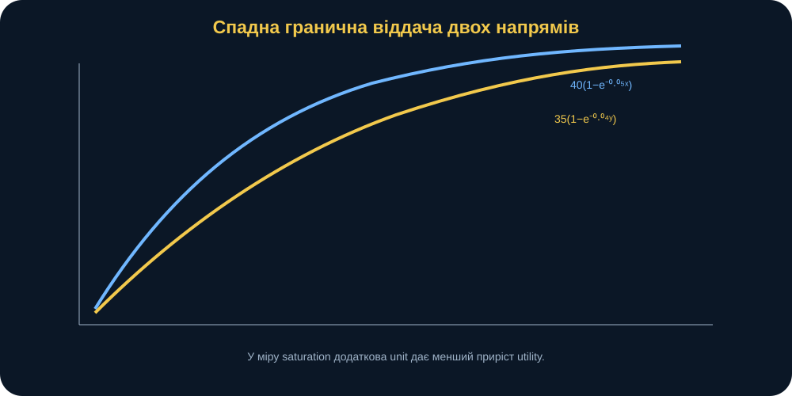
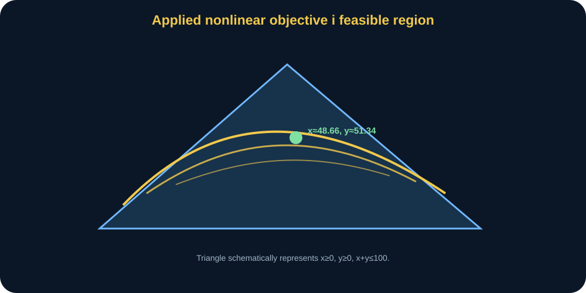
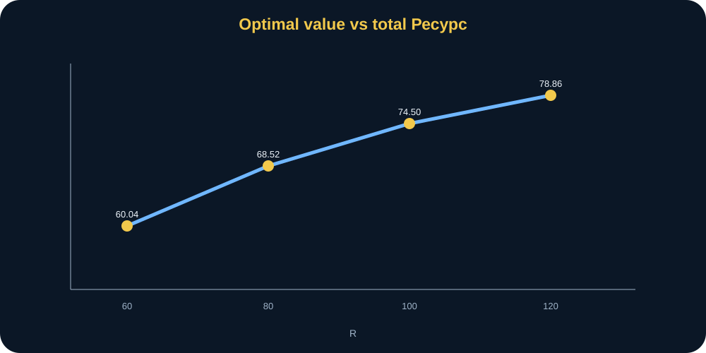
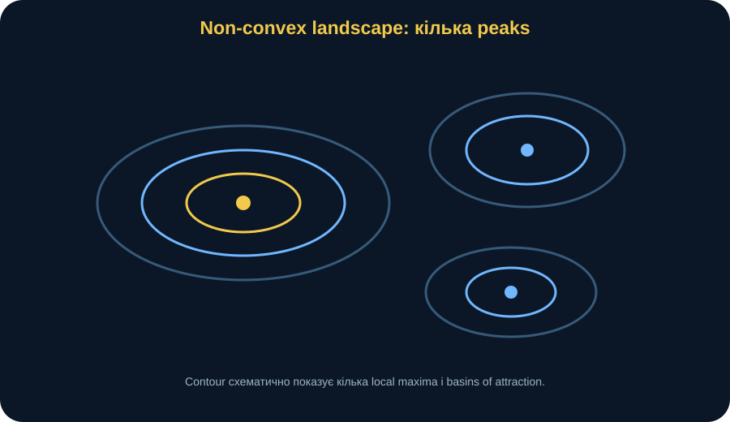
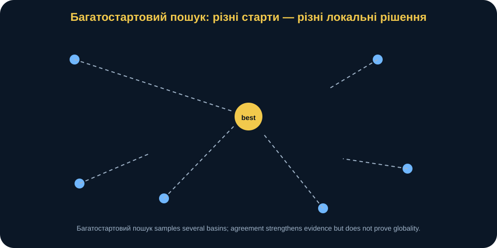
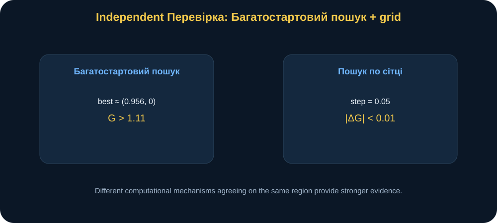
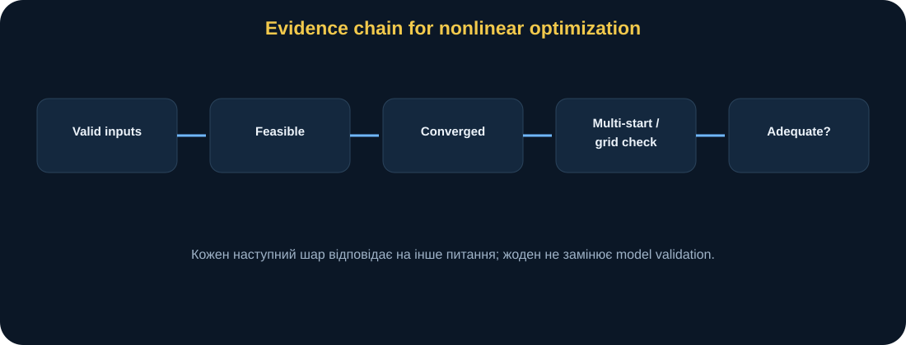

# MathModelingIT · Мінікнига T2.L3

## Математичні моделі задач нелінійного програмування

### Коли пряма лінія перестає працювати: спадна віддача, локальні максимуми і перевірка оптимуму

> **Головна ідея книги:** у нелінійній оптимізації недостатньо отримати повідомлення **success=істинний**. Нелінійна форма цільова функція може створювати насичення, взаємодія, криволінійний область допустимих розв’язківs і кілька локальних максимумів. Тому сильний обчислювальний результат повинен поєднувати формалізацію, допустимість перевірки, чутливість, множинні початкові точки, незалежну перевірку і візуальну інтерпретацію поверхня.

---

## 0. Паспорт книги

**Код заняття:** T2.L3 
**Тема:** математичні моделі задач нелінійного програмування 
**Рівень:** середній 
**Орієнтовний час читання:** 70–85 хвилин 
**Попередні знання:** поняття функції, обмеження, похідна на інтуїтивному рівні, базова лінійна оптимізація.

Після цієї книги ви повинні вміти:

- пояснювати, що робить оптимізація задача нелінійною;
- відрізняти спадна віддача від лінійний віддача;
- читати крива насичення;
- формулювати нелінійний цільова функція і обмеження;
- інтерпретувати прикладний оптимум T2.L3;
- розуміти роль стартової точки;
- розрізняти локальний і глобальний оптимум;
- пояснювати, чому локальний розв’язувач може успішно завершитися в різних точках;
- використовувати множинні початкові точки як практичну перевірку;
- використовувати пошук на сітці як незалежний перевірка здорового глузду у двох вимірах;
- читати контурний графік;
- проводити чутливість до загальний ресурс;
- формулювати допустимий висновок без перебільшення;
- знаходити аналог нелінійний вплив у власній дослідження задача.

---

## 1. Сцена: більше ресурсу — але не пропорційно більше ефекту

Уявімо синтетичну навчальну задачу.

Є два напрями використання обмеженого ресурсу:

- \(x\);
- \(y\).

Загальний ресурс:

\[
R=100.
\]

На першому етапі додаткові одиниці ресурсу дають значний вплив.

Але далі напрям насичується.

Перші 10 одиниці можуть бути дуже корисними.

Наступні 10 — трохи менше.

Після певного рівня ще одна одиниця майже не змінює результат.

Крім того, два напрями можуть слабко підсилювати один одного.

У такій ситуації лінійний цільова функція на кшталт:

\[
8x+6y
\]

вже не описує бажану поведінку.

Потрібна нелінійна модель.

Дослідницьке питання:

> **Як розподілити обмежений ресурс між двома напрямами, якщо їхня віддача насичується, а результат містить слабку взаємодія, і як перевірити, що чисельний оптимізатор не ввів нас в оману?**

<figure>
 
 <figcaption><strong>Рис. 1.</strong> У лінійний модель граничний return сталий. У diminishing-returns модель кожна наступна одиниця дає менший приріст, тому оптимальний розподіл уже не визначається простим порівнянням коефіцієнтів.</figcaption>
</figure>

---

## 2. Що означає нелінійність

Функція нелінійна, якщо relationship між змінні і результат не можна подати лише як:

\[
a_1x_1+a_2x_2+\dots+a_nx_n+b.
\]

Нелінійність може виникати через:

- експонента;
- логарифм;
- square корінь;
- product змінні;
- степені;
- trigonometric функції;
- thresholds;
- кускові ефекти;
- ratios.

У нашому прикладний приклад присутні одразу кілька нелінійний forms.

---

## 3. прикладний цільова функція T2.L3

Функція:

\[
F(x,y)=
40(1-e^{-0.05x})
+
35(1-e^{-0.04y})
+
0.15\sqrt{xy}.
\]

Потрібно:

\[
F(x,y)\rightarrow\max.
\]

обмеження:

\[
x+y\le R,
\]

\[
x\ge0,
\]

\[
y\ge0.
\]

Для базовий сценарій:

\[
R=100.
\]

Ця формула навмисно синтетична.

Вона потрібна для розуміння нелінійний поведінка, а не для опису конкретної реальної військової системи.

---

## 4. Перший доданок: спадна віддача для x

Розглянемо:

\[
F_x(x)=40(1-e^{-0.05x}).
\]

Коли:

\[
x=0,
\]

маємо:

\[
F_x(0)=0.
\]

Коли \(x\) зростає:

\[
e^{-0.05x}\rightarrow0.
\]

Отже:

\[
F_x(x)\rightarrow40.
\]

Тобто вплив має верхній насичення рівень близько 40.

Це принципово інша поведінка, ніж:

\[
8x,
\]

яка росте безмежно.

<figure>
 
 <figcaption><strong>Рис. 2.</strong> Експоненційні компоненти швидко ростуть на початку, але поступово виходять на насичення. граничний приріст зменшується зі збільшенням розподіл.</figcaption>
</figure>

---

## 5. граничний return як похідна

Для:

\[
F_x(x)=40(1-e^{-0.05x}),
\]

похідна:

\[
\frac{dF_x}{dx}=2e^{-0.05x}.
\]

На старті:

\[
\frac{dF_x}{dx}\Big|_{x=0}=2.
\]

При \(x=20\):

\[
2e^{-1}\approx0.736.
\]

При \(x=60\):

\[
2e^{-3}\approx0.100.
\]

Тобто додаткова одиниця x стає менш корисною.

Це і є **спадна гранична віддача**.

---

## 6. Другий напрям y

Для:

\[
F_y(y)=35(1-e^{-0.04y}),
\]

похідна:

\[
\frac{dF_y}{dy}=1.4e^{-0.04y}.
\]

Він теж diminishing.

Але має інший насичення рівень та іншу швидкість насичення.

Отже, оптимум повинен балансувати два нелінійний відгук profiles.

---

## 7. взаємодія член

Третій член:

\[
0.15\sqrt{xy}.
\]

Він залежить від обох змінні одночасно.

Якщо:

\[
x=0
\]

або:

\[
y=0,
\]

взаємодія член = 0.

Коли обидва додатний, з’являється додаткова utility.

Це слабка синергія.

У лінійний additive модель:

\[
F(x,y)=F_x(x)+F_y(y)
\]

такої взаємодія немає.

Тут:

\[
F(x,y)\ne F_x(x)+F_y(y).
\]

---

## 8. Чому синергія впливає на баланс

Без взаємодія оптимізатор міг би більше схилятися до напряму з кращим standalone граничний profile.

член:

\[
\sqrt{xy}
\]

заохочує ситуацію, де додатні розподіли є в обох напрямах.

Це не означає автоматично 50/50.

Але робить крайній розподіл менш привабливим.

У базовий сценарій оптимум:

\[
x^*\approx48.659,
\]

\[
y^*\approx51.341.
\]

Результат близький до баланс, але не точно equal.

---

## 9. обмеження ресурс

Маємо:

\[
x+y\le100.
\]

У оптимум:

\[
x^*+y^*\approx100.
\]

Ресурс практично повністю використаний.

Чому?

Бо в базовій області корисність усе ще зростає за обома змінними.

Якщо залишити ресурс невикористаний, можна трохи збільшити x або y й покращити цільова функція.

Отже, обмеження активний:

\[
x+y=100.
\]

---

## 10. базовий сценарій оптимум

канонічне джерело тести фіксують:

\[
x^*\approx48.6593,
\]

\[
y^*\approx51.3407.
\]

цільова функція:

\[
F^*\approx74.49685.
\]

ресурс використаний:

\[
100.
\]

<figure>
 
 <figcaption><strong>Рис. 3.</strong> прикладний цільова функція є гладкою нелінійний поверхня. область допустимих розв’язків обмежена трикутником \(x\ge0\), \(y\ge0\), \(x+y\le100\); оптимум лежить поблизу ресурс межа.</figcaption>
</figure>

---

## 11. Чому оптимум не 50/50

Рівний розподіл:

\[
(50,50)
\]

дуже близький до оптимум.

Але коефіцієнти двох насичення components різні:

- 40 та 0.05 для x;
- 35 та 0.04 для y.

Тому граничний віддача трохи різні.

розв’язувач знаходить баланс, де малий локальний reallocation уже не дає поліпшення у межах обмеження.

---

## 12. One-dimensional інтуїція

Якщо ресурс обмеження активний:

\[
y=R-x.
\]

Тоді цільова функція можна розглядати як:

\[
H(x)=F(x,R-x).
\]

оптимум приблизно там, де:

\[
\frac{dH}{dx}=0.
\]

Інтуїтивно:

> граничний виграш перенести одну малу одиниця з y у x стає нульовим.

Тобто баланс системи досягнуто не через симетрію, а через рівність відповідних граничних компромісів.

---

## 13. допустимість перевірки

Після розв’язувач окремо перевіряємо:

\[
x\ge0,
\]

\[
y\ge0,
\]

\[
x+y\le R,
\]

і:

\[
F(x,y)
\]

скінченний.

У джерело код verify_applied_solution() робить це незалежно.

**success=істинний** і допустимість — це різні твердження.

---

## 14. Чому SLSQP

прикладний задача розв’язується через SLSQP.

Цей метод підтримує:

- межі;
- inequality обмеження;
- гладкі нелінійні цільові функції.

Ми мінімізуємо:

\[
-F(x,y),
\]

бо `scipy.optimize.minimize` виконує мінімізацію.

Тобто:

\[
\max F
\]

перетворюється на:

\[
\min(-F).
\]

---

## 15. Стартова точка

чисельний нелінійний розв’язувач потребує початковий guess:

\[
(x_0,y_0).
\]

Наприклад:

\[
(50,50).
\]

Для прикладний модель assignment пропонує:

- (10,10);
- (80,10);
- (10,80);
- (50,50).

У nonлінійна оптимізація шлях алгоритм може залежати від початок.

---

## 16. прикладний модель і початок залежність

Для гладкої прикладної функції у базовому сценарії різні обґрунтовані стартові точки сходяться поблизу того самого оптимуму.

Це корисний empirical свідчення.

Але це не універсальна властивість нелінійних задач.

Саме тому курс має другий приклад — deliberately невипуклий поверхня.

---

## 17. чутливість до загальний ресурс

Досліджуємо:

\[
R\in\{60,80,100,120\}.
\]

Контрольні результати:

| R | x* | y* | F* |
|---:|---:|---:|---:|
| 60 | ≈30.56 | ≈29.44 | ≈60.04 |
| 80 | ≈39.58 | ≈40.42 | ≈68.52 |
| 100 | ≈48.66 | ≈51.34 | ≈74.50 |
| 120 | ≈57.83 | ≈62.17 | ≈78.86 |

цільова функція зростає.

Але increments зменшуються.

---

## 18. Спадна цінність додаткового ресурсу

Приріст від 60 до 80:

\[
68.52-60.04\approx8.48.
\]

Від 80 до 100:

\[
74.50-68.52\approx5.98.
\]

Від 100 до 120:

\[
78.86-74.50\approx4.36.
\]

Однакове:

\[
\Delta R=20.
\]

Але \(\Delta F\) зменшується.

<figure>
 
 <figcaption><strong>Рис. 4.</strong> Additional ресурс покращує оптимум, але граничний приріст зменшується. Це прямий прояв спадна віддача на рівні оптимальний значення функція.</figcaption>
</figure>

---

## 19. значення функція

Визначимо:

\[
V(R)=
\max_{x+y\le R}F(x,y).
\]

Таблиця чутливості — це вибіркові значення функції \(V(R)\).

У нелінійний приклад вона криволінійний.

Ключове питання:

> як змінюється найкращий досяжний результат при послабленні ресурсного обмеження?

Це часто значно важливіше, ніж один базовий сценарій оптимум.

---

## 20. невипуклий приклад: навіщо друга модель

прикладний функція поводиться досить дружньо.

Щоб зрозуміти локальні оптимуми, потрібна поверхня з кількома вершинами.

курс використовує:

\[
G(x,y)=
\sin(1.7x)\cos(1.3y)
+
0.15x
-
0.03(x^2+y^2).
\]

межі:

\[
-4\le x\le4,
\]

\[
-4\le y\le4.
\]

Ця функція — навчальний поверхня.

Вона не претендує на direct реальний військовий інтерпретація.

---

## 21. Чому поверхня невипуклий

Тригонометричні члени:

\[
\sin(1.7x),\qquad
\cos(1.3y)
\]

створюють oscillations.

Квадратичний член:

\[
-0.03(x^2+y^2)
\]

формує загальну спадну тенденцію.

лінійний:

\[
0.15x
\]

нахиляє поверхня.

У результаті:

- кілька peaks;
- кілька valleys;
- локальний maxima.

<figure>
 
 <figcaption><strong>Рис. 5.</strong> невипуклий поверхня має кілька локальних максимумів. Різні початок точки можуть привести локальний розв’язувач у різні basins attraction.</figcaption>
</figure>

---

## 22. локальний оптимум

точка \(z^*\) є локальний максимум, якщо в невеликому neighborhood немає кращого точка.

Але десь далеко може існувати:

\[
G(\tilde z)>G(z^*).
\]

Тоді локальний оптимум не глобальний.

Це центральна проблема невипуклий оптимізація.

---

## 23. глобальний оптимум

глобальний максимум задовольняє:

\[
G(z^*)\ge G(z)
\]

для всіх допустимий \(z\).

У bounded 2D навчальний поверхня можна наближено перевірити глобальний область через dense пошук на сітці.

У високій розмірності це швидко стає обчислювально дорогим.

---

## 24. Що насправді означає success=істинний

Для локального розв’язувача **success=істинний** означає, що алгоритм задовольнив власну умову зупинки.

Не означає:

> знайдено найвищу вершину на всій поверхні.

Це фундаментальне правило:

> **збіжність є не globality.**

---

## 25. початок точка як частина експеримент

Запустимо:

\[
(0,0)
\]

і:

\[
(2,2).
\]

канонічне джерело перевірка вимагає, щоб отримані objectives відрізнялися більше ніж на 0.05.

Отже, різні починається можуть привести до різних локальний розв’язки.

---

## 26. Область притягання

Інтуїтивно поверхня схожа на гористу місцевість.

локальний оптимізатор — мандрівник, який іде вгору, але бачить лише локальний slope.

Якщо стартує біля одного peak, підніметься на нього.

Якщо біля іншого — на інший.

Область початок точки, що приводить до певного локальний оптимум, називають basin attraction.

<figure>
 
 <figcaption><strong>Рис. 6.</strong> множинні початкові точки запускає локальний оптимізатор з різних точок. Якщо розв’язки різняться, початок залежність є empirically demonstrated, а не лише теоретично згаданою.</figcaption>
</figure>

---

## 27. множинні початкові точки

курс запускає починається:

\[
(-3,-3),\ (-3,2),\ (0,0),\ (2,2),\ (3,-2),\ (4,4).
\]

Для кожного:

1. розв’язати локальний;
2. записати final x,y;
3. цільова функція;
4. успіх.

Потім sort за цільова функція.

найкращий відомий область:

\[
x\approx0.956,
\]

\[
y\approx0,
\]

\[
G\approx1.1145.
\]

---

## 28. Множинні початкові точки не є формальним доказом

Навіть якщо 100 стартових точок дали один найкращий результат, це ще не формальний доказ глобальної оптимальності.

Можливо:

- вузька вершина не потрапила до досліджених областей притягання;
- розв’язувач skipped область;
- межі досліджено недостатньо.

множинні початкові точки — strong практичний перевірка.

Це не універсальний доказ.

---

## 29. незалежний пошук на сітці

У 2D можна зробити coarse сітка.

Наприклад:

\[
step=0.05.
\]

Перебираємо всі комбінації вузлів сітки в заданих межах.

Для кожного точка обчислюємо G.

Беремо найкращий.

канонічне джерело перевірка вимагає:

\[
|G_{multistart}-G_{grid}|<0.01.
\]

Це незалежний перевірка здорового глузду.

---

## 30. Чому пошук на сітці корисний

Переваги:

- простий;
- не залежить від градієнт;
- оглядає всю обмежену область;
- легко visualise;
- має інший відмова mode, ніж локальний оптимізатор.

У 2D це сильний навчальний перевірка.

---

## 31. Чому пошук на сітці погано масштабується

Якщо на одну змінна маємо 161 сітка точки, у 2D:

\[
161^2\approx25921.
\]

У 5D:

\[
161^5
\]

вже величезне число.

Це прояв **прокляття розмірності**.

пошук на сітці — не general глобальний оптимізація розв’язок.

---

## 32. Роздільна здатність сітки і точність

крок:

\[
0.05
\]

означає, що сітка не бачить точки між nodes.

Зменшимо крок:

- точність вища;
- обсяг обчислень значно більший.

Тобто незалежний засіб перевірки теж має власний параметр і обмеження.

---

## 33. Контурний графік як свідчення

Контурний графік показує лінії однакового значення цільової функції.

На ньому можна побачити:

- peaks;
- valleys;
- basins;
- початок точки;
- розв’язувач endpoints.

Це інформативніше за таблицю успіх значення.

<figure>
 
 <figcaption><strong>Рис. 7.</strong> множинні початкові точки і coarse сітка використовують різні обчислювальний mechanisms. Їхня згода поблизу \(x\approx0.956, y\approx0\) підсилює довірчий у знайденому найкращий область.</figcaption>
</figure>

---

## 34. візуалізація не доводить оптимум

Красивий контурний графік не є формальним доказом.

Роздільна здатність обмежена.

Колірна шкала може приховувати відмінності.

Plot корисний для:

- інтуїція;
- виявлення аномалій;
- communication.

Але не замінює чисельний перевірка.

---

## 35. обмеження і межі — різні механізми

прикладний модель:

\[
x+y\le R
\]

— загальне обмеження-нерівність.

Також:

\[
x\ge0,y\ge0
\]

можна задавати межі.

невипуклий:

\[
-4\le x,y\le4
\]

— прямокутні межі змінних.

розв’язувач algorithms можуть обробляти їх по-різному.

Для modeler головне — математичний зміст має бути явний.

---

## 36. допустимий порівняно з локальний оптимум

Точка може бути локальним максимумом задачі без обмежень, але бути недопустимою.

оптимізація шукає оптимум лише всередині область допустимих розв’язків.

межа сам може містити оптимум.

Тому після чисельний розв’язати завжди перевіряємо обмеження.

---

## 37. KKT інтуїція

У формальній теорії гладкої оптимізації з обмеженнями використовують умови Каруша—Куна—Таккера.

На вступному рівні важлива така ідея:

- якщо обмеження неактивне, оптимум локально поводиться як стаціонарна точка задачі без обмежень;
- якщо обмеження активний, оптимум може лежати на межа;
- градієнт цільової функції взаємодіє з градієнтами обмежень.

У базовій прикладній задачі ресурсне обмеження активне.

---

## 38. Інтуїція множника Лагранжа

Для:

\[
x+y\le R
\]

Множник можна інтерпретувати як локальну цінність додаткового ресурсу.

Це нелінійний аналог інтуїції тіньової ціни.

Якщо \(V(R)\) saturates, граничний значення:

\[
\frac{dV}{dR}
\]

decreases.

Таблиця чутливості вже показує це без складної теорії двоїстості.

---

## 39. Інтуїція опуклості та вгнутості

У maximization є важлива властивість.

Якщо:

- допустимий набір convex;
- цільова функція concave,

то локальний максимум є глобальний максимум.

Це дуже сильна гарантія.

У deliberately невипуклий поверхня такої гарантії немає.

Саме тому один локальний розв’язати недостатній.

---

## 40. Hessian інтуїція

Для двічі диференційовної функції кривину описує матриця Гессе.

Не потрібно вручну обчислювати Hessian для кожної лабораторія.

Але варто пам’ятати:

- кривина визначає форму;
- від’ємний curvature навколо точка може підтримувати локальний максимум інтерпретація;
- змішана кривина може створювати сідлові точки.

оптимізація алгоритм взаємодіє з geometry, а не просто «перебирає числа».

---

## 41. Saddle точка

точка може мати нуля градієнт, але не бути оптимум.

Наприклад:

\[
H(x,y)=x^2-y^2.
\]

У:

\[
(0,0)
\]

градієнт нуля.

Але вздовж x функція зростає, вздовж y — зменшується.

Це saddle.

Отже:

> стаціонарна точка ≠ автоматично оптимум.

---

## 42. модель адекватність прикладний приклад

прикладний функція синтетичний.

У реальний дослідження потрібно обґрунтувати:

- чому exponential насичення;
- чому ці коефіцієнти;
- чому використано синергію через квадратний корінь;
- whether взаємодія додатний;
- whether ресурс неперервний;
- чи достатньо одного періоду.

Без цього формула має навчальний зміст лише.

---

## 43. калібрування нелінійний модель

Якщо є спостережуваний pairs:

\[
(x_k,y_k,F_k),
\]

можна оцінювати коефіцієнти:

\[
40,\ 0.05,\ 35,\ 0.04,\ 0.15.
\]

Наприклад нелінійний метод найменших квадратів.

Тоді оптимізація модель пов’язується з дані.

Але з’являється невизначеність параметри.

---

## 44. невизначеність оптимум

Якщо коефіцієнти невизначений, оптимум:

\[
x^*,y^*
\]

теж невизначений.

Можна:

1. вибірка коефіцієнти;
2. розв’язати оптимізація кожен запуск;
3. аналізувати розподіл оптимальних рішень.

Але тут є важлива методологічна розвилка.

### повторна оптимізація

Кожна змодельована реалізація отримує власний оптимум.

Питання:

> яким був би оптимум, якби параметри були саме такими?

### Fixed-decision стійкість

Обираємо одне рішення \(x^*\) і оцінюємо його ефективність за невизначених параметрів.

Питання:

> наскільки стійке базове рішення, якщо реальні параметри відрізняються?

Ці експерименти не можна змішувати.

---

## 45. спадна віддача порівняно з поріг вплив

Спадна віддача — це плавне зменшення граничного приросту.

поріг — sharp зміна біля певного значення.

Наприклад:

\[
F(x)=
\begin{cases}
ax,&x<T,\\
ax+b,&x\ge T.
\end{cases}
\]

Такий модель нелінійний/non-smooth.

Не всі nonlinearities однакові.

вибір методу залежить від структура.

---

## 46. Non-smooth цільова функція

Якщо цільова функція має:

- absolute значення;
- мінімум/максимум;
- discontinuities;

Градієнтний розв’язувач може мати труднощі.

Потрібно обирати метод відповідно до математичний properties.

Питання «який розв’язувач?» завжди йде **після** питання «яка структура модель?».

---

## 47. Чому властивість задачі важливіша за назву розв’язувача

Перед вибором алгоритм запитайте:

- цільова функція smooth?
- опукла/вгнута?
- межі?
- обмеження?
- derivatives доступний?
- розмірність?
- дискретний змінні?
- невипуклий?
- стохастичний?

Після цього метод.

Назва бібліотека — останній рівень, а не перший.

---

## 48. Python без страху: прикладний цільова функція

~~~python
def applied_utility(x, y):
    return (
        40 * (1 - exp(-0.05*x))
        + 35 * (1 - exp(-0.04*y))
        + 0.15 * sqrt(x*y)
    )
~~~

код mirrors формула.

Це desirable для аудит.

---

## 49. Python без страху: прикладний розв’язати

~~~python
sol = solve_applied(
    total_resource=100,
    start=(50, 50),
)
~~~

Контроль:

~~~text
x ≈ 48.659
y ≈ 51.341
F ≈ 74.497
~~~

---

## 50. Python без страху: перевірка

~~~python
checks = verify_applied_solution(
    sol,
    total_resource=100,
)

assert checks["all_passed"]
~~~

Не вважайте успіх достатньою перевірка.

---

## 51. Python без страху: чутливість

~~~python
rows = applied_sensitivity(
    [60, 80, 100, 120]
)
~~~

Перевірка:

\[
F^*(R)
\]

має неспадну тенденцію для цієї моделі.

джерело перевірка перевіряє саме це.

---

## 52. Python без страху: невипуклий

~~~python
a = solve_nonconvex((0,0))
b = solve_nonconvex((2,2))
~~~

Якщо цільова функція значення різні:

> продемонстровано залежність локального розв’язувача від початкової точки.

---

## 53. Python без страху: множинні початкові точки

~~~python
rows = multistart_nonconvex([
    (-3,-3),
    (-3,2),
    (0,0),
    (2,2),
    (3,-2),
    (4,4),
])
~~~

Sort за цільова функція.

найкращий область біля:

\[
(0.956,0).
\]

---

## 54. Python без страху: сітка перевірка

~~~python
grid = grid_search_nonconvex(
    step=0.05
)
~~~

Порівняйте:

\[
G_{grid}
\]

і:

\[
G_{best\ multistart}.
\]

Різниця < 0.01 у контрольний перевірка.

---

## 55. перевірка рівні

### вхідні дані валідація

- R додатний;
- початок length = 2;
- початок невід’ємний прикладний приклад;
- сітка крок додатний.

### допустимість

- x,y within обмеження.

### розв’язувач збіжність

- успіх статус.

### міжметодний перевірка

- множинні початкові точки;
- пошук на сітці.

### модель адекватність

- структура justified за область/дані.

<figure>
 
 <figcaption><strong>Рис. 8.</strong> Надійний нелінійний результат будується шарами: коректний вхідні дані → допустимий розв’язок → чисельний збіжність → множинні початкові точки / незалежний перевірка → область адекватність.</figcaption>
</figure>

---

## 56. Зламай модель: один початок лише

Запустили з:

\[
(0,0)
\]

і отримали успіх.

Зупинилися.

У невипуклий поверхня це insufficient.

злам умова:

> інший початок дає кращий цільова функція.

Модернізація:

> множинні початкові точки.

---

## 57. Зламай модель: надто груба сітка

крок:

\[
1.0
\]

може пропустити вузьку вершину.

сітка says найкращий.

Finer сітка — найкращий B.

Отже, роздільна здатність сітки сама є параметром.

Need чутливість до перевірка метод.

---

## 58. Зламай модель: некоректний початок

прикладний початок:

\[
(80,80)
\]

sum > R.

поточний функція rescales початок до допустимий ресурс загальний.

Це convenient поведінка.

Але дослідник повинен знати, що алгоритм змінив початкову точку.

Прозоре журналювання важливе.

---

## 59. Зламай модель: square корінь біля нуля

член:

\[
\sqrt{xy}
\]

має похідні з підвищеною чутливістю біля нуля.

Якщо модель допускає точний нуля, математичний smoothness зміни.

У поточному налаштуванні розв’язувач коректно обробляє базовий сценарій.

Але форма цільова функція впливає на чисельний поведінка.

---

## 60. Зламай модель: помилковий область

Якщо x або y від’ємні, `applied_utility` повертає від’ємну нескінченність.

Це семантичний запобіжник.

У реальний модель область restrictions повинні бути явний обмеження.

---

## 61. Зламай модель: коефіцієнти без дані

Якщо коефіцієнти 40, 35, 0.05, 0.04, 0.15 не мають empirical basis, оптимум має навчальний зміст лише.

Це нормально для курс.

Але dissertation результат потребує параметр походження.

---

## Поглиблення: зведення задачі з обмеженнями до однієї змінної

У базовий сценарій ресурс обмеження активний:

\[
x+y=R.
\]

Тому:

\[
y=R-x.
\]

Підставимо в цільова функція:

\[
H_R(x)=F(x,R-x).
\]

допустимий інтервал:

\[
0\le x\le R.
\]

Це дуже корисний conceptual крок.

Двовимірна задача оптимізації з обмеженнями стає одновимірною задачею.

Ми можемо:

- побудувати граф \(H_R(x)\);
- побачити максимум;
- порівняти чисельний розв’язок;
- перевірити shape.

Для \(R=100\) максимум \(H_{100}(x)\) лежить поблизу:

\[
x\approx48.66.
\]

Тоді:

\[
y\approx51.34.
\]

Це незалежний інтерпретація розв’язувач результат.

Важливо:

> таке зведення працює, оскільки ми знаємо структуру активного обмеження, яке в оптимумі фактично задає рівність.

Не кожну задачу з обмеженнями можна так просто звести до меншої розмірності.

---

## Поглиблення: градієнт як локальний компас

Для гладкої функції градієнт:

\[
\nabla F(x,y)
=
\left(
\frac{\partial F}{\partial x},
\frac{\partial F}{\partial y}
\right)
\]

показує напрям найшвидшого локальний збільшення.

У задачі максимізації без обмежень стаціонарний кандидат задовольняє:

\[
\nabla F=0.
\]

Але в задачі з обмеженнями оптимум може лежати на межі, де градієнт не дорівнює нулю.

базовий сценарій саме такий випадок.

ресурс межа:

\[
x+y=R.
\]

Тому важливо не застосовувати правило:

> «оптимум там, де похідна = 0»

без урахування обмеження.

---

## Поглиблення: граничний баланс на межа

Якщо:

\[
y=R-x,
\]

то малий збільшення \(dx\) автоматично означає:

\[
dy=-dx.
\]

У оптимум локальний приріст від x має балансувати локальний втрата від y з урахуванням взаємодія.

Тобто:

\[
\frac{dH_R}{dx}=0.
\]

Інтуїтивно:

> якщо перенести дуже малу одиниця ресурсу з y у x, цільова функція майже не зміниться.

Це глибша причина того, чому розподіл близький до баланс.

Не «розв’язувач любить 50/50», а:

> граничний компроміс збалансовано.

---

## Поглиблення: curvature пояснює насичення

Перша похідна показує граничний приріст.

Друга похідна:

\[
\frac{d^2F}{dx^2}
\]

описує curvature.

Для експоненційної складової насичення:

\[
F_x(x)=40(1-e^{-0.05x}),
\]

маємо:

\[
\frac{d^2F_x}{dx^2}
=
-0.1e^{-0.05x}<0.
\]

Від’ємна друга похідна означає вгнутість цієї складової.

Тобто slope зменшується.

Це математичний signature спадна віддача.

---

## Поглиблення: concavity не треба плутати з «кривою вниз на картинці»

Graphical інтуїція корисна.

Але формальна властивість важливіша.

Вгнута цільова функція на опуклій допустимій множині в задачі максимізації дає сильну гарантію:

> будь-який локальний оптимум є глобальний.

Саме тому класифікація геометрії задачі має практичне значення.

У невипуклий приклад такої гарантії немає.

---

## Поглиблення: scaling змінні

чисельний оптимізація може поводитися гірше, якщо змінні мають дуже різні масштаби.

Наприклад:

\[
x\in[0,1],
\]

\[
y\in[0,10^6].
\]

Тоді компоненти градієнта можуть мати радикально різні масштаби.

Корисно масштабувати:

\[
\tilde x=\frac{x-x_{min}}{x_{max}-x_{min}}.
\]

У нашому навчальний приклад x і y одного порядку, тому issue мінімальна.

Але під час перенесення у власне дослідження масштабування потрібно перевіряти.

---

## Поглиблення: scaling цільова функція

Так само складові цільової функції можуть мати різні масштаби.

Якщо один складова ~0.01, а інший ~100000, малий складова чисельний розв’язувач майже «не бачить».

Це не обов’язково означає, що він предметно неважливий.

Потрібно distinguish:

- чисельний масштаб;
- концептуальна важливість.

Особливо це важливо у зважених нелінійних цільових функціях.

---

## Поглиблення: stopping допуск

розв’язувач зупиняється не тоді, коли досягнуто mathematically точний оптимум.

Він використовує tolerances.

Наприклад:

- норма градієнта мала;
- крок малий;
- цільова функція зміна малий;
- максимум iterations.

Тому два реалізації можуть дати:

\[
74.49684
\]

і:

\[
74.49685.
\]

Це не змістовна наукова відмінність.

Потрібно подання результатів точність узгоджувати з чисельний допуск та дані якість.

---

## Поглиблення: хибний точність нелінійний результат

Якщо параметри синтетичний:

\[
0.05,\ 0.04,\ 0.15,
\]

то подання результатів:

\[
x^*=48.659312487
\]

створює хибний точність.

У навчальний інтерпретація достатньо:

\[
x^*\approx48.66,
\]

\[
y^*\approx51.34.
\]

Точніші digits потрібні для тести, але не обов’язково для науковий narrative.

Це важливе розділення:

- обчислювальний точність;
- подання результатів точність.

---

## Поглиблення: дизайн множинні початкові точки експеримент

множинні початкові точки не повинен бути випадковим списком початок точки.

Корисно включити:

### центр

\[
(0,0)
\]

або центр область.

### Corners

\[
(-4,-4),\ (-4,4),\ (4,-4),\ (4,4).
\]

### Interior точки

кілька locations.

### випадковий вибірка

за потреби.

Мета:

> покрити різні basins.

У курс використовується невеликий детермінований набір, щоб експеримент був відтворюваний.

---

## Поглиблення: детермінований починається порівняно з випадковий починається

детермінований починається:

- відтворюваний;
- легкий до порівняти;
- можуть систематично пропускати певну область.

випадковий починається:

- ширше дослідження простору;
- require початкове значення генератора;
- результати vary з вибірка.

Комбінований дизайн:

1. фіксований канонічний починається;
2. випадковий починається з початкове значення генератора.

Це часто практичний compromise.

---

## Поглиблення: найкращий результат із багатьох стартів як нижня межа глобального оптимуму

У maximization якщо знайдено найкращий значення:

\[
G_{best}=1.1145,
\]

то ми знаємо:

\[
G_{global}\ge1.1145.
\]

Бо глобальний оптимум не може бути гіршим за знайдений допустимий розв’язок.

Але не знаємо:

\[
G_{global}=1.1145
\]

без сильніший доказ.

Тобто найкраще знайдене значення дає **нижню межу значення глобального максимуму**.

Це коректна логічна позиція.

---

## Поглиблення: пошук на сітці як upper-proof не працює

Груба сітка знаходить найкраще значення серед її вузлів.

Це не верхній межа на неперервний максимум.

Між сітка nodes може бути вищий точка.

Отже:

\[
G_{grid}
\]

— ще одна допустима нижня межа.

Якщо:

\[
G_{grid}\approx G_{multistart},
\]

довірчий grows.

Але формальний розрив до глобального максимуму невідомий.

---

## Поглиблення: branch-and-bound / глобальний методи як наступний рівень

Для деяких невипуклий problems існують глобальний оптимізація методи:

- branch-and-bound;
- інтервал методи;
- детермінований глобальний solvers;
- еволюційні алгоритми;
- метод перестрибування між областями притягання;
- диференціальна еволюція.

Але їх застосування залежить від:

- розмірність;
- smoothness;
- межі;
- похідна availability;
- обчислювальний бюджет.

На T2.L3 головне не перелік algorithms.

Головне:

> локальний метод потребує явний перевірка strategy.

---

## Поглиблення: межа оптимум

невипуклий найкращий область у курс близький до:

\[
y\approx0.
\]

Тобто найкращий розв’язок лежить біля межа.

Це важливий reminder.

оптимум не обов’язково «в центрі красивого peak».

межі самі формують допустимий поверхня.

Тому візуалізація повинна показувати не лише цільова функція, а й допустимий область.

---

## Поглиблення: активний межі і інтерпретація

Якщо оптимум має:

\[
y=0,
\]

це активна нижня межа.

Предметна інтерпретація:

> у цій синтетичний поверхня модель розподіл y не дає достатньої граничний виграш біля найкращий область.

Але це не означає:

> реальний напрям y «не потрібний».

Навчальна поверхня не має прямої предметної семантики.

Це навчальний приклад локальний/глобальний поведінка.

---

## Поглиблення: параметр чутливість нелінійної форми

Можна змінити коефіцієнт взаємодія:

\[
0.15\rightarrow0.05,\ 0.30.
\]

питання:

> як сильніша або слабша синергія змінює розподіл?

Або насичення швидкість:

\[
0.05\rightarrow0.03.
\]

питання:

> як slower насичення x змінює оптимум?

Такі експерименти допомагають визначити:

> які нелінійний припущення найбільше формують рішення.

---

## Поглиблення: структурний невизначеність

параметр невизначеність:

> коефіцієнт 0.05 неточний.

структурний невизначеність:

> можливо, експоненційне насичення взагалі належить до невідповідного сімейства функцій.

Це глибша проблема.

Можливі альтернативи:

- logarithmic;
- функція Міхаеліса—Ментен;
- logistic;
- кусковий лінійний.

У дослідження модель варто порівнювати правдоподібний structures, якщо дані не підтримує одну однозначно.

---

## Поглиблення: калібрування до оптимізація

Небезпечний робочий процес:

1. invent нелінійний формула;
2. optimize;
3. report оптимум.

Сильніший:

1. сформулювати гіпотезу про механізм;
2. зібрати та підготувати дані;
3. оцінка параметри;
4. validate відгук функція;
5. quantify невизначеність;
6. лише тоді optimize;
7. оцінити стійкість рішення.

Оптимізація має йти **після** калібрування моделі, а не замінювати його.

---

## Поглиблення: fixed-decision стійкість

Припустимо базовий сценарій оптимум:

\[
d_0=(48.66,51.34).
\]

параметри невизначеність.

Є два експерименти.

### Повторно оптимізувати кожну реалізацію

Для кожного параметр вибірка знаходимо новий оптимум.

Отримуємо розподіл:

\[
d^*(\theta).
\]

### Keep \(d_0\) фіксований

Для кожного параметр вибірка оцінюємо:

\[
F(d_0;\theta).
\]

Це показує стійкість фактично обраного рішення.

Для підтримки прийняття рішень другий експеримент часто не менш важливий.

---

## Поглиблення: regret

Можна визначити regret:

\[
Regret(\theta)
=
F(d^*(\theta);\theta)
-
F(d_0;\theta).
\]

Він відповідає:

> скільки ефективності ми втрачаємо, якщо використовуємо базове рішення замість оптимуму для конкретного сценарію?

Це сильний міст до прийняття стійких рішень.

---

## Поглиблення: модель аудит T2.L3

### математичний аудит

- область коректний?
- цільова функція скінченний?
- обмеження явний?
- чи зрозуміла гладкість функції?

### чисельний аудит

- починається logged?
- допуск відомий?
- чи прийнятне масштабування?
- збіжність checked?

### Globality аудит

- чи відомі властивості опуклості/вгнутості?
- множинні початкові точки performed?
- незалежний перевірка доступний?

### науковий аудит

- формула justified?
- параметри калібрований?
- невизначеність acknowledged?
- допустимий висновок умовний?

---

## Поглиблення: відтворюваність пакет

Для нелінійний експеримент збережіть:

- функція definition;
- параметр значення;
- межі;
- обмеження;
- розв’язувач/метод;
- початковий точки;
- tolerances;
- випадковий початкове значення генератора, якщо є;
- усі локальний розв’язки;
- найкращий цільова функція;
- сітка resolution;
- чутливість результати;
- рисунки;
- код версія;
- пакет версії.

Особливо важливо зберігати починається.

Без них colleague може не відтворити локальний розв’язок.

---

## Поглиблення: напівхудожнє повернення до сцени

Керівник бачить:

\[
x=48.66,\quad y=51.34
\]

і питає:

> «Чому не 50 на 50?»

Аналітик відповідає:

> «Бо два напрями мають різні насичення rates, а взаємодія винагороджує спільне використання. На межа \(x+y=100\) оптимум виникає там, де граничний компроміс баланс. Якщо ресурс збільшувати, цільова функція росте, але все повільніше».

Потім керівник дивиться на невипуклий приклад:

> «А тут розв’язувач теж написав успіх. Чому ви запускаєте його шість разів?»

Аналітик:

> «Бо успіх означає локальний збіжність. Різні починається приводять до різних peaks. Ми використовуємо множинні початкові точки і незалежний сітка, щоб не переплутати локальний максимум із найкращим знайденим область».

Саме ця друга відповідь і є сутністю T2.L3.

---

## 62. сценарій дизайн нелінійний

Корисний план:

| запуск | зміна | Purpose |
|---|---|---|
| базовий сценарій | R=100 | контрольний |
| низький R | 60 | спадна віддача |
| Mid R | 80 | значення функція |
| високий R | 120 | насичення |
| починається | 4 починається | початок чутливість |
| Невипукла | 6 стартів | локальні оптимуми |
| сітка | крок=.05 | незалежний перевірка |

Перед запуском бажано записати прогноз.

---

## 63. допустимий висновок прикладний приклад

Слабкий:

> оптимально x=48.659, y=51.341.

Кращий:

> Для синтетичний нелінійний utility T2.L3 за R=100 SLSQP знаходить допустимий розв’язок \(x\approx48.659\), \(y\approx51.341\) з \(F\approx74.497\), використовуючи practically весь ресурс.

Ще сильніше:

> аналіз чутливості для R=60–120 показує нелінійне зростання оптимального значення цільової функції зі спадними граничними приростами; отже додатковий ресурс має дедалі меншу модельовану цінність у цій структурі насичення.

---

## 64. Допустимий висновок для невипуклого прикладу

Слабкий:

> глобальний оптимум = 1.1145.

Обережніше:

> У bounded toy поверхня множинні початкові точки із заданого набору починається знаходить найкращий розв’язок поблизу \(x\approx0.956,y\approx0\) з цільова функція >1.11; незалежний пошук на сітці крок=.05 дає цільова функція within.01, що підсилює довірчий у цьому найкращий область, але не є formal доказ глобальний оптимальність.

Це саме той рівень точність, який підтримує свідчення.

---

## 65. дослідження перенесення

Поставте питання:

> де у моєму дослідження об’єкт очікується нелінійний відгук?

Можливі patterns:

- спадна віддача;
- насичення;
- поріг;
- синергія;
- conflict;
- квадратичний штраф;
- ймовірність відгук;
- експоненційне згасання;
- логістичне зростання.

Шаблон:

~~~text
Research question:

Decision variables:

Parameters:

Nonlinear mechanism:

Objective:

Constraints:

Bounds:

Data source:

Starting points:

Solver:

Feasibility verification:

Multi-start plan:

Independent check:

Sensitivity parameter:

Uncertainty:

Limitations:

Allowed conclusion:
~~~

---

## 66. Не вставляйте нелінійний формула лише «щоб було складніше»

Нелінійність повинна мати змістовне обґрунтування.

Наприклад:

- насичення спостережуваний у дані;
- physics;
- відомий взаємодія;
- теоретичний механізм.

формула без предметного пояснення не робить дослідження сильніший.

Вона лише робить обчислення harder.

---

## Поглиблення: що саме означає «надійний нелінійний оптимум»

Для nonлінійна оптимізація слово «надійний» повинно мати конкретний зміст.

### чисельний надійність

Розв’язувач неодноразово збігався до розв’язку.

### допустимість надійність

Обмеження перевірено незалежно.

### початок надійність

Кілька стартових точок приводять до тієї самої або співмірної найкращої області.

### міжметодний надійність

Незалежний пошук на сітці або інший метод підтверджує ту саму область.

### модель надійність

Функціональна форма і параметри мають мати предметне або даними підтверджене обґрунтування.

Ці рівні утворюють ієрархію свідчень.

Якщо є лише перший рівень:

> розв’язувач успіх,

висновок слабкий.

Якщо є всі п’ять, обчислювальний твердження значно сильніший.

---

## Поглиблення: синтетичний військовий інтерпретація без операційний claims

прикладний приклад можна уявити як розподіл умовного навчального ресурсу між двома напрямами підготовки.

Кожен напрям має насичення:

> після певного рівня додаткове вкладення дає дедалі менший ефект.

взаємодія член означає:

> певна частина корисності виникає лише коли обидва напрями підтримуються разом.

Це не реальна оцінка бойової ефективності.

Це навчальний механізм для пояснення:

- спадна віддача;
- синергія;
- constrained нелінійний розподіл.

Невипуклий приклад узагалі не має предметної семантики.

Він навмисно є **математичний stress перевірка** для оптимізатор.

Це теж важлива академічна дисципліна:

> не кожен навчальний приклад потрібно маскувати під «реалістичний військовий приклад».

---

## Поглиблення: контрольний список перед твердження про глобальний оптимум

Перед словами:

> «знайдено глобальний оптимум»

перевірте:

1. Чи є задача опуклою/вгнутою у змістовному сенсі?
2. Чи theorem гарантує локальний=глобальний?
3. Якщо ні — які globality перевірки виконані?
4. Скільки починається?
5. Як вони обрані?
6. Чи перевірені boundaries?
7. Чи є незалежний метод?
8. Яким є невизначений розрив до глобального оптимуму?

Якщо формальної гарантії немає, коректніше писати:

> найкращий розв’язок, знайдений за визначеною процедурою пошуку та перевірки.

Це не слабкість.

Це точність.

---

## 67. Мінісловник T2.L3

### нелінійний функція

функція, що не є афінною комбінацією змінних.

### спадна віддача

Спадний граничний приріст зі зростанням вхідної величини.

### насичення

Наближення до верхньої межі відгуку.

### взаємодія

вплив одного змінна залежить від іншого.

### локальний оптимум

найкращий точка лише у neighborhood.

### глобальний оптимум

найкращий точка над entire область допустимих розв’язків.

### початок точка

початковий guess чисельний розв’язувач.

### Область притягання

область починається converging до той самий локальний оптимум.

### множинні початкові точки

Повторна локальна оптимізація з кількох стартових точок.

### пошук на сітці

явний evaluation на дискретний сітка.

### Контурний графік

Лінії однакового значення цільової функції.

### збіжність

алгоритм stopping за чисельний критерій.

### Опуклість / вгнутість

Ці властивості визначають, чи може локальний оптимум одночасно бути глобальним.

---

## 68. Мініексперимент

### питання 1

Чому \(F^*(R)\) зростає не лінійно?

Через насичення/спадна віддача.

### питання 2

Чому інший successful починається можуть мати різні цільова функція?

невипуклий поверхня має множинний локальний maxima.

### питання 3

Навіщо пошук на сітці?

незалежний coarse перевірка.

### питання 4

Чи сітка крок.05 доводить глобальний оптимум?

Ні.

---

## Поглиблення: оптимізація поверхня як частина наукового аргументу

У нелінійний дослідження важливо зберігати не лише final точка, а й свідчення про поверхня:

- кілька починається;
- контурний графік/поверхня;
- цільова функція значення локальний розв’язки;
- межа перевірки;
- незалежний сітка результат;
- чутливість.

Тоді читач може побачити, чи висновок залежить від одного lucky запуск.

Саме ця свідчення bundle робить фразу «найкращий розв’язок found» науково перевірюваною.

---

## 69. Одна сторінка підсумку

### П’ять ідей

1. Нелінійність змінює геометрію цільової функції та поведінку оптимізації.
2. спадна віддача означає decreasing граничний вплив.
3. `success=True` означає збіжність алгоритму, а не глобальність оптимуму.
4. множинні початкові точки і незалежний сітка перевірка підсилюють свідчення.
5. модель форма повинна мати предметне або data-based обґрунтування.

### Три формули

прикладний:

\[
F(x,y)=40(1-e^{-0.05x})+35(1-e^{-0.04y})+0.15\sqrt{xy}.
\]

ресурс:

\[
x+y\le R.
\]

невипуклий:

\[
G(x,y)=\sin(1.7x)\cos(1.3y)+0.15x-0.03(x^2+y^2).
\]

### Дві помилки

- «розв’язувач успіх = глобальний оптимум»;
- «складніша формула = краща модель».

### Одне питання

> Який нелінійний mechanism у моєму дослідження об’єкт можна обґрунтувати даними або theory?

### Наступний крок

Порівняйте прикладний чутливість, запустіть невипуклий з кількох починається і перевірте найкращий область пошук на сітці.

---

## 70. Фінальна думка

Нелінійна оптимізація модель наближає нас до систем, де вплив рідко зростає вічно й пропорційно.

Але разом із реалістичність приходить нова відповідальність:

- алгоритм може залежати від початок;
- локальний оптимум може маскуватися під «рішення»;
- візуалізація може створювати хибне відчуття впевненості;
- перевірка потребує кількох незалежних підходів.

Тому головний заняття T2.L3 не «як викликати SciPy оптимізатор».

Головний заняття:

> **чим складніша geometry модель, тим сильнішим має бути ланцюг доказів, що обчислювальний результат справді означає те, що ми про нього стверджуємо.**
