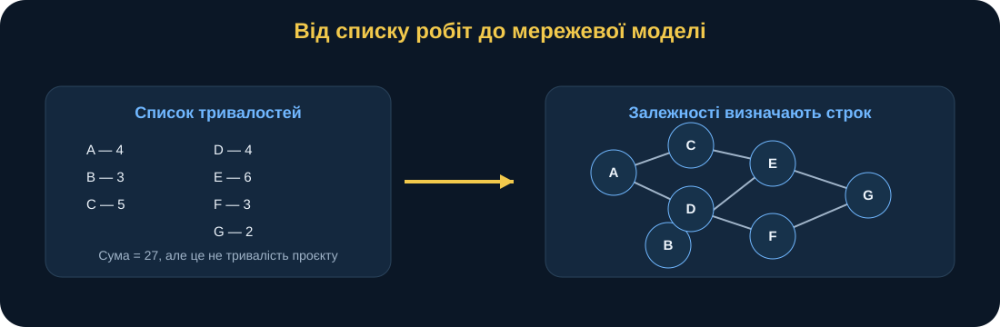
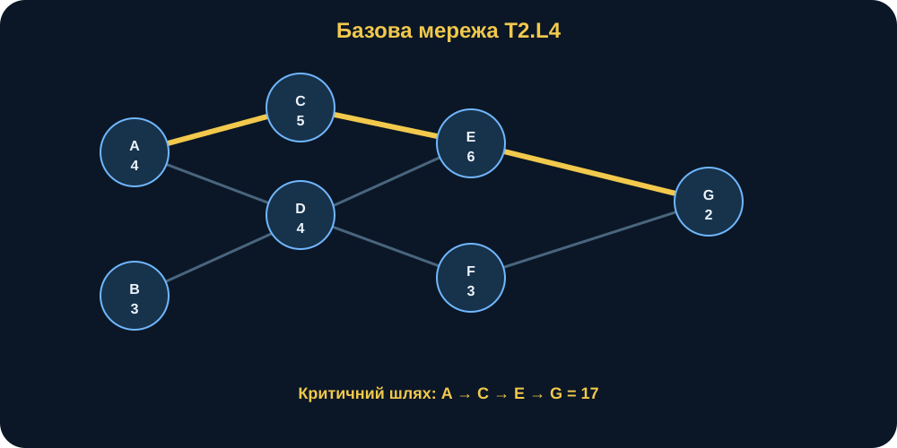
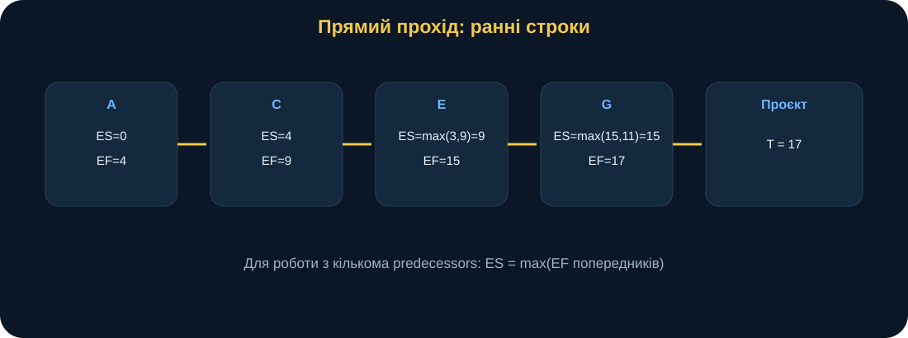
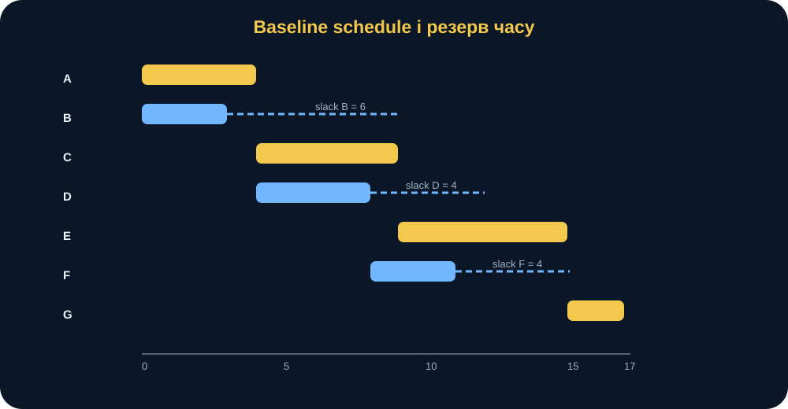
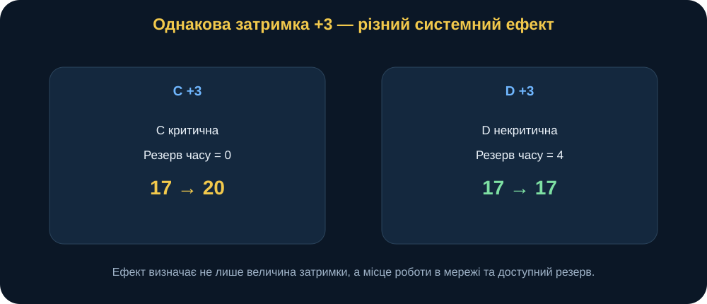
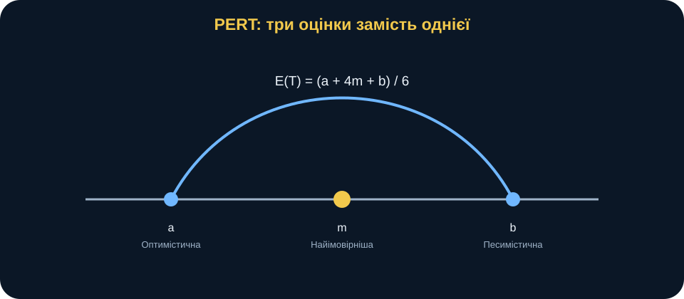
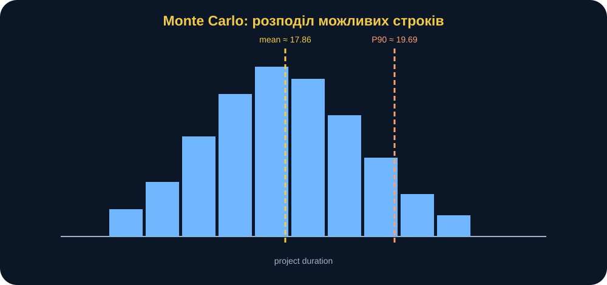
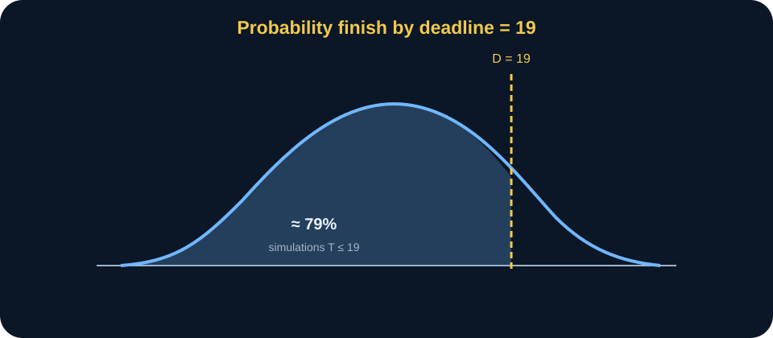

# MathModelingIT MiniBook T2.L4

## Математичне моделювання із застосуванням методів мережевого планування

### Критичний шлях, резерв часу і невизначені строки

> **Головна ідея книги:** у складному процесі не всі роботи однаково впливають на кінцевий строк. Мережеве планування дозволяє побачити структуру залежностей, знайти критичний шлях, виміряти резерви часу, дослідити наслідки затримок і перейти від одного «планового числа» до ймовірнісної оцінки строку.

---

## 0. Паспорт книги

**Код заняття:** T2.L4  
**Тема:** математичне моделювання із застосуванням методів мережевого планування  
**Рівень:** середній  
**Орієнтовний час читання:** 60–75 хвилин  
**Попередні знання:** базова алгебра, читання таблиць і графіків; бажано розуміти, що таке орієнтований граф.

Після цієї книги ви повинні вміти:

- перетворювати складний процес на мережу взаємозалежних робіт;
- розрізняти роботу, подію, залежність і тривалість;
- пояснювати, чому простого списку тривалостей недостатньо;
- обчислювати ранні та пізні строки;
- визначати резерв часу;
- пояснювати критичний шлях без магії «найдовшої роботи»;
- моделювати локальні затримки;
- розуміти, чому затримка однієї роботи не завжди затримує весь проєкт;
- переходити від CPM до PERT і Monte Carlo;
- інтерпретувати ймовірність завершення до заданого строку;
- переносити мережеву логіку на власне дослідження.

**Після книги:** відкрийте Lab T2.L4, перевірте baseline і delay scenarios, а потім перейдіть до Python-пакета заняття.

---

## 1. Сцена: сім робіт і одне неправильне запитання

Уявімо підготовку великого навчального заходу. Є кілька груп, які працюють паралельно. Одна команда готує основу задуму, інша — інформаційні матеріали, третя — технічне середовище, четверта — перевіряє готовність.

У таблиці записано сім робіт:

- A — 4 одиниці часу;
- B — 3;
- C — 5;
- D — 4;
- E — 6;
- F — 3;
- G — 2.

Якщо просто скласти всі тривалості, отримаємо:

\[
4+3+5+4+6+3+2=27.
\]

Чи означає це, що проєкт триватиме 27 одиниць часу?

Ні.

Частина робіт може виконуватися паралельно. Частина не може початися, доки не завершиться інша. У результаті загальний строк визначається не сумою всіх тривалостей, а **структурою залежностей**.

Тому правильне дослідницьке питання звучить так:

> **Яка послідовність взаємозалежних робіт реально визначає мінімальний строк завершення проєкту, які роботи мають резерв і що відбудеться зі строком, якщо окремі роботи затримаються?**

Це вже задача мережевого планування.

<figure>
  
  <figcaption><strong>Рис. 1.</strong> Однаковий набір тривалостей може давати різний загальний строк залежно від того, які роботи виконуються послідовно, а які — паралельно.</figcaption>
</figure>

---

## 2. Чому список робіт ще не є моделлю

Таблиця з назвами робіт і тривалістю відповідає лише на питання:

> скільки триває кожна робота?

Але не відповідає:

- що має бути завершено перед її початком;
- які роботи можуть початися одночасно;
- де є резерв;
- де виникне bottleneck;
- яка затримка локальна, а яка системна.

Мережева модель додає **відношення передування**.

У нашому baseline:

| Task | Duration | Predecessors |
|---|---:|---|
| A | 4 | — |
| B | 3 | — |
| C | 5 | A |
| D | 4 | A |
| E | 6 | B, C |
| F | 3 | D |
| G | 2 | E, F |

Цю таблицю потрібно читати не рядками, а логікою залежностей.

- A і B можуть стартувати одразу.
- C і D чекають завершення A.
- E не може початися, доки не завершені і B, і C.
- F чекає D.
- G чекає і E, і F.

Саме ці залежності утворюють структуру проєкту.

---

## 3. Граф як мова процесу

Проєкт представляємо орієнтованим графом:

\[
G=(V,E),
\]

де:

- \(V\) — множина робіт;
- \(E\) — множина відношень передування.

Якщо робота A повинна завершитися до початку C, маємо ребро:

\[
A\rightarrow C.
\]

Важливо: у цьому курсі вузол графа представляє **роботу**, а ребро — **залежність**.

<figure>
  
  <figcaption><strong>Рис. 2.</strong> Baseline network. Критичний шлях A → C → E → G проходить через роботи, які разом визначають мінімальну тривалість проєкту.</figcaption>
</figure>

### Що дає граф

Граф дозволяє відповісти на три принципові питання.

1. **Порядок:** що має бути раніше?
2. **Паралельність:** що можна робити одночасно?
3. **Вплив:** яка послідовність робіт обмежує весь проєкт?

Без графа ці питання приховані в текстових описах.

---

## 4. Чому мережа повинна бути DAG

Для класичного CPM мережа має бути орієнтованим ациклічним графом — DAG.

Ациклічність означає, що не можна пройти за стрілками і повернутися у вихідну роботу.

Наприклад, структура:

\[
A\rightarrow C\rightarrow E\rightarrow A
\]

створює цикл.

Що це означало б предметно?

- A повинна завершитися перед C;
- C — перед E;
- E — перед A.

Тобто A не може початися, доки сама не завершиться через ланцюг залежностей.

Такий план логічно суперечливий.

Тому перевірка DAG — не просто технічна функція NetworkX. Це **перевірка логічної узгодженості постановки**.

---

## 5. Forward pass: коли робота може початися найраніше

Починаємо з ранніх строків.

Для кожної роботи \(i\):

\[
EF_i=ES_i+d_i,
\]

де:

- \(ES_i\) — earliest start;
- \(EF_i\) — earliest finish;
- \(d_i\) — тривалість роботи.

Якщо робота не має predecessors:

\[
ES_i=0.
\]

Якщо має кілька predecessors:

\[
ES_i=\max_{j\in Pred(i)} EF_j.
\]

### Чому максимум

Припустимо, E залежить від B і C.

Якщо:

\[
EF_B=3,
\]

а:

\[
EF_C=9,
\]

то E не може початися в момент 3.

Вона повинна чекати довшу з передумов:

\[
ES_E=\max(3,9)=9.
\]

Це проста, але фундаментальна логіка мережевого планування:

> **робота з кількома predecessors може початися лише тоді, коли завершено останню необхідну передумову.**

---

## 6. Forward pass для baseline

Розрахуємо послідовно.

### A

Немає predecessors:

\[
ES_A=0,
\]

\[
EF_A=0+4=4.
\]

### B

Так само:

\[
ES_B=0,
\]

\[
EF_B=3.
\]

### C

Залежить від A:

\[
ES_C=EF_A=4,
\]

\[
EF_C=4+5=9.
\]

### D

Теж залежить від A:

\[
ES_D=4,
\]

\[
EF_D=8.
\]

### E

Залежить від B і C:

\[
ES_E=\max(EF_B,EF_C)=\max(3,9)=9.
\]

\[
EF_E=9+6=15.
\]

### F

Залежить від D:

\[
ES_F=8,
\]

\[
EF_F=11.
\]

### G

Залежить від E і F:

\[
ES_G=\max(15,11)=15.
\]

\[
EF_G=15+2=17.
\]

Отже:

\[
T_{project}=17.
\]

<figure>
  
  <figcaption><strong>Рис. 3.</strong> Forward pass поширює найраніші строки від початку мережі до завершення. У вузлах із кількома predecessors обирається максимальний ранній finish.</figcaption>
</figure>

---

## 7. Backward pass: наскільки пізно можна почати без затримки всього проєкту

Forward pass показує «як рано».

Backward pass — «як пізно».

Для кожної роботи:

\[
LS_i=LF_i-d_i,
\]

де:

- \(LF_i\) — latest finish;
- \(LS_i\) — latest start.

Для завершальної роботи G:

\[
LF_G=T_{project}=17.
\]

Отже:

\[
LS_G=17-2=15.
\]

Для попередньої роботи \(i\), якщо є кілька successors:

\[
LF_i=\min_{k\in Succ(i)} LS_k.
\]

### Чому мінімум

Якщо робота має двох successors, вона повинна завершитися достатньо рано, щоб **не затримати жодного** з них.

Тому обираємо найжорсткішу часову вимогу.

---

## 8. Резерв часу

Резерв, або slack:

\[
Slack_i=LS_i-ES_i.
\]

Еквівалентно:

\[
Slack_i=LF_i-EF_i.
\]

Інтерпретація дуже проста:

> **slack показує, наскільки роботу можна змістити в часі в поточному baseline-плані, не збільшуючи загальну тривалість проєкту.**

Для baseline:

- B: slack = 6;
- D: slack = 4;
- F: slack = 4;
- A, C, E, G: slack = 0.

<figure>
  
  <figcaption><strong>Рис. 4.</strong> Критичні роботи не мають резерву. Некритичні роботи B, D і F мають часовий простір, який може поглинати частину локальних затримок.</figcaption>
</figure>

---

## 9. Критична робота — не обов’язково найдовша

Це одна з найтиповіших помилок.

Робота E триває 6 — вона критична.

Але сама велика тривалість не робить роботу критичною.

Робота може бути довгою, але виконуватися паралельно з ще довшою послідовністю й мати резерв.

Критичність визначається не лише \(d_i\), а **місцем у мережі**.

У CPM робота критична, якщо:

\[
Slack_i=0.
\]

У baseline критичні:

\[
A,C,E,G.
\]

Вони утворюють шлях:

\[
A\rightarrow C\rightarrow E\rightarrow G.
\]

Його тривалість:

\[
4+5+6+2=17.
\]

Саме вона дорівнює загальній тривалості проєкту.

---

## 10. Критичний шлях як структурне обмеження

Критичний шлях часто описують як «найдовший шлях у мережі».

Це математично коректно, але для інтерпретації корисніше сказати інакше:

> **критичний шлях — це послідовність залежних робіт, яка в поточній моделі не має сукупного часово́го запасу і тому визначає мінімально можливий строк завершення проєкту.**

Це вже не просто алгоритмічний факт.

Це пояснення механізму.

Якщо затримати роботу критичного шляху й не компенсувати це іншою зміною, загальний строк зсувається.

Але навіть тут треба бути обережним: після зміни тривалостей може змінитися сама структура критичного шляху.

---

## 11. Delay experiment: C +3

Baseline:

\[
d_C=5.
\]

Затримка:

\[
\Delta d_C=3.
\]

Нова тривалість:

\[
d_C'=8.
\]

Оскільки C критична, її finish зміщується.

Baseline:

\[
EF_C=9.
\]

Після затримки:

\[
EF_C'=12.
\]

E тепер може початися не в 9, а в 12:

\[
ES_E'=12.
\]

Далі:

\[
EF_E'=18,
\]

\[
EF_G'=20.
\]

Отже:

\[
T_{project}'=20.
\]

Зміна:

\[
\Delta T=3.
\]

Критичний шлях залишається:

\[
A\rightarrow C\rightarrow E\rightarrow G.
\]

---

## 12. Delay experiment: D +3

Baseline:

\[
d_D=4,
\]

slack D:

\[
Slack_D=4.
\]

Додаємо:

\[
\Delta d_D=3.
\]

Нова тривалість:

\[
d_D'=7.
\]

F почнеться на 3 одиниці пізніше.

Але гілка D→F все одно завершиться до того, як G звільнить гілка E.

Тому:

\[
T_{project}'=17.
\]

Локальна затримка існує.

Системної затримки немає.

<figure>
  
  <figcaption><strong>Рис. 5.</strong> Однакова затримка +3 має різний наслідок. На критичній роботі C вона напряму збільшує строк проєкту; на D поглинається baseline-резервом.</figcaption>
</figure>

---

## 13. Чому slack = 4 не означає «можна гарантовано затримати на 4»

Фраза:

> D має slack 4.

Коректна лише **для конкретного baseline-плану**.

Вона не означає:

> D за будь-яких інших змін гарантовано може затриматися на 4.

Чому?

Бо slack залежить від:

- тривалостей інших робіт;
- структури залежностей;
- того, які роботи затрималися одночасно;
- того, чи змінився критичний шлях.

Якщо одночасно змінити E, F або інші роботи, резерв D може змінитися.

Отже:

> **slack — це властивість поточного сценарію мережі, а не незмінна властивість роботи.**

Це дуже важливе методологічне уточнення.

---

## 14. Мережева модель як причинна схема

Граф корисний не тільки для строків.

Він змушує чітко записати твердження:

> «робота X не може початися до завершення Y».

Це вже модель залежності.

Але не кожна стрілка автоматично є причинністю у строгому науковому сенсі.

Іноді стрілка означає:

- технологічну необхідність;
- логічний порядок;
- адміністративну послідовність;
- правило організації;
- обмеження доступу до результату попередньої роботи.

Тому при перенесенні на дисертаційне дослідження потрібно пояснювати **семантику залежності**.

Чому саме A→C?

Що фізично, логічно або організаційно не дозволяє C початися раніше?

---

## 15. Коли CPM достатній

CPM добре працює, коли:

- набір робіт відомий;
- dependencies відомі;
- тривалості можна вважати детермінованими;
- ресурси не створюють додаткових конфліктів;
- нас цікавить календарна структура та резерви.

Це сильна baseline-модель.

Але реальні тривалості часто невизначені.

Робота, оцінена як «4 години», іноді займає 3, іноді 6.

Тоді одного \(d_i\) недостатньо.

---

## 16. PERT: три оцінки замість однієї

Для кожної роботи задаємо:

- \(a\) — optimistic;
- \(m\) — most likely;
- \(b\) — pessimistic.

Класична PERT-оцінка очікуваної тривалості:

\[
E(T)=\frac{a+4m+b}{6}.
\]

Оцінка дисперсії:

\[
Var(T)=\left(\frac{b-a}{6}\right)^2.
\]

### Чому most likely має вагу 4

PERT робить \(m\) центральною оцінкою, але дозволяє врахувати асиметрію між optimistic і pessimistic межами.

Формула:

\[
\frac{a+4m+b}{6}
\]

не є універсальним законом природи.

Це модель оцінювання.

Її корисність залежить від того, наскільки осмислено задані \(a,m,b\).

<figure>
  
  <figcaption><strong>Рис. 6.</strong> PERT замінює одну детерміновану тривалість на трійку optimistic–most likely–pessimistic і тим самим робить невизначеність явною.</figcaption>
</figure>

---

## 17. Найскладніше в PERT — не формула

Формулу легко обчислити.

Складніше відповісти:

- звідки взялося optimistic значення;
- чому most likely саме таке;
- що означає pessimistic;
- чи не занадто вузький діапазон;
- чи не змішуємо ми «рідкісний екстремум» і «реалістичний песимістичний сценарій».

Якщо \(a,m,b\) довільні, красивий PERT-розрахунок лише формалізує довільність.

Тому якість невизначеної моделі починається не з Monte Carlo, а з **якості оцінок параметрів**.

---

## 18. Від PERT до Beta-PERT

У Python-пакеті заняття тривалості генеруються з Beta-PERT розподілу.

Ідея проста:

- значення обмежене між \(a\) і \(b\);
- найбільша концентрація — поблизу \(m\);
- форма гладка;
- можна багаторазово генерувати правдоподібні тривалості.

Це дозволяє замість одного проєкту створити тисячі можливих реалізацій.

Для кожної симуляції:

1. генеруємо тривалості всіх робіт;
2. повторно обчислюємо CPM;
3. записуємо project duration;
4. записуємо critical path.

Це принципово важливо:

> **критичний шлях у stochastic model не задається один раз назавжди — він може змінюватися між симуляціями.**

---

## 19. Monte Carlo: не одне майбутнє, а багато можливих

Baseline deterministic CPM дає:

\[
T=17.
\]

Monte Carlo ставить інше питання:

> якщо тривалості невизначені в заданих межах, який розподіл можливих строків завершення ми отримаємо?

У baseline курсу:

- \(n=3000\);
- seed = 2026;
- mean project duration ≈ 17.86;
- P90 ≈ 19.69;
- \(P(T\le19)\approx0.79\);
- домінуючий critical path — A→C→E→G.

<figure>
  
  <figcaption><strong>Рис. 7.</strong> Замість одного числа 17 stochastic model формує розподіл можливих строків. Це дозволяє говорити про quantiles і deadline probability.</figcaption>
</figure>

---

## 20. Mean, P50, P80, P90 — це різні питання

Середнє:

\[
E[T]
\]

відповідає:

> який строк є середнім у великій кількості подібних реалізацій?

P50:

> 50% simulated outcomes не перевищують це значення.

P90:

> 90% simulated outcomes не перевищують це значення.

Це різні характеристики.

Якщо P90 ≈ 19.69, це не означає:

> проєкт завершиться за 19.69.

Це означає:

> у межах заданої stochastic model приблизно 90% симуляцій мають строк не більше 19.69.

---

## 21. Probability finish by deadline

Нехай deadline:

\[
D=19.
\]

Тоді оцінюємо:

\[
P(T\le D).
\]

У baseline:

\[
P(T\le19)\approx0.79.
\]

Інтуїтивно:

> приблизно 79% simulated project realizations завершилися до або в момент 19.

Це набагато інформативніше, ніж фраза:

> «очікуваний строк 17.86».

Бо deadline probability прямо пов’язує модель із рішенням.

<figure>
  
  <figcaption><strong>Рис. 8.</strong> Deadline probability — це частка simulated outcomes, які потрапили ліворуч від заданої межі D=19.</figcaption>
</figure>

---

## 22. Чому probability ≠ гарантія

Якщо модель дала:

\[
P(T\le19)=0.79,
\]

не можна писати:

> існує 79% реальна гарантія завершення до 19.

Коректніше:

> за заданими PERT-припущеннями, Beta-PERT sampling scheme, network structure і незалежними генераціями модель оцінює частку simulated completions до 19 приблизно як 0.79.

Причини обережності:

- \(a,m,b\) можуть бути неточні;
- залежності можуть бути неповними;
- реальні тривалості можуть бути корельовані;
- resource conflicts не моделюються;
- структура мережі може змінюватися;
- sample model не дорівнює реальності.

---

## 23. Критичний шлях у stochastic model

У deterministic CPM critical path один:

\[
A\rightarrow C\rightarrow E\rightarrow G.
\]

У Monte Carlo різні тривалості можуть зробити іншу гілку довшою.

Тому корисно рахувати frequency of critical paths.

Це дозволяє відповісти:

- який шлях найчастіше визначає строк;
- чи існує один домінуючий bottleneck;
- чи критичність розподілена між кількома маршрутами.

Це важливіше за просте повторення baseline critical path.

---

## 24. Python без страху: baseline CPM

Концептуально workflow такий:

~~~python
tasks = load_tasks()
duration, schedule, path = cpm_schedule(tasks)

print(duration)
print(path)
print(schedule[["task", "ES", "EF", "LS", "LF", "slack"]])
~~~

Очікуваний контроль:

~~~text
duration = 17
path = A -> C -> E -> G
~~~

Це важлива дисципліна:

> перед запуском коду знати хоча б один контрольний результат.

---

## 25. Python без страху: delay scenario

~~~python
delayed = apply_delay(tasks, "C", 3)
duration, schedule, path = cpm_schedule(delayed)

assert duration == 20
~~~

Для D:

~~~python
delayed = apply_delay(tasks, "D", 3)
duration, _, _ = cpm_schedule(delayed)

assert duration == 17
~~~

Ці два сценарії разом дають сильнішу інтуїцію, ніж десяток абстрактних визначень slack.

---

## 26. Python без страху: Monte Carlo

~~~python
results, critical_freq = monte_carlo_project(
    tasks,
    pert,
    n=3000,
    seed=2026,
)

p = deadline_probability(results, 19)
~~~

Тут seed має методологічне значення.

Якщо двічі запустити той самий stochastic experiment з однаковим seed, ми повинні отримати той самий набір pseudo-random draws.

Це допомагає reproducibility.

---

## 27. Verification checklist

Перед довірою до результату перевірте:

### Структура

- task identifiers унікальні;
- predecessors існують;
- граф є DAG;
- немає негативних durations.

### Baseline

\[
T=17.
\]

Critical path:

\[
A\rightarrow C\rightarrow E\rightarrow G.
\]

Slack:

\[
Slack_B=6,
\]

\[
Slack_D=4,
\]

\[
Slack_F=4.
\]

### Delay

\[
C+3\Rightarrow T=20.
\]

\[
D+3\Rightarrow T=17.
\]

### Stochastic

Однаковий seed → відтворюваний Monte Carlo.

Це не просто тести коду.

Це формалізовані твердження про те, що ми очікуємо від моделі.

---

## 28. Зламай модель

Найцікавіша частина — знайти, де CPM/PERT перестає бути достатнім.

### Failure 1. Цикл

Якщо:

\[
A\rightarrow C\rightarrow E\rightarrow A,
\]

мережа логічно неможлива.

### Failure 2. Невідомий predecessor

Якщо C залежить від X, якого немає в моделі, план неповний.

### Failure 3. Негативна тривалість

\[
d_i<0
\]

не має змістовної інтерпретації в цій постановці.

### Failure 4. Resource constraints

CPM припускає, що роботи можуть виконуватися паралельно, якщо dependencies дозволяють.

Але що, якщо B і D потребують одного й того самого обмеженого ресурсу?

Тоді граф технологічних залежностей недостатній.

Потрібна resource-constrained project scheduling model.

### Failure 5. Корельовані затримки

Monte Carlo може генерувати тривалості робіт незалежно.

Але в реальному процесі одна причина може одночасно сповільнити кілька робіт.

Наприклад, спільна технічна проблема може збільшити B, D і F разом.

Тоді незалежне sampling занижує системний ризик.

### Failure 6. Неправильна структура залежностей

Навіть ідеальні durations не врятують модель, якщо ми забули критичну залежність.

---

## 29. Коли потрібна складніша модель

Мережеву модель можна розширювати.

### Якщо є resource conflicts

Додати resource constraints.

### Якщо dependencies імовірнісні

Розглянути stochastic network structure.

### Якщо тривалості корельовані

Моделювати joint distributions.

### Якщо робота може повторюватися

Проста DAG-модель вже може бути недостатньою.

### Якщо важлива вартість

Додати time-cost trade-off.

### Якщо є управлінські рішення

Можна моделювати alternatives та policy decisions.

Головний принцип той самий:

> **не ускладнювати модель до появи чіткої причини.**

---

## Поглиблення: topological order — правильний порядок обчислення

У DAG не існує циклів, тому роботи можна розташувати в **topological order**: кожен predecessor стоїть раніше за successor.

Для нашої мережі один можливий порядок:

\[
A,\ B,\ C,\ D,\ E,\ F,\ G.
\]

Але він не є єдиним.

Наприклад, A і B незалежні на старті, тому порядок:

\[
B,\ A,\ D,\ C,\ F,\ E,\ G
\]

також може бути topologically valid, якщо кожна залежність зберігається.

Це важлива відмінність:

> topological order не є календарним планом і не означає, що роботи виконуються строго одна за одною.

Він лише гарантує:

> коли алгоритм переходить до певної роботи, всі її predecessors уже були опрацьовані.

Саме тому forward pass зручно реалізувати через topological sorting.

### Чому це важливо для Python

У коді:

~~~python
topo = list(nx.topological_sort(G))
~~~

далі можна обчислювати:

~~~python
for task in topo:
    ES[task] = max(EF[p] for p in predecessors)
~~~

Якщо ж граф містить цикл, topological order не існує.

Це ще один спосіб побачити, чому cycle — не просто software exception, а логічна суперечність у моделі процесу.

---

## Поглиблення: повна baseline-таблиця CPM

Корисно бачити не лише duration і critical path, а весь schedule.

Для baseline:

| Task | d | ES | EF | LS | LF | Slack | Critical |
|---|---:|---:|---:|---:|---:|---:|---|
| A | 4 | 0 | 4 | 0 | 4 | 0 | yes |
| B | 3 | 0 | 3 | 6 | 9 | 6 | no |
| C | 5 | 4 | 9 | 4 | 9 | 0 | yes |
| D | 4 | 4 | 8 | 8 | 12 | 4 | no |
| E | 6 | 9 | 15 | 9 | 15 | 0 | yes |
| F | 3 | 8 | 11 | 12 | 15 | 4 | no |
| G | 2 | 15 | 17 | 15 | 17 | 0 | yes |

Ця таблиця дає значно більше, ніж просто:

\[
T=17.
\]

Вона показує **часову геометрію проєкту**.

### Як читати B

B може початися в 0.

Ранній finish:

\[
EF_B=3.
\]

Але E чекає C до моменту 9.

Тому B може бути зміщена так, щоб завершитися аж у 9:

\[
LF_B=9.
\]

Відповідно:

\[
LS_B=6.
\]

І:

\[
Slack_B=6.
\]

Це не означає, що B «неважлива».

Це означає, що в поточній мережі її раннє завершення не визначає момент старту E, бо C завершується пізніше.

### Як читати D і F

D завершується baseline у 8.

F завершується в 11.

А G все одно чекає E до 15.

Тому гілка:

\[
A\rightarrow D\rightarrow F
\]

має сукупний простір до моменту 15.

Саме звідси виникає slack.

---

## Поглиблення: резерв належить не роботі «в абсолюті»

Розглянемо вислів:

> D має резерв 4.

Це скорочення.

Повніше:

> У baseline network із поточними durations і dependencies D має total slack 4 відносно current project duration 17.

Якщо зміниться C або E, зміниться «часова стіна», відносно якої визначається резерв гілки D→F.

Тому slack — **scenario-dependent output**.

Це особливо важливо в research transfer.

Якщо ад’юнкт переносить CPM на власний процес і записує:

> «етап X має резерв 2 дні»,

то потрібно додати:

> за baseline durations та baseline dependency structure.

Без цього висновок звучить сильніше, ніж підтримує модель.

---

## Поглиблення: поріг, після якого D стає системно важливою

Baseline для гілки D→F:

\[
A=4,\quad D=4,\quad F=3.
\]

Сумарний шлях:

\[
4+4+3=11.
\]

Гілка A→C→E до моменту об’єднання перед G має:

\[
4+5+6=15.
\]

Різниця:

\[
15-11=4.
\]

Саме це пояснює slack гілки D→F.

Якщо D затримати на 3:

\[
11+3=14<15.
\]

Project duration не зміниться.

Якщо D затримати на 4:

\[
11+4=15.
\]

Гілки зрівняються.

Якщо D затримати на 5:

\[
11+5=16>15.
\]

Тепер перед G уже довше чекати гілку D→F.

Отже, після перевищення baseline slack може:

- змінитися project duration;
- з’явитися інший critical path;
- або виникнути кілька critical paths однакової довжини.

Це сильніша інтуїція, ніж проста фраза «slack = 4».

---

## Поглиблення: кілька критичних шляхів

У навчальному baseline один домінуючий шлях:

\[
A\rightarrow C\rightarrow E\rightarrow G.
\]

Але мережа може мати два або більше шляхів однакової максимальної тривалості.

Тоді:

- кілька гілок мають zero slack;
- локальна затримка в будь-якій із них може впливати на строк;
- управлінська гнучкість зменшується.

У проєкті з кількома near-critical paths варто аналізувати не лише strict zero slack, а й **малий резерв**.

Наприклад, slack 0.2 у моделі з uncertainty durations може практично означати майже критичну роботу.

Тому deterministic label:

> critical / noncritical

іноді занадто грубий.

Stochastic critical-path frequency дає багатшу картину.

---

## Поглиблення: deterministic CPM і stochastic network — це різні запитання

CPM baseline відповідає:

> який мінімальний строк за заданих fixed durations?

Monte Carlo відповідає:

> який розподіл строків виникає, якщо durations випадкові за заданими distributions?

Це різні питання.

Тому якщо:

\[
T_{CPM}=17
\]

і:

\[
E[T_{MC}]\approx17.86,
\]

це не суперечність.

У stochastic runs деякі durations:

- менші за baseline;
- більші;
- змінюють relative path lengths;
- іноді перемикають critical path.

Отже, stochastic result не «уточнює число 17» у простому сенсі.

Він змінює тип відповіді:

> з точкового результату на розподіл.

---

## Поглиблення: звідки береться емпірична ймовірність

Припустимо, виконано:

\[
n=3000
\]

симуляцій.

Для кожної маємо duration:

\[
T_1,T_2,\ldots,T_{3000}.
\]

Deadline:

\[
D=19.
\]

Тоді оцінка:

\[
\hat P(T\le19)=
\frac{1}{n}
\sum_{k=1}^{n}
I(T_k\le19),
\]

де indicator:

\[
I(condition)=
\begin{cases}
1,& condition\ true,\\
0,& condition\ false.
\end{cases}
\]

Тобто ми буквально рахуємо:

> скільки simulated projects завершилися не пізніше 19,

і ділимо на кількість simulations.

Це проста емпірична частка.

Її сила — прозорість.

Її обмеження — вона умовна відносно всієї stochastic model.

---

## Поглиблення: P50, P80, P90 як operational language моделі

Quantiles зручні, бо дозволяють говорити не лише про average.

Наприклад:

\[
P90\approx19.69.
\]

Це означає:

> приблизно 90% simulated durations не перевищують 19.69.

Але не означає:

> 19.69 — гарантовано безпечний строк.

Якщо decision-maker потребує більш conservative planning point, P90 може бути кориснішим за mean.

Якщо задача дослідницька, варто показувати кілька quantiles:

- P50;
- P80;
- P90.

Тоді читач бачить форму uncertainty не лише через одну statistic.

---

## Поглиблення: залежність між тривалостями

Базовий Monte Carlo часто зручно починати з independent samples.

Але в реальному процесі durations можуть бути пов’язані.

Наприклад, одна зовнішня причина може одночасно впливати на:

- B;
- D;
- F.

Тоді:

\[
Corr(T_B,T_D)>0.
\]

Якщо ігнорувати correlation, model може недооцінити probability simultaneous delays.

Це важливий Research Transfer question:

> чи існує shared cause, що впливає на кілька етапів одночасно?

Якщо так, independent Beta-PERT — baseline, а не фінальна модель.

---

## Поглиблення: resource constraints — приховане припущення CPM

У CPM дві роботи можуть виконуватися паралельно, якщо між ними немає dependency.

Але припустимо:

- C і D формально незалежні;
- обидві потребують одного й того самого specialist;
- specialist може працювати лише над однією задачею.

Тоді фактичної паралельності немає.

Мережева модель dependencies каже:

> можна паралельно.

Resource reality каже:

> не можна.

Це вже інша задача — resource-constrained project scheduling.

Отже, один із ключових assumptions CPM:

> sufficient resources are available to realize allowed parallelism.

Це припущення обов’язково потрібно перевіряти при перенесенні моделі.

---

## Поглиблення: verification, validation і calibration в мережевій моделі

### Verification

Чи правильно реалізований CPM?

Приклади:

- forward pass;
- backward pass;
- slack;
- critical path;
- DAG rejection.

### Calibration

Чи відповідають duration estimates даним?

Наприклад, чи справді:

\[
d_C=5?
\]

Це вже питання оцінювання параметра.

### Validation / adequacy

Чи достатньо network structure описує реальний процес?

Наприклад:

- чи всі dependencies враховані;
- чи немає resource conflicts;
- чи адекватна assumption independence;
- чи не змінюється workflow залежно від стану.

Можна мати:

- ідеально verified code;
- добре calibrated durations;
- але structurally inadequate network.

Ці рівні не можна змішувати.

---

## Поглиблення: сценарний дизайн для T2.L4

Сильний експеримент не складається з випадкового збільшення duration.

Корисно спланувати набір:

| Run | Зміна | Очікування | Що перевіряємо |
|---|---|---|---|
| Baseline | none | T=17 | контроль |
| Critical delay | C+3 | T=20 | zero-slack effect |
| Noncritical small | D+3 | T=17 | slack absorption |
| Boundary | D+4 | T≈17 | exhaustion of slack |
| Beyond slack | D+5 | T>17 | path competition |
| Stochastic | PERT/MC | distribution | uncertainty |

Ця таблиця перетворює «покрутимо параметри» на planned computational experiment.

---

## Поглиблення: рівні допустимого висновку

### Рівень 1 — computational fact

> Baseline CPM duration = 17.

### Рівень 2 — structural interpretation

> За поточної network structure A→C→E→G визначає project duration.

### Рівень 3 — scenario statement

> У baseline D має slack 4; затримка +3 поглинається резервом.

### Рівень 4 — stochastic statement

> За заданими Beta-PERT distributions та seed=2026 Monte Carlo дає mean близько 17.86 та приблизно 0.79 simulated probability завершення до 19.

### Надмірний рівень

> Реальний процес із імовірністю 79% завершиться до 19.

Це твердження сильніше за модель.

Allowed conclusion повинен зберігати умови.

---

## Поглиблення: reproducibility package мережевого експерименту

Для наукової роботи недостатньо зберегти screenshot histogram.

Мінімальний package:

- tasks.csv;
- pert.csv;
- model code;
- seed;
- number of simulations;
- deadline;
- software versions;
- output table;
- critical path frequency;
- figures;
- metadata;
- commit reference.

Тоді інший дослідник може не лише побачити картинку, а відтворити computational experiment.

---

## 30. Типові помилки мислення

### Помилка 1. «Найдовша робота є критичною»

Не обов’язково.

Критичність — властивість положення в мережі.

### Помилка 2. «Slack 4 означає гарантований запас 4»

Ні.

Це baseline slack за поточних інших параметрів.

### Помилка 3. «Critical path один назавжди»

Не в stochastic model.

### Помилка 4. «Mean duration — це плановий строк з гарантією»

Ні.

Mean — лише одна характеристика розподілу.

### Помилка 5. «P90 — це найгірший випадок»

Ні.

10% simulated outcomes можуть бути більшими за P90.

### Помилка 6. «Monte Carlo компенсує погані inputs»

Ні.

Тисячі симуляцій поганих припущень дають дуже точну картину поганої моделі.

---

## 31. Predict: спочатку думка, потім запуск

Перед Lab дайте відповіді.

1. Чи змінить D+3 загальний строк?
2. Чи змінить C+3?
3. Чому дві однакові затримки мають різний ефект?
4. Якщо D затримати на 5, чи достатньо baseline slack=4 для прогнозу?
5. Чи може critical path змінитися?

Правильна відповідь повинна посилатися на **структуру мережі та slack**, а не на інтуїцію «ця робота здається важливою».

---

## 32. Від MiniBook до Lab

У browser Lab T2.L4 ви працюватимете з:

- baseline network;
- task delay selector;
- delay amount;
- project duration;
- critical path;
- slack visualization.

Обов’язково перевірте:

\[
baseline=17,
\]

\[
C+3=20,
\]

\[
D+3=17.
\]

Пройдіть цикл:

### Predict

Запишіть очікування.

### Run

Застосуйте затримку.

### Explain

Поясніть через slack і network position.

### Break

Знайдіть затримку, після якої некритична робота починає впливати на project duration.

### Transfer

Перетворіть частину власного дослідження на DAG.

[**Відкрити інтерактивну Lab T2.L4 →**](../../index.html#network)

---

## 33. Від Lab до Python

Browser Lab показує контрольовану детерміновану частину CPM.

Python package розширює її:

- повний schedule;
- verification;
- PERT;
- Beta-PERT;
- Monte Carlo;
- deadline probability;
- critical path frequency;
- reproducible seed.

Тобто:

> **Lab дає інтуїцію, Python дає повний обчислювальний експеримент.**

---

## 34. Research Transfer

Тепер замініть навчальний проєкт на власний дослідницький процес.

Спробуйте виділити 5–10 етапів.

Для кожного запитайте:

- що це за робота;
- скільки вона триває;
- що повинно бути завершено перед нею;
- які роботи можуть виконуватися паралельно;
- де є невизначеність;
- що означатиме deadline;
- який результат буде корисним.

Шаблон:

~~~text
Research question:

Project/process:

Tasks:

Dependencies:

Deterministic durations:

Uncertain durations:

Baseline critical path:

Slack / bottlenecks:

Delay scenarios:

Deadline:

Monte Carlo assumptions:

Verification:

Limitations:

Allowed conclusion:
~~~

### Приклад дослідницького перенесення

Умовно, дисертаційний експеримент може складатися з:

- підготовки даних;
- валідації даних;
- реалізації baseline;
- реалізації alternative model;
- серії експериментів;
- аналізу;
- перевірки;
- оформлення результатів.

Мережева модель дозволяє побачити не лише календар, а **логіку залежностей дослідження**.

---

## 35. Мінісловник T2.L4

### DAG

Directed Acyclic Graph — орієнтований граф без циклів.

### Predecessor

Робота, яку потрібно завершити до початку іншої.

### Successor

Робота, що залежить від попередньої.

### ES

Earliest Start — найраніший допустимий початок.

### EF

Earliest Finish.

\[
EF=ES+d.
\]

### LS

Latest Start — найпізніший початок без збільшення baseline project duration.

### LF

Latest Finish.

### Slack

Часовий резерв:

\[
Slack=LS-ES.
\]

### Critical task

Робота з нульовим slack у поточному сценарії.

### Critical path

Послідовність залежних робіт, яка визначає project duration.

### PERT

Метод оцінювання невизначеної тривалості через optimistic, most likely, pessimistic values.

### Monte Carlo

Багаторазове моделювання випадкових реалізацій параметрів.

### Deadline probability

Частка simulated project durations, що не перевищують deadline.

### Critical path frequency

Частота появи певного critical path у stochastic simulations.

---

## 36. Мініексперимент для самоперевірки

### Питання 1

Якщо робота має:

\[
ES=4,
\]

\[
LS=9,
\]

то:

\[
Slack=5.
\]

Що це означає?

У baseline вона має часовий резерв 5.

### Питання 2

Чи означає це, що затримка +5 ніколи не вплине на строк?

Ні.

Лише в поточному сценарії та за незмінних інших умов.

### Питання 3

Якщо deterministic duration = 17, а Monte Carlo mean ≈ 17.86, чи є CPM неправильним?

Ні.

Це різні моделі:

- CPM baseline використовує точкові durations;
- Monte Carlo враховує розподіл невизначених durations.

---

## 37. Одна сторінка підсумку

### П’ять головних ідей

1. Строк проєкту визначає не сума всіх робіт, а структура залежностей.
2. Критичність визначається network position і slack, а не лише duration.
3. Delay effect залежить від того, де робота стоїть у мережі.
4. PERT робить невизначеність явною, Monte Carlo перетворює її на розподіл результатів.
5. Probability і quantiles — умовні характеристики моделі, а не гарантії реального строку.

### Три формули

\[
EF_i=ES_i+d_i.
\]

\[
Slack_i=LS_i-ES_i.
\]

\[
E(T)=\frac{a+4m+b}{6}.
\]

### Дві типові помилки

- «довга робота = критична робота»;
- «P90 = гарантований строк».

### Одне питання

> Якщо критичний шлях змінився після невеликої зміни durations, що це говорить про структурну стійкість плану?

### Наступний крок

У Lab виконайте C+3 і D+3, а в Python — Monte Carlo з seed=2026 та deadline=19.

---

## 38. Фінальна думка

Мережева модель навчає бачити процес не як список справ, а як **систему залежностей**.

У цьому і є її головна цінність.

CPM показує, де в baseline немає резерву.

PERT показує, що сама тривалість може бути невизначеною.

Monte Carlo показує, що майбутнє доцільно описувати не одним числом, а розподілом можливих результатів.

Але в усіх трьох випадках діє один принцип:

> **спочатку побудуйте зрозумілу структуру процесу, потім обчислюйте, а після обчислення обов’язково поверніться до припущень, які зробили результат можливим.**
