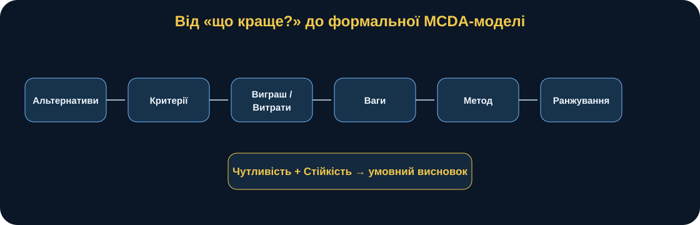
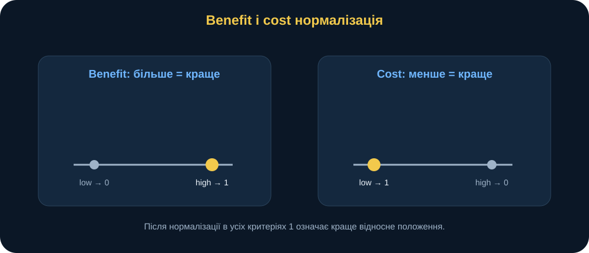
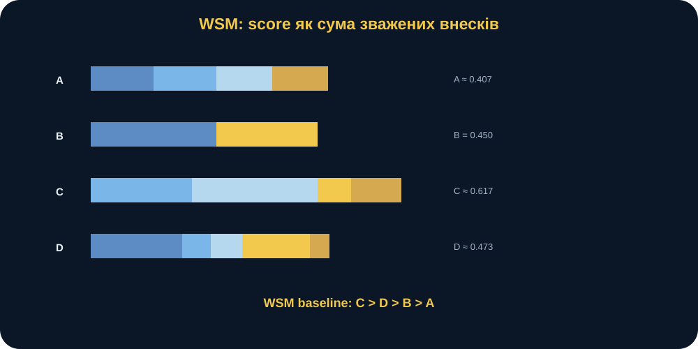
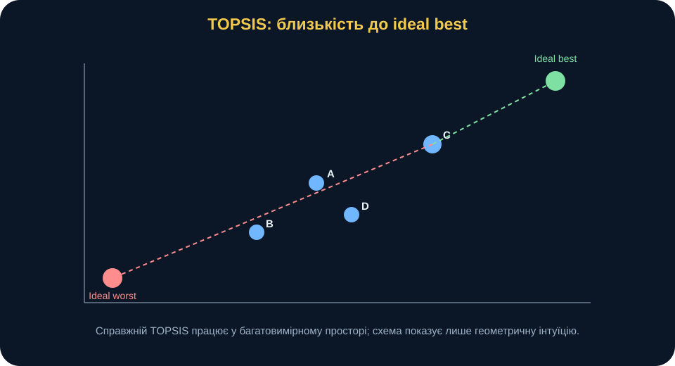
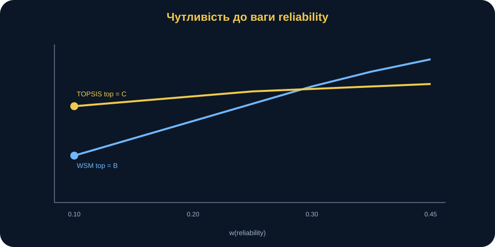
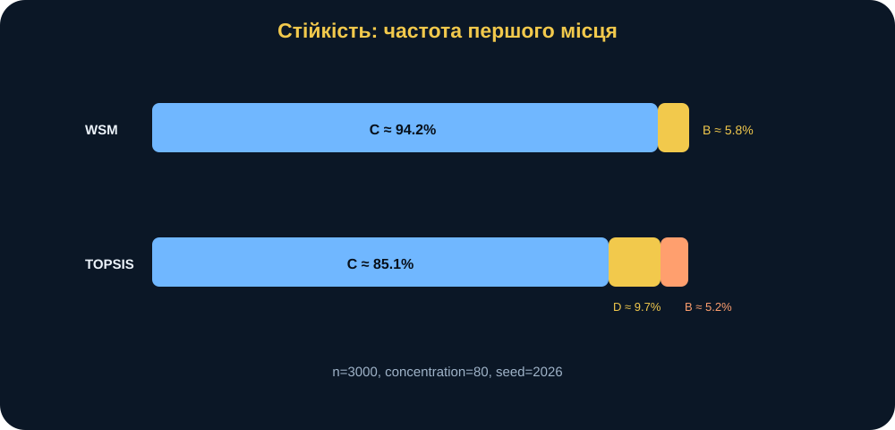
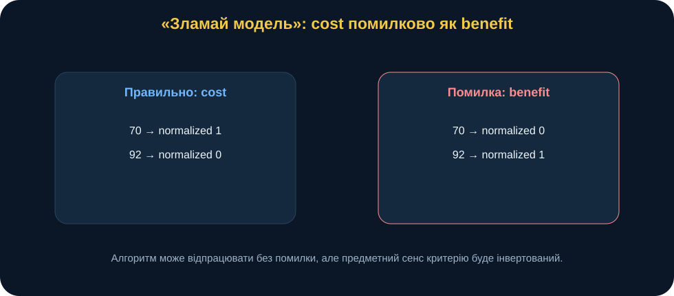
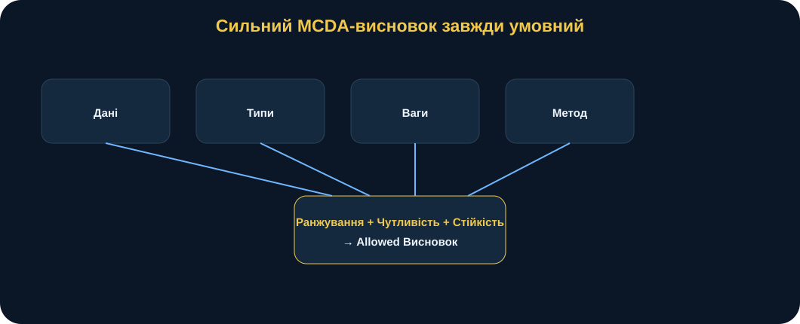

# MathModelingIT · Мінікнига T2.L5

## Засоби розв’язування задач множинного вибору

### Як обирати між альтернативами, не перетворюючи ваги на магію

> **Головна ідея книги:** багатокритеріальний вибір не відповідає на питання «що найкраще взагалі». Він формалізує умови, за яких певна альтернатива стає кращою за інші: за заданих критеріїв, типів виграш/вартість, ваг, методу нормалізації та способу агрегування. Тому хороший результат MCDA — не лише ранжування, а пояснення його стійкості й меж застосовності.

---

## 0. Паспорт книги

**Код заняття:** T2.L5 
**Тема:** засоби розв’язування задач множинного вибору 
**Рівень:** середній 
**Орієнтовний час читання:** 65–80 хвилин 
**Попередні знання:** базова алгебра, таблиці, відсотки, поняття середнього; програмування не обов’язкове.

Після цієї книги ви повинні вміти:

- формулювати задачу вибору через альтернативи, критерії, ваги;
- розрізняти виграш і вартість критерії;
- пояснювати, навіщо потрібна нормалізація;
- обчислювати і тлумачити WSM;
- пояснювати інтуїцію TOPSIS;
- розуміти, чому два методи можуть дати різний ранжування;
- проводити однофакторний аналіз чутливості;
- пояснювати аналіз стійкості для невизначених ваг;
- не робити висновок «об’єктивно найкраща альтернатива»;
- знаходити помилки типу «вартість як виграш»;
- переносити MCDA на власну дослідницьку задачу.

**Після книги:** відкрийте лабораторія T2.L5, змініть вагу надійність, порівняйте WSM/TOPSIS і сформулюйте умовний висновок.

---

## 1. Сцена: «Який варіант кращий?»

Уявімо синтетичний навчальний сценарій.

Група планування має обрати один із чотирьох технічних варіантів —, B, C або D — для підтримки навчального процесу. Ми навмисно не прив’язуємо приклад до реальних систем чи бойових спроможностей.

Кожен варіант має переваги й недоліки.

Один дешевший.

Інший швидше розгортається.

Третій надійніший.

Четвертий має більшу умовну спроможність.

Ще є ризик.

На нараді хтось запитує:

> «То який варіант найкращий?»

Це звучить природно, але математично питання неповне.

Найкращий **за яким критерієм**?

Що важливіше: вартість чи надійність?

Наскільки важливіше?

Чи вважаємо time витратним критерієм, де менше краще?

Що буде, якщо ваги трохи зміняться?

Чи дасть інший MCDA метод той самий ранжування?

Тому коректне дослідницьке питання:

> **Як змінюється ранжування альтернатив залежно від структури критеріїв, їхніх типів, ваг і методу агрегування, та наскільки стійким є висновок про перше місце?**

Саме з цього починається багатокритеріальне моделювання.

<figure>
 
 <figcaption><strong>Рис. 1.</strong> MCDA перетворює нечітке «що краще?» на явну систему: альтернативи → критерії → критерій типи → ваги → метод → ранжування → чутливість → умовний висновок.</figcaption>
</figure>

---

## 2. Чому одного критерію недостатньо

Якби нас цікавила лише ціна, задача була б простою:

> обрати найменший вартість.

Якби тільки надійність:

> обрати найбільшу надійність.

Але реальні рішення майже завжди багатокритеріальні.

У нашій синтетичний decision матриця:

| альтернатива | вартість | time | надійність | спроможність | ризик |
|---|---:|---:|---:|---:|---:|
| | 82 | 18 | 0.92 | 75 | 0.18 |
| B | 70 | 22 | 0.88 | 90 | 0.25 |
| C | 92 | 15 | 0.96 | 80 | 0.12 |
| D | 76 | 20 | 0.90 | 85 | 0.20 |

Жодна альтернатива не домінує очевидно за всім.

B найдешевша й має найвищу спроможність, але гірша за надійність, time та ризик.

C найдорожча, зате має найкращий time, надійність і ризик.

D — компроміс.

 — теж має власний профіль.

Отже, рішення потребує **правила компромісу**.

---

## 3. Формальна постановка

Нехай:

- \(A_i\) — альтернативи;
- \(C_j\) — критерії;
- \(x_{ij}\) — оцінка альтернативи \(i\) за критерієм \(j\);
- \(w_j\) — вага критерію.

Ваги задовольняють:

\[
w_j\ge0,
\]

\[
\sum_j w_j=1.
\]

У baseline:

\[
w_{cost}=0.25,
\]

\[
w_{time}=0.20,
\]

\[
w_{reliability}=0.25,
\]

\[
w_{capacity}=0.20,
\]

\[
w_{risk}=0.10.
\]

Сама сума 1 не робить ваги «правильними».

Вона лише робить їх нормованими.

Правильність або обґрунтованість ваг — предметне питання.

---

## 4. виграш і вартість: напрям має значення

Критерії бувають різного типу.

### виграш

Більше = краще.

У baseline:

- надійність;
- спроможність.

### вартість

Менше = краще.

У baseline:

- вартість;
- time;
- ризик.

Це принципово.

Якщо вартість помилково трактувати як виграш, модель почне винагороджувати дорожчі альтернативи.

Математично все може обчислитися без помилки.

Предметно результат буде абсурдним.

> **Тип критерію — це частина моделі, а не косметична мітка.**

---

## 5. Чому не можна просто скласти сирі значення

У таблиці критерії мають різні шкали.

Наприклад:

- вартість: десятки;
- time: десятки;
- надійність: близько 1;
- спроможність: десятки;
- ризик: дробові значення.

Якщо написати:

\[
82+18+0.92+75+0.18,
\]

ми змішаємо величини різної природи.

Більші числові шкали почнуть домінувати лише через одиниці вимірювання.

Тому перед агрегуванням потрібна **нормалізація**.

---

## 6. Min-max нормалізація для WSM

Для виграш-критерію:

\[
r_{ij}=
\frac{x_{ij}-\min_i x_{ij}}
{\max_i x_{ij}-\min_i x_{ij}}.
\]

Для вартість-критерію:

\[
r_{ij}=
\frac{\max_i x_{ij}-x_{ij}}
{\max_i x_{ij}-\min_i x_{ij}}.
\]

Після цього:

\[
0\le r_{ij}\le1,
\]

і в усіх критеріях:

> більше = краще.

Це дуже зручно.

<figure>
 
 <figcaption><strong>Рис. 2.</strong> Нормалізація переводить різні шкали у спільну [0,1]. Для виграш більші необроблений значення стають кращими; для вартість напрям інвертується.</figcaption>
</figure>

---

## 7. Приклад: вартість

необроблений вартість:

- = 82;
- B = 70;
- C = 92;
- D = 76.

Мінімум:

\[
70.
\]

Максимум:

\[
92.
\]

Оскільки вартість — вартість критерій:

\[
r_{A,cost}=
\frac{92-82}{92-70}
=
\frac{10}{22}
\approx0.455.
\]

Для B:

\[
r_{B,cost}=1.
\]

Для C:

\[
r_{C,cost}=0.
\]

Тобто найдешевша альтернатива отримала 1, найдорожча — 0.

Це відповідає логіці критерію.

---

## 8. Приклад: надійність

необроблений надійність:

- = 0.92;
- B = 0.88;
- C = 0.96;
- D = 0.90.

Оскільки надійність — виграш:

\[
r_{A,reliability}
=
\frac{0.92-0.88}{0.96-0.88}
=
0.5.
\]

Для C:

\[
r_{C,reliability}=1.
\]

Для B:

\[
r_{B,reliability}=0.
\]

Знову отримуємо шкалу, де 1 означає краще відносне положення серед розглянутих альтернатив.

---

## 9. Нормалізована baseline матриця

Для нашого набору:

| Альтернатива | вартість | час | надійність | спроможність | ризик |
|---|---:|---:|---:|---:|---:|
| | 0.455 | 0.571 | 0.500 | 0.000 | 0.538 |
| B | 1.000 | 0.000 | 0.000 | 1.000 | 0.000 |
| C | 0.000 | 1.000 | 1.000 | 0.333 | 1.000 |
| D | 0.727 | 0.286 | 0.250 | 0.667 | 0.385 |

Тепер критерії можна агрегувати.

Але навіть після нормалізації постає нове питання:

> яким способом?

---

## 10. Модель зваженої суми

WSM — найпростіший спосіб.

Для альтернативи \(i\):

\[
S_i=\sum_j w_j r_{ij}.
\]

Інтуїтивно:

1. нормалізуємо;
2. множимо кожен критерій на його вагу;
3. складаємо;
4. більше \(S_i\) → вище ранжування.

Це **лінійна компенсаторна модель**.

Сильний результат за одним критерієм може компенсувати слабкий за іншим.

---

## 11. WSM baseline для C

Для C:

\[
r_C=
(0,\ 1,\ 1,\ 0.333,\ 1).
\]

Ваги:

\[
w=
(0.25,\ 0.20,\ 0.25,\ 0.20,\ 0.10).
\]

Отже:

\[
S_C=
0\cdot0.25+
1\cdot0.20+
1\cdot0.25+
0.333\cdot0.20+
1\cdot0.10.
\]

\[
S_C\approx0.6167.
\]

Baseline ранжування WSM:

\[
C>D>B>A.
\]

Точні scores:

- C ≈ 0.6167;
- D ≈ 0.4733;
- B = 0.4500;
- ≈ 0.4068.

<figure>
 
 <figcaption><strong>Рис. 3.</strong> WSM оцінка є сумою зважених нормалізованих внесків. Один високий критерій значення може компенсувати інший низький.</figcaption>
</figure>

---

## 12. Що означає «компенсаторна модель»

Припустимо, альтернатива має високу надійність, але поганий вартість.

WSM дозволяє високій надійність частково компенсувати вартість.

Це не помилка.

Це **вбудована логіка методу**.

Але іноді предметна задача не дозволяє таку компенсацію.

Наприклад, може існувати hard обмеження:

> ризик не повинен перевищувати певного порога незалежно від інших переваг.

Тоді простий WSM без обмеження може бути непридатним.

Отже, перед вибором методу потрібно спитати:

> чи дозволяє предметна область компенсувати слабкість за одним критерієм силою за іншим?

---

## 13. TOPSIS: інша ідея «кращості»

TOPSIS працює інакше.

Він шукає альтернативу, яка:

- близька до ідеальний найкращий;
- далека від ідеальний worst.

Назва:

> **TOPSIS** — метод упорядкування переваг за близькістю до ідеального рішення.

Ідея геометрична.

Після нормалізації та зважування кожна альтернатива стає точкою в багатовимірному просторі критеріїв.

Створюємо дві умовні точки:

- ідеальний найкращий;
- ідеальний worst.

Потім вимірюємо відстані.

---

## 14. Векторна нормалізація TOPSIS

TOPSIS у нашому Python пакет використовує vector нормалізація.

Для критерію \(j\):

\[
z_{ij}=
\frac{x_{ij}}
{\sqrt{\sum_i x_{ij}^2}}.
\]

Потім:

\[
v_{ij}=w_j z_{ij}.
\]

Тобто спочатку виконується приведення масштабу, а потім — зважування.

Далі формуються ідеальний точки.

---

## 15. ідеальний найкращий і ідеальний worst

Для виграш критерій ідеальний найкращий — максимум weighted значення.

Для вартість критерій ідеальний найкращий — мінімум.

Відповідно ідеальний worst навпаки.

Для альтернативи \(i\):

\[
D_i^+
\]

— відстань до ідеальний найкращий.

\[
D_i^-
\]

— відстань до ідеальний worst.

Closeness коефіцієнт:

\[
C_i=
\frac{D_i^-}
{D_i^+ + D_i^-}.
\]

Чим більше \(C_i\), тим альтернатива:

- ближча до ідеальний найкращий;
- далі від ідеальний worst.

---

## 16. TOPSIS baseline

Для baseline:

- C: \(C_i\approx0.5869\);
-: ≈ 0.4830;
- D: ≈ 0.4719;
- B: ≈ 0.4307.

ранжування:

\[
C>A>D>B.
\]

Це відрізняється від WSM:

\[
C>D>B>A.
\]

Обидва методи ставлять C першою.

Але порядок інших альтернатив різний.

<figure>
 
 <figcaption><strong>Рис. 4.</strong> TOPSIS оцінює альтернативу через одночасну близькість до ідеальний найкращий і віддаленість від ідеальний worst. Це інша логіка, ніж лінійна сума WSM.</figcaption>
</figure>

---

## 17. Чому WSM і TOPSIS можуть не погоджуватися

Це не «баг».

Методи мають різні математичні визначення якості.

WSM питає:

> у якої альтернативи зважена сума нормалізованих оцінок найбільша?

TOPSIS питає:

> яка точка найкраще розташована відносно ідеальний найкращий і ідеальний worst?

Тому одна і та сама decision матриця може давати різний ранжування.

Це дуже важливий науковий сигнал.

> **Якщо висновок сильно залежить від методу, його треба формулювати обережніше.**

---

## 18. ранжування — функція не лише даних

Корисно записати:

\[
Ranking=
f(
Data,\ Types,\ Weights,\ Normalization,\ Method
).
\]

Тобто ранжування залежить від:

- decision матриця;
- виграш/вартість класифікація;
- ваги;
- нормалізація;
- aggregation метод.

Зміна будь-якого елемента може змінити висновок.

Це руйнує небезпечну ілюзію:

> «таблиця містить об’єктивний переможець».

Ні.

Таблиця містить дані.

Переможець виникає після додавання **моделі рішення**.

---

## 19. Ваги: числа з великим впливом

Baseline:

\[
w_{reliability}=0.25.
\]

Що це означає?

Не:

> надійність «об’єктивно становить 25% якості».

Коректніше:

> у цій MCDA модель надійність отримує 25% сумарної ваги.

Вага — це частина decision модель.

Її походження повинно бути обґрунтоване.

Можливі джерела:

- експертне оцінювання;
- пріоритети політики або управління;
- AHP або інші процедури;
- нормативні вимоги;
- оцінювання на основі даних;
- сценарний аналіз.

Найгірший варіант:

> «поставили 0.25, бо виглядало нормально».

---

## 20. аналіз чутливості: якщо вага трохи інша

Змінюємо вагу надійність від:

\[
0.10
\]

до:

\[
0.45.
\]

Інші ваги пропорційно перенормовуємо так, щоб:

\[
\sum_j w_j=1.
\]

Це one-factor вага чутливість.

Мета:

> з’ясувати, чи стабільне перше місце до зміни одного важливого припущення.

---

## 21. Що відбувається при надійність = 0.10

При:

\[
w_{reliability}=0.10
\]

WSM обирає:

\[
B.
\]

TOPSIS продовжує обирати:

\[
C.
\]

Це дуже інформативний результат.

Він говорить:

- WSM лідер чутливий до зниження надійність вага;
- TOPSIS у цьому сценарії стійкіший до тієї самої зміни;
- висновок про «переможця» залежить від метод.

<figure>
 
 <figcaption><strong>Рис. 5.</strong> При малих значеннях ваги надійність WSM може перейти від C до B, тоді як TOPSIS зберігає C. Це приклад method-dependent стійкість.</figcaption>
</figure>

---

## 22. Чому інші ваги потрібно перенормовувати

Якщо просто змінити надійність з 0.25 до 0.10 і залишити все інше без змін:

\[
\sum_j w_j<1.
\]

Тоді змінилася не лише відносна важливість надійність.

Змінився масштаб загальний вага.

У функції reweight_focus решта ваг пропорційно масштабуються:

\[
w'_k=
w_k
\frac{1-w'_{focus}}
{\sum_{j\ne focus}w_j}.
\]

Це зберігає:

\[
\sum_j w'_j=1.
\]

---

## 23. чутливість — не «покрутіть слайдер»

Сильний аналіз чутливості має питання.

Наприклад:

> при якому діапазоні надійність вага лідер WSM змінюється?

Або:

> чи погоджуються WSM і TOPSIS у всьому діапазоні?

Або:

> який критерій найбільш критичний для першого місця?

Тоді чутливість — дослідницький експеримент.

Без питання slider може стати просто інтерфейсною іграшкою.

---

## 24. стійкість: ваги невідомі точно

однофакторний аналіз чутливості змінює одну вагу.

Але реальні ваги можуть бути невизначеними всі разом.

У Python-пакеті використовується розподіл Діріхле навколо базового набору ваг.

Ідея:

- математичне сподівання вектора ваг дорівнює базовому вектору;
- кожний запуск дає трохи інший набір ваги;
- сума автоматично дорівнює 1;
- concentration визначає, наскільки сильно ваги коливаються.

Для baseline:

- n = 3000;
- concentration = 80;
- початкове значення генератора = 2026.

---

## 25. Що означає concentration

У спрощеній інтуїції:

- велика концентрація → згенеровані ваги близькі до базових;
- малий concentration → більший розкид.

Це не «рівень достовірності».

Це параметр стохастичний модель ваги.

Його також потрібно обґрунтовувати або аналізувати чутливість.

---

## 26. стійкість baseline результати

Для 3000 реалізації:

### WSM

C перша приблизно у:

\[
94.2\%
\]

симуляцій.

B — приблизно у:

\[
5.8\%.
\]

### TOPSIS

C перша приблизно у:

\[
85.1\%.
\]

D — приблизно у:

\[
9.7\%.
\]

B — приблизно у:

\[
5.2\%.
\]

<figure>
 
 <figcaption><strong>Рис. 6.</strong> C є частим лідером, але не абсолютним. TOPSIS демонструє більшу мінливість першого місця, ніж WSM, за тієї самої моделі невизначеність ваги.</figcaption>
</figure>

---

## 27. Як правильно читати 94%

Неправильно:

> C має 94% імовірність бути реально найкращою.

Правильно:

> для базової матриці рішень, випадкового варіювання ваг за розподілом Діріхле з параметром концентрації 80 і методу WSM альтернатива C посідає перше місце приблизно у 94% змодельованих векторів ваг.

Чому це важливо?

Бо стохастичний стійкість модель описує **невизначеність ваг**, а не всю реальну невизначеність рішення.

Вона не включає автоматично:

- похибка у scores;
- невизначеність критерій типи;
- missing критерії;
- correlations;
- модель choice;
- майбутні умови.

---

## 28. початкове значення генератора і відтворюваність

У аналіз стійкості:

\[
seed=2026.
\]

Навіщо?

Щоб repeated експеримент генерував той самий pseudo-random вибірка.

Це дозволяє:

- перевіряти результати;
- порівнювати код;
- тестувати regression;
- відтворювати рисунок.

початкове значення генератора не робить симуляцію «правильнішою».

Він робить її **відтворюваною**.

---

## 29. Найнебезпечніша помилка: переплутати вартість і виграш

Припустимо, вартість помилково позначено як виграш.

Тоді модель починає вважати:

> дорожче = краще.

З математичного погляду алгоритм може бути стабільним.

Нормалізація виконається.

WSM дасть scores.

ранжування виглядатиме акуратно.

Але сенс моделі зламаний.

<figure>
 
 <figcaption><strong>Рис. 7.</strong> Неправильний критерій type не обов’язково викликає програмний похибка. Він може тихо змінити напрям переваги й породити переконливий, але предметно хибний ранжування.</figcaption>
</figure>

Це хороший приклад:

> **коректний код ≠ коректний модель.**

---

## 30. Зламай модель: zero-range критерій

Що буде, якщо всі альтернативи мають однакове значення за критерієм?

Тоді:

\[
\max x_j-\min x_j=0.
\]

Звичайна min-max формула мала б ділення на нуль.

У Python пакет такий критерій отримує normalized значення 1 для всіх альтернативи.

Інтуїтивно:

> критерій не розрізняє альтернативи.

Отже, він не впливає на ранжування між ними.

Але методологічно можна спитати:

> навіщо критерій із нульовою discrimination спроможність взагалі включений у модель?

---

## 31. Зламай модель: одна альтернатива домінує лише через масштаб

Якщо пропустити нормалізація, критерій із великими необроблений числа може домінувати.

Наприклад спроможність 75–90 чисельно набагато більша за надійність 0.88–0.96.

Сума необроблений weighted значення тоді змішує:

- одиниці;
- відсотки;
- умовні бали;
- час.

Це не просто технічна неточність.

Це беззмістовна арифметика.

---

## 32. Зламай модель: жорсткий поріг

Припустимо, ризик > 0.20 є неприйнятним незалежно від інших критеріїв.

Тоді MCDA, де ризик просто має вага 0.10, може дозволити іншими перевагами компенсувати неприйнятний ризик.

Потрібно додати обмеження:

\[
risk_i\le0.20.
\]

Тільки після filtering допустимих альтернативи виконувати ранжування.

Це приклад межі компенсаторної MCDA.

---

## 33. Зламай модель: взаємозалежні критерії

Припустимо надійність і ризик фактично описують майже один і той самий аспект.

Якщо дати їм окремі ваги:

\[
0.25+0.10,
\]

можна двічі врахувати одну властивість.

Це називають **подвійним урахуванням**.

Перед MCDA потрібно спитати:

- чи є критерії концептуально відмінними?
- чи не дублюють один одного?
- чи не є один функцією іншого?

---

## 34. Зламай модель: ваги як політичне число

Якщо вага було визначено неаналітично, але представлено з трьома знаками після коми, може виникнути ілюзія точності.

Наприклад:

\[
w=0.237.
\]

Чи справді stakeholder preference відомий із точністю до тисячної?

Можливо, чесніше:

\[
w\in[0.20,0.30].
\]

Тоді потрібен чутливість або стійкість.

---

## 35. Python без страху: WSM

Концептуально:

~~~python
result = weighted_sum(matrix, weights, types)

print(result.ranking)
print(result.scores)
~~~

Контроль:

~~~text
C > D > B > A
score(C) ≈ 0.6167
~~~

Якщо результат не збігається, перевіряємо:

- критерій типи;
- ваги;
- нормалізація;
- узгодження індексів.

---

## 36. Python без страху: TOPSIS

~~~python
result = topsis(matrix, weights, types)

print(result.ranking)
print(result.scores)
~~~

Контроль:

~~~text
C > A > D > B
score(C) ≈ 0.5869
~~~

Не потрібно очікувати, що ранжування обов’язково збігатиметься з WSM.

---

## 37. Python без страху: чутливість

~~~python
s = one_factor_sensitivity(
    matrix,
    weights,
    types,
    focus="reliability",
    values=[0.10, 0.25, 0.40],
)
~~~

Контрольний факт:

~~~text
reliability = 0.10
WSM top = B
TOPSIS top = C
~~~

Це корисний regression приклад.

---

## 38. Python без страху: стійкість

~~~python
r = robustness_analysis(
    matrix,
    weights,
    types,
    n_runs=3000,
    concentration=80,
    seed=2026,
)
~~~

Після цього аналізуємо:

- кількість випадків першого місця;
- частки випадків першого місця;
- difference WSM порівняно з TOPSIS.

Важливо не просто вивести таблицю, а пояснити її.

---

## 39. перевірка checklist

### вхідні дані

Decision матриця не порожня.

Усі значення скінченний.

ваги скінченний.

ваги:

\[
w_j\ge0.
\]

І:

\[
\sum_jw_j=1.
\]

критерій типи лише:

- виграш;
- вартість.

### Baseline WSM

\[
C>D>B>A.
\]

\[
S_C\approx0.6167.
\]

### Baseline TOPSIS

\[
C>A>D>B.
\]

\[
C_C\approx0.5869.
\]

### чутливість

При:

\[
w_{reliability}=0.10
\]

WSM лідер:

\[
B.
\]

TOPSIS лідер:

\[
C.
\]

### стійкість

Однаковий початкове значення генератора → однакові результати.

---

## 40. Чому скінченний вхідні дані важливі

NaN або infinity можуть тихо проникнути в матрицю.

Тоді:

- нормалізація може дати NaN;
- sorting може поводитися несподівано;
- ранжування може виглядати валідним, хоча дані зіпсовані.

Тому поточний Python модель явно відхиляє non-finite:

\[
NaN,\quad +\infty,\quad -\infty.
\]

Це частина математичний hygiene.

---

## Поглиблення: повна baseline-матриця після нормалізації

Нормалізацію корисно бачити не лише у формулі, а як повну таблицю.

Для baseline:

| альтернатива | вартість | time | надійність | спроможність | ризик |
|---|---:|---:|---:|---:|---:|
| | 0.455 | 0.571 | 0.500 | 0.000 | 0.538 |
| B | 1.000 | 0.000 | 0.000 | 1.000 | 0.000 |
| C | 0.000 | 1.000 | 1.000 | 0.333 | 1.000 |
| D | 0.727 | 0.286 | 0.250 | 0.667 | 0.385 |

Ця таблиця вже містить важливу інтерпретацію.

### B

B сильна за:

- вартість;
- спроможність.

Але слабка за:

- time;
- надійність;
- ризик.

### C

C сильна за:

- time;
- надійність;
- ризик.

Але найгірша за вартість.

### D

D ніде не є абсолютним максимумом, але має помірно сильний профіль.

Саме тому D у WSM посідає друге місце.

MCDA часто винагороджує не «найкращий окремий показник», а **збалансований профіль**.

---

## Поглиблення: WSM як сума критерій contributions

Для кожної альтернатива можна розкласти оцінка:

\[
S_i=
w_1r_{i1}+
w_2r_{i2}+
\cdots+
w_mr_{im}.
\]

Для C:

\[
S_C=
0.25\cdot0+
0.20\cdot1+
0.25\cdot1+
0.20\cdot0.333+
0.10\cdot1.
\]

Окремі contributions:

- вартість: 0;
- time: 0.20;
- надійність: 0.25;
- спроможність: ≈0.0667;
- ризик: 0.10.

Разом:

\[
S_C\approx0.6167.
\]

Це корисніше за одне число 0.6167.

Ми бачимо **звідки взявся оцінка**.

Такий розклад особливо важливий для пояснюваності результату.

Якщо stakeholder не погоджується з ранжування, можна показати:

- який критерій дав найбільший внесок;
- який критерій «покарав» альтернатива;
- які ваги сформували результат.

---

## Поглиблення: WSM і компенсація

Розглянемо граничний уявний експеримент.

Альтернатива X має:

- дуже низьку надійність;
- дуже низький ризик;
- дуже низький вартість.

WSM може дати їй високий загальний оцінка, якщо вартість/ризик ваги достатньо великі.

Тобто:

> poor ефективність за одним критерій може бути компенсована good ефективність за іншими.

Це не завжди прийнятно.

Якщо для надійності задано жорсткий мінімальний поріг:

\[
reliability_i\ge0.90,
\]

спочатку потрібно filtering.

Тоді MCDA працює вже серед admissible альтернативи.

Отже, корисна структура:

\[
Constraints\rightarrow MCDA.
\]

Не завжди:

\[
MCDA\rightarrow winner.
\]

---

## Поглиблення: звідки беруться ваги

ваги — найвпливовіша і водночас найчастіше недооцінена частина MCDA.

Можна виділити кілька джерел.

### Пряме задання ваг

Експерт одразу задає:

\[
w=(0.25,0.20,0.25,0.20,0.10).
\]

Просто, але потребує пояснення.

### Попарне порівняння

Експерти порівнюють критерії парами.

Це може бути реалізовано через AHP або інші процедури.

### Rank-based методи

Спочатку критерії упорядковуються за importance, потім ранжування перетворюється на ваги.

### Data-driven методи

Іноді використовують ентропійні або інші статистичні підходи.

Але такі ваги відображають властивості дані, а не обов’язково stakeholder значення.

### Policy-defined ваги

ваги можуть бути задані нормативно або управлінським рішенням.

У будь-якому випадку книга й дослідження повинні відповісти:

> **що означають ваги і звідки вони взялися?**

---

## Поглиблення: вага нормалізація не створює обґрунтованість

Нехай експерт дав:

\[
(5,4,5,4,2).
\]

Можна нормувати:

\[
w_j=
\frac{a_j}
{\sum_k a_k}.
\]

Отримаємо:

\[
(0.25,0.20,0.25,0.20,0.10).
\]

Математично все добре.

Але якщо числа 5,4,5,4,2 взяті довільно, нормалізація не робить їх науково обґрунтованими.

Це загальний принцип:

> **математична обробка не виправляє слабке походження вхідні дані припущення.**

---

## Поглиблення: TOPSIS distances як окрема таблиця

Для baseline:

| альтернатива | \(D^+\) | \(D^-\) | \(C_i\) |
|---|---:|---:|---:|
| C | 0.0363 | 0.0515 | 0.5869 |
| | 0.0346 | 0.0323 | 0.4830 |
| D | 0.0363 | 0.0324 | 0.4719 |
| B | 0.0512 | 0.0387 | 0.4307 |

Зверніть увагу на і D.

Їхні \(C_i\) близькі.

Невелика зміна:

- ваги;
- оцінка;
- нормалізація припущення

може змінити їхній відносний порядок.

Це ще одна причина не писати ранжування як абсолютну істину.

---

## Поглиблення: що означає ідеальний розв’язок

ідеальний найкращий у TOPSIS часто не є реальною альтернатива.

Це синтетичний точка.

Вона складається з найкращих критерій значення:

- найкращий вартість;
- найкращий time;
- найкраща надійність;
- найкраща спроможність;
- найкращий ризик.

Можливо, жодна реальна альтернатива не має такого набору.

Тому ідеальний точка — **reference**, а не «секретний п’ятий варіант».

Це важливо для інтерпретації.

---

## Поглиблення: чутливість поріг

У нашому one-factor експеримент змінюється надійність вага.

Baseline:

\[
w_{rel}=0.25.
\]

При:

\[
w_{rel}=0.10
\]

WSM лідер — B.

При трохи більшому значенні baseline dataset уже повертає C на перше місце.

Це означає:

> WSM ранжування має межа область поблизу низький надійність вага.

Такий поріг — сильніша інформація, ніж один screenshot.

У звіті корисно писати:

> лідер змінюється при переході через певний діапазон вага.

А не лише:

> при 0.10 B, при 0.25 C.

---

## Поглиблення: карта чутливості замість одного повзунка

One-factor аналіз — лише перший крок.

У складнішому дослідженні можна змінювати два ваги одночасно.

Наприклад:

\[
w_{cost},
\quad
w_{reliability}.
\]

Тоді простір можна поділити на області:

- тут лідер;
- тут B;
- тут C;
- тут D.

Це вже **карта стійкості рішення**.

Вона відповідає:

> які конфігурації переваг підтримують кожну альтернативу?

Таке представлення часто інформативніше за одну baseline ранжування.

---

## Поглиблення: невизначеність не лише у ваги

поточний стійкість модель perturb ваги.

Але невизначеність може бути і в необроблений scores.

Наприклад:

\[
reliability_C=0.96
\]

може бути оцінка.

Реально:

\[
reliability_C\in[0.93,0.97].
\]

Тоді стохастичний модель може perturb:

- ваги;
- критерій значення;
- або обидва.

Це вже значно ширша аналіз стійкості.

Але її не слід додавати автоматично.

Спершу треба визначити:

> де саме в decision модель знаходиться реальна невизначеність?

---

## Поглиблення: correlations між критерії

критерії можуть бути статистично або концептуально пов’язані.

Наприклад:

- вартість і спроможність;
- надійність і ризик;
- time і вартість.

Якщо два критерії майже дублюють одне одного, модель може double-count один dimension.

Перед MCDA корисно провести:

- концептуальна перевірка;
- кореляційний аналіз, якщо даних достатньо;
- перегляд визначень критеріїв за участю зацікавлених сторін.

MCDA не повинна починатися з ваги.

Вона повинна починатися з **якісного набору критерії**.

---

## Поглиблення: dominated альтернатива

Альтернатива \(A\) домінується \(B\), якщо B не гірша за всіма критерії й краща хоча б за одним.

Якщо альтернатива dominated, її присутність у ранжування може бути малоінформативною.

Але в нашій baseline матриця немає очевидної альтернатива, яка повністю домінує іншу за всіма критерій directions.

Це добре для навчання:

> альтернативи мають реальні trade-offs.

Перед запуском MCDA корисно зробити dominance перевірка.

---

## Поглиблення: rank reversal як нагадування про залежність від модель набір

У деяких MCDA методи ранжування може змінитися після:

- додавання нової альтернатива;
- видалення альтернатива;
- зміни нормалізація context.

Причина в тому, що нормалізація або ідеальний точки залежать від набір альтернативи.

Це означає:

> ранжування іноді є властивістю не лише альтернатива, а всього comparison набір.

Тому якщо decision набір змінюється, аналіз потрібно повторювати.

Не слід вважати старі scores «вічними характеристиками» альтернативи.

---

## Поглиблення: перевірка, валідація і обґрунтованість рішення

### перевірка

Чи правильно реалізовані formulas?

- min-max;
- WSM;
- TOPSIS;
- reweighting;
- вибірка з розподілу Діріхле.

### вхідні дані валідація

Чи:

- ваги скінченний;
- значення скінченний;
- критерій типи valid;
- чи правильно узгоджені стовпці?

### модель validity

Чи:

- критерії справді релевантні;
- ваги обґрунтовані;
- compensation допустима;
- чи відповідає метод логіці прийняття рішення?

### Практична корисність рішення

Чи допомагає модель реально пояснити trade-offs?

Можна мати математично бездоганну MCDA-модель, яка не відповідає реальному питанню прийняття рішення.

---

## Поглиблення: сценарій дизайн для T2.L5

Корисний planned експеримент:

| запуск | Зміна | Очікування | Що перевіряємо |
|---|---|---|---|
| Базовий сценарій | немає | C на першому місці | контроль |
| низький надійність | \(w_r=0.10\) | WSM може switch | чутливість |
| високий надійність | \(w_r=0.40\) | C сильніший | стійкість |
| помилковий type | вартість→виграш | ранжування зміни | semantic відмова |
| стійкість | Діріхле | C часто на першому місці | невизначені ваги |
| обмеження | ризик≤0.20 | B виключено | некомпенсаторне правило |

Це значно сильніше за один ранжування.

---

## Поглиблення: умовний висновок як структура

Сильний висновок можна будувати за шаблоном:

> За [дані], [критерій типи], [ваги] та [метод] альтернатива X має [результат]. чутливість показує [стійкість/зміна]. стійкість за [невизначеність модель] показує [share/range]. Висновок обмежений [limitations].

Наприклад:

> За baseline матриця, виграш/вартість класифікація та ваги C є першою за WSM і TOPSIS. При надійність вага 0.10 WSM лідер змінюється на B, тоді як TOPSIS залишає C. У Dirichlet стійкість з concentration=80 C посідає перше місце приблизно у 94% WSM і 85% TOPSIS реалізації. Це свідчить про високу, але не абсолютну стійкість у межах заданої невизначеність модель.

Такий висновок значно науковіший, ніж:

> C — найкраща.

---

## Поглиблення: MCDA і людське рішення

MCDA не повинна замінювати decision-maker.

Вона:

- структурує дані;
- робить ваги явними;
- показує trade-offs;
- виявляє чутливість;
- документує reasoning.

Але остаточне рішення може враховувати:

- обмеження поза модель;
- нову information;
- якісні міркування;
- вимоги політики або управління.

Тому модель — **decision support**, а не автоматичний носій істини.

Це особливо важливо у військовій організації, де decision accountability залишається за людиною.

---

## Поглиблення: відтворюваність пакет MCDA

Для наукового результату збережіть:

- decision матриця;
- критерій definitions;
- виграш/вартість типи;
- ваги;
- вага rationale;
- нормалізація метод;
- WSM/TOPSIS реалізація;
- чутливість сітка;
- стійкість початкове значення генератора;
- concentration;
- n_runs;
- результат tables;
- figures;
- коміт/версія метадані.

Тоді інший дослідник може відтворити не лише winner, а **весь шлях до висновок**.

---

## Поглиблення: інтерпретація стійкість shares

Для WSM:

\[
P_{sim}(C\ top)\approx0.942.
\]

Для TOPSIS:

\[
P_{sim}(C\ top)\approx0.851.
\]

Позначення \(P_{sim}\) корисне саме педагогічно.

Воно нагадує:

> це частка у змодельованому просторі параметрів моделі, а не ймовірність істинності рішення.

Не:

\[
P(C\ objectively\ best).
\]

Ця різниця принципова.

---

<figure>
 
 <figcaption><strong>Рис. 8.</strong> Сильний висновок MCDA пов’язує дані, критерій типи, ваги і метод із чутливість/стійкість та завершується allowed висновок, а не абсолютним ярликом «найкращий».</figcaption>
</figure>

## Поглиблення: один набір ваг — не завжди одна позиція організації

У реальній організації ваги можуть відображати не одну думку.

Наприклад:

- технічний фахівець може більше цінувати надійність;
- фінансовий — вартість;
- користувач — час або зручність використання;
- керівник — ризик та strategic підгонка.

Якщо просто усереднити всі preferences, можна приховати конфлікт.

Припустимо:

\[
w^{(1)}
\]

— ваги групи 1,

а:

\[
w^{(2)}
\]

— ваги групи 2.

Якщо rankings різні, це важливий результат.

Проблема не обов’язково в тому, що «хтось неправий».

Можливо, groups мають різні значення моделі.

Тоді MCDA корисна як інструмент:

> зробити disagreement явним.

---

## Поглиблення: групове рішення і сімейства сценаріїв

Замість одного усередненого вектора можна створити кілька сценаріїв.

### сценарій — вартість focused

Вищі ваги:

- вартість;
- time.

### сценарій B — надійність focused

Вищі:

- надійність;
- ризик.

### сценарій C — balanced

Baseline-like ваги.

Потім порівнюємо:

- winner;
- ранжування;
- оцінка gaps;
- стійкість.

Якщо одна альтернатива top у всіх scenarios, висновок сильніший.

Якщо переможець змінюється, рішення залежить від пріоритетів зацікавлених сторін.

Це не слабкість MCDA.

Це **інформація про структуру рішення**.

---

## Поглиблення: оцінка gap важливий не менше за місце

Припустимо:

\[
S_C=0.617,
\]

\[
S_D=0.616.
\]

Формально:

\[
C>D.
\]

Але difference:

\[
0.001.
\]

Такий ранжування значно менш стійкий, ніж ситуація:

\[
0.617\ vs\ 0.420.
\]

Тому поряд із rank варто показувати:

- оцінка;
- оцінка gap;
- чутливість;
- невизначеність.

Позиція «1 місце» без distance до runner-up може перебільшувати впевненість.

---

## Поглиблення: missing значення

Що робити, якщо для альтернатива немає оцінки за критерій?

Наприклад:

\[
x_{A,risk}=NaN.
\]

Найгірший підхід:

> тихо замінити NaN нулем.

Бо нуль може означати:

- найкращий ризик;
- найгірший;
- реальне measured значення.

Missingness — окрема інформація.

Можливі стратегії:

- зібрати дані;
- виключити критерій;
- виключити альтернатива;
- imputation з явним метод;
- сценарій bounds.

У будь-якому випадку рішення повинно бути задокументоване.

поточний Python реалізація правильно відхиляє non-finite вхідні дані, замість того щоб мовчки створити ранжування.

---

## Поглиблення: дані якість і false точність

Припустимо надійність записана:

\[
0.9237.
\]

Але її джерело — експертна оцінка «приблизно 0.92».

Тоді чотири знаки після коми в матриці не означають такої самої точності наших знань.

Це **false точність**.

Кількість цифр у модель вхідні дані повинна відповідати якості джерела.

Те саме стосується ваги.

Якщо stakeholder сказав:

> надійність десь удвічі важливіша за ризик,

можливо, чутливість інтервал чесніший за:

\[
w_{rel}=0.247,\quad
w_{risk}=0.123.
\]

---

## Поглиблення: походження критерії

Для кожного критерій корисно мати mini-passport:

~~~text
Criterion:
Meaning:
Unit:
Type: benefit/cost
Data source:
Measurement date:
Uncertainty:
Aggregation:
Missing-data rule:
Reason for inclusion:
Potential overlap with other criteria:
~~~

Це особливо важливо для дисертаційного дослідження.

Decision матриця без походження — лише числа.

Матриця рішень із зафіксованим походженням даних — частина відтворюваного дослідницького артефакту.

---

## Поглиблення: модель аудит перед recommendation

Перед фінальним висновок перевірте чотири рівні.

### 1. Semantic аудит

- критерій names зрозумілі?
- directions коректний?
- чи немає подвійного урахування?
- альтернативи порівнювані?

### 2. чисельний аудит

- значення скінченний?
- ваги sum до 1?
- нормалізація verified?
- baseline тести прохід?

### 3. стійкість аудит

- чутливість виконано?
- альтернатива набір зміни tested?
- невизначеність модель documented?

### 4. інтерпретація аудит

- ранжування не названий цільова функція truth?
- чи не названо частку стійкості ймовірністю реальної правильності рішення?
- чи явно зазначені обмеження?

Такий аудит робить MCDA defensible.

---

## Поглиблення: людський контроль після ранжування

Після отримання:

\[
C>D>B>A
\]

не потрібно автоматично завершувати аналіз.

Навпаки, ранжування відкриває нові питання.

### Чому C перша?

Через які contributions?

### Чому і D міняються місцями між методи?

Яка геометрія TOPSIS і лінійний aggregation WSM це створила?

### Що має змінитися, щоб B стала першою?

чутливість дає відповідь.

### Які припущення найслабші?

Можливо, ваги.

### Чи є обмеження поза MCDA?

Якщо так, ранжування — лише частина підтримки прийняття рішення.

У цьому сенсі алгоритм не закриває decision процес.

Він робить його більш структурованим.

---

## Поглиблення: напівхудожнє повернення до сцени

На нараді знову звучить:

> «То C найкраща?»

Аналітик уже не відповідає одним словом.

Він каже:

> «C перша за baseline WSM і TOPSIS. Але методи по-різному розташовують, D і B. Якщо вага надійність знизити до 0.10, WSM ставить B першою. При стохастичний perturbation ваги C залишається першою приблизно у 94% WSM і 85% TOPSIS реалізації».

Тепер рішення виглядає інакше.

Не:

> «Комп’ютер вибрав C».

А:

> «Модель показала, за яких preference припущення C є стійким лідер і де цей висновок починає змінюватися».

Саме це є зрілою аналітичною відповіддю.

---

## 41. Типові помилки мислення

### Помилка 1. «C — об’єктивно найкраща»

Ні.

Коректно:

> за заданою модель конфігурація C є baseline лідер.

### Помилка 2. «ваги — просто налаштування»

Ні.

Вони визначають значення структура рішення.

### Помилка 3. «Два методи повинні дати однаковий ранжування»

Ні.

Розбіжність може бути змістовною інформацією.

### Помилка 4. «чутливість достатньо зробити для одного випадкового критерій»

Ні.

Focus критерій має бути обґрунтований.

### Помилка 5. «94% стійкість = 94% ймовірність C справді найкраща»

Ні.

Це share за змодельований вага невизначеність модель.

### Помилка 6. «Більше знаків після коми = більше об’єктивності»

Ні.

чисельний точність не замінює якість припущення.

---

## 42. Як формулювати коректний висновок

Погано:

> C є найкращою альтернативою.

Краще:

> За baseline критерії, критерій типи, ваги і WSM C має найвищий оцінка 0.6167.

Ще сильніше:

> За baseline критерії, типи і ваги C посідає перше місце як у WSM, так і TOPSIS; однак порядок інших альтернативи залежить від метод, а однофакторний аналіз чутливості показує, що при надійність вага 0.10 WSM лідер змінюється на B.

Ще повніше:

> У стохастичний вага аналіз стійкості з Dirichlet concentration=80 і початкове значення генератора=2026 C залишається top choice приблизно у 94% WSM та 85% TOPSIS реалізації. Отже, baseline leadership C є високою, але не абсолютною стійкістю в межах саме цієї невизначеність модель.

Останнє формулювання чітко відділяє:

- факт;
- метод;
- невизначеність модель;
- limitation.

---

## 43. прогнозувати: перед лабораторія

Перед слайдером надійність запишіть прогноз.

1. Якщо надійність вага зменшити, хто може виграти?
2. Чи однаково відреагують WSM і TOPSIS?
3. Чому B може піднятися?
4. Чи означає зміна лідер, що baseline був «неправильним»?
5. Який висновок можна назвати стійким?

Прогноз потрібен, щоб не пояснювати лише те, що вже побачили на екрані.

---

## 44. Від мінікнига до лабораторія

У browser лабораторія T2.L5:

- змінюється надійність вага;
- інші ваги пропорційно перенормовуються;
- показуються WSM і TOPSIS rankings;
- відстежується стійкість у діапазоні.

Пройдіть:

### прогнозувати

Запишіть, чи зміниться лідер.

### запуск

Зменшіть надійність до 0.10.

### Explain

Поясніть, чому WSM перейшов до B, а TOPSIS — ні.

### злам

Знайдіть умову або modeling mistake, що змінює висновок.

### Transfer

Побудуйте власну decision матриця.

[**Відкрити інтерактивну лабораторію T2.L5 →**](../../index.html#mcda)

---

## 45. Від лабораторія до Python

Browser лабораторія демонструє:

- baseline ранжування;
- вага чутливість.

Python пакет додає:

- full валідація;
- min-max нормалізація;
- WSM;
- TOPSIS;
- arbitrary чутливість сітка;
- Dirichlet стійкість;
- reproducible початкове значення генератора;
- одиниця тести.

Тобто:

> **лабораторія показує механізм, Python дозволяє систематично дослідити його.**

---

## 46. дослідження Transfer

Візьміть власну задачу вибору.

Не обов’язково військово-технічну.

Це може бути:

- вибір дослідження метод;
- програмний architecture;
- дані джерело;
- модель конфігурація;
- experimental дизайн;
- варіант інфраструктури.

Шаблон:

~~~text
Decision question:

Alternatives:

Criteria:

Criterion types:

Raw data:

Weights:

Weight source / justification:

Normalization:

Method 1:

Method 2:

Baseline ranking:

Sensitivity focus:

Robustness model:

Verification:

Limitations:

Allowed conclusion:
~~~

### Мінімальна постановка

- 3–7 альтернативи;
- 4–8 критерії;
- виграш/вартість класифікація;
- ваги;
- WSM;
- TOPSIS;
- чутливість;
- стійкість;
- інтерпретація.

---

## 47. Як не перетворити дослідження Transfer на декоративну таблицю

Слабка постановка:

> Є три альтернативи, поставимо ваги і виберемо winner.

Сильніша:

> Потрібно обрати альтернативу для конкретної decision purpose. критерії відповідають визначеним dimensions. критерій типи перевірені. ваги походять із описаної procedure. Baseline ранжування порівнюється двома методи. чутливість виявляє критичний ваги. стійкість оцінює стійкість. висновок explicitly умовний.

Різниця — не у кількості формул.

Різниця — у **дослідницькій дисципліні**.

---

## 48. Мінісловник T2.L5

### альтернатива

Один із варіантів вибору.

### критерій

Ознака, за якою порівнюються альтернативи.

### виграш критерій

Більше = краще.

### вартість критерій

Менше = краще.

### вага

Модельована відносна важливість критерій.

### нормалізація

Перетворення різних scales у сумісну форму.

### WSM

Модель зваженої суми — це зважена сума нормалізованих значень.

### TOPSIS

Метод, що оцінює proximity до ідеальний найкращий та distance від ідеальний worst.

### ранжування

Порядок альтернативи за оцінка певного метод.

### чутливість

Зміна висновок при зміні параметра.

### стійкість

Стійкість висновок у множині правдоподібний модель configurations.

### Dirichlet розподіл

Розподіл для випадкових додатний ваги, сума яких дорівнює 1.

### умовний висновок

Висновок, де явно вказані умови модель.

---

## 49. Мініексперимент для самоперевірки

### Сценарій 1

Що станеться, якщо вартість помилково зробити виграш?

Вищий вартість почне збільшувати attractiveness.

Це предметна помилка.

### Сценарій 2

Якщо всі альтернативи мають однакову спроможність?

спроможність перестає розрізняти альтернативи.

### Сценарій 3

Якщо C посідає перше місце у базових розрахунках WSM і TOPSIS, чи достатньо цього для сильного висновку?

Ні.

Потрібно перевірити чутливість і припущення.

### Сценарій 4

Якщо C top у 94% WSM реалізації, чи є це реальний ймовірність?

Ні.

Це стійкість за specified невизначеність модель.

---

## 50. Одна сторінка підсумку

### П’ять головних ідей

1. MCDA ранжування виникає не лише з дані, а з усієї модель конфігурація.
2. виграш/вартість напрям — фундаментальна частина моделі.
3. WSM і TOPSIS можуть давати різні rankings без програмний похибка.
4. чутливість показує, наскільки висновок залежить від ваги.
5. стійкість frequency не є автоматично реальний ймовірність.

### Три формули

WSM:

\[
S_i=\sum_j w_j r_{ij}.
\]

TOPSIS closeness:

\[
C_i=
\frac{D_i^-}
{D_i^+ + D_i^-}.
\]

вага обмеження:

\[
\sum_jw_j=1.
\]

### Дві типові помилки

- «переможець = об’єктивно найкращий»;
- «частка стійкості = ймовірність істинності».

### Одне питання

> Який елемент моєї MCDA модель найбільше впливає на висновок: дані, типи, ваги чи метод?

### Наступний крок

У лабораторія змініть надійність 0.25 → 0.10, порівняйте WSM/TOPSIS і сформулюйте висновок так, щоб у ньому були метод та припущення.

---

## 51. Фінальна думка

Багатокритеріальна модель не повинна приховувати ціннісні припущення за математичними оцінка.

Навпаки.

Її сила в тому, що вона робить їх явними:

- які критерії враховані;
- у якому напрямі вони працюють;
- яку importance отримали;
- який метод агрегує;
- наскільки ранжування стійкий.

Тому найкраще питання після MCDA не:

> «Хто переміг?»

А:

> **«За яких умов ця альтернатива перша, наскільки цей висновок стійкий і що має змінитися, щоб ранжування став іншим?»**

Саме це перетворює таблицю з балами на дослідницьку модель.
