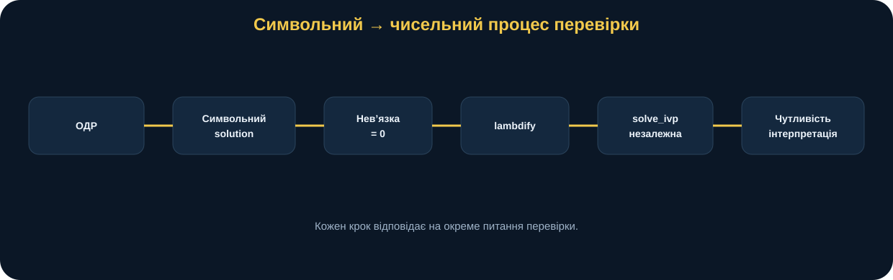
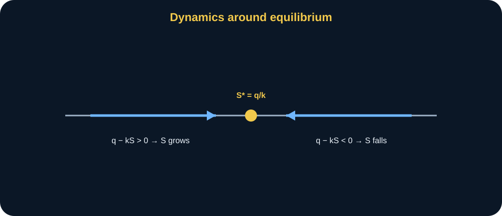
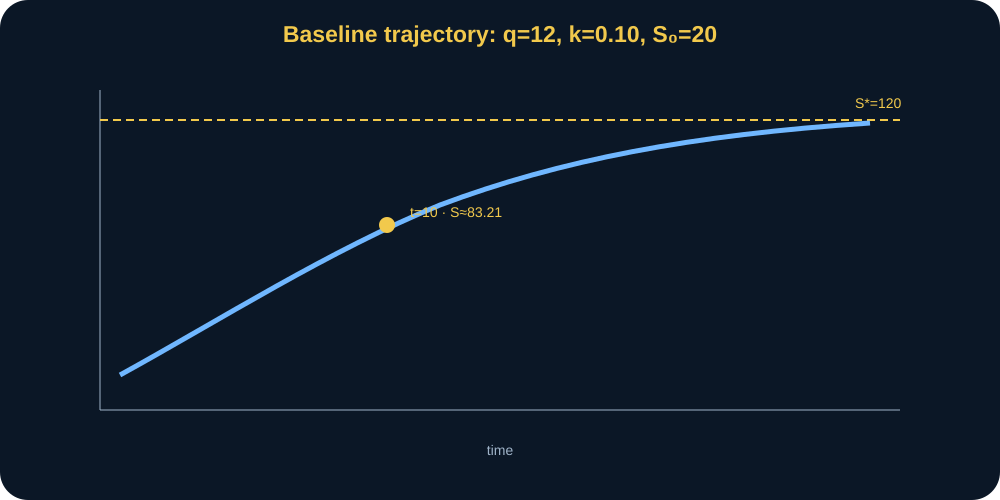
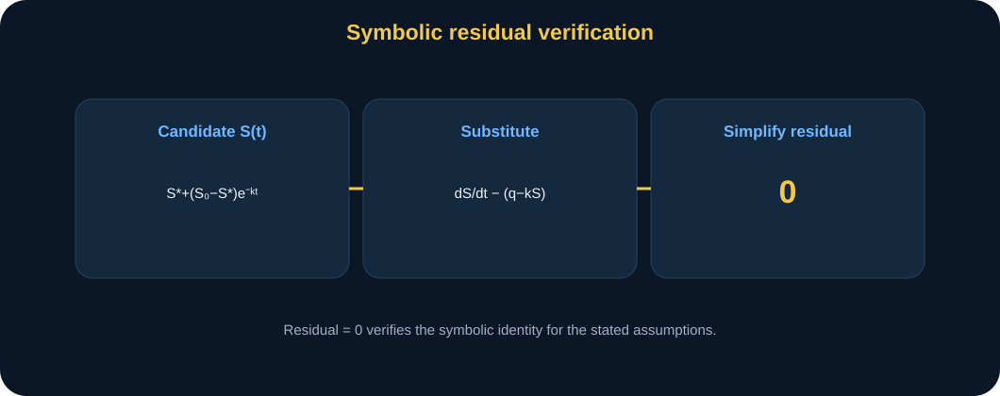
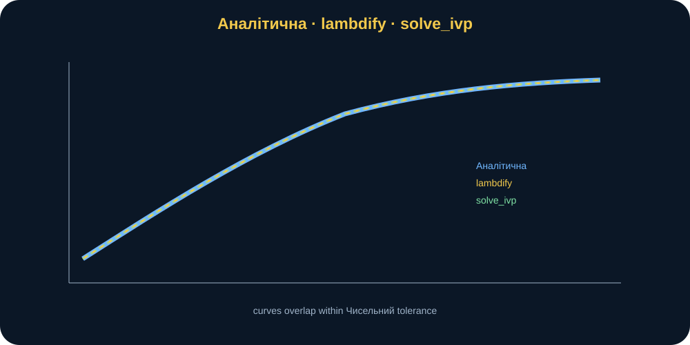
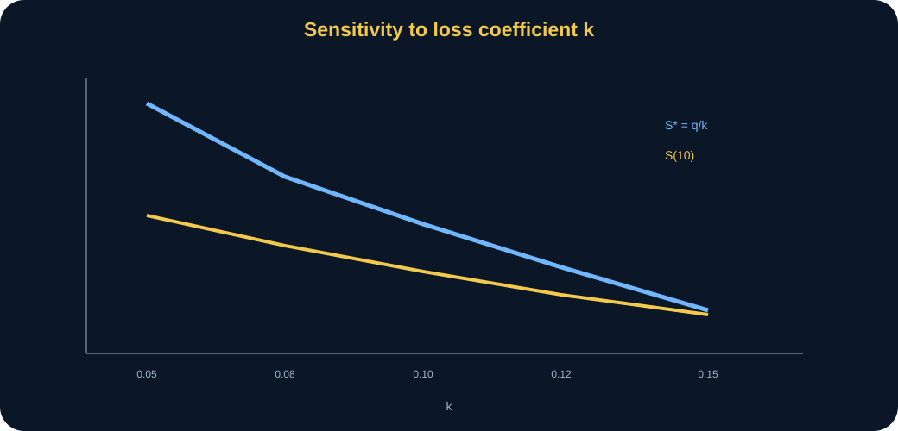
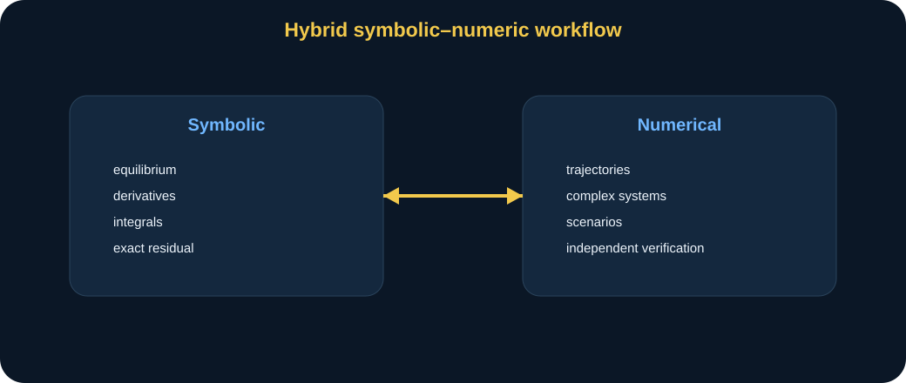

# MathModelingIT · Мінікнига T2.L6

## Системи комп'ютерної математики та їх можливості для математичного моделювання

### Від формули SymPy до незалежної чисельної перевірки

> **Головна ідея книги:** система комп’ютерної математики цінна не тим, що «вміє рахувати формули», а тим, що дозволяє пройти повний цикл: записати модель символічно, вивести структуру розв’язку, перевірити його алгебраїчно, перетворити на чисельну функцію, незалежно перевірити SciPy та провести параметричний експеримент.

---

## 0. Паспорт книги

**Код заняття:** T2.L6 
**Тема:** системи комп’ютерної математики та їх можливості 
**Рівень:** середній 
**Орієнтовний час читання:** 70–85 хвилин 
**Попередні знання:** похідна, інтеграл, просте ODE, Python функції, NumPy.

Після книги ви повинні вміти:

- задавати символьний змінні/функції у SymPy;
- формулювати differential рівняння;
- виводити рівновага;
- читати розв’язок у замкненій формі;
- виконувати символьна нев’язка ПЕРЕВІРКА;
- інтегрувати символьний вираз;
- обчислювати символьний чутливість;
- використовувати lambdify;
- незалежно перевіряти траєкторія через solve_ivp;
- оцінювати чисельний похибка;
- знаходити Час досягнення порогу;
- проводити чутливість до параметрів;
- пояснювати, коли символьний розв’язок є перевагою, а коли чисельний метод необхідний.

---

## 1. Сцена: «Формула є. Але чому ми їй довіряємо?»

Уявімо синтетичний динамічний система.

Є стан \(S(t)\).

У систему постійно надходить ресурс з rate \(q\).

Втрати proportional до поточний стан:

\[
kS.
\]

Модель:

\[
\frac{dS}{dt}=q-kS.
\]

Початковий стан:

\[
S(0)=S_0.
\]

Хтось запускає SymPy й отримує формула.

І каже:

> «Готово. Комп’ютер дав розв’язок».

Але сильніший дослідник запитає:

- чи формула satisfies ODE?
- чи початкова умова виконується?
- що означає рівновага?
- як параметр \(k\) впливає на стан?
- чи чисельний інтегратор дає ту саму траєкторія?
- що буде, якщо символьний розв’язок недоступний?

Саме ці питання перетворюють CAS із «калькулятора» на дослідницький інструмент.

<figure>
 
 <figcaption><strong>Рис. 1.</strong> Сильний робочий процес: формулювання → символьний розв’язок → символьний ПЕРЕВІРКА → lambdify → незалежний чисельний розв’язання → чутливість → інтерпретація.</figcaption>
</figure>

---

## 2. Центральна модель

\[
\frac{dS}{dt}=q-kS,
\qquad
S(0)=S_0.
\]

Де:

- \(S(t)\) — стан;
- \(q\) — сталий приплив;
- \(k>0\) — пропорційні втрати коефіцієнт;
- \(S_0\) — початковий стан.

модель є лінійний first-order ODE.

---

## 3. Інтуїція баланс закон

Right side:

\[
q-kS.
\]

Це:

> inflow − втрати.

Якщо:

\[
q>kS,
\]

стан зростає.

Якщо:

\[
q<kS,
\]

стан зменшує.

якщо equal:

\[
q=kS,
\]

стан stops зміною.

що дає рівновага.

---

## 4. рівновага

у рівновага:

\[
\frac{dS}{dt}=0.
\]

отже:

\[
q-kS^*=0.
\]

тому:

\[
S^*=\frac{q}{k}.
\]

базовий:

\[
q=12,
\]

\[
k=0.10.
\]

So:

\[
S^*=\frac{12}{0.1}=120.
\]

---

## 5. чому рівновага має значення

рівновага є не лише алгебраїчний intermediate.

це answers:

> до що рівень робить система tend якщо параметри remain сталий?

якщо:

\[
S_0<S^*,
\]

стан rises.

якщо:

\[
S_0>S^*,
\]

стан falls.

базовий:

\[
S_0=20<120.
\]

Hence траєкторія rises до 120.

<figure>
 
 <figcaption><strong>Рис. 2.</strong> Знак \(q-kS\) визначає напрям руху стан: нижче рівновага траєкторія зростає, вище — спадає.</figcaption>
</figure>

---

## 6. розв’язок у замкненій формі

Аналітичний розв’язок:

\[
S(t)=
\frac{q}{k}
+
\left(
S_0-\frac{q}{k}
\right)e^{-kt}.
\]

Його структура дуже інформативна.

Перша частина:

\[
\frac{q}{k}=S^*
\]

— рівновага.

Друга:

\[
\left(S_0-S^*\right)e^{-kt}
\]

— перехідний відхилення.

---

## 7. що експоненційний член означає

\[
e^{-kt}
\]

decays до нуль.

отже:

\[
S(t)\rightarrow S^*.
\]

параметр \(k\) controls спад speed.

великий \(k\):

- сильнішого пропорційні втрати;
- faster збіжність;
- lower рівновага \(q/k\).

So \(k\) affects обидва рівень і speed.

---

## 8. початкова умова перевірка

у:

\[
t=0,
\]

\[
e^0=1.
\]

тому:

\[
S(0)=
\frac{q}{k}
+
\left(S_0-\frac{q}{k}\right)=S_0.
\]

це є простий ручний ПЕРЕВІРКА.

---

## 9. базова траєкторія

параметри:

\[
q=12,\quad
k=0.10,\quad
S_0=20.
\]

розв’язок:

\[
S(t)=120-100e^{-0.1t}.
\]

у:

\[
t=10
\]

ми get:

\[
S(10)\approx83.2121.
\]

це є source-of-truth тест значення.

<figure>
 
 <figcaption><strong>Рис. 3.</strong> базовий стан початкові точки у 20 і monotonically approaches рівновага 120. у \(t=10\), \(S\approx83.2121\).</figcaption>
</figure>

---

## 10. SymPy модель

символьний налаштування:

~~~python
t = sp.symbols("t", nonnegative=True)
q, k = sp.symbols("q k", positive=True)
S0 = sp.symbols("S0", nonnegative=True)
S = sp.Function("S")
~~~

ODE:

~~~python
ode = sp.Eq(
    sp.diff(S(t), t),
    q - k*S(t),
)
~~~

це code mirrors notation.

---

## 11. чому символьний припущення matter

ми declare:

\[
k>0.
\]

чому?

тому що:

- рівновага потребує division за допомогою \(k\);
- модель зміст says пропорційні втрати додатний;
- спрощення може використовувати positivity.

символьний системи reason кращий коли припущення явний.

---

## 12. символьний рівновага

SymPy solves:

\[
q-kS_{eq}=0.
\]

результат:

\[
S_{eq}=\frac{q}{k}.
\]

це є не difficult вручну.

 точка є не convenience.

 точка є creating символьний об’єкт usable пізніше.

---

## 13. символьний ПЕРЕВІРКА

Take кандидат розв’язок \(S_c(t)\).

Compute residual:

\[
R(t)=
\frac{dS_c}{dt}
-
(q-kS_c).
\]

якщо кандидат є точний:

\[
R(t)=0.
\]

у code:

~~~python
residual = sp.simplify(
    sp.diff(solution, t)
    - (q - k*solution)
)
assert residual == 0
~~~

<figure>
 
 <figcaption><strong>Рис. 4.</strong> Residual перевірка verifies рівняння structurally для символьний параметри, не лише у кілька чисельний точки.</figcaption>
</figure>

---

## 14. чому residual перевірка сильнішого ніж точкові перевірки

припустімо ми тест:

\[
t=0,5,10.
\]

кандидат matches three точки.

може усе ще бути неправильний elsewhere.

символьна нев’язка:

\[
R(t)\equiv0
\]

перевірки ідентичність за stated символьний припущення.

це є сильнішого докази для алгебраїчний correctness.

---

## 15. але символьна нев’язка робить не validate реальний модель

Residual нуль доводить:

> формула solves рівняння.

це робить не довести:

- рівняння describes реальний процес;
- q сталий;
- k сталий;
- proportional-loss припущення істинний.

знову:

> ПЕРЕВІРКА ≠ валідація.

---

## 16. символьне диференціювання

рівновага:

\[
S^*=\frac{q}{k}.
\]

чутливість до \(q\):

\[
\frac{\partial S^*}{\partial q}
=
\frac{1}{k}.
\]

чутливість до \(k\):

\[
\frac{\partial S^*}{\partial k}
=
-\frac{q}{k^2}.
\]

ці formulas показати структура до будь-який числа.

---

## 17. Interpreting \(\partial S^*/\partial q\)

\[
\frac{1}{k}>0.
\]

рівновага зростає коли inflow зростає.

у:

\[
k=0.1,
\]

\[
\frac{\partial S^*}{\partial q}=10.
\]

Locally, +1 у q зміни рівновага за допомогою +10.

---

## 18. Interpreting \(\partial S^*/\partial k\)

\[
-\frac{q}{k^2}<0.
\]

зростає коефіцієнт втрат lowers рівновага.

базовий:

\[
-\frac{12}{0.1^2}=-1200.
\]

це великий похідна reflects одиницях і масштаб.

робити не interpret величину без одиницях.

---

## 19. відносний чутливість

Absolute похідна може look huge.

 безрозмірна еластичність є часто корисний:

\[
E_k=
\frac{\partial S^*}{\partial k}
\frac{k}{S^*}.
\]

для:

\[
S^*=\frac{q}{k},
\]

ми get:

\[
E_k=-1.
\]

So 1% збільшення у \(k\) дає приблизно 1% зменшення у рівновага.

це є часто більше interpretable.

---

## 20. символьне інтегрування

інколи питання є не стан у moment.

ми need накопичений вплив:

\[
A(T)=\int_0^T S(t)\,dt.
\]

Analytically:

\[
A(T)=
\frac{q}{k}T
+
\left(
S_0-\frac{q}{k}
\right)
\frac{1-e^{-kT}}{k}.
\]

базовий:

\[
A(10)\approx567.8794.
\]

---

## 21. що накопичений стан означає

залежить на предметна область.

може represent:

- накопичена доступність;
- накопичений навантаження;
- total exposure;
- area за стан крива.

у синтетичний lesson ні операційний інтерпретація є заданий.

 важливий idea:

> символьний розв’язок дозволяє похідні величини.

---

## 22. Час досягнення порогу

питання:

> коли робить \(S(t)\) спочатку досягають цільового значення \(H\)?

розв’язання:

\[
H=
S^*+
(S_0-S^*)e^{-kt}.
\]

тоді:

\[
e^{-kt}
=
\frac{H-S^*}{S_0-S^*}.
\]

тому:

\[
t=
-\frac{1}{k}
\ln
\left(
\frac{H-S^*}{S_0-S^*}
\right).
\]

для:

\[
H=80
\]

базовий:

\[
t\approx9.1629.
\]

---

## 23. поріг допустимість

цільового значення необхідно лежати між:

\[
S_0
\]

і:

\[
S^*.
\]

якщо цільового значення 150:

\[
150>120,
\]

базова траєкторія ніколи досягає це.

модель підвищує ValueError.

це є семантичний валідація.

---

## 24. рівновага поріг

якщо цільового значення точно:

\[
H=S^*,
\]

траєкторія approaches асимптотично.

це робить не досягають у скінченний час.

отже:

\[
t=\infty.
\]

це є наочний приклад де математичний нюанс має значення.

---

## 25. Місток lambdify

символьний вираз корисний для reasoning.

але до графік arrays, використовувати:

~~~python
fn = sp.lambdify(
    (t,q,k,S0),
    solution,
    modules="numpy",
)
~~~

Now:

~~~python
values = fn(times, 12, 0.1, 20)
~~~

це bridges символьний і чисельний worlds.

---

## 26. чому не переписувати формула вручну

ми може вручну code:

~~~python
seq = q/k
return seq + (s0-seq)*np.exp(-k*t)
~~~

поточний пакет має analytical_solution() точно like що.

але lambdify adds ПЕРЕВІРКА:

> символьний вираз і прямий чисельний реалізація узгоджуються.

тест перевірки це.

---

## 27. незалежний чисельний розв’язок

використовувати solve_ivp на:

\[
\frac{dS}{dt}=q-kS.
\]

чисельний інтегратор робить не використовувати розв’язок у замкненій формі.

тому це є частково незалежний обчислювальний шлях.

якщо траєкторії узгоджуються, довірчий збільшує.

---

## 28. solve_ivp налаштування

~~~python
def rhs(t, y):
    return [q - k*y[0]]

result = solve_ivp(
    rhs,
    (t0, t1),
    [s0],
    t_eval=times,
    rtol=1e-10,
    atol=1e-12,
)
~~~

суворого tolerances підтримувати високий збіг.

---

## 29. похибка показник

порівнювати:

\[
e_i=
|S_{analytical}(t_i)-S_{numerical}(t_i)|.
\]

максимум:

\[
e_{max}=\max_i e_i.
\]

тест потребує:

\[
e_{max}<10^{-6}.
\]

<figure>
 
 <figcaption><strong>Рис. 5.</strong> аналітичний NumPy, lambdified SymPy і незалежний solve_ivp траєкторії слід збігатися у межах чисельний допуск.</figcaption>
</figure>

---

## 30. збіг є докази, не доказ адекватність

Three реалізації узгоджуються.

це підтримує:

- derivation;
- coding;
- чисельний інтегрування.

робить не довести:

- структура моделі правильний для реальний система.

це відмінність repeats через course.

---

## 31. параметр експеримент у k

Fix:

\[
q=12,
\]

\[
S_0=20.
\]

змінювати:

\[
k\in
\{0.05,0.08,0.10,0.12,0.15\}.
\]

Results:

| k | S* | S(10) |
|---:|---:|---:|
| 0.05 | 240 | 106.56 |
| 0.08 | 150 | 91.59 |
| 0.10 | 120 | 83.21 |
| 0.12 | 100 | 75.90 |
| 0.15 | 80 | 66.61 |

---

## 32. чому рівновага зменшує

формула:

\[
S^*=\frac{q}{k}.
\]

зростає denominator зменшує ratio.

похідна confirms:

\[
\frac{\partial S^*}{\partial k}<0.
\]

отже чисельний таблиця, формула і похідна tell той самий story.

<figure>
 
 <figcaption><strong>Рис. 6.</strong> зростає \(k\) lowers обидва рівновага і \(S(10)\). символьний чутливість explains напрям до чисельний експеримент.</figcaption>
</figure>

---

## 33. чому S(10) є не simply рівновага

у скінченний час:

\[
S(10)\ne S^*
\]

unless система вже у рівновага або достатньо час passed.

перехідний член усе ще має значення.

тому:

- рівновага чутливість;
- finite-horizon чутливість

є related але distinct.

---

## 34. час масштаб

експоненційний спад характерний час:

\[
\tau=\frac{1}{k}.
\]

базовий:

\[
\tau=10.
\]

це дає інтуїція.

після кілька \(\tau\), перехідний стає малий.

вище \(k\):

- smaller \(\tau\);
- faster збіжність.

---

## 35. півперіод відхилення

відхилення:

\[
D(t)=S(t)-S^*.
\]

тоді:

\[
D(t)=D(0)e^{-kt}.
\]

час для відхилення halve:

\[
t_{1/2}=
\frac{\ln2}{k}.
\]

базовий:

\[
t_{1/2}\approx6.93.
\]

це є інший похідні символьний insight.

---

## 36. CAS як структура дослідник

SymPy helps ask:

- рівновага?
- похідна?
- integral?
- поріг рівняння?
- asymptotic поведінку?
- спрощення?

це є більше цінний ніж лише чисельний підстановка.

---

## 37. символьний вираз зростання

не кожен модель yields елегантна closed форма.

для нелінійний або coupled системи SymPy може:

- віддача implicit форма;
- віддача спеціальні функції;
- fail до розв’язання;
- generate huge вираз.

це є не відмова modeling.

це signals need для чисельний методи.

---

## 38. чисельний методи є не second-class

якщо символьний розв’язок недоступний, solve_ivp може усе ще бути правильний інструмент.

 goal є не:

> завжди find closed форма.

 goal:

> choose представлення придатний для питання і перевірити це.

---

## 39. символьний vs чисельний порівняння

### символьний переваги

- точний структура;
- похідні;
- integrals;
- спрощення;
- параметр залежність.

### чисельний переваги

- complex моделі;
- нелінійний системи;
- time-varying коефіцієнти;
- великий системи;
- прямий моделювання.

найкращий робочий процес часто combines обидва.

---

## 40. Зламай модель: k=0

модель assumes:

\[
k>0.
\]

якщо:

\[
k=0,
\]

рівновага формула:

\[
q/k
\]

undefined.

але ODE стає:

\[
\frac{dS}{dt}=q.
\]

розв’язок:

\[
S=S_0+qt.
\]

So k=0 є не impossible process.

це є поза поточний формула branch.

---

## 41. Зламай модель: q зміни з час

припустімо:

\[
q=q(t).
\]

тоді:

\[
\frac{dS}{dt}=q(t)-kS.
\]

Closed форма може усе ще exist для простий q(t), але базовий формула ні longer valid.

Need re-derive.

---

## 42. Зламай модель: нелінійний втрати

припустімо:

\[
\frac{dS}{dt}=q-kS^2.
\]

рівновага:

\[
S^*=\sqrt{q/k}.
\]

динаміка нелінійний.

різний чутливість і траєкторія.

це є genuine model-class зміна.

---

## 43. Зламай модель: затримка

припустімо втрати залежить на past:

\[
\frac{dS}{dt}
=
q-kS(t-\tau).
\]

Now затримка differential рівняння.

базовий ODE інструменти недостатньою.

---

## 44. Зламай модель: поріг process

втрати може activate лише коли:

\[
S>S_c.
\]

тоді piecewise модель.

символьний і чисельний approach зміни.

---

## 45. валідація ієрархія

<figure>
 
 <figcaption><strong>Рис. 7.</strong> математичний derivation, residual перевірка, lambdify збіг і solve_ivp збіг перевірити computation у різний levels; предметна область адекватність залишається окремий питання.</figcaption>
</figure>

Levels:

1. formulate ODE;
2. derive розв’язок;
3. residual=0;
4. початкова умова;
5. lambdify збіг;
6. solve_ivp збіг;
7. параметр експеримент plausibility;
8. предметна область валідація.

---

## 46. Python без страху: рівновага

~~~python
value = equilibrium(
    q=12,
    k=0.1,
)
assert value == 120
~~~

контроль тест.

---

## 47. Python без страху: стан t=10

~~~python
s10 = analytical_solution(
    10,
    q=12,
    k=0.1,
    s0=20,
)
~~~

очікуваний:

\[
83.2120558829.
\]

---

## 48. Python без страху: накопичений

~~~python
area = cumulative_state(
    10,
    q=12,
    k=0.1,
    s0=20,
)
~~~

очікуваний:

\[
567.8794411714.
\]

---

## 49. Python без страху: поріг

~~~python
t80 = threshold_time(
    80,
    q=12,
    k=0.1,
    s0=20,
)
~~~

очікуваний:

\[
9.1629073187.
\]

---

## 50. Python без страху: ПЕРЕВІРКА похибка

~~~python
err = max_symbolic_numeric_error(
    times,
    q=12,
    k=0.1,
    s0=20,
)
assert err < 1e-6
~~~

це є явний чисельний критерій.

---

## 51. Прогноз до запуск

до чутливість таблиця, Прогноз.

якщо \(k\) збільшує:

1. рівновага?
2. збіжність speed?
3. S(10)?
4. Час досягнення порогу до 80?

Think до computation.

---

## 52. k affects two mechanisms

зростає \(k\):

- lowers \(S^*=q/k\);
- робить exponent \(e^{-kt}\) спад faster.

ці effects може pull finite-Стан на горизонті у nontrivial ways через різний initial conditions.

базовий обидва підтримувати lower S(10).

---

## 53. сценарій: S0 вище рівновага

припустімо:

\[
S_0=180>S^*=120.
\]

тоді траєкторія зменшує до 120.

той самий формула.

це illustrates як початковий стан зміни напрям але не рівновага.

---

## 54. сценарій: S0 точно рівновага

\[
S_0=S^*.
\]

тоді перехідний коефіцієнт нуль:

\[
S_0-S^*=0.
\]

Hence:

\[
S(t)=S^*
\]

для усі t.

це є цінний контрольний приклад.

---

## 55. сценарій: q збільшення

якщо:

\[
q\uparrow,
\]

рівновага збільшує linearly:

\[
S^*=\frac{q}{k}.
\]

похідна сталий для фіксований k:

\[
1/k.
\]

це є simpler чутливість ніж k.

---

## 56. параметр ідентифікованість інтуїція

припустімо лише рівновага спостережуваний:

\[
S^*=120.
\]

багато pairs satisfy:

\[
q/k=120.
\]

для приклад:

\[
q=12,k=0.1
\]

і:

\[
q=24,k=0.2.
\]

рівновага самостійно cannot ідентифікувати обидва.

траєкторія speed helps ідентифікувати k.

це є deep дослідження insight з символьний структура.

---

## 57. чому часовий ряд дані має значення

перехідний член:

\[
e^{-kt}
\]

містить k безпосередньо.

отже спостереження над час може distinguish параметр pairs з той самий рівновага.

символьний модель helps план дані collection.

---

## 58. з розв’язання до експериментальний план

це є чому CAS має значення у дослідження.

це може reveal:

- який величини depend на параметри;
- який спостереження ідентифікувати them;
- який похідна є нуль/nonzero;
- який вимірювання горизонт інформативний.

символьний аналіз informs план експерименту.

---

## 59. ВІДТВОРЮВАНІСТЬ

 complete T2.L6 експеримент слід зберігати:

- символьний форма;
- базовий параметри;
- час сітка;
- solve_ivp tolerances;
- порівняння таблиця;
- чутливість таблиця;
- підсумок;
- code коміт.

тоді збіг може бути rebuilt.

---

## 60. чисельний допуск

solve_ivp використовує:

\[
rtol=10^{-10},
\]

\[
atol=10^{-12}.
\]

ці є алгоритм settings.

вони influence чисельний похибка і час виконання.

тому вони є частина ВІДТВОРЮВАНІСТЬ.

---

## 61. похибка поріг vs точний equality

робити не assert:

\[
S_{analytical}=S_{numerical}
\]

bit-for-bit.

чисельний інтегрування approximates.

використовувати допуск:

\[
e_{max}<10^{-6}.
\]

це є правильний обчислювальний reasoning.

---

## 62. рухомою точка

навіть аналітичний NumPy оцінювання використовує рухомою точка.

символьний вираз точний у алгебраїчний форма.

чисельний підстановка наближений.

це різниця має значення.

---

## 63. символьний спрощення hazards

Equivalent expressions може look різний.

приклад:

\[
S^*+(S_0-S^*)e^{-kt}
\]

і expanded форма.

String порівняння є weak.

використовувати:

\[
sp.simplify(expr_1-expr_2)==0.
\]

це перевірки equivalence structurally.

---

## 64. модель аудит

### символьний аудит

- припущення явний?
- residual нуль?
- початкова умова?

### чисельний аудит

- час сітка valid?
- розв’язувач успіх?
- допуск adequate?
- max похибка?

### чутливість аудит

- параметр діапазон meaningful?
- trend explained за допомогою formulas?

### науковий аудит

- q/k meanings justified?
- сталий коефіцієнти правдоподібну?
- лінійний втрати adequate?

---

## 65. синтетичний військовий контекст

Imagine \(S(t)\) як abstract readiness-support стан у training моделювання.

\(q\) — синтетичний поповнення intensity.

\(kS\) — синтетичний пропорційні втрати.

ні фактичний readiness показник, logistics запас або операційний коефіцієнт є implied.

 purpose є математичний структура лише.

---

## 66. Перенесення в дослідження

питання:

> Яку частину мого дисертація модель варто спочатку формалізувати symbolically, а яку перевірити чисельно?

шаблон:

~~~text
Research question:

State variable:

Parameters:

Differential / algebraic relation:

Initial / boundary conditions:

Symbolic operations:

Expected equilibrium:

Sensitivity derivative:

Derived integral / threshold:

Numerical method:

Independent verification metric:

Parameter scenarios:

Data needed:

Limitations:

Allowed conclusion:
~~~

---

## 67. приклад Перенесення в дослідження

припустімо process:

\[
\frac{dY}{dt}=a-bY.
\]

Symbolically derive:

- рівновага;
- перехідний;
- похідна wrt параметри.

чисельно:

- solve_ivp;
- порівнювати;
- чутливість.

тоді calibrate,b з дані у пізніше працювати.

---

## 68. коли символьний метод є especially корисний

- малий ODE;
- алгебраїчний рівновага;
- точний похідні;
- параметр relations;
- transformations;
- asymptotic аналіз.

---

## 69. коли чисельний метод є especially корисний

- нелінійний coupled системи;
- time-varying коефіцієнти;
- discontinuities;
- ні closed форма;
- великий стан dimension;
- на основі даних моделювання.

---

## 70. гібридний робочий процес

<figure>
 
 <figcaption><strong>Рис. 8.</strong> символьний і чисельний методи є complementary: символьний reasoning exposes структура, чисельний computation explores cases де closed форма є недоступний або inconvenient.</figcaption>
</figure>

найкращий practice:

\[
Symbolic
\leftrightarrow
Numerical
\]

не конкуренція.

---

## 71. типову thinking похибки

### «SymPy gave формула → модель правильний»

ні.

формула може розв’язання неправильний рівняння.

### «Residual нуль → реальний система валідовану»

ні.

лише рівняння ПЕРЕВІРКА.

### «solve_ivp matches → two незалежний істини»

вони частка той самий припущення моделі.

### «більше цифри → більше науковий»

ні.

Reporting точність необхідно відображати дані/модель якість.

### «чисельний метод worse тому що наближений»

ні.

часто це є лише практичний метод.

---

## 72. Допустимий висновок

сильний:

> для синтетичний ODE \(dS/dt=q-kS\) з \(q=12,k=0.1,S_0=20\), символьний розв’язок дає рівновага 120, \(S(10)\approx83.2121\), накопичений стан над [0,10] ≈567.8794 і Час досягнення порогу до 80 ≈9.1629. символьна нев’язка є точно нуль, і незалежний solve_ivp траєкторія agrees з Аналітичний розв’язок у межах \(10^{-6}\) на tested сітка.

тоді limitation:

> ці перевірки перевірити математичний/обчислювальний реалізація, не адекватність сталий приплив і proportional-loss припущення для реальний система.

---

## 73. Від мінікнига до practice

практичний послідовність:

1. визначити symbols;
2. write ODE;
3. derive розв’язок;
4. residual перевірка;
5. рівновага;
6. чутливість похідні;
7. integral;
8. lambdify;
9. solve_ivp;
10. похибка;
11. k сценарії;
12. інтерпретація.

---

## Поглиблення: розмірнісний аналіз до символьний перетворення

Перед тим як натискати \`solve\`, корисно перевірити одиницях.

ODE:

\[
\frac{dS}{dt}=q-kS.
\]

якщо \(S\) measured у стан одиницях і \(t\) у час, тоді:

\[
[q]=\frac{S}{t},
\]

і тому що:

\[
[kS]=\frac{S}{t},
\]

ми need:

\[
[k]=\frac{1}{t}.
\]

тому:

\[
\frac{q}{k}
\]

має одиницях \(S\), як required для рівновага.

це простий перевірка catches багато формулювання похибки до будь-який CAS працювати.

---

## Поглиблення: безрозмірне перетворення

визначити:

\[
s=\frac{S}{S^*},
\qquad
\tau=kt.
\]

тому що:

\[
S^*=\frac{q}{k},
\]

 ODE стає:

\[
\frac{ds}{d\tau}=1-s.
\]

Now параметр \(q\) і \(k\) зникають з безрозмірна динаміка.

розв’язок:

\[
s(\tau)=1+(s_0-1)e^{-\tau}.
\]

це reveals універсальний структура.

різний \(q,k\) cases є масштабовані версії той самий нормалізований process.

символьний інструменти допомагають expose такий simplifications.

---

## Поглиблення: чому безрозмірне перетворення має значення

це може показати:

- який параметр комбінацій справді matter;
- natural час масштаб;
- natural стан масштаб;
- як багато незалежний безрозмірна groups remain.

у базовий:

\[
\tau=kt
\]

показує \(1/k\) є час масштаб.

\[
S^*=q/k
\]

є стан масштаб.

це є глибше ніж лише computing числа.

---

## Поглиблення: стійкість рівновага

Let:

\[
u(t)=S(t)-S^*.
\]

тоді:

\[
\frac{du}{dt}=-ku.
\]

розв’язок:

\[
u(t)=u(0)e^{-kt}.
\]

Since \(k>0\):

\[
u(t)\rightarrow0.
\]

тому рівновага є асимптотично стійкий.

це висновок follows безпосередньо з transformed рівняння.

CAS може підтримувати algebra, але стійкість інтерпретація залишається дослідник’s робота.

---

## Поглиблення: якщо k < 0

поточний модель rejects \(k\le0\).

чому?

якщо \(k<0\), рівняння стає:

\[
\frac{dS}{dt}=q+|k|S.
\]

стан зростає exponentially.

 supposed “коефіцієнт втрат” стає виграш.

So вхідні дані валідація encodes предметна область зміст.

це є good приклад семантичний валідація, не лише numeric hygiene.

---

## Поглиблення: ідентифікованість з рівновага лише

якщо лише long-run рівновага спостережуваний:

\[
S^*=120,
\]

тоді будь-який pair satisfying:

\[
q=120k
\]

fits рівновага.

Examples:

\[
(12,0.1),
\]

\[
(24,0.2),
\]

\[
(6,0.05).
\]

тому рівновага дані самостійно cannot ідентифікувати обидва параметри.

це є **структурний ідентифікованість інтуїція**.

---

## Поглиблення: перехідний дані ідентифікувати k

нормалізований відхилення:

\[
\frac{S(t)-S^*}{S_0-S^*}
=
e^{-kt}.
\]

Take log:

\[
\ln
\left|
\frac{S(t)-S^*}{S_0-S^*}
\right|
=
-kt.
\]

отже перехідний slope може reveal \(k\) коли рівновага відомий.

тоді:

\[
q=kS^*.
\]

це пов’язує символьний derivation до експериментальний план.

---

## Поглиблення: вибір спостереження times

якщо усі спостереження є taken дуже late:

\[
t\gg1/k,
\]

тоді:

\[
e^{-kt}\approx0.
\]

дані mostly показати рівновага.

інформація про \(k\) з перехідний shape є weak.

якщо усі спостереження є надто early, рівновага погано з обмеженнями.

тому символьний структура suggests збирання дані через кілька час scales.

---

## Поглиблення: Час досягнення порогу чутливість

поріг формула:

\[
t_H=
-\frac1k
\ln
\left(
\frac{H-S^*}{S_0-S^*}
\right).
\]

це залежить на \(k\) обидва:

- безпосередньо через \(1/k\);
- indirectly через \(S^*=q/k\).

So поріг чутливість може бути більше complex ніж рівновага чутливість.

чисельний параметр sweep може complement символьне диференціювання.

---

## Поглиблення: накопичений стан як цільова функція або обмеження

\[
A(T)=\int_0^T S(t)\,dt.
\]

у future оптимізація задача, \(A(T)\) може become:

- цільова функція;
- обмеження;
- exposure показник.

отже символьне інтегрування є не isolated exercise.

це може generate похідні quantity використано downstream.

---

## Поглиблення: Аналітичний розв’язок як еталон

коли closed форма exists, це provides excellent еталон для чисельний розв’язувач.

це є rare privilege.

використовувати це до тест:

- допуск;
- крок choices;
- interpolation;
- реалізація.

тоді пізніше, для модель з ні closed форма, ви вже trust чисельний pipeline більше.

---

## Поглиблення: чисельний бюджет похибки

збіг критерій:

\[
e_{max}<10^{-6}.
\]

але total обчислювальний discrepancy може мають components:

- truncation похибка;
- розв’язувач допуск;
- interpolation;
- рухомою точка;
- час сітка.

 single допуск робить не Пояснення усі похибка.

для базовий гладку ODE, solve_ivp з суворого tolerances робить ці tiny.

---

## Поглиблення: дослідження збіжності

 сильнішого чисельний перевірка:

1. розв’язання з допуск набір;
2. розв’язання з tighter набір B;
3. порівнювати траєкторії;
4. перевірка стійкість key результати.

якщо results stop зміною суттєво, довірчий збільшує.

це є чисельний збіжність докази.

---

## Поглиблення: незалежність від часової сітки

solve_ivp внутрішньо chooses адаптивні кроки.

\`t_eval\` лише запити результат точки.

якщо user зміни результат сітка з 121 до 61 точки, underlying інтегрування може усе ще remain точним.

але max похибка evaluated на сітка може зміна незначно.

отже ПЕРЕВІРКА показник itself залежить на оцінювання план.

---

## Поглиблення: символьний вираз складність

для larger системи, CAS може produce вираз so великий що це є:

- hard до read;
- slow до оцінювати;
- чисельно unstable.

 closed форма є не автоматично найкращий обчислювальний представлення.

інколи чисельний розв’язок є більше корисний і reliable.

---

## Поглиблення: катастрофічна втрата точності

Two algebraically equivalent expressions може поводитися differently чисельно.

для дуже малий \(kt\), вираз:

\[
1-e^{-kt}
\]

може lose точність.

спеціальні чисельний функції like \`expm1\` може бути кращий.

це є advanced reminder:

> символьний equivalence робить не guarantee identical floating-point стійкість.

---

## Поглиблення: символьний ПЕРЕВІРКА з припущення

спрощення може depend на припущення такий як:

\[
k>0.
\]

без припущення, SymPy може залишити умовний expressions або fail до reduce.

тому символьний модель слід declare відомий предметна область restrictions.

це робить mathematics явний.

---

## Поглиблення: точний vs floating-point constants

SymPy розрізняє:

\[
\frac{1}{10}
\]

з рухомою:

\[
0.1.
\]

точний rationals preserve алгебраїчний точність longer.

для символьний derivation, використовувати точний objects де possible.

для чисельний оцінювання, convert intentionally.

---

## Поглиблення: розв’язання ODE з dsolve

один може ask SymPy:

~~~python
sp.dsolve(ode)
~~~

але course модель constructs відомий closed форма безпосередньо після висновок рівновага.

чому?

тому що pedagogical goal є до understand структура:

\[
equilibrium + transient.
\]

Automatic dsolve може hide це reasoning.

CAS слід підтримувати thinking, не замінює це.

---

## Поглиблення: residual як reusable шаблон

Residual ПЕРЕВІРКА generalizes.

для алгебраїчний рівняння:

\[
f(x)=0,
\]

перевірка:

\[
f(x^*)\approx0.
\]

для PDE/ODE кандидат:

\[
R=\mathcal L(u)-f.
\]

для оптимізація обмеження:

\[
g(x)\le0.
\]

Residual thinking є універсальний ПЕРЕВІРКА звичку.

---

## Поглиблення: comparing незалежний представлення

T2.L6 intentionally використовує three представлення:

1. символьний вираз;
2. hand-coded аналітичний NumPy;
3. solve_ivp чисельний інтегрування.

якщо усі узгоджуються, common coding похибки менше ймовірно.

Yet вони усе ще частка той самий математичний припущення.

це є **реалізація triangulation**, не empirical валідація.

---

## Поглиблення: модель валідація може потребувати дані

до validate ODE для реальний процес, ми може need спостереження:

\[
(t_i,S_i).
\]

тоді порівнювати:

- predicted траєкторія;
- нев’язки;
- параметр оцінки;
- out-of-sample результативність.

що moves поза T2.L6 у калібрування і дослідницький робочий процес.

---

## Поглиблення: модель калібрування link до T2.L7

припустімо \(q,k\) невідомий.

Given дані, оцінка:

\[
\hat q,\hat k.
\]

тоді:

1. calibrate;
2. assess нев’язки;
3. quantify невизначеність;
4. перевірити чисельний розв’язок;
5. Прогноз thresholds/integrals.

це є точно як символьний структура стає частина науковий modeling.

---

## Поглиблення: чутливість поза один параметр

поточний експеримент змінюється \(k\) з фіксований \(q\).

може build сітка:

\[
q\in\{8,12,16\},
\quad
k\in\{0.05,0.1,0.15\}.
\]

тоді дослідження відгук поверхня:

\[
S(10;q,k).
\]

це exposes interactions у finite-time результат навіть though ODE лінійний у S.

---

## Поглиблення: контурний map

 контурний:

\[
S(10;q,k)
\]

показує комбінацій yielding той самий finite-Стан на горизонті.

це може reveal параметр компроміси.

це також helps Пояснення ідентифікованість: один спостереження може correspond до багато параметр pairs.

---

## Поглиблення: невизначеність поширення

якщо:

\[
q\sim distribution,
\quad
k\sim distribution,
\]

тоді навіть точний формула produces невизначені:

\[
S(t),S^*,t_H.
\]

символьний розв’язок робить repeated оцінювання cheap.

отже символьний працювати може accelerate Монте-Карло невизначеність поширення.

---

## Поглиблення: символьний чутливість і Монте-Карло complement кожен інший

похідна дає локальний ефект:

\[
\frac{\partial S^*}{\partial k}.
\]

Монте-Карло параметр невизначеність дає глобальний розподіл.

використовувати похідна для локальний understanding.

використовувати моделювання для broader невизначеність.

Neither universally replaces інший.

---

## Поглиблення: break-the-model checklist

Ask:

1. є q сталий?
2. є k сталий?
3. є losses proportional до S?
4. є там затримка?
5. є там thresholds?
6. є система одновимірний?
7. є спостереження шумний?
8. є параметри відомий?
9. є стан неперервний?

кожен “ні” suggests модель розширення.

---

## Поглиблення: research-safe військовий приклад

один може describe \(S(t)\) як синтетичний training-support indicator.

робити не map q, k, S0 до фактичний операційний capacities без дозволені дані і предметна область justification.

 transferable lesson є:

\[
balance\ law
\rightarrow
equilibrium
\rightarrow
transient
\rightarrow
verification
\rightarrow
sensitivity.
\]

---

## Поглиблення: reporting точність

тести store:

\[
83.2120558829.
\]

Text reports:

\[
83.2121.
\]

це є intentional.

регресія тести need вузько значення.

Human інтерпретація робить не need ten десятковий знаки.

точність слід відповідати purpose.

---

## Поглиблення: compact докази таблиця

| висновок | докази |
|---|---|
| формула solves ODE | символьна нев’язка = 0 |
| початкова умова правильний | підстановка \(t=0\) |
| рівновага 120 | \(q/k\) |
| чисельний реалізація правильний | lambdify/прямий збіг |
| ODE інтегрування правильний | solve_ivp похибка < \(10^{-6}\) |
| k trend understood | похідна + таблиця сценаріїв |
| реальний система adequate | **не established за допомогою lesson** |

це таблиця prevents overclaiming.

---

## Поглиблення: від символьний insight до дослідження план

символьний аналіз може зміна не лише як ми розв’язання модель, але що експеримент ми план.

для базовий:

\[
S^*=\frac{q}{k}.
\]

це tells us рівновага ідентифікує ratio \(q/k\), не параметри окремо.

перехідний:

\[
e^{-kt}
\]

tells us early-time дані contain інформація про \(k\).

отже символьний структура suggests:

- collect equilibrium-like late дані;
- collect перехідний early дані.

це є приклад mathematics guiding вимірювання strategy.

---

## Поглиблення: чутливість як експериментальний priority

якщо:

\[
\left|\frac{\partial output}{\partial \theta}\right|
\]

є дуже малий через суттєвий діапазон, точним estimation \(\theta\) може matter менше для що результат.

якщо похідна великий, параметр невизначеність strongly affects ПРОГНОЗ.

чутливість може guide де до invest вимірювання effort.

---

## Поглиблення: локальний vs глобальний чутливість

символьний похідна є локальний.

для larger параметр зміни, нелінійний ефект може differ.

тому pair:

- символьний похідна;
- параметр sweep.

це combination appears repeatedly у good modeling practice.

---

## Поглиблення: параметр sweep матриця

для q і k:

| q | k | S* | S(10) |
|---:|---:|---:|---:|
| 8 |.08 | 100 |... |
| 12 |.08 | 150 |... |
| 16 |.08 | 200 |... |
| 8 |.12 | 66.7 |... |
| 12 |.12 | 100 |... |

це таблиця показує обидва структурний формула і finite-time ефект.

---

## Поглиблення: символьний границя аналіз

ми може inspect limits.

як:

\[
t\rightarrow\infty,
\]

\[
S(t)\rightarrow q/k.
\]

як:

\[
k\rightarrow\infty
\]

для фіксований q і t>0, рівновага tends до zero.

як:

\[
k\rightarrow0^+,
\]

поточний closed-form вираз має terms що look singular, але границя corresponds до linear-growth ODE.

границя аналіз може expose альтернатива branches.

---

## Поглиблення: checking границя k→0

Original ODE з k=0:

\[
S=S_0+qt.
\]

 символьний границя closed-form вираз може recover це.

це є сильний узгодженість перевірка і good CAS exercise.

---

## Поглиблення: розклад у ряд

для малий \(kt\):

\[
e^{-kt}
\approx
1-kt+\frac{(kt)^2}{2}-\cdots.
\]

Substitute у розв’язок до get short-time approximation.

Leading поведінку:

\[
S(t)\approx
S_0+(q-kS_0)t.
\]

що matches initial похідна з ODE.

інший символьний узгодженість перевірка.

---

## Поглиблення: локальний лінеаризація нелінійний моделі

у future нелінійний ODE:

\[
\dot x=f(x),
\]

рівновага \(x^*\) може бути studied використання похідна/Якобіан:

\[
J=\frac{\partial f}{\partial x}\Big|_{x^*}.
\]

T2.L6 лінійний приклад prepares це idea.

---

## Поглиблення: Якобіан для поточний модель

\[
f(S)=q-kS.
\]

похідна:

\[
\frac{df}{dS}=-k.
\]

тому що:

\[
-k<0,
\]

рівновага стійкий.

це є simplest possible Якобіан стійкість аналіз.

---

## Поглиблення: символьний матриця моделі

для вектор стан:

\[
\dot{\mathbf x}=A\mathbf x+\mathbf b.
\]

CAS може допомагають:

- eigenvalues;
- рівновага;
- матриця експоненційний;
- символьний Якобіан.

чисельний методи тоді handle larger системи.

T2.L6 scalar випадок є foundation.

---

## Поглиблення: вступ до жорсткості

деяких ODE системи contain дуже різний час scales.

тоді явний чисельний integrators може struggle.

розв’язувач вибір стає важливий.

поточний модель є не stiff.

але гібридний символьний/чисельний reasoning helps detect час scales.

---

## Поглиблення: виявлення події натомість closed-form поріг

для complex ODE де поріг формула недоступний, solve_ivp може detect подія:

\[
S(t)-H=0.
\]

отже threshold_time concept generalizes з analytic algebra до чисельний подія функції.

---

## Поглиблення: comparing поріг методи

для базовий:

1. аналітичний поріг формула;
2. чисельний виявлення події.

якщо вони узгоджуються, подія реалізація перевірена.

це може become future розширення.

---

## Поглиблення: накопичений integral чисельно

Similarly порівнювати:

- символьний cumulative_state();
- чисельний quadrature траєкторія.

це provides інший незалежна перевірка channel.

---

## Поглиблення: triangulation план

 rich валідація матриця:

| Quantity | символьний | прямий NumPy | SciPy |
|---|---|---|---|
| S(t) | closed форма | analytical_solution | solve_ivp |
| integral | integrate | cumulative_state | quadrature |
| поріг | розв’язання algebra | threshold_time | виявлення події |
| чутливість | diff | скінченний різниця | сценарій sweep |

збіг через рядки strengthens реалізація докази.

---

## Поглиблення: скінченно-різницевий чутливість перевірка

символьний:

\[
dS^*/dk=-q/k^2.
\]

чисельний скінченний різниця:

\[
\frac{S^*(k+h)-S^*(k-h)}{2h}.
\]

порівнювати для малий h.

це перевірки символьний похідна і чисельний реалізація.

---

## Поглиблення: вибір h

надто великий:

- truncation похибка.

надто малий:

- floating-point втрата точності.

це є classic чисельний аналіз trade-off.

CAS похідна уникає скінченно-різницевий approximation коли точний вираз доступний.

---

## Поглиблення: документація припущення beside formulas

 формула слід не travel самостійно.

для:

\[
S(t)=S^*+(S_0-S^*)e^{-kt}
\]

store припущення:

- q сталий;
- k сталий >0;
- одновимірний стан;
- ні delays;
- початкова умова S0;
- детермінований динаміка.

це prevents пізніше misuse.

---

## Поглиблення: символьний notebooks і джерело файли

ноутбук є ідеальний для displaying SymPy derivation.

але reusable функції слід зберігатися у src/model.py.

той самий principle як T1.L3.

це дозволяє тести і CI.

---

## Поглиблення: CAS versioning

SymPy спрощення/printing може зміна через версії.

математичний equivalence може remain.

тому тести слід prefer структурний equivalence:

\[
simplify(expr_1-expr_2)=0
\]

радше ніж точний string formatting.

---

## Поглиблення: публікація формула ПЕРЕВІРКА

до placing формула у article:

1. derive symbolically;
2. simplify;
3. residual перевірка;
4. render LaTeX;
5. порівнювати notation з manuscript.

це зменшує transcription похибки між code і paper.

---

## 74. One-page підсумок

### П’ять головних ідей

1. CAS exposes математичний структура.
2. Residual нуль verifies символьний розв’язок.
3. Lambdify bridges символьний і чисельний представлення.
4. solve_ivp provides незалежний чисельний ПЕРЕВІРКА.
5. ПЕРЕВІРКА рівняння є не валідація реальний припущення.

### Три формули

\[
S^*=\frac{q}{k}.
\]

\[
S(t)=S^*+(S_0-S^*)e^{-kt}.
\]

\[
\frac{\partial S^*}{\partial k}
=
-\frac{q}{k^2}.
\]

### Дві помилки

- «SymPy solved це = дослідження complete»;
- «чисельний відповідати = реальний модель adequate».

### Одне питання

> Яку структурний інформація моя символьний модель може reveal до I launch чисельний експеримент?

### Наступний крок

Reproduce базовий, перевірити residual, порівнювати solve_ivp і запуск k-sensitivity.

---

## 75. Фінальна думка

Computer algebra і чисельний методи є strongest разом.

символьний layer answers:

> що робить модель imply structurally?

чисельний layer answers:

> що happens для ці параметри і сценарії?

ПЕРЕВІРКА layer ставить:

> робити незалежний представлення узгоджуються?

дослідження layer ставить:

> є припущення meaningful для об’єкт?

 зріла обчислювальний модель moves через усі four layers.

що є реальний capability T2.L6 є designed до build.
