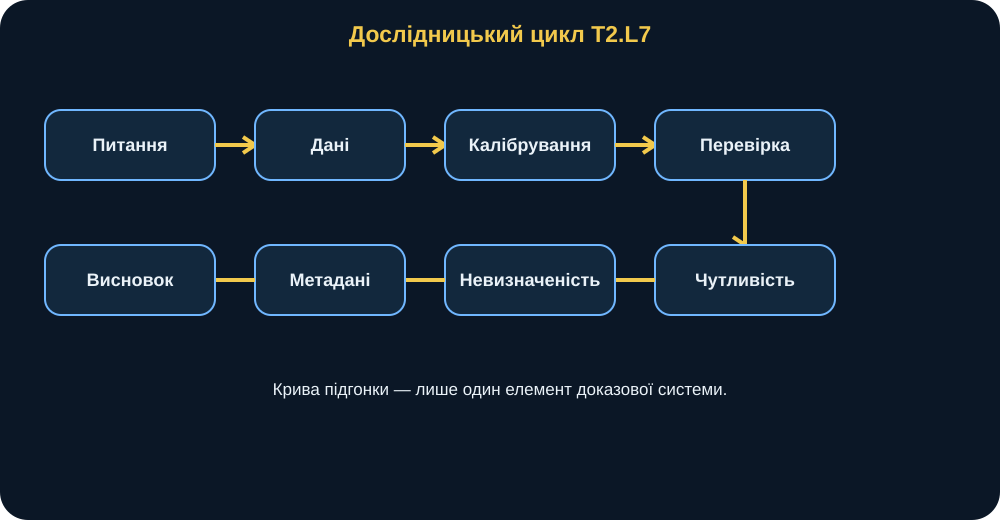
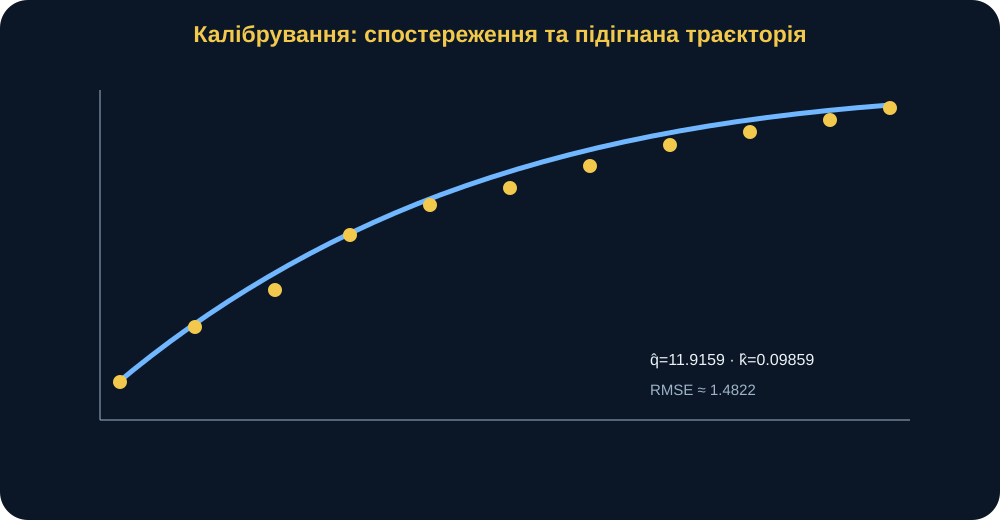
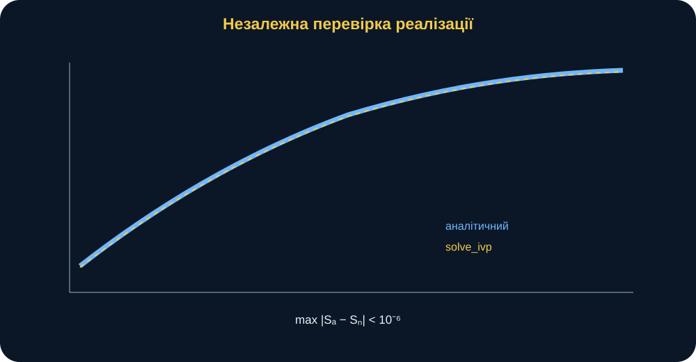
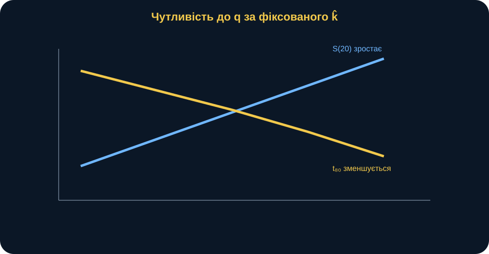
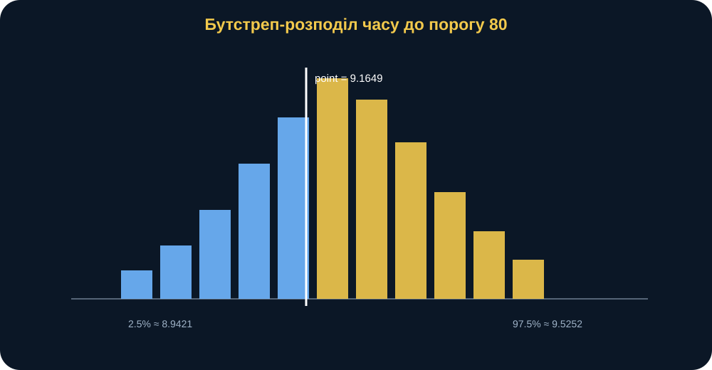

# MathModelingIT MiniBook T2.L7

## Використання систем комп’ютерної математики в наукових дослідженнях

### Від шумних спостережень до відтворюваного наукового висновку

> **Головна ідея книги:** науковий computational result — це не fitted curve і не одне число RMSE. Це ланцюг evidence: research question → hypothesis → data → model → calibration → verification → prediction → sensitivity → uncertainty → reproducibility → обережний scientific claim.

---

## 0. Паспорт книги

**Код заняття:** T2.L7  
**Тип:** інтеграційний mini-research project  
**Рівень:** підвищений  
**Орієнтовний час читання:** 80–95 хвилин.

Після книги ви повинні вміти:

- формулювати research question і testable hypothesis;
- відокремлювати observations від model trajectory;
- калібрувати \(q,k\) методом nonlinear least squares;
- інтерпретувати RMSE без overclaim;
- будувати fitted trajectory;
- незалежно verify analytical solution через solve_ivp;
- прогнозувати threshold time і horizon state;
- виконувати scenario sensitivity по \(q\);
- пояснювати residual bootstrap;
- відрізняти uncertainty of recalibration від robustness fixed decision;
- інтерпретувати finite/nonfinite threshold outcomes;
- формувати deterministic experiment identity;
- писати scientific conclusion, що не сильніший за evidence.

---

## 1. Сцена: «Модель красиво підігнала дані. Чи можемо ми їй довіряти?»

Уявімо, що є synthetic observations dynamic state.

На графіку dots лежать близько до smooth curve.

Researcher запускає least_squares.

Отримує:

\[
RMSE\approx1.48.
\]

Виглядає переконливо.

І звучить фраза:

> «Модель підтверджена».

Але одразу виникають questions:

- які parameters estimated?
- чи parameter values stable?
- чи fitted formula independently verified?
- яка uncertainty threshold prediction?
- що станеться, якщо \(q\) зміниться?
- чи bootstrap interval conditional on chosen model?
- чи можна exact experiment reproduce?
- чи small RMSE distinguishes alternative model structures?

Саме цим T2.L7 відрізняється від простого curve fitting.

<figure>
  
  <figcaption><strong>Рис. 1.</strong> T2.L7 з’єднує всі попередні теми в один research workflow: question, data, calibration, verification, sensitivity, uncertainty, metadata та claim.</figcaption>
</figure>

---

## 2. Research question

Lesson question:

> **Наскільки надійно за шумними спостереженнями можна оцінити параметри динамічної системи та спрогнозувати час досягнення заданого порогу?**

Це питання має дві частини:

1. parameter estimation;
2. predictive reliability.

Calibration без prediction uncertainty відповідає лише на першу.

---

## 3. Hypothesis

Working hypothesis:

> calibrated model відновить \(q,k\) із малою похибкою, а bootstrap покаже вузький, але ненульовий interval uncertainty threshold prediction.

Hypothesis must be linked to observable evidence:

- calibrated values near synthetic generating parameters;
- RMSE small;
- interval finite and not zero-width.

---

## 4. Dynamic model

\[
\frac{dS}{dt}=q-kS,
\]

\[
S(0)=S_0.
\]

Analytical solution:

\[
S(t)=
\frac{q}{k}
+
\left(
S_0-\frac{q}{k}
\right)e^{-kt}.
\]

Same mathematical core as T2.L6.

But research role is different.

T2.L6: derive and verify.

T2.L7: estimate parameters from noisy data and quantify uncertainty.

---

## 5. Synthetic data

Observed pairs:

| t | observed S |
|---:|---:|
| 0 | 18.5724 |
| 2 | 38.5600 |
| 4 | 49.5546 |
| 6 | 67.6312 |
| 8 | 76.2160 |
| 10 | 82.6864 |
| 12 | 89.3191 |
| 14 | 95.8872 |
| 16 | 99.3286 |
| 18 | 103.0635 |
| 20 | 107.7626 |

Data intentionally contain noise.

Thus parameters cannot be read directly from one point.

---

## 6. Why synthetic data are useful here

Synthetic data allow a controlled teaching environment:

- model structure known;
- expected parameters roughly known;
- no sensitive data;
- reproducible baseline;
- calibration can be checked.

But successful recovery on synthetic data does not prove performance on real data.

Synthetic test is verification/training stage.

---

## 7. Calibration objective

Let observations:

\[
y_i.
\]

Model prediction:

\[
\hat y_i(q,k)=S(t_i;q,k).
\]

Residual:

\[
r_i(q,k)=\hat y_i-y_i.
\]

Least squares minimizes:

\[
J(q,k)=
\sum_i r_i(q,k)^2.
\]

SciPy least_squares estimates:

\[
\hat q,\hat k.
\]

---

## 8. Why nonlinear least squares

Model is nonlinear in \(k\) because:

\[
e^{-kt}
\]

and:

\[
q/k.
\]

Thus ordinary linear regression formulation does not directly match parameter structure.

Use nonlinear least squares.

---

## 9. Calibrated baseline

Exact current control values:

\[
\hat q
=
11.9159423611,
\]

\[
\hat k
=
0.0985939001.
\]

Estimated equilibrium:

\[
\hat S^*
=
\frac{\hat q}{\hat k}
\approx120.8588193439.
\]

RMSE:

\[
RMSE\approx1.4821542085.
\]

These agree closely with synthetic generating scale \(q\approx12,k\approx0.1\).

<figure>
  
  <figcaption><strong>Рис. 2.</strong> Calibration minimizes residuals between noisy observations and analytical trajectory. A visually close fit is evidence about fit quality, not proof of model truth.</figcaption>
</figure>

---

## 10. RMSE

\[
RMSE=
\sqrt{
\frac1n
\sum_i
(y_i-\hat y_i)^2
}.
\]

It measures typical residual magnitude in output units.

Smaller is better **relative to context**.

RMSE does not say:

- assumptions correct;
- parameters unique;
- predictions unbiased outside observed range;
- no alternative model fits equally well.

---

## 11. Residuals

Residual:

\[
e_i=y_i-\hat y_i.
\]

Inspect:

- sign pattern;
- trend over time;
- changing variance;
- outliers;
- autocorrelation.

If residuals show structure, model may be missing mechanism.

A scalar RMSE can hide this.

---

## 12. Identifiability connection

From T2.L6:

\[
S^*=q/k.
\]

Equilibrium alone identifies ratio, not both parameters separately.

Transient trajectory:

\[
e^{-kt}
\]

contains information about \(k\).

Therefore time-series observations help identify both.

This is a strong example of symbolic theory informing calibration.

---

## 13. Initial guesses

least_squares starts from:

\[
q_0=10,
\qquad
k_0=0.08.
\]

For well-behaved baseline it converges to control fit.

In nonlinear calibration, starting point can matter.

A stronger research workflow may test multiple starts.

---

## 14. Parameter bounds

Implementation constrains:

\[
q>0,
\]

\[
k>0.
\]

This encodes domain meaning.

Without bounds optimizer could explore physically meaningless regions.

---

## 15. Fit is not validation

The statement:

> RMSE <2.

supports:

> model fits this synthetic dataset reasonably closely.

It does not establish:

> real process obeys \(dS/dt=q-kS\).

Validation requires independent real/authorized data or domain evidence.

---

# PREDICTION

## 16. Threshold time

Threshold:

\[
S=80.
\]

Using calibrated parameters:

\[
t_{80}
\approx9.1648572165.
\]

This is point estimate.

It answers:

> under fitted model, when does trajectory reach 80?

---

## 17. Horizon state

Horizon:

\[
t=20.
\]

Prediction:

\[
S(20)
\approx106.8197556402.
\]

Again, point estimate conditional on \(\hat q,\hat k\).

---

## 18. Point estimate is not uncertainty

A single number:

\[
9.1649
\]

does not tell:

- how sensitive it is to data noise;
- how parameters co-vary;
- how often threshold might be unreachable under resampled fits.

Need uncertainty analysis.

---

# VERIFICATION

## 19. Analytical trajectory

Calibration uses analytical formula.

To verify implementation, use independent numerical ODE solver.

---

## 20. Correct initial-condition origin

Important hardened rule:

\[
S_0
\]

is defined at:

\[
t=0.
\]

If requested output grid starts at \(t=5\), numerical solver must still integrate from zero to requested times.

Earlier wrong implementation could reinterpret \(S_0\) as state at first requested time.

That was fixed.

---

## 21. Nonzero-start control case

For:

\[
t=[5,6,7],
\]

\[
S_0=20,
\]

\[
q=10,
\]

\[
k=0.1,
\]

analytical/numerical first requested state is about:

\[
S(5)\approx51.4775.
\]

Not 20.

This test protects the mathematical meaning of initial condition.

---

## 22. Analytical vs solve_ivp

Compute:

\[
e_{max}
=
\max_t
|S_{analytical}(t)-S_{numerical}(t)|.
\]

Tests require:

\[
e_{max}<10^{-6}.
\]

Experiment usually obtains error around \(10^{-9}\).

<figure>
  
  <figcaption><strong>Рис. 3.</strong> Independent solve_ivp verifies numerical consistency of the calibrated analytical trajectory. Agreement supports implementation, not empirical adequacy.</figcaption>
</figure>

---

## 23. What verification proves

It supports:

- analytical formula implemented correctly;
- numerical solver initialized at correct time;
- trajectories consistent.

It does not prove:

- model structure true;
- synthetic data representative;
- parameter estimates unbiased.

---

# SCENARIO / SENSITIVITY

## 24. Vary q

Config uses multipliers:

\[
0.8,\ 0.9,\ 1.0,\ 1.1,\ 1.2.
\]

For each:

\[
q'=m\hat q.
\]

Hold calibrated \(k\) fixed.

Calculate:

- equilibrium;
- \(S(20)\);
- time to threshold 80.

---

## 25. Expected direction

As \(q\) increases:

\[
S^*=\frac qk
\]

increases.

Horizon state increases.

Threshold 80 is reached sooner.

Tests verify:

- \(S(20)\) monotonic increasing;
- threshold time monotonic decreasing.

---

## 26. Sensitivity is conditional

This experiment changes q only.

It assumes k fixed.

Conclusion:

> response to q under fixed calibrated k.

Not:

> complete uncertainty of system.

<figure>
  
  <figcaption><strong>Рис. 4.</strong> q-sensitivity asks a controlled “what if?” question: increasing replenishment raises the horizon state and generally reduces time to the threshold.</figcaption>
</figure>

---

## 27. One-factor limitation

If q and k uncertain together, one-factor sensitivity can miss interaction/correlation.

Possible extension:

- 2D grid;
- joint bootstrap;
- response surface.

T2.L7 baseline keeps one-factor scenario for interpretability.

---

# BOOTSTRAP UNCERTAINTY

## 28. Why bootstrap

We have one noisy dataset.

Want to know:

> how much might fitted parameters and predictions vary because observations contain noise?

Residual bootstrap approximates this uncertainty.

---

## 29. Residual bootstrap steps

1. Fit model to original observations.
2. Compute fitted values.
3. Compute residuals:
   \[
   e_i=y_i-\hat y_i.
   \]
4. Sample residuals with replacement.
5. Create synthetic bootstrap dataset:
   \[
   y_i^{(b)}=\hat y_i+e_i^*.
   \]
6. Recalibrate q,k.
7. Recompute threshold and horizon prediction.
8. Repeat.

Baseline:

\[
B=500,
\]

\[
seed=2026.
\]

---

## 30. Recalibration is crucial

Each bootstrap replication estimates new:

\[
\hat q^{(b)},
\hat k^{(b)}.
\]

Therefore bootstrap distribution represents:

> **uncertainty of re-estimated parameters/predictions under residual-resampling assumptions.**

It is not performance distribution of one fixed parameter pair.

---

## 31. This is not fixed-decision robustness

Suppose we freeze:

\[
\hat q,\hat k
\]

and perturb environment.

That asks another question.

Current bootstrap asks:

> if we observed another noise realization and recalibrated, how would estimates/predictions vary?

Keep these concepts separate.

---

## 32. Bootstrap threshold distribution

For current 500-replication baseline:

\[
P_{2.5}
\approx8.9421,
\]

median:

\[
\approx9.1944,
\]

\[
P_{97.5}
\approx9.5252.
\]

Mean:

\[
\approx9.2020.
\]

Point estimate:

\[
9.1649.
\]

The point lies inside bootstrap interval.

<figure>
  
  <figcaption><strong>Рис. 5.</strong> Residual bootstrap generates a distribution of recalibrated threshold predictions. The interval is conditional on the residual-resampling and model assumptions.</figcaption>
</figure>

---

## 33. Horizon bootstrap

For \(S(20)\), current bootstrap approximately gives:

\[
P_{2.5}\approx104.8995,
\]

median:

\[
106.7010,
\]

\[
P_{97.5}\approx108.4714.
\]

Mean:

\[
106.7153.
\]

This quantifies calibration/data-noise uncertainty in horizon prediction.

---

## 34. Bootstrap interval is not universal truth

It is conditional on:

- chosen model structure;
- residual bootstrap procedure;
- observed data;
- number of replications;
- seed for exact run.

If residual assumptions wrong, interval may misrepresent uncertainty.

---

## 35. Residual bootstrap assumptions

Implicitly residuals treated as exchangeable enough to resample.

If residual variance changes with time or residuals correlated, simple residual bootstrap may be inadequate.

Possible extensions:

- wild bootstrap;
- block bootstrap;
- parametric bootstrap.

---

# UNREACHED THRESHOLDS

## 36. Threshold may be unreachable

For some parameter combinations equilibrium can lie below target.

Then:

\[
t_{threshold}=\infty.
\]

This is meaningful.

It means under that model trajectory never reaches threshold.

---

## 37. Why silently dropping infinity is dangerous

Suppose bootstrap times:

\[
[10,20,\infty,\infty,\infty].
\]

Finite mean:

\[
15.
\]

If report only 15, you hide that 60% runs never reach threshold.

This was a red-team finding and is now explicitly handled.

---

## 38. Hardened summary

quantile_summary reports:

- conditional mean;
- conditional median;
- finite_share;
- nonfinite_share;
- positive_infinity_share;
- n_total;
- n_finite.

For example:

\[
finite\_share=0.4,
\]

\[
nonfinite\_share=0.6.
\]

This makes conditioning visible.

<figure>
  
  <figcaption><strong>Рис. 6.</strong> A finite conditional mean must be reported together with the share of simulations that actually reach the threshold.</figcaption>
</figure>

---

## 39. Baseline finite share

For current 500 bootstrap replications around fitted data:

\[
finite\_share=1.0.
\]

All bootstrap fits reach threshold 80.

This is a baseline property.

In other scenarios it may not hold.

---

# REPRODUCIBILITY

## 40. Config records scientific intent

experiment_config stores:

- research question;
- hypothesis;
- s0;
- threshold;
- horizon;
- q multipliers;
- bootstrap replications;
- seed.

This is stronger than parameters scattered in notebook.

---

## 41. Experiment hash includes data

Unlike T1.L3 config-only hash, T2.L7 experiment hash payload includes:

- config;
- rounded observations;
- model identity string.

Thus data changes alter experiment ID.

This closes an earlier provenance gap.

---

## 42. Baseline experiment identity

Current canonical experiment:

~~~text
t2_l7_92787dfc5ccd
~~~

This is deterministic for same payload.

It does not replace Git commit or dependency info, but it identifies model+config+data payload.

---

## 43. Metadata

experiment.py stores:

- experiment ID;
- model;
- config;
- calibrated parameters;
- threshold uncertainty;
- horizon uncertainty;
- verification error;
- Python/platform environment.

Outputs include:

- calibration_summary.csv;
- scenario_results.csv;
- bootstrap_predictions.csv;
- summary.csv;
- metadata.json;
- figures.

---

## 44. Why metadata is part of evidence

A chart without metadata says:

> here is a distribution.

Metadata lets us answer:

- which data?
- which seed?
- how many bootstraps?
- which threshold?
- which fit?
- which model?

This is research traceability.

---

# SCIENTIFIC INTERPRETATION

## 45. What the model shows

Supported:

> the chosen dynamic model can be calibrated to the synthetic observations with RMSE around 1.48 and parameters near the generating scale.

Supported:

> analytical and numerical implementations agree within strict numerical tolerance.

Supported:

> threshold prediction under calibrated model is around 9.165 and residual bootstrap gives nonzero uncertainty around it.

---

## 46. What the model does not show

Not established:

- true real system follows this ODE;
- errors are iid/exchangeable;
- q,k remain constant;
- threshold definition operationally valid;
- bootstrap interval covers all uncertainty;
- calibration unique under all starting points/model structures.

These are limitations.

---

## 47. Small RMSE can hide wrong structure

Two different model forms can fit observed window similarly.

Example:

- exponential approach;
- flexible polynomial;
- logistic curve.

A low RMSE only measures fit in observed data.

Model comparison and out-of-sample validation needed for stronger structural claim.

---

## 48. Calibration uncertainty vs model-form uncertainty

Bootstrap varies data noise within fixed model form.

It does not vary equation itself.

Thus interval omits structural uncertainty.

This distinction should appear in dissertation methodology.

---

## 49. Sensitivity vs uncertainty

Sensitivity:

> deliberately change q and observe response.

Uncertainty:

> quantify plausible variation in estimates/predictions due to noisy data.

Different questions.

Both needed.

---

## 50. Verification vs validation

Verification:

> equations/code agree.

Validation:

> model adequate for target real process.

T2.L7 provides strong verification.

Real-data validation remains future task.

---

## 51. Research conclusion template

A strong conclusion:

> Using synthetic observations and the model \(dS/dt=q-kS\), nonlinear least squares estimated \(q=11.9159\) and \(k=0.098594\) with RMSE 1.482. The fitted model predicts threshold \(S=80\) at \(t=9.1649\) and \(S(20)=106.8198\). Analytical and solve_ivp trajectories agree within the numerical tolerance. A 500-replication residual bootstrap gives a 95% empirical interval for threshold time of approximately [8.942; 9.525]. These results quantify calibration and residual-resampling uncertainty under the selected model; they do not validate the model for a real system.

That is evidence-bounded language.

---

# BREAK THE MODEL

## 52. Break: change time origin

If numerical integration starts at first requested time instead of zero, \(S_0\) gets reinterpreted.

This can produce internally smooth but wrong trajectory.

Lesson test protects against it.

---

## 53. Break: threshold above equilibrium

If:

\[
threshold>S^*,
\]

and \(S_0<S^*\), threshold unreachable.

Return:

\[
\infty.
\]

Do not force a number.

---

## 54. Break: poor starting parameters

Nonlinear least squares can be sensitive to initialization in harder problems.

Test multiple starts if landscape uncertain.

---

## 55. Break: heteroskedastic residuals

If noise grows with S, residual resampling assumes wrong structure.

Need weighted least squares or different bootstrap.

---

## 56. Break: correlated residuals

Time-series residual correlation violates naive exchangeability.

Block/bootstrap or explicit error model may be needed.

---

## 57. Break: parameter drift

If q or k changes over time:

\[
q=q(t),
\quad
k=k(t),
\]

constant-parameter ODE can fit average behavior but miss mechanism.

---

## 58. Break: alternate model

Try nonlinear loss:

\[
\frac{dS}{dt}=q-kS^\gamma.
\]

If \(\gamma\ne1\) materially improves validated fit, baseline structure may be insufficient.

Model comparison becomes research question.

---

# PYTHON WITHOUT FEAR

## 59. Calibration

~~~python
fit = calibrate_parameters(
    times,
    observations,
    s0=20,
)
~~~

Check:

\[
q\approx11.916,
\quad
k\approx0.09859.
\]

---

## 60. Prediction

~~~python
t80 = time_to_threshold(
    s0=20,
    q=fit["q"],
    k=fit["k"],
    threshold=80,
)
~~~

Control:

\[
9.164857.
\]

---

## 61. Scenario batch

~~~python
scenarios = scenario_batch(
    q_values,
    s0=20,
    k=fit["k"],
    horizon=20,
    threshold=80,
)
~~~

Verify directions:

- s_horizon increasing;
- time_to_threshold decreasing.

---

## 62. Bootstrap

~~~python
boot = bootstrap_calibration(
    times,
    observations,
    s0=20,
    threshold=80,
    horizon=20,
    n_boot=500,
    seed=2026,
)
~~~

Exact repeatability with same seed is unit-tested.

---

## 63. Quantile summary

~~~python
summary = quantile_summary(
    boot,
    "time_to_threshold",
)
~~~

Always inspect:

- p2_5;
- median;
- p97_5;
- finite_share;
- nonfinite_share.

---

# RESEARCH TRANSFER

## 64. Transfer to dissertation

Use template:

~~~text
Research question:

Hypothesis:

Data:

Data provenance:

Mathematical model:

Parameters to estimate:

Calibration method:

Fit metric:

Independent verification:

Prediction target:

Scenario/sensitivity factors:

Uncertainty method:

Finite/nonfinite outcome rule:

Reproducibility ID:

Model limitations:

Validation data needed:

Allowed scientific claim:
~~~

---

## 65. Example transfer

Suppose a dissertation studies response time of an information-processing subsystem.

Possible workflow:

1. define dynamic/statistical model;
2. collect authorized observations;
3. calibrate;
4. verify code on known cases;
5. perform scenarios;
6. bootstrap parameter/prediction uncertainty;
7. validate on held-out data;
8. record experiment ID and commit.

The method transfers without copying military-sensitive values.

---

## 66. Research evidence pyramid

<figure>
  
  <figcaption><strong>Рис. 7.</strong> A fitted curve is only the bottom layer. Stronger evidence adds verification, sensitivity, uncertainty, reproducibility and external/domain validation.</figcaption>
</figure>

Layers:

1. fit;
2. verification;
3. sensitivity;
4. uncertainty;
5. reproducibility;
6. validation.

---

## 67. Research-grade checklist

Before publication ask:

- question explicit?
- hypothesis testable?
- data provenance known?
- model assumptions explicit?
- calibration reproducible?
- residuals inspected?
- numerical implementation verified?
- scenario logic justified?
- bootstrap assumptions stated?
- unreachable outcomes visible?
- experiment ID recorded?
- Git/environment recorded?
- conclusion conditional?

---

## 68. Relationship to previous MiniBooks

T2.L7 integrates:

- T1.L2 uncertainty;
- T1.L3 reproducibility;
- T1.L4 method selection;
- T2.L3 nonlinear optimization ideas;
- T2.L6 symbolic/numeric verification.

It is the course’s research synthesis.

---

## 69. One-page summary

### Five ideas

1. Calibration is only one stage of research evidence.
2. Small RMSE does not validate model structure.
3. Independent solve_ivp checks computational consistency.
4. Bootstrap quantifies recalibration uncertainty under explicit assumptions.
5. Scientific conclusion must preserve conditions, uncertainty and limitations.

### Three formulas

Model:

\[
\frac{dS}{dt}=q-kS.
\]

Least-squares objective:

\[
J(q,k)=\sum_i(\hat y_i-y_i)^2.
\]

Threshold summary must pair conditional quantiles with:

\[
finite\_share=
\frac{n_{finite}}{n_{total}}.
\]

### Two errors

- narrow bootstrap interval = model truth;
- small RMSE = validation.

### One question

> What evidence would still be needed before I use this calibrated model to make a real-world scientific claim?

### Next step

Reproduce experiment ID, calibration, verification, q-sensitivity and bootstrap before changing any assumptions.

<figure>
  
  <figcaption><strong>Рис. 8.</strong> The allowed claim is bounded by data, model form, calibration, verification and uncertainty assumptions. Beyond that boundary begins speculation.</figcaption>
</figure>

---

## 70. Фінальна думка

The most dangerous computational result is not one with a visible error.

It is one that looks precise, fits nicely, and quietly carries assumptions nobody wrote down.

T2.L7 builds the opposite habit.

A research result should say:

- what question was asked;
- what model was assumed;
- what data were used;
- what was estimated;
- how implementation was verified;
- how uncertainty was quantified;
- how sensitive prediction is;
- how experiment can be reproduced;
- and what the result **does not** prove.

That is the difference between a calculation and a defensible computational research claim.
